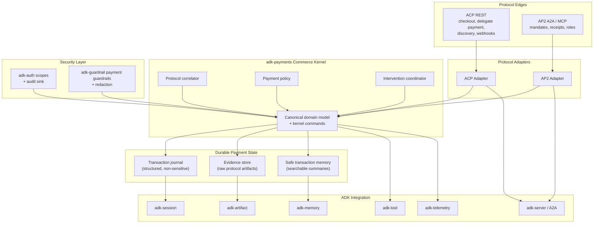
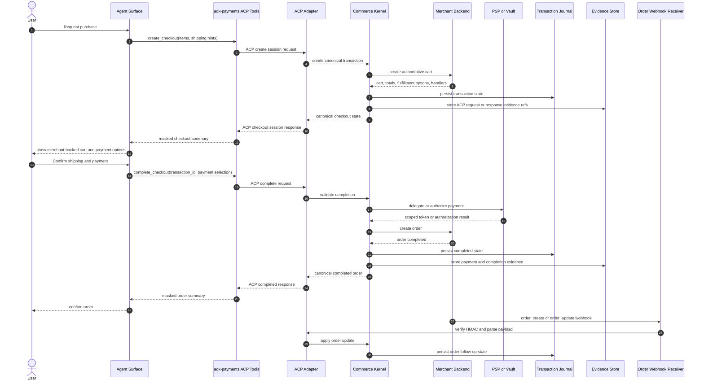
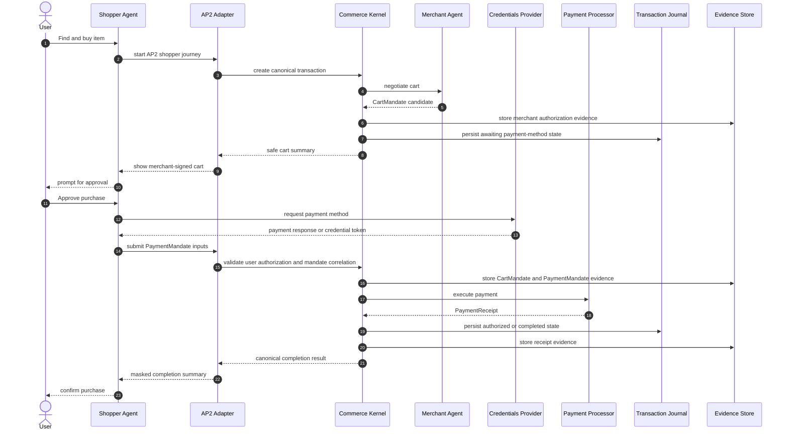
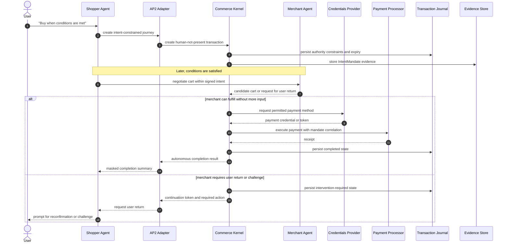
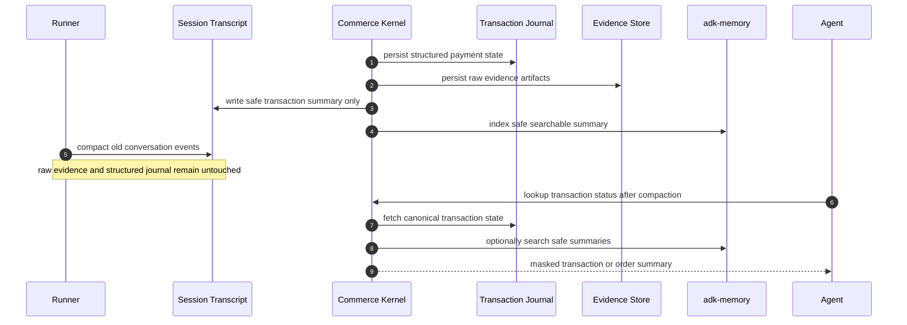

# Design Document: adk-payments

## Overview

`adk-payments` should make ADK-Rust a credible foundation for agentic commerce, but it should do that without collapsing different protocol layers into one vague abstraction.

The protocol research verified on March 22, 2026 points to a clear split:

- **ACP** is a merchant or PSP-facing HTTP protocol with checkout sessions, delegated payment, order webhooks, capability negotiation, and an emerging discovery story.
- **AP2** is a mandate-centered trust and authorization model over A2A and MCP, with explicit roles, signed mandates, and separation between shopping, credential custody, and payment execution.

Those are not interchangeable wire formats. Trying to translate ACP payloads directly into AP2 payloads would either discard evidence or invent semantics. The correct design is:

1. build a **protocol-neutral commerce kernel**
2. expose **ACP and AP2 adapters** at the edge
3. persist a **transaction journal** and **evidence store** outside conversation history
4. emit only **safe summaries** into transcript, memory, and telemetry surfaces

This design lets one merchant backend support both standards while preserving:

- protocol correctness
- security boundaries
- actor accountability
- transaction continuity after context compaction

## Protocol Baselines

The implementation should be explicit about the versions it targets.

### ACP

- **Stable baseline:** `2026-01-30`
- **Experimental baseline:** unreleased materials for:
  - discovery document `/.well-known/acp.json`
  - stricter idempotency rules
  - Stripe-style `Merchant-Signature` webhook signing
  - delegated authentication for 3DS2 browser flows

### AP2

- **Baseline:** repository and docs state aligned with `v0.1-alpha`
- **A2A extension URI:** `https://github.com/google-agentic-commerce/ap2/tree/v0.1`
- **Current role model:** shopper, merchant, credentials-provider, payment-processor

### Design Consequence

- ACP stable support can be treated as the first production-grade target.
- ACP experimental support must be feature-gated.
- AP2 support must be feature-gated and documented as alpha-baseline support rather than stable interoperability.

## Design Principles

### 1. Kernel First, Not Protocol Transcoding

The system should not define a fake "universal payment payload" and then force both protocols through it. The system should define canonical transaction state and service traits, then let each adapter map its own wire semantics into those traits.

### 2. Evidence Is First-Class

Raw protocol material matters:

- ACP detached signatures and timestamps
- ACP delegated payment request bodies
- ACP webhook payloads and HMAC verification inputs
- AP2 merchant authorization JWTs
- AP2 user authorization presentations
- AP2 mandate and receipt payloads

Those artifacts are not optional metadata. Those artifacts are part of accountability. The design therefore keeps raw artifacts in an evidence store and keeps only references and digests in the canonical journal.

### 3. Payment State Must Survive Compaction

Conversation history is for model context. Payment state is for durable system truth. The runner's compaction path must never be the only place where payment facts live.

### 4. Sensitive Data Never Enters Generic Agent Surfaces

Full PAN values, CVC values, unredacted billing PII, raw signed authorizations, and similar material must never appear in:

- session transcript content
- semantic memory summaries
- telemetry span bodies
- user-facing tool output

### 5. Human Authorization Must Stay Explicit

Both protocols model user authority, but they do so differently. The design must preserve:

- ACP intervention requirements and delegated authentication
- AP2 CartMandate and IntentMandate distinctions
- AP2 PaymentMandate visibility into payment execution

### 6. Stable and Experimental Surfaces Must Be Separated

Protocol maturity must be reflected in feature flags, rustdoc, examples, and defaults.

## Target Architecture



## End-to-End Supported Journeys

The design should treat these as first-class supported journeys rather than as optional demos:

1. ACP human-present merchant checkout
2. AP2 human-present signed-cart payment
3. AP2 human-not-present intent-driven payment with optional return-to-user intervention
4. Transaction recall and order follow-up after context compaction

Those journeys are where the kernel, adapters, auth, guardrails, journal, and evidence model either hold together or fail.

## Sequence Diagrams

### ACP Human-Present Checkout



### AP2 Human-Present Mandate Flow



### AP2 Human-Not-Present Intent Flow



### Compaction-Safe Transaction Continuity



## Module Layout

The crate should be organized around one core and two protocol edges:

```text
adk-payments/src/
├── lib.rs
├── domain/
│   ├── money.rs
│   ├── actor.rs
│   ├── cart.rs
│   ├── order.rs
│   ├── intervention.rs
│   ├── evidence.rs
│   └── transaction.rs
├── kernel/
│   ├── commands.rs
│   ├── service.rs
│   ├── errors.rs
│   └── correlator.rs
├── journal/
│   ├── store.rs
│   ├── session_state.rs
│   ├── evidence_store.rs
│   └── memory_index.rs
├── auth/
│   ├── scopes.rs
│   └── audit.rs
├── guardrail/
│   ├── amount_policy.rs
│   ├── merchant_policy.rs
│   ├── intervention_policy.rs
│   └── redaction.rs
├── protocol/
│   ├── acp/
│   │   ├── mod.rs
│   │   ├── profile.rs
│   │   ├── types.rs
│   │   ├── mapper.rs
│   │   ├── idempotency.rs
│   │   ├── signature.rs
│   │   ├── server.rs
│   │   ├── webhooks.rs
│   │   ├── discovery.rs
│   │   └── delegate_auth.rs
│   └── ap2/
│       ├── mod.rs
│       ├── roles.rs
│       ├── mandates.rs
│       ├── payment_request.rs
│       ├── verifier.rs
│       ├── a2a.rs
│       └── mcp.rs
├── tools/
│   ├── checkout.rs
│   ├── status.rs
│   └── intervention.rs
└── server/
    └── router.rs
```

## Canonical Domain Model

### Core Types

The canonical layer should represent durable payment truth rather than transport syntax.

```rust
pub struct TransactionRecord {
    pub transaction_id: TransactionId,
    pub identity: AdkIdentity,
    pub merchant_of_record: MerchantRef,
    pub payment_processor: Option<ProcessorRef>,
    pub mode: CommerceMode,
    pub state: TransactionState,
    pub protocol_refs: ProtocolRefs,
    pub safe_summary: SafeTransactionSummary,
    pub evidence: Vec<ProtocolEnvelopeDigest>,
    pub last_updated_at: DateTime<Utc>,
}

pub enum CommerceMode {
    HumanPresent,
    HumanNotPresent,
}

pub enum TransactionState {
    Draft,
    Negotiating,
    AwaitingUserAuthorization,
    AwaitingPaymentMethod,
    InterventionRequired(InterventionState),
    Authorized,
    Completed,
    Canceled,
    Failed,
}
```

### Why `TransactionRecord` Is Structured

The canonical transaction record must answer all of the following without replaying chat:

- What state is the transaction in?
- Which protocol created the state?
- Which ACP checkout session or AP2 mandate corresponds to the state?
- Which evidence blobs back the decision?
- What safe summary can be shown to the model or user?

### Protocol Reference Model

`ProtocolRefs` should correlate:

- ACP checkout session ID
- ACP order ID
- ACP delegated payment token ID
- AP2 intent mandate ID or hash
- AP2 cart mandate ID or hash
- AP2 payment mandate ID
- AP2 payment receipt ID

The system should never assume those identifiers are interchangeable.

## Kernel Service Traits

The kernel should expose backend-facing traits instead of hard-coding a merchant implementation.

### `MerchantCheckoutService`

Responsible for:

- creating or updating authoritative cart state
- selecting fulfillment options
- validating checkout state
- producing order records
- canceling sessions or orders

### `PaymentExecutionService`

Responsible for:

- delegated credential handling
- authorization or capture decisions
- challenge continuation
- payment completion outcomes
- post-payment state updates

This separation reflects both protocols:

- ACP separates merchant checkout and delegated payment PSP behavior.
- AP2 separates merchant behavior from payment-processor behavior.

### `TransactionStore`

Responsible for:

- durable structured transaction state
- idempotency and correlation lookups
- unresolved transaction indexing
- post-compaction recovery

### `EvidenceStore`

Responsible for:

- storing raw ACP or AP2 payloads and signatures
- storing raw webhook bodies used for verification
- storing raw mandates and receipts
- returning immutable artifact references and digests

## ACP Adapter Design

### Profiles

The ACP adapter should expose two profiles:

- `AcpProfile::V2026_01_30`
- `AcpProfile::ExperimentalUnreleased`

`AcpProfile::ExperimentalUnreleased` should only be available when `acp-experimental` is enabled.

### Stable Scope

The stable ACP adapter should cover:

- `POST /checkout_sessions`
- `POST /checkout_sessions/{id}`
- `GET /checkout_sessions/{id}`
- `POST /checkout_sessions/{id}/complete`
- `POST /checkout_sessions/{id}/cancel`
- `POST /agentic_commerce/delegate_payment`

### Idempotency

ACP now clearly expects serious retry behavior, and the unreleased protocol material tightens the rules. The implementation should therefore design idempotency into the stable adapter from the start, even if enforcement strictness is configurable by profile.

The ACP adapter should introduce a dedicated `IdempotencyStore` concept with behavior for:

- missing key
- replay with identical body
- conflict with different body
- in-flight duplicate

The ideal backend behavior is:

1. compute a canonical body hash
2. start an idempotency record
3. commit the idempotency record and transaction mutation atomically
4. replay the stored result when the same key and body reappear

### Signature Verification

Inbound ACP traffic may include detached request signatures and timestamps. The adapter should support a pluggable verifier:

```rust
pub trait AcpRequestVerifier: Send + Sync {
    async fn verify(&self, headers: &HeaderMap, raw_body: &[u8]) -> Result<VerifiedRequest>;
}
```

This keeps signing policy separate from transport parsing.

### Discovery and Webhooks

When `acp-experimental` is enabled, the ACP adapter should add:

- `/.well-known/acp.json`
- `Merchant-Signature` verification
- full order webhook ingestion using the full order object

The webhook verifier should follow the unreleased Stripe-style format:

- header: `t=<unix_seconds>,v1=<64_hex>`
- signed payload: `timestamp + "." + raw_body`
- algorithm: HMAC-SHA256
- replay window: configurable, default `300` seconds

### Delegated Authentication

Delegated authentication belongs behind the experimental ACP profile because the contract is still unreleased. The kernel should still reserve a canonical `InterventionState` so the stable and experimental ACP adapters share the same intervention surface.

## AP2 Adapter Design

### Role Model

The AP2 adapter should model the four AP2 roles explicitly:

- shopper
- merchant
- credentials-provider
- payment-processor

Those roles should not be collapsed into one generic "agent" type because role separation is one of AP2's primary security ideas.

### Mandate Types

The AP2 adapter should provide typed wrappers for:

- `IntentMandate`
- `CartMandate`
- `PaymentMandate`
- `PaymentReceipt`
- risk data containers
- W3C `PaymentRequest` and `PaymentResponse` payloads

### Verification

AP2 artifacts are sensitive and still evolving. The crate should therefore use pluggable verification traits rather than baking in one cryptographic assumption too early:

```rust
pub trait MandateVerifier: Send + Sync {
    async fn verify_cart_mandate(&self, mandate: &CartMandateEnvelope) -> Result<VerifiedCartMandate>;
    async fn verify_payment_mandate(&self, mandate: &PaymentMandateEnvelope) -> Result<VerifiedPaymentMandate>;
}
```

This makes the alpha support honest while still giving integrators a strong abstraction boundary.

### A2A Extension

When `ap2-a2a` is enabled, the adapter should:

- advertise the AP2 extension URI
- validate AP2 role parameters in AgentCard metadata
- wrap IntentMandate in A2A `Message` data parts
- wrap CartMandate in A2A `Artifact` data parts
- wrap PaymentMandate in A2A `Message` data parts

### MCP Integration

When `ap2-mcp` is enabled, the adapter should provide MCP-facing wrappers for:

- safe mandate lookup
- payment orchestration continuation
- intervention status
- receipt lookup

The MCP integration should never expose raw sensitive mandate or credential payloads unless the operator explicitly builds a privileged surface around those payloads.

## Cross-Protocol Correlation

### The Key Decision

The crate should support **shared backend compatibility**, not **wire-format equivalence**.

That means:

- ACP and AP2 both drive the same kernel.
- ACP and AP2 both update the same canonical transaction journal.
- ACP and AP2 can coexist for one merchant backend.
- ACP and AP2 are not automatically converted into one another when doing so would lose semantics.

### Best-Effort Projection

Some projections are safe:

- ACP cart and totals can be projected into a canonical cart
- AP2 payment request details can be projected into the same canonical cart
- ACP order updates and AP2 payment receipts can both update canonical settlement state

Some projections are unsafe:

- ACP delegated payment token to AP2 user authorization credential
- AP2 signed user authorization to ACP delegated payment token

Unsafe projections should be rejected explicitly.

## Auth, Audit, and Guardrail Design

### Scopes

Payment-sensitive operations should use named scopes instead of ad hoc booleans. The crate should define constants such as:

- `payments:checkout:create`
- `payments:checkout:update`
- `payments:checkout:complete`
- `payments:checkout:cancel`
- `payments:credential:delegate`
- `payments:intervention:continue`
- `payments:order:update`
- `payments:admin`

The adapter or tool layer can then use `adk-auth::ScopeGuard` directly.

### Audit Events

Every sensitive mutation should emit audit metadata including:

- transaction ID
- protocol
- protocol version
- merchant of record
- operation name
- outcome
- whether an intervention or escalation occurred

### Guardrails

`adk-payments` should define payment-specific guardrails instead of expecting generic content guardrails to cover commerce risk. At minimum:

- `AmountThresholdGuardrail`
- `MerchantAllowlistGuardrail`
- `CurrencyPolicyGuardrail`
- `InterventionPolicyGuardrail`
- `ProtocolVersionGuardrail`
- `SensitivePaymentDataGuardrail`

## Transaction Journal, Evidence, and Compaction

### Separation of Concerns

The design should write three different outputs per meaningful payment transition:

1. **Transaction journal update**
   - structured state
   - durable
   - non-sensitive
2. **Evidence artifact**
   - raw protocol material
   - durable
   - access-controlled
3. **Safe transcript or memory summary**
   - masked
   - model-usable
   - compaction-safe

### Session-State Mirroring

For compatibility with existing ADK state patterns, the journal should mirror compact structured state into app-scoped session keys such as:

- `app:payments:tx:<transaction_id>`
- `app:payments:index:active`
- `app:payments:index:completed`

That allows post-compaction recovery without loading raw transcript history.

### Artifact Layout

Raw evidence blobs should be stored via `adk-artifact` using paths shaped like:

```text
payments/evidence/<transaction_id>/<protocol>/<artifact_kind>.json
payments/evidence/<transaction_id>/<protocol>/<artifact_kind>.sig
```

The journal should keep only:

- artifact ID
- protocol name
- protocol version
- hash or digest
- created timestamp

### Safe Memory

If `adk-memory` is enabled, the crate should index only safe summaries such as:

- merchant name
- item titles
- total amount
- order status
- transaction timestamp
- protocol and state tags

This lets an agent answer "what did I buy?" or "is my order complete?" after compaction without disclosing raw card or mandate material.

### Compaction Behavior

The runner's compaction system should see only safe summaries. The source of truth remains the journal.

For unresolved transactions, the compaction-visible summary should include:

- transaction ID
- unresolved state
- next required action
- masked merchant and amount summary

## Feature Flag Strategy

The feature strategy should reflect risk and maturity:

- `acp`: stable ACP baseline
- `acp-experimental`: discovery, stricter idempotency behavior, webhook signing, delegated authentication
- `ap2`: typed AP2 domain support
- `ap2-a2a`: A2A extension and message or artifact bindings
- `ap2-mcp`: MCP wrappers

The `adk-rust` umbrella should expose `payments`, but that feature should remain opt-in during the initial rollout.

## Correctness Properties

### Property 1: Evidence Preservation

For any accepted ACP or AP2 transition, the system preserves enough protocol-specific evidence to prove which protocol message or artifact caused the state change.

### Property 2: No Sensitive Transcript Leakage

For any accepted transaction, conversation history, semantic memory, and telemetry output never contain raw Sensitive_Payment_Data.

### Property 3: Idempotent ACP Mutation

For any ACP POST request replayed with the same idempotency key and equivalent body, the stable result is replayed rather than duplicated.

### Property 4: Compaction Durability

For any transaction journal entry persisted before runner compaction, the entry remains queryable after compaction without replaying compacted chat events.

### Property 5: Cross-Protocol Correlation

For any transaction touched by ACP, AP2, or both, all protocol identifiers remain correlated to one canonical transaction ID.

### Property 6: Experimental Isolation

For any build where experimental features are disabled, unstable ACP or AP2-alpha transport surfaces are absent from the public behavior of the crate.

### Property 7: End-to-End Journey Continuity

For any supported ACP or AP2 end-to-end journey, later status lookup and order follow-up return the same canonical transaction state regardless of whether the original chat history has been compacted.

## Rollout Recommendation

The implementation order should follow protocol maturity and security dependency:

1. canonical kernel and transaction journal
2. auth, guardrails, and redaction
3. ACP stable adapter
4. compaction-safe memory and evidence storage
5. ACP experimental surfaces
6. AP2 alpha adapter
7. shared examples and docs

That sequence makes the first shipped version useful and defensible without blocking the entire crate on AP2 cryptographic or transport evolution.
