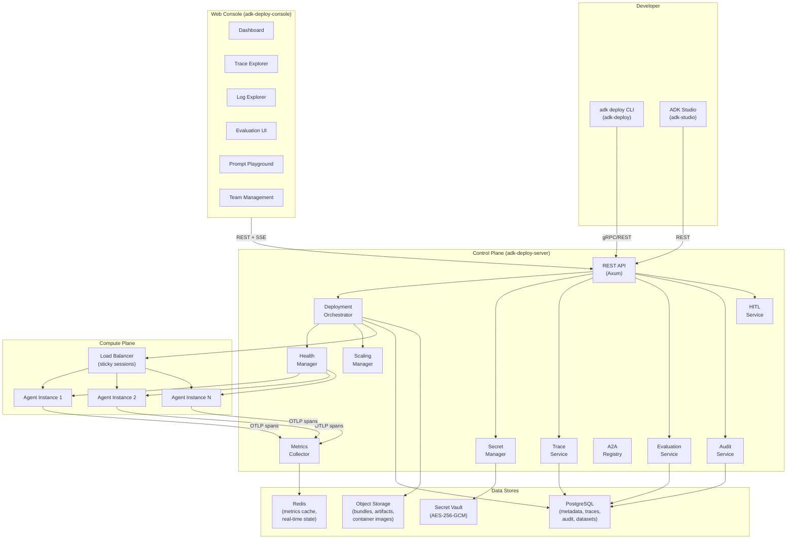
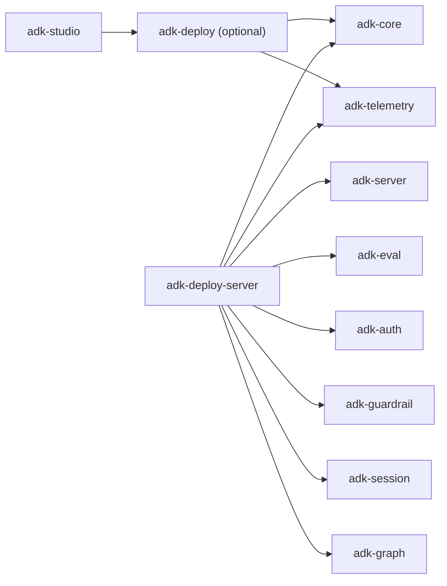

# Design Document: ADK Deployment Platform

## Overview

The ADK Deployment Platform is a full-stack production system for deploying, managing, and observing ADK-Rust agents. It consists of three new crates and a web console:

- **`adk-deploy`** — Client library and CLI extension (`adk deploy` subcommands) for bundling, pushing, and managing deployments from the terminal.
- **`adk-deploy-server`** — Control plane server (Axum) that orchestrates agent lifecycle, infrastructure provisioning, metrics collection, trace storage, and multi-tenant isolation.
- **`adk-deploy-console`** — React/TypeScript web console for dashboards, trace visualization, evaluation, annotation, prompt playground, team management, billing, and HITL workflow management.

The platform bridges ADK Studio's existing `DeployManifest` (generated from `ProjectSchema` via `from_project()`) into the deployment pipeline, and also supports CLI-first workflows via `adk-deploy.toml` manifests.

## Implementation Strategy

The first publishable target is **self-hosted `v1`**. That target is intentionally narrower than the full long-term platform vision:

- One control plane deployment per cluster
- Operator-managed identity and bearer credential distribution
- Real runtime orchestration for supported ADK-Rust capability combinations
- No simulated fleet, telemetry, evaluation, or billing data presented as production truth

The deploy stack SHALL compose existing ADK-Rust crates wherever those crates already define the runtime behavior:

- `adk-auth` for request authentication, scopes, and audit semantics
- `adk-server` and `adk-runner` for agent serving, auth bridging, A2A, artifacts, and runtime execution
- `adk-session`, `adk-artifact`, `adk-memory`, and `adk-graph` for manifest-driven backend selection
- `adk-telemetry` for spans/metrics export
- `adk-eval` for evaluation execution and reporting
- `adk-studio` for source metadata and Studio-originated deploy flow integration

Capabilities that are not yet backed by a real runtime/control-plane implementation MUST fail validation explicitly instead of being represented as supported through mock or synthetic responses.

### Design Goals

1. **Zero-to-production in one command** — `adk deploy push` takes a compiled agent to a running, health-checked, auto-scaled deployment.
2. **Full ADK capability coverage** — Every ADK feature (multi-model, sessions, memory, real-time, graph/HITL, A2A, guardrails, auth, plugins, skills) is deployable without custom infrastructure work.
3. **Competitive parity** — Feature set matches LangSmith/LangGraph Platform, AWS Bedrock AgentCore, Azure AI Foundry, and Google Vertex AI Agent Builder.
4. **Phased deployment modes** — publish `v1` as self-hosted first, then add fully managed cloud and hybrid customer-compute modes in later phases.

### Delivery Phases

1. **Phase 1: Contract and security foundation** — expand the deploy manifest, secure CLI/control-plane auth boundaries, and remove demo-only assumptions.
2. **Phase 2: Real deployment runtime** — bundle upload, checksum verification, runtime assembly, health, rollout, rollback, and service binding admission.
3. **Phase 3: Real observability and evaluation** — traces, logs, metrics, HITL, and evaluation driven by actual runtime signals.
4. **Phase 4: Console completion and publish gates** — UI completion on top of real APIs, end-to-end tests, and crate publication readiness.

### Requirements Coverage

This design addresses:
- **Deployment Engine** (requirements-deployment-engine.md): Requirements 1–20 covering CLI, manifest, bundling, lifecycle, health, scaling, secrets, strategies, rollback, logging, metrics, service bindings, A2A, real-time, auth, status, guardrails, validation, containers, plugins/skills, and graph HITL.
- **Platform Experience** (requirements-platform.md): Requirements 1–20 covering console dashboard, agent detail, log explorer, trace visualization, evaluation, annotation queues, prompt playground, team/org, billing, onboarding, agent catalog, monitoring, alerting, multi-environment, deployment options, A2A service map, HITL management, API explorer, audit logging, and data residency.

## Architecture

### High-Level System Architecture



### Crate Dependency Graph




## Components and Interfaces

### Component 1: Deployment Manifest (`adk-deploy`)

The deployment manifest is the single source of truth for an agent's deployment configuration. Two paths produce it:

1. **CLI path**: Developer writes `adk-deploy.toml` by hand.
2. **Studio path**: `DeployManifest::from_project()` generates it, then a converter maps it to `adk-deploy.toml` format.

**Validates: Requirements DE-1, DE-2, DE-17, DE-18**

```rust
// adk-deploy/src/manifest.rs

/// Parsed deployment manifest from adk-deploy.toml
#[derive(Debug, Clone, Serialize, Deserialize)]
pub struct DeploymentManifest {
    pub agent: AgentConfig,
    pub build: BuildConfig,
    pub scaling: ScalingPolicy,
    pub health: HealthCheckConfig,
    pub strategy: DeploymentStrategy,
    pub services: Vec<ServiceBinding>,
    pub secrets: Vec<SecretRef>,
    pub env: HashMap<String, String>,
    pub guardrails: Option<GuardrailConfig>,
    pub auth: Option<AuthConfig>,
    pub realtime: Option<RealtimeConfig>,
    pub a2a: Option<A2aConfig>,
    pub graph: Option<GraphConfig>,
    pub plugins: Vec<PluginRef>,
    pub skills_dir: Option<PathBuf>,
    pub assets: Vec<PathBuf>,
    pub source: Option<SourceInfo>,
}

#[derive(Debug, Clone, Serialize, Deserialize)]
pub struct AgentConfig {
    pub name: String,
    pub binary: String,
    pub version: String,
    pub description: Option<String>,
    pub toolchain: Option<String>,       // e.g., "1.85.0"
    pub profile: Option<String>,         // e.g., "release"
    pub target: Option<String>,          // e.g., "x86_64-unknown-linux-musl"
    pub features: Vec<String>,
}

#[derive(Debug, Clone, Serialize, Deserialize)]
pub struct BuildConfig {
    pub target: String,                  // default: x86_64-unknown-linux-musl
    pub profile: String,                 // default: release
    pub features: Vec<String>,
    pub system_deps: Vec<String>,        // e.g., ["cmake"] for openai-webrtc
}

#[derive(Debug, Clone, Serialize, Deserialize)]
pub struct ScalingPolicy {
    pub min_instances: u32,              // default: 1
    pub max_instances: u32,              // default: 10
    pub target_latency_ms: Option<u64>,
    pub target_cpu_percent: Option<u8>,
    pub target_concurrent_requests: Option<u32>,
    pub scale_down_delay_secs: u64,      // default: 300
}

#[derive(Debug, Clone, Serialize, Deserialize)]
pub struct HealthCheckConfig {
    pub path: String,                    // default: /api/health
    pub interval_secs: u64,              // default: 10
    pub timeout_secs: u64,               // default: 5
    pub failure_threshold: u32,          // default: 3
}

#[derive(Debug, Clone, Serialize, Deserialize)]
#[serde(rename_all = "kebab-case")]
pub enum DeploymentStrategy {
    Rolling,
    BlueGreen,
    Canary { traffic_percent: u8 },      // default: 10
}

#[derive(Debug, Clone, Serialize, Deserialize)]
pub struct ServiceBinding {
    pub name: String,
    pub kind: ServiceKind,
    pub mode: BindingMode,
    pub connection_url: Option<String>,  // for external mode
    pub secret_ref: Option<String>,      // secret key for connection URL
}

#[derive(Debug, Clone, Serialize, Deserialize)]
#[serde(rename_all = "kebab-case")]
pub enum ServiceKind {
    // Session backends
    Postgres, Redis, Sqlite, MongoDB, Neo4j, Firestore,
    // Memory backends
    Pgvector, RedisMemory, MongoMemory, Neo4jMemory,
    // Other
    ArtifactStorage, McpServer,
    // Graph
    CheckpointPostgres, CheckpointRedis,
}

#[derive(Debug, Clone, Serialize, Deserialize)]
#[serde(rename_all = "kebab-case")]
pub enum BindingMode {
    Managed,
    External,
}

#[derive(Debug, Clone, Serialize, Deserialize)]
pub struct SourceInfo {
    pub kind: String,                    // "cli" or "adk_studio"
    pub project_id: Option<String>,
    pub project_name: Option<String>,
}
```

**TOML Example (`adk-deploy.toml`):**

```toml
[agent]
name = "support-bot"
binary = "support-bot"
version = "1.2.0"
description = "Customer support agent with RAG"

[build]
target = "x86_64-unknown-linux-musl"
profile = "release"
features = ["gemini", "postgres"]

[scaling]
min_instances = 2
max_instances = 20
target_latency_ms = 500

[health]
path = "/api/health"
interval_secs = 10
timeout_secs = 5
failure_threshold = 3

[strategy]
type = "canary"
traffic_percent = 10

[[services]]
name = "session-db"
kind = "postgres"
mode = "managed"

[[services]]
name = "memory-db"
kind = "pgvector"
mode = "managed"

[[secrets]]
key = "GEMINI_API_KEY"
required = true

[[secrets]]
key = "DATABASE_URL"
required = false  # managed services inject automatically

[guardrails]
input_profiles = ["harmful-content", "pii-redaction"]
output_profiles = ["pii-redaction"]

[auth]
type = "jwt"
issuer = "https://auth.example.com"
audience = "support-bot"

[a2a]
enabled = true
dependencies = ["knowledge-agent", "escalation-agent"]
```

### Studio-to-Manifest Converter

Bridges the existing `DeployManifest` (from `adk-studio/src/schema/deploy.rs`) to `adk-deploy.toml`:

```rust
// adk-deploy/src/studio_bridge.rs

/// Convert ADK Studio's DeployManifest to the deployment platform's manifest format.
pub fn from_studio_manifest(
    studio: &StudioDeployManifest,
    overrides: &StudioDeployOverrides,
) -> Result<DeploymentManifest> {
    // Maps studio.app.capabilities → features
    // Maps studio.app.permissions → auth config
    // Maps studio.app.default_risk → guardrail profiles
    // Maps studio.app.runtime.guardrails → guardrails section
    // Maps studio.source → source info with kind = "adk_studio"
    // Maps MCP tool configs → service bindings
}
```

### Component 2: CLI Commands (`adk-deploy`)

The CLI extends `adk-cli` with the `adk deploy` subcommand group.

**Validates: Requirements DE-2 through DE-18**

```rust
// adk-deploy/src/cli.rs

#[derive(Debug, clap::Subcommand)]
pub enum DeployCommand {
    /// Initialize a new adk-deploy.toml manifest
    Init,
    /// Validate the deployment manifest
    Validate {
        #[arg(long)]
        remote: bool,
    },
    /// Build the agent bundle
    Build {
        #[arg(long)]
        container: bool,
    },
    /// Push the agent bundle to the control plane
    Push {
        #[arg(long, default_value = "staging")]
        env: String,
    },
    /// Simulate deployment without executing
    DryRun {
        #[arg(long, default_value = "staging")]
        env: String,
    },
    /// Show deployment status
    Status {
        #[arg(long, default_value = "production")]
        env: String,
    },
    /// Show deployment history
    History {
        #[arg(long, default_value = "production")]
        env: String,
    },
    /// Roll back to a previous version
    Rollback {
        #[arg(long, default_value = "production")]
        env: String,
        #[arg(long)]
        version: Option<u64>,
    },
    /// Promote canary to full traffic
    Promote,
    /// Stream logs from deployed agent
    Logs {
        #[arg(long, default_value = "production")]
        env: String,
        #[arg(long)]
        level: Option<String>,
        #[arg(long)]
        instance: Option<String>,
        #[arg(long)]
        since: Option<String>,
    },
    /// Display metrics summary
    Metrics {
        #[arg(long, default_value = "production")]
        env: String,
    },
    /// Secret management
    Secret(SecretCommand),
    /// Authentication
    Login,
    Logout,
}

#[derive(Debug, clap::Subcommand)]
pub enum SecretCommand {
    Set { key: String, value: String, #[arg(long)] env: String },
    List { #[arg(long)] env: String },
    Delete { key: String, #[arg(long)] env: String },
}
```

### Component 3: Agent Bundler (`adk-deploy`)

Produces a self-contained deployment artifact.

**Validates: Requirements DE-3, DE-18 (container), DE-19**

```rust
// adk-deploy/src/bundler.rs

pub struct AgentBundle {
    pub manifest: DeploymentManifest,
    pub binary_path: PathBuf,
    pub assets: Vec<PathBuf>,
    pub skills: Vec<PathBuf>,
    pub checksum: String,               // SHA-256
}

pub struct Bundler {
    manifest: DeploymentManifest,
    project_root: PathBuf,
}

impl Bundler {
    /// Compile the agent binary and produce a bundle.
    pub async fn build(&self) -> Result<AgentBundle> {
        // 1. Run `cargo build --release --target <target> --features <features>`
        // 2. Collect binary from target/<target>/release/<binary>
        // 3. Collect assets from manifest.assets paths
        // 4. Collect skills from .skills/ directory
        // 5. Collect plugin configs
        // 6. Compute SHA-256 checksum of all files
        // 7. Package into tar.gz archive
    }

    /// Generate a multi-stage Dockerfile for the agent.
    pub fn generate_dockerfile(&self) -> Result<String> {
        // Builder stage: rust:1.85-slim with system deps
        // Runtime stage: gcr.io/distroless/cc-debian12 or alpine:3.20
        // Copy only binary + assets
    }
}
```

**Dockerfile Template:**

```dockerfile
# Builder stage
FROM rust:1.85-slim AS builder
WORKDIR /build
{{#if system_deps}}
RUN apt-get update && apt-get install -y {{system_deps}} && rm -rf /var/lib/apt/lists/*
{{/if}}
COPY . .
RUN cargo build --release --target {{target}} {{#if features}}--features {{features}}{{/if}}

# Runtime stage
FROM gcr.io/distroless/cc-debian12
COPY --from=builder /build/target/{{target}}/release/{{binary}} /app/agent
COPY --from=builder /build/adk-deploy.toml /app/
{{#if skills_dir}}
COPY --from=builder /build/.skills/ /app/.skills/
{{/if}}
WORKDIR /app
EXPOSE 8080
ENTRYPOINT ["/app/agent"]
```

### Component 4: Control Plane Server (`adk-deploy-server`)

The control plane is an Axum server that manages the full deployment lifecycle.

**Validates: Requirements DE-4 through DE-16, DE-20, Platform 1–20**

```rust
// adk-deploy-server/src/lib.rs

pub mod api;           // REST API routes
pub mod auth;          // OAuth2, API key, tenant isolation
pub mod audit;         // Audit event recording
pub mod billing;       // Usage tracking and tier enforcement
pub mod catalog;       // Agent template catalog
pub mod config;        // Server configuration
pub mod db;            // PostgreSQL schema and queries
pub mod deploy;        // Deployment orchestration
pub mod error;         // Error types
pub mod eval;          // Evaluation runner integration
pub mod health;        // Health check manager
pub mod hitl;          // HITL checkpoint management
pub mod logging;       // Log collection and streaming
pub mod metrics;       // Metrics collection and Prometheus export
pub mod provisioner;   // Service binding provisioner
pub mod registry;      // A2A service registry
pub mod scaling;       // Autoscaling manager
pub mod secrets;       // Secret store (AES-256-GCM)
pub mod traces;        // Trace ingestion and storage
pub mod workspace;     // Workspace and team management
```

#### REST API Surface

```
# Deployment lifecycle
POST   /api/v1/deployments                    # Push new deployment
GET    /api/v1/deployments/:id                # Get deployment status
GET    /api/v1/deployments/:id/status         # Detailed status with instances
POST   /api/v1/deployments/:id/promote        # Promote canary
POST   /api/v1/deployments/:id/rollback       # Rollback
DELETE /api/v1/deployments/:id                # Delete deployment

# Environments
GET    /api/v1/environments                   # List environments
POST   /api/v1/environments                   # Create environment
GET    /api/v1/environments/:env              # Get environment details
POST   /api/v1/environments/:env/promote      # Promote deployment between envs

# Agents
GET    /api/v1/agents                         # List agents
GET    /api/v1/agents/:name                   # Agent detail
GET    /api/v1/agents/:name/history           # Deployment history
GET    /api/v1/agents/:name/metrics           # Agent metrics
GET    /api/v1/agents/:name/logs              # Historical logs
GET    /api/v1/agents/:name/logs/stream       # SSE log stream

# Secrets
PUT    /api/v1/secrets/:env/:key              # Set secret
GET    /api/v1/secrets/:env                   # List secret keys
DELETE /api/v1/secrets/:env/:key              # Delete secret

# Traces
GET    /api/v1/traces                         # List traces (paginated)
GET    /api/v1/traces/:id                     # Get trace detail (run tree)
GET    /api/v1/traces/:id/compare/:other_id   # Compare two traces

# Evaluations
GET    /api/v1/datasets                       # List datasets
POST   /api/v1/datasets                       # Create dataset
POST   /api/v1/datasets/:id/import            # Import from file
POST   /api/v1/datasets/:id/from-trace        # Create from trace
POST   /api/v1/evaluations                    # Run evaluation
GET    /api/v1/evaluations/:id                # Get evaluation results
GET    /api/v1/evaluations/:id/compare/:other # Compare eval runs

# Annotation Queues
GET    /api/v1/annotations/queues             # List queues
POST   /api/v1/annotations/queues             # Create queue
POST   /api/v1/annotations/queues/:id/items   # Add traces to queue
GET    /api/v1/annotations/queues/:id/next    # Get next item to annotate
POST   /api/v1/annotations/:item_id           # Submit annotation
POST   /api/v1/annotations/queues/:id/export  # Export as dataset

# Prompt Playground
POST   /api/v1/playground/run                 # Execute prompt
GET    /api/v1/playground/prompts             # List saved prompts
POST   /api/v1/playground/prompts             # Save prompt

# HITL
GET    /api/v1/hitl/pending                   # List pending checkpoints
GET    /api/v1/hitl/:checkpoint_id            # Get checkpoint detail
POST   /api/v1/hitl/:checkpoint_id/approve    # Approve checkpoint
POST   /api/v1/hitl/:checkpoint_id/reject     # Reject checkpoint
POST   /api/v1/hitl/:checkpoint_id/modify     # Modify state and resume

# Workspace & Team
GET    /api/v1/workspace                      # Get workspace info
PUT    /api/v1/workspace                      # Update workspace
GET    /api/v1/workspace/members              # List members
POST   /api/v1/workspace/members/invite       # Invite member
DELETE /api/v1/workspace/members/:id          # Remove member
PUT    /api/v1/workspace/members/:id/role     # Update role

# Billing
GET    /api/v1/billing                        # Current billing summary
GET    /api/v1/billing/usage                  # Detailed usage breakdown
POST   /api/v1/billing/tier                   # Change tier

# Alerting
GET    /api/v1/alerts/rules                   # List alert rules
POST   /api/v1/alerts/rules                   # Create alert rule
GET    /api/v1/alerts/history                 # Alert history
POST   /api/v1/alerts/rules/:id/suppress     # Suppress (maintenance window)

# A2A Registry
GET    /api/v1/a2a/registry                   # List A2A-enabled agents
GET    /api/v1/a2a/service-map                # Get service map with edges

# Audit
GET    /api/v1/audit                          # Query audit events
POST   /api/v1/audit/export                   # Export audit log

# Catalog
GET    /api/v1/catalog                        # List templates
GET    /api/v1/catalog/:id                    # Template detail
POST   /api/v1/catalog/:id/deploy             # Deploy from template

# API Keys
GET    /api/v1/api-keys                       # List API keys
POST   /api/v1/api-keys                       # Create API key
DELETE /api/v1/api-keys/:id                   # Revoke API key

# Health & Meta
GET    /api/v1/health                         # Control plane health
GET    /api/v1/openapi.json                   # OpenAPI spec
GET    /metrics                               # Prometheus metrics
```

#### Deployment Orchestrator

Manages the lifecycle of deployments through state transitions.

```rust
// adk-deploy-server/src/deploy/orchestrator.rs

#[derive(Debug, Clone, Serialize, Deserialize, PartialEq, Eq)]
#[serde(rename_all = "snake_case")]
pub enum DeploymentStatus {
    Pending,
    Building,
    Deploying,
    Healthy,
    Degraded,
    Failed,
    RolledBack,
}

pub struct DeploymentRecord {
    pub id: Uuid,
    pub agent_name: String,
    pub environment: String,
    pub version: u64,
    pub status: DeploymentStatus,
    pub strategy: DeploymentStrategy,
    pub manifest: DeploymentManifest,
    pub bundle_checksum: String,
    pub created_at: DateTime<Utc>,
    pub updated_at: DateTime<Utc>,
    pub created_by: String,
    pub source: SourceInfo,
    pub instance_count: u32,
    pub endpoint_url: String,
    pub studio_project_link: Option<String>,
}

pub struct Orchestrator {
    db: PgPool,
    health_mgr: Arc<HealthManager>,
    scale_mgr: Arc<ScalingManager>,
    provisioner: Arc<ServiceProvisioner>,
    secret_mgr: Arc<SecretManager>,
    audit: Arc<AuditService>,
}

impl Orchestrator {
    /// Accept a new deployment, validate, and begin rollout.
    pub async fn deploy(
        &self,
        tenant_id: &str,
        env: &str,
        bundle: AgentBundle,
    ) -> Result<DeploymentRecord> {
        // 1. Validate bundle checksum
        // 2. Validate secrets exist for all required refs
        // 3. Assign version number (monotonically increasing per env)
        // 4. Provision managed service bindings
        // 5. Store bundle in object storage
        // 6. Begin rollout per strategy (rolling/blue-green/canary)
        // 7. Record audit event
        // 8. Return deployment record
    }

    /// Rollback to a previous version.
    pub async fn rollback(
        &self,
        tenant_id: &str,
        env: &str,
        agent_name: &str,
        target_version: Option<u64>,
    ) -> Result<DeploymentRecord> {
        // 1. Find target version (latest successful if not specified)
        // 2. Apply same deployment strategy as original
        // 3. Update status to RolledBack on old deployment
        // 4. Record audit event
    }

    /// Promote canary to full traffic.
    pub async fn promote(
        &self,
        tenant_id: &str,
        deployment_id: Uuid,
    ) -> Result<DeploymentRecord> {
        // 1. Verify deployment is canary with healthy instances
        // 2. Route 100% traffic to new version
        // 3. Decommission old instances
        // 4. Record audit event
    }
}
```

#### Health Manager

Continuously monitors agent instance health.

**Validates: Requirements DE-5**

```rust
// adk-deploy-server/src/health/manager.rs

pub struct HealthManager {
    db: PgPool,
    client: reqwest::Client,
}

pub struct InstanceHealth {
    pub instance_id: String,
    pub status: InstanceStatus,
    pub consecutive_failures: u32,
    pub last_check: DateTime<Utc>,
    pub last_success: DateTime<Utc>,
}

#[derive(Debug, Clone, PartialEq, Eq)]
pub enum InstanceStatus {
    Starting,
    Healthy,
    Unhealthy,
    Draining,
    Terminated,
}

impl HealthManager {
    /// Run health check loop for all active instances.
    /// Spawns a tokio task per deployment that checks at the configured interval.
    pub async fn start_health_loop(&self) -> Result<()> {
        // For each active deployment:
        //   For each instance:
        //     GET {instance_url}{health_path}
        //     If non-200 or timeout: increment consecutive_failures
        //     If consecutive_failures >= threshold: mark unhealthy, replace
        //     If 200: reset consecutive_failures, mark healthy
    }
}
```

#### Scaling Manager

Implements autoscaling based on metrics.

**Validates: Requirements DE-6**

```rust
// adk-deploy-server/src/scaling/manager.rs

pub struct ScalingManager {
    db: PgPool,
    metrics: Arc<MetricsCollector>,
    health_mgr: Arc<HealthManager>,
}

pub struct ScalingDecision {
    pub action: ScalingAction,
    pub reason: String,
    pub current_count: u32,
    pub target_count: u32,
}

pub enum ScalingAction {
    ScaleUp,
    ScaleDown,
    NoChange,
}

impl ScalingManager {
    /// Evaluate scaling policies and adjust instance counts.
    pub async fn evaluate(&self, deployment: &DeploymentRecord) -> Result<ScalingDecision> {
        // 1. Collect current metrics (latency, CPU, concurrent requests)
        // 2. Compare against policy thresholds
        // 3. Scale up: if latency > target for 60s, add 1 instance
        // 4. Scale down: if CPU < 20% for 300s and count > min, remove 1
        // 5. Enforce min/max bounds
        // 6. Wait for health check before routing (scale up)
        // 7. Drain before terminating (scale down, max 30s drain)
    }
}
```

#### Secret Manager

Encrypted secret storage with per-environment isolation.

**Validates: Requirements DE-7**

```rust
// adk-deploy-server/src/secrets/manager.rs

pub struct SecretManager {
    db: PgPool,
    cipher: Aes256Gcm,  // AES-256-GCM encryption
}

impl SecretManager {
    pub async fn set(
        &self, tenant_id: &str, env: &str, key: &str, value: &str,
    ) -> Result<()>;

    pub async fn get(
        &self, tenant_id: &str, env: &str, key: &str,
    ) -> Result<String>;

    pub async fn list_keys(
        &self, tenant_id: &str, env: &str,
    ) -> Result<Vec<String>>;

    pub async fn delete(
        &self, tenant_id: &str, env: &str, key: &str,
    ) -> Result<()>;

    /// Validate that all required secrets exist for a deployment.
    pub async fn validate_secrets(
        &self, tenant_id: &str, env: &str, required: &[SecretRef],
    ) -> Result<Vec<String>>; // returns missing keys
}
```

#### Trace Service

Ingests, stores, and queries execution traces.

**Validates: Requirements Platform-4**

```rust
// adk-deploy-server/src/traces/service.rs

#[derive(Debug, Clone, Serialize, Deserialize)]
#[serde(rename_all = "camelCase")]
pub struct Trace {
    pub id: Uuid,
    pub agent_name: String,
    pub environment: String,
    pub timestamp: DateTime<Utc>,
    pub duration_ms: u64,
    pub status: TraceStatus,
    pub total_tokens: u64,
    pub cost_estimate_usd: f64,
    pub root_span: TraceSpan,
    pub metadata: HashMap<String, String>,
}

#[derive(Debug, Clone, Serialize, Deserialize)]
#[serde(rename_all = "camelCase")]
pub struct TraceSpan {
    pub span_id: String,
    pub name: String,
    pub span_type: SpanType,
    pub start_time: DateTime<Utc>,
    pub end_time: DateTime<Utc>,
    pub input: Option<Value>,
    pub output: Option<Value>,
    pub metadata: HashMap<String, String>,
    pub children: Vec<TraceSpan>,
    pub error: Option<String>,
}

#[derive(Debug, Clone, Serialize, Deserialize)]
#[serde(rename_all = "snake_case")]
pub enum SpanType {
    AgentStep,
    LlmCall { model: String, prompt_tokens: u64, completion_tokens: u64 },
    ToolCall { tool_name: String },
    StateTransition,
    GuardrailCheck,
}

#[derive(Debug, Clone, Serialize, Deserialize)]
#[serde(rename_all = "snake_case")]
pub enum TraceStatus {
    Success,
    Error,
    Timeout,
}
```

#### Evaluation Service

Integrates with `adk-eval` for dataset management and evaluation runs.

**Validates: Requirements Platform-5**

```rust
// adk-deploy-server/src/eval/service.rs

pub struct EvaluationService {
    db: PgPool,
    eval_runner: Arc<adk_eval::Evaluator>,
}

#[derive(Debug, Clone, Serialize, Deserialize)]
#[serde(rename_all = "camelCase")]
pub struct Dataset {
    pub id: Uuid,
    pub name: String,
    pub version: u32,
    pub examples: Vec<DatasetExample>,
    pub created_at: DateTime<Utc>,
    pub updated_at: DateTime<Utc>,
}

#[derive(Debug, Clone, Serialize, Deserialize)]
#[serde(rename_all = "camelCase")]
pub struct DatasetExample {
    pub id: Uuid,
    pub input: Value,
    pub expected_output: Option<Value>,
    pub metadata: HashMap<String, String>,
}

#[derive(Debug, Clone, Serialize, Deserialize)]
#[serde(rename_all = "camelCase")]
pub struct EvaluationRun {
    pub id: Uuid,
    pub dataset_id: Uuid,
    pub agent_name: String,
    pub environment: String,
    pub status: EvalRunStatus,
    pub results: Vec<EvalExampleResult>,
    pub summary: EvalSummary,
    pub created_at: DateTime<Utc>,
}

#[derive(Debug, Clone, Serialize, Deserialize)]
#[serde(rename_all = "camelCase")]
pub struct EvalSummary {
    pub total_examples: u32,
    pub passed: u32,
    pub failed: u32,
    pub pass_rate: f64,
    pub avg_score: f64,
    pub score_distribution: HashMap<String, f64>,
}
```

#### HITL Service

Manages human-in-the-loop checkpoint approvals for graph workflows.

**Validates: Requirements DE-20, Platform-17**

```rust
// adk-deploy-server/src/hitl/service.rs

pub struct HitlService {
    db: PgPool,
    webhook_client: reqwest::Client,
}

#[derive(Debug, Clone, Serialize, Deserialize)]
#[serde(rename_all = "camelCase")]
pub struct PendingCheckpoint {
    pub id: Uuid,
    pub deployment_id: Uuid,
    pub agent_name: String,
    pub checkpoint_id: String,
    pub state: Value,
    pub execution_history: Vec<TraceSpan>,
    pub created_at: DateTime<Utc>,
    pub callback_url: Option<String>,
    pub status: CheckpointStatus,
}

#[derive(Debug, Clone, Serialize, Deserialize)]
#[serde(rename_all = "snake_case")]
pub enum CheckpointStatus {
    Pending,
    Approved,
    Rejected,
    TimedOut,
}

impl HitlService {
    /// Webhook endpoint: POST /api/hitl/{deployment_id}/{checkpoint_id}
    pub async fn receive_checkpoint(
        &self, deployment_id: Uuid, checkpoint_id: &str, state: Value,
    ) -> Result<PendingCheckpoint>;

    pub async fn approve(
        &self, checkpoint_id: Uuid, comment: Option<String>,
    ) -> Result<()>;

    pub async fn reject(
        &self, checkpoint_id: Uuid, comment: Option<String>,
    ) -> Result<()>;

    pub async fn modify_and_resume(
        &self, checkpoint_id: Uuid, modified_state: Value,
    ) -> Result<()>;

    pub async fn list_pending(
        &self, tenant_id: &str,
    ) -> Result<Vec<PendingCheckpoint>>;
}
```

#### Audit Service

Immutable audit trail for all platform actions.

**Validates: Requirements Platform-19**

```rust
// adk-deploy-server/src/audit/service.rs

#[derive(Debug, Clone, Serialize, Deserialize)]
#[serde(rename_all = "camelCase")]
pub struct AuditEvent {
    pub id: Uuid,
    pub timestamp: DateTime<Utc>,
    pub tenant_id: String,
    pub user_id: String,
    pub action: AuditAction,
    pub resource_type: String,
    pub resource_id: String,
    pub source_ip: String,
    pub result: AuditResult,
    pub details: Option<Value>,
}

#[derive(Debug, Clone, Serialize, Deserialize)]
#[serde(rename_all = "snake_case")]
pub enum AuditAction {
    DeploymentCreated,
    DeploymentRolledBack,
    DeploymentPromoted,
    SecretCreated,
    SecretUpdated,
    SecretDeleted,
    MemberInvited,
    MemberRemoved,
    RoleChanged,
    EnvironmentCreated,
    AlertRuleCreated,
    AlertRuleModified,
    CheckpointApproved,
    CheckpointRejected,
    ApiKeyCreated,
    ApiKeyRevoked,
    TierChanged,
}

#[derive(Debug, Clone, Serialize, Deserialize)]
#[serde(rename_all = "snake_case")]
pub enum AuditResult {
    Success,
    Failure,
}
```

#### Workspace and Auth

Multi-tenant workspace management with RBAC.

**Validates: Requirements DE-15, Platform-8**

```rust
// adk-deploy-server/src/workspace/mod.rs

#[derive(Debug, Clone, Serialize, Deserialize)]
#[serde(rename_all = "camelCase")]
pub struct Workspace {
    pub id: Uuid,
    pub name: String,
    pub description: Option<String>,
    pub tier: BillingTier,
    pub data_region: DataRegion,
    pub created_at: DateTime<Utc>,
}

#[derive(Debug, Clone, Serialize, Deserialize)]
#[serde(rename_all = "snake_case")]
pub enum BillingTier {
    Free,
    Pro,
    Enterprise,
}

#[derive(Debug, Clone, Serialize, Deserialize)]
#[serde(rename_all = "snake_case")]
pub enum DataRegion {
    Us,
    Eu,
    Apac,
}

#[derive(Debug, Clone, Serialize, Deserialize)]
#[serde(rename_all = "camelCase")]
pub struct WorkspaceMember {
    pub user_id: Uuid,
    pub email: String,
    pub role: MemberRole,
    pub last_active: Option<DateTime<Utc>>,
    pub invitation_status: InvitationStatus,
}

#[derive(Debug, Clone, Serialize, Deserialize)]
#[serde(rename_all = "snake_case")]
pub enum MemberRole {
    Owner,
    Developer,
    Viewer,
    Custom(Vec<Permission>),
}

#[derive(Debug, Clone, Serialize, Deserialize)]
#[serde(rename_all = "kebab-case")]
pub enum Permission {
    Deploy,
    Rollback,
    ManageSecrets,
    ManageTeam,
    ViewTraces,
    ManageEvaluations,
    ManageAlerts,
    ManageBilling,
}
```

### Component 5: Web Console (`adk-deploy-console`)

React/TypeScript SPA using the same tech stack as ADK Studio (Vite + React + TypeScript + Tailwind).

Reference mock UI: `mockups/adk_deployment_platform_mock_ui.jsx`

The checked-in JSX mock is the reference layout for the first-pass Console information architecture. The mock is not a pixel-locked design system, but it is the canonical reference for page inventory, top-level navigation, and cross-screen composition.

**Validates: Requirements Platform 1–20**

```
adk-deploy-console/
├── package.json
├── vite.config.ts
├── tsconfig.json
├── tailwind.config.ts
├── src/
│   ├── main.tsx
│   ├── App.tsx
│   ├── api/
│   │   ├── client.ts              # API client (fetch + auth headers)
│   │   ├── types.ts               # API response types
│   │   └── hooks.ts               # React Query hooks
│   ├── components/
│   │   ├── Dashboard/
│   │   │   ├── FleetOverview.tsx   # Fleet summary on the dashboard
│   │   │   ├── HealthSummary.tsx   # Global health counts
│   │   │   ├── DeployPipelineCard.tsx
│   │   │   ├── UsageSummary.tsx
│   │   │   └── DashboardFilters.tsx
│   │   ├── Agents/
│   │   │   ├── AgentList.tsx       # Fleet list route (/agents)
│   │   │   ├── AgentDetail.tsx     # Agent detail view
│   │   │   ├── MetricsPanel.tsx    # Live metrics charts
│   │   │   ├── InstanceList.tsx    # Instance health table
│   │   │   └── DeployHistory.tsx   # Deployment timeline
│   │   ├── Traces/
│   │   │   ├── TraceExplorer.tsx   # Trace list with filters
│   │   │   ├── RunTree.tsx         # Hierarchical trace view
│   │   │   ├── SpanDetail.tsx      # Span input/output viewer
│   │   │   └── TraceCompare.tsx    # Side-by-side comparison
│   │   ├── Logs/
│   │   │   ├── LogExplorer.tsx     # Log search and filter
│   │   │   └── LogEntry.tsx        # Expandable log entry
│   │   ├── Evaluation/
│   │   │   ├── DatasetManager.tsx  # Dataset CRUD
│   │   │   ├── EvalRunner.tsx      # Run evaluations
│   │   │   ├── EvalResults.tsx     # Results table
│   │   │   └── EvalCompare.tsx     # Cross-run comparison
│   │   ├── Annotations/
│   │   │   ├── QueueManager.tsx    # Queue CRUD
│   │   │   └── AnnotationView.tsx  # Annotation interface
│   │   ├── Playground/
│   │   │   ├── PromptEditor.tsx    # Prompt text editor
│   │   │   ├── ModelSelector.tsx   # Model + params
│   │   │   └── ResponseView.tsx    # Response + metrics
│   │   ├── Monitoring/
│   │   │   ├── MonitorDashboard.tsx # Custom metric charts
│   │   │   └── ChartBuilder.tsx    # Custom panel builder
│   │   ├── Environments/
│   │   │   ├── EnvironmentList.tsx
│   │   │   ├── PromotionDiff.tsx
│   │   │   └── SecretOverrides.tsx
│   │   ├── Alerts/
│   │   │   ├── AlertRules.tsx      # Rule management
│   │   │   └── AlertHistory.tsx    # Alert timeline
│   │   ├── HITL/
│   │   │   ├── HitlQueue.tsx       # Pending approvals
│   │   │   └── CheckpointView.tsx  # Checkpoint detail + actions
│   │   ├── A2A/
│   │   │   ├── ServiceMap.tsx      # Agent communication graph
│   │   │   └── A2ARegistry.tsx     # A2A agent list
│   │   ├── Team/
│   │   │   ├── TeamManagement.tsx  # Members + roles
│   │   │   └── RoleEditor.tsx
│   │   ├── Billing/
│   │   │   ├── Billing.tsx         # Usage + tier
│   │   │   └── UsageBreakdown.tsx
│   │   ├── Audit/
│   │   │   └── AuditLog.tsx        # Audit event viewer
│   │   ├── Onboarding/
│   │   │   ├── WelcomeWizard.tsx   # Three-path onboarding
│   │   │   └── ProgressChecklist.tsx
│   │   ├── Catalog/
│   │   │   ├── CatalogBrowser.tsx  # Template gallery
│   │   │   └── TemplateDetail.tsx  # Template detail + deploy
│   │   └── ApiExplorer/
│   │       ├── EndpointList.tsx    # API endpoint browser
│   │       └── RequestTester.tsx   # Interactive request builder
│   ├── routes/
│   │   ├── dashboard.tsx
│   │   ├── agents.tsx
│   │   ├── traces.tsx
│   │   ├── logs.tsx
│   │   ├── evaluations.tsx
│   │   ├── catalog.tsx
│   │   ├── environments.tsx
│   │   ├── alerts.tsx
│   │   ├── hitl.tsx
│   │   ├── team.tsx
│   │   ├── billing.tsx
│   │   ├── api.tsx
│   │   ├── audit.tsx
│   │   └── settings.tsx
│   ├── hooks/
│   │   ├── useAuth.ts             # Auth state + token refresh
│   │   ├── useSSE.ts              # SSE connection for live data
│   │   └── useAutoRefresh.ts      # Configurable polling
│   ├── store/
│   │   └── index.ts               # Zustand store
│   ├── styles/
│   │   └── theme.css              # CSS variables (reuse ADK Studio tokens)
│   └── types/
│       ├── deployment.ts
│       ├── trace.ts
│       ├── evaluation.ts
│       └── workspace.ts
```

#### Route Map and IA Alignment

The Console route map SHALL align with the reference mock UI:

- `/dashboard` — fleet health, deploy pipeline summary, usage, queue summaries
- `/agents` — fleet list and per-agent drill-down
- `/traces` — trace explorer, run tree, comparison
- `/logs` — log explorer with live tail and export
- `/evaluations` — datasets, eval runs, annotations, prompt playground entry points
- `/catalog` — templates and starter agents
- `/environments` — environment management and promotion
- `/alerts` — alert rules and history
- `/hitl` — pending checkpoint queue and review flows
- `/team` — team members, roles, workspace access
- `/billing` — usage, plan, and cost
- `/api` — API explorer, SDK snippets, API keys
- `/audit` — audit trail
- `/settings` — workspace configuration, regions, retention, general preferences

#### Deployment Pipeline Presentation Rules

The dashboard and agent detail views both surface rollout state. To keep the mock UI aligned with engine semantics:

- A deployment exposes exactly one active strategy: `rolling`, `blue-green`, or `canary`.
- `canary` deployments show traffic split, canary health, and a `Promote` action.
- `blue-green` deployments show old/new environment readiness and cutover state, not canary traffic percentages.
- `rolling` deployments show replacement progress, batch status, and per-instance health during rollout.

This rule resolves the ambiguity in the original mock where a single card mixed blue-green labeling with canary-only steps.

#### Run Tree Visualization

The trace Run Tree is the core observability feature. It renders a hierarchical tree of spans with color-coded types:

```typescript
// src/components/Traces/RunTree.tsx

interface RunTreeNode {
  spanId: string;
  name: string;
  spanType: 'agent_step' | 'llm_call' | 'tool_call' | 'state_transition' | 'guardrail_check';
  startTime: string;
  endTime: string;
  durationMs: number;
  input?: unknown;
  output?: unknown;
  metadata: Record<string, string>;
  children: RunTreeNode[];
  error?: string;
  // LLM-specific
  model?: string;
  promptTokens?: number;
  completionTokens?: number;
}

const SPAN_COLORS: Record<string, string> = {
  llm_call: '#3B82F6',        // Blue
  tool_call: '#10B981',        // Green
  agent_step: '#8B5CF6',       // Purple
  state_transition: '#6B7280', // Gray
  guardrail_check: '#F59E0B',  // Amber
  error: '#EF4444',            // Red (override when error present)
};
```

#### Service Map Visualization

The A2A service map uses a force-directed graph layout showing agent communication:

```typescript
// src/components/A2A/ServiceMap.tsx

interface ServiceMapNode {
  agentName: string;
  environment: string;
  healthStatus: 'healthy' | 'degraded' | 'failed';
  instanceCount: number;
  a2aEndpoint: string;
}

interface ServiceMapEdge {
  source: string;
  target: string;
  requestVolume: number;
  avgLatencyMs: number;
  errorRate: number;
}
```

## Data Models

### PostgreSQL Schema (Control Plane)

```sql
-- Workspaces
CREATE TABLE workspaces (
    id UUID PRIMARY KEY DEFAULT gen_random_uuid(),
    name TEXT NOT NULL,
    description TEXT,
    tier TEXT NOT NULL DEFAULT 'free',  -- free, pro, enterprise
    data_region TEXT NOT NULL DEFAULT 'us',  -- us, eu, apac
    created_at TIMESTAMPTZ NOT NULL DEFAULT NOW(),
    updated_at TIMESTAMPTZ NOT NULL DEFAULT NOW()
);

-- Workspace members
CREATE TABLE workspace_members (
    workspace_id UUID NOT NULL REFERENCES workspaces(id) ON DELETE CASCADE,
    user_id UUID NOT NULL,
    email TEXT NOT NULL,
    role TEXT NOT NULL DEFAULT 'viewer',  -- owner, developer, viewer, custom
    custom_permissions JSONB,
    invitation_status TEXT NOT NULL DEFAULT 'pending',  -- pending, accepted
    last_active TIMESTAMPTZ,
    created_at TIMESTAMPTZ NOT NULL DEFAULT NOW(),
    PRIMARY KEY (workspace_id, user_id)
);

-- Environments
CREATE TABLE environments (
    id UUID PRIMARY KEY DEFAULT gen_random_uuid(),
    workspace_id UUID NOT NULL REFERENCES workspaces(id) ON DELETE CASCADE,
    name TEXT NOT NULL,
    created_at TIMESTAMPTZ NOT NULL DEFAULT NOW(),
    UNIQUE (workspace_id, name)
);

-- Agents
CREATE TABLE agents (
    id UUID PRIMARY KEY DEFAULT gen_random_uuid(),
    workspace_id UUID NOT NULL REFERENCES workspaces(id) ON DELETE CASCADE,
    name TEXT NOT NULL,
    description TEXT,
    tags JSONB NOT NULL DEFAULT '[]',
    created_at TIMESTAMPTZ NOT NULL DEFAULT NOW(),
    updated_at TIMESTAMPTZ NOT NULL DEFAULT NOW(),
    UNIQUE (workspace_id, name)
);

-- Deployments
CREATE TABLE deployments (
    id UUID PRIMARY KEY DEFAULT gen_random_uuid(),
    agent_id UUID NOT NULL REFERENCES agents(id) ON DELETE CASCADE,
    environment_id UUID NOT NULL REFERENCES environments(id),
    version BIGINT NOT NULL,
    status TEXT NOT NULL DEFAULT 'pending',
    strategy JSONB NOT NULL,
    manifest JSONB NOT NULL,
    bundle_checksum TEXT NOT NULL,
    bundle_url TEXT NOT NULL,
    endpoint_url TEXT,
    instance_count INTEGER NOT NULL DEFAULT 0,
    created_by TEXT NOT NULL,
    source_kind TEXT NOT NULL DEFAULT 'cli',
    studio_project_id TEXT,
    studio_project_link TEXT,
    created_at TIMESTAMPTZ NOT NULL DEFAULT NOW(),
    updated_at TIMESTAMPTZ NOT NULL DEFAULT NOW(),
    UNIQUE (agent_id, environment_id, version)
);

-- Agent instances
CREATE TABLE agent_instances (
    id UUID PRIMARY KEY DEFAULT gen_random_uuid(),
    deployment_id UUID NOT NULL REFERENCES deployments(id) ON DELETE CASCADE,
    status TEXT NOT NULL DEFAULT 'starting',  -- starting, healthy, unhealthy, draining, terminated
    host TEXT NOT NULL,
    port INTEGER NOT NULL,
    cpu_utilization REAL,
    memory_utilization REAL,
    active_connections INTEGER DEFAULT 0,
    consecutive_failures INTEGER DEFAULT 0,
    last_health_check TIMESTAMPTZ,
    last_health_success TIMESTAMPTZ,
    created_at TIMESTAMPTZ NOT NULL DEFAULT NOW(),
    terminated_at TIMESTAMPTZ
);

-- Secrets (encrypted values)
CREATE TABLE secrets (
    workspace_id UUID NOT NULL REFERENCES workspaces(id) ON DELETE CASCADE,
    environment_id UUID NOT NULL REFERENCES environments(id) ON DELETE CASCADE,
    key TEXT NOT NULL,
    encrypted_value BYTEA NOT NULL,
    nonce BYTEA NOT NULL,
    created_at TIMESTAMPTZ NOT NULL DEFAULT NOW(),
    updated_at TIMESTAMPTZ NOT NULL DEFAULT NOW(),
    PRIMARY KEY (workspace_id, environment_id, key)
);

-- Service bindings
CREATE TABLE service_bindings (
    id UUID PRIMARY KEY DEFAULT gen_random_uuid(),
    deployment_id UUID NOT NULL REFERENCES deployments(id) ON DELETE CASCADE,
    name TEXT NOT NULL,
    kind TEXT NOT NULL,
    mode TEXT NOT NULL,  -- managed, external
    connection_url TEXT,
    provisioned_at TIMESTAMPTZ,
    status TEXT NOT NULL DEFAULT 'pending'
);

-- Traces
CREATE TABLE traces (
    id UUID PRIMARY KEY DEFAULT gen_random_uuid(),
    workspace_id UUID NOT NULL REFERENCES workspaces(id),
    agent_name TEXT NOT NULL,
    environment TEXT NOT NULL,
    timestamp TIMESTAMPTZ NOT NULL DEFAULT NOW(),
    duration_ms BIGINT NOT NULL,
    status TEXT NOT NULL,  -- success, error, timeout
    total_tokens BIGINT NOT NULL DEFAULT 0,
    cost_estimate_usd DOUBLE PRECISION NOT NULL DEFAULT 0.0,
    root_span JSONB NOT NULL,
    metadata JSONB NOT NULL DEFAULT '{}',
    created_at TIMESTAMPTZ NOT NULL DEFAULT NOW()
);
CREATE INDEX idx_traces_workspace_agent ON traces(workspace_id, agent_name, timestamp DESC);
CREATE INDEX idx_traces_status ON traces(workspace_id, status);

-- Datasets
CREATE TABLE datasets (
    id UUID PRIMARY KEY DEFAULT gen_random_uuid(),
    workspace_id UUID NOT NULL REFERENCES workspaces(id) ON DELETE CASCADE,
    name TEXT NOT NULL,
    version INTEGER NOT NULL DEFAULT 1,
    created_at TIMESTAMPTZ NOT NULL DEFAULT NOW(),
    updated_at TIMESTAMPTZ NOT NULL DEFAULT NOW()
);

CREATE TABLE dataset_examples (
    id UUID PRIMARY KEY DEFAULT gen_random_uuid(),
    dataset_id UUID NOT NULL REFERENCES datasets(id) ON DELETE CASCADE,
    input JSONB NOT NULL,
    expected_output JSONB,
    metadata JSONB NOT NULL DEFAULT '{}'
);

-- Evaluation runs
CREATE TABLE evaluation_runs (
    id UUID PRIMARY KEY DEFAULT gen_random_uuid(),
    workspace_id UUID NOT NULL REFERENCES workspaces(id),
    dataset_id UUID NOT NULL REFERENCES datasets(id),
    agent_name TEXT NOT NULL,
    environment TEXT NOT NULL,
    status TEXT NOT NULL DEFAULT 'running',
    summary JSONB,
    created_at TIMESTAMPTZ NOT NULL DEFAULT NOW(),
    completed_at TIMESTAMPTZ
);

CREATE TABLE evaluation_results (
    id UUID PRIMARY KEY DEFAULT gen_random_uuid(),
    run_id UUID NOT NULL REFERENCES evaluation_runs(id) ON DELETE CASCADE,
    example_id UUID NOT NULL REFERENCES dataset_examples(id),
    actual_output JSONB,
    scores JSONB NOT NULL DEFAULT '{}',
    passed BOOLEAN NOT NULL,
    error TEXT
);

-- Annotation queues
CREATE TABLE annotation_queues (
    id UUID PRIMARY KEY DEFAULT gen_random_uuid(),
    workspace_id UUID NOT NULL REFERENCES workspaces(id) ON DELETE CASCADE,
    name TEXT NOT NULL,
    config JSONB NOT NULL DEFAULT '{}',
    created_at TIMESTAMPTZ NOT NULL DEFAULT NOW()
);

CREATE TABLE annotation_items (
    id UUID PRIMARY KEY DEFAULT gen_random_uuid(),
    queue_id UUID NOT NULL REFERENCES annotation_queues(id) ON DELETE CASCADE,
    trace_id UUID NOT NULL REFERENCES traces(id),
    status TEXT NOT NULL DEFAULT 'pending',  -- pending, completed
    assigned_to UUID,
    label TEXT,
    feedback TEXT,
    rating INTEGER,
    completed_at TIMESTAMPTZ
);

-- HITL checkpoints
CREATE TABLE hitl_checkpoints (
    id UUID PRIMARY KEY DEFAULT gen_random_uuid(),
    workspace_id UUID NOT NULL REFERENCES workspaces(id),
    deployment_id UUID NOT NULL REFERENCES deployments(id),
    agent_name TEXT NOT NULL,
    checkpoint_id TEXT NOT NULL,
    state JSONB NOT NULL,
    execution_history JSONB NOT NULL DEFAULT '[]',
    status TEXT NOT NULL DEFAULT 'pending',
    comment TEXT,
    resolved_by TEXT,
    callback_url TEXT,
    created_at TIMESTAMPTZ NOT NULL DEFAULT NOW(),
    resolved_at TIMESTAMPTZ
);

-- Alert rules
CREATE TABLE alert_rules (
    id UUID PRIMARY KEY DEFAULT gen_random_uuid(),
    workspace_id UUID NOT NULL REFERENCES workspaces(id) ON DELETE CASCADE,
    name TEXT NOT NULL,
    condition JSONB NOT NULL,
    channels JSONB NOT NULL DEFAULT '[]',
    enabled BOOLEAN NOT NULL DEFAULT true,
    suppressed_until TIMESTAMPTZ,
    created_at TIMESTAMPTZ NOT NULL DEFAULT NOW()
);

CREATE TABLE alert_events (
    id UUID PRIMARY KEY DEFAULT gen_random_uuid(),
    rule_id UUID NOT NULL REFERENCES alert_rules(id) ON DELETE CASCADE,
    agent_name TEXT,
    metric_value DOUBLE PRECISION,
    threshold DOUBLE PRECISION,
    status TEXT NOT NULL DEFAULT 'active',  -- active, acknowledged, resolved
    created_at TIMESTAMPTZ NOT NULL DEFAULT NOW(),
    resolved_at TIMESTAMPTZ
);

-- Audit events (append-only, no DELETE cascade)
CREATE TABLE audit_events (
    id UUID PRIMARY KEY DEFAULT gen_random_uuid(),
    workspace_id UUID NOT NULL,
    user_id TEXT NOT NULL,
    action TEXT NOT NULL,
    resource_type TEXT NOT NULL,
    resource_id TEXT NOT NULL,
    source_ip TEXT NOT NULL,
    result TEXT NOT NULL,  -- success, failure
    details JSONB,
    created_at TIMESTAMPTZ NOT NULL DEFAULT NOW()
);
CREATE INDEX idx_audit_workspace_time ON audit_events(workspace_id, created_at DESC);

-- Billing usage
CREATE TABLE usage_records (
    id UUID PRIMARY KEY DEFAULT gen_random_uuid(),
    workspace_id UUID NOT NULL REFERENCES workspaces(id),
    period_start TIMESTAMPTZ NOT NULL,
    period_end TIMESTAMPTZ NOT NULL,
    compute_hours DOUBLE PRECISION NOT NULL DEFAULT 0,
    trace_count BIGINT NOT NULL DEFAULT 0,
    storage_bytes BIGINT NOT NULL DEFAULT 0,
    network_egress_bytes BIGINT NOT NULL DEFAULT 0,
    created_at TIMESTAMPTZ NOT NULL DEFAULT NOW()
);

-- Agent catalog templates
CREATE TABLE catalog_templates (
    id UUID PRIMARY KEY DEFAULT gen_random_uuid(),
    name TEXT NOT NULL,
    description TEXT NOT NULL,
    category TEXT NOT NULL,
    complexity TEXT NOT NULL,  -- beginner, intermediate, advanced
    manifest_template JSONB NOT NULL,
    architecture_diagram TEXT,
    required_services JSONB NOT NULL DEFAULT '[]',
    estimated_cost_usd DOUBLE PRECISION,
    community_contributed BOOLEAN NOT NULL DEFAULT false,
    created_at TIMESTAMPTZ NOT NULL DEFAULT NOW()
);

-- Saved prompts (playground)
CREATE TABLE saved_prompts (
    id UUID PRIMARY KEY DEFAULT gen_random_uuid(),
    workspace_id UUID NOT NULL REFERENCES workspaces(id) ON DELETE CASCADE,
    name TEXT NOT NULL,
    version INTEGER NOT NULL DEFAULT 1,
    content TEXT NOT NULL,
    model TEXT,
    parameters JSONB NOT NULL DEFAULT '{}',
    created_at TIMESTAMPTZ NOT NULL DEFAULT NOW(),
    updated_at TIMESTAMPTZ NOT NULL DEFAULT NOW()
);

-- API keys
CREATE TABLE api_keys (
    id UUID PRIMARY KEY DEFAULT gen_random_uuid(),
    workspace_id UUID NOT NULL REFERENCES workspaces(id) ON DELETE CASCADE,
    name TEXT NOT NULL,
    key_hash TEXT NOT NULL,
    prefix TEXT NOT NULL,  -- first 8 chars for display
    permissions JSONB NOT NULL DEFAULT '[]',
    created_at TIMESTAMPTZ NOT NULL DEFAULT NOW(),
    last_used TIMESTAMPTZ,
    revoked_at TIMESTAMPTZ
);

-- Agent logs
CREATE TABLE agent_logs (
    id UUID PRIMARY KEY DEFAULT gen_random_uuid(),
    workspace_id UUID NOT NULL,
    agent_name TEXT NOT NULL,
    environment TEXT NOT NULL,
    instance_id TEXT NOT NULL,
    severity TEXT NOT NULL,
    message TEXT NOT NULL,
    structured_data JSONB,
    timestamp TIMESTAMPTZ NOT NULL DEFAULT NOW()
);
CREATE INDEX idx_logs_agent_time ON agent_logs(workspace_id, agent_name, timestamp DESC);
CREATE INDEX idx_logs_severity ON agent_logs(workspace_id, severity, timestamp DESC);
```

### Metrics Storage (Redis)

Real-time metrics are stored in Redis with time-series keys for fast aggregation:

```
# Per-instance metrics (5-minute buckets)
metrics:{agent}:{env}:{instance}:requests:{bucket}     → counter
metrics:{agent}:{env}:{instance}:latency:{bucket}      → sorted set (values for percentile calc)
metrics:{agent}:{env}:{instance}:errors:{bucket}        → counter
metrics:{agent}:{env}:{instance}:connections:{bucket}   → gauge

# Per-agent aggregated metrics
metrics:{agent}:{env}:tokens:prompt:{bucket}            → counter
metrics:{agent}:{env}:tokens:completion:{bucket}        → counter
metrics:{agent}:{env}:model:{model_name}:calls:{bucket} → counter
metrics:{agent}:{env}:sessions:active                   → gauge
metrics:{agent}:{env}:sessions:created:{bucket}         → counter
```

Metrics older than 30 days are downsampled to hourly granularity and archived to PostgreSQL.


## Correctness Properties

These properties define the formal correctness criteria for the deployment platform. Each property is universally quantified and maps to specific requirements.

### Property 1: Manifest Round-Trip Fidelity

*For any* valid `DeploymentManifest` M, serializing M to TOML and deserializing back SHALL produce a manifest M' where M == M'.

**Validates:** DE-2, DE-17

### Property 2: Studio Manifest Conversion Completeness

*For any* valid `StudioDeployManifest` S with capabilities C, `from_studio_manifest(S)` SHALL produce a `DeploymentManifest` D where every capability in C maps to a corresponding feature flag or service binding in D.

**Validates:** DE-1

### Property 3: Deployment Status Transition Validity

*For any* deployment D with status S, the next status S' SHALL be reachable from S according to the valid state machine: Pending → Building → Deploying → Healthy | Failed, Healthy → Degraded | RolledBack, Degraded → Healthy | RolledBack | Failed.

**Validates:** DE-4

### Property 4: Secret Encryption Round-Trip

*For any* secret value V, encrypting V with AES-256-GCM and decrypting SHALL produce V' where V == V'. Secret values SHALL never appear in logs, API responses (except the get endpoint), or audit events.

**Validates:** DE-7

### Property 5: Scaling Bounds Enforcement

*For any* scaling decision, the resulting instance count SHALL satisfy: `scaling.min_instances <= count <= scaling.max_instances`.

**Validates:** DE-6

### Property 6: Health Check Failure Threshold

*For any* instance I with `consecutive_failures >= failure_threshold`, the instance status SHALL transition to `Unhealthy` and a replacement SHALL be scheduled.

**Validates:** DE-5

### Property 7: Rollback Version Ordering

*For any* rollback operation targeting version V in environment E, V SHALL be less than the current active version and SHALL reference a deployment with status `Healthy` or `RolledBack`.

**Validates:** DE-8

### Property 8: Bundle Checksum Integrity

*For any* agent bundle B, the SHA-256 checksum computed at build time SHALL match the checksum verified at deployment time. A mismatch SHALL reject the deployment.

**Validates:** DE-3

### Property 9: Audit Event Immutability

*For any* audit event A recorded at time T, A SHALL be retrievable at any time T' > T with identical content. No UPDATE or DELETE operations SHALL be permitted on the audit_events table.

**Validates:** Platform-19

### Property 10: Tenant Isolation

*For any* API request from workspace W1, the response SHALL contain only resources belonging to W1. No resource from workspace W2 (where W2 ≠ W1) SHALL be visible.

**Validates:** Platform-8, Platform-20

### Property 11: Canary Traffic Routing

*For any* canary deployment with `traffic_percent = P`, the percentage of requests routed to the new version SHALL be within P ± 5% over any 1-minute window (statistical tolerance).

**Validates:** DE-8

### Property 12: Trace Span Hierarchy Consistency

*For any* trace T with root span R, every span S in T SHALL be reachable from R through the parent-child hierarchy, and no span SHALL have a start_time before its parent's start_time.

**Validates:** Platform-4
