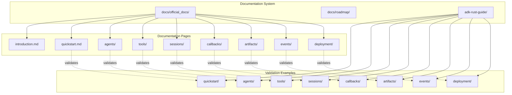
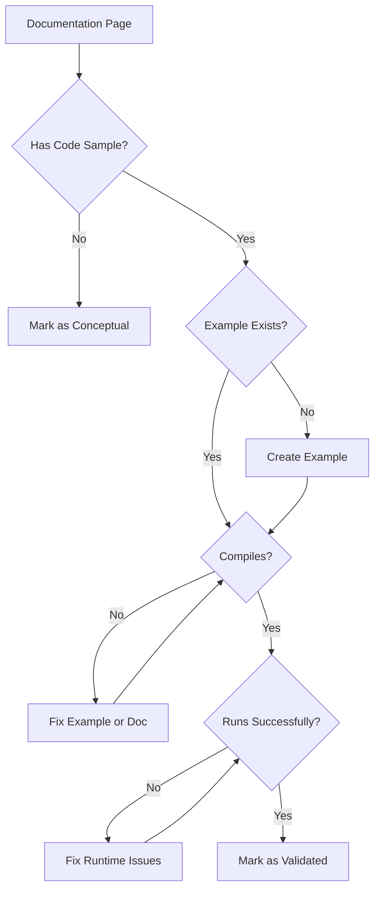

# Design Document: ADK-Rust Official Documentation

## Overview

This design document outlines the architecture and implementation approach for creating comprehensive, validated official documentation for ADK-Rust. The documentation system consists of two main components:

1. **Documentation Pages** (`docs/official_docs/`): Markdown files containing explanations, concepts, and code samples
2. **Validation Examples** (`adk-rust-guide/`): Working Rust code that validates each documentation page's samples

The system ensures documentation accuracy by requiring every code sample to have a corresponding validated example that compiles and executes successfully.

## Architecture



## Components and Interfaces

### Documentation Structure

```
docs/
├── official_docs/
│   ├── index.md                    # Table of contents
│   ├── introduction.md             # ADK-Rust overview
│   ├── quickstart.md               # Getting started guide
│   ├── agents/
│   │   ├── llm-agent.md            # LlmAgent configuration
│   │   ├── workflow-agents.md      # Sequential, Parallel, Loop
│   │   └── multi-agent.md          # Sub-agents and hierarchies
│   ├── tools/
│   │   ├── function-tools.md       # Custom function tools
│   │   ├── built-in-tools.md       # GoogleSearchTool, etc.
│   │   └── mcp-tools.md            # MCP integration
│   ├── sessions/
│   │   ├── sessions.md             # Session management
│   │   └── state.md                # State management
│   ├── callbacks/
│   │   └── callbacks.md            # All callback types
│   ├── artifacts/
│   │   └── artifacts.md            # Binary data management
│   ├── events/
│   │   └── events.md               # Event system
│   ├── observability/
│   │   └── telemetry.md            # Logging and tracing
│   └── deployment/
│       ├── launcher.md             # Launcher API
│       ├── server.md               # REST API server
│       └── a2a.md                  # Agent-to-Agent protocol
└── roadmap/
    ├── long-running-tools.md       # Long running function tools
    ├── vertex-ai-session.md        # VertexAI session service
    ├── gcs-artifacts.md            # GCS artifact service
    ├── agent-tool.md               # Agent-as-a-tool pattern
    └── evaluation.md               # Evaluation framework
```

### Validation Examples Structure

```
adk-rust-guide/
├── Cargo.toml
├── src/
│   ├── main.rs                     # CLI entry point
│   └── lib.rs                      # Shared utilities
├── examples/
│   ├── quickstart.rs               # Validates quickstart.md
│   ├── agents/
│   │   ├── llm_agent_basic.rs      # Basic LlmAgent
│   │   ├── llm_agent_config.rs     # All config options
│   │   ├── sequential_agent.rs     # Sequential workflow
│   │   ├── parallel_agent.rs       # Parallel workflow
│   │   ├── loop_agent.rs           # Loop workflow
│   │   └── multi_agent.rs          # Sub-agents
│   ├── tools/
│   │   ├── function_tool.rs        # Custom function tool
│   │   ├── google_search.rs        # GoogleSearchTool
│   │   └── mcp_tool.rs             # MCP integration
│   ├── sessions/
│   │   ├── session_basic.rs        # Session creation
│   │   └── state_management.rs     # State operations
│   ├── callbacks/
│   │   ├── before_agent.rs         # Before agent callback
│   │   ├── after_agent.rs          # After agent callback
│   │   ├── before_model.rs         # Before model callback
│   │   ├── after_model.rs          # After model callback
│   │   └── tool_callbacks.rs       # Tool callbacks
│   ├── artifacts/
│   │   └── artifact_ops.rs         # Save/load artifacts
│   ├── events/
│   │   └── event_inspection.rs     # Event handling
│   └── deployment/
│       ├── console_mode.rs         # Console runner
│       └── server_mode.rs          # HTTP server
└── tests/
    └── validation_tests.rs         # Compilation tests
```

### Documentation Page Interface

Each documentation page follows a consistent structure:

```markdown
# Feature Name

Brief description of the feature.

## Overview

Conceptual explanation of what the feature does and why it's useful.

## Basic Usage

```rust
// Minimal working example
```

## Configuration Options

Detailed explanation of each configuration option with examples.

## Advanced Patterns

More complex usage patterns and best practices.

## API Reference

Link to rustdoc or inline API documentation.

## Related

- Links to related documentation pages
```

### Validation Example Interface

Each validation example follows this pattern:

```rust
//! Validates: docs/official_docs/{path}/{page}.md
//! 
//! This example demonstrates {feature} as documented in the official docs.

use adk_rust::prelude::*;
// ... other imports

#[tokio::main]
async fn main() -> Result<(), Box<dyn std::error::Error>> {
    // Setup (API key, model, etc.)
    
    // Feature demonstration matching documentation
    
    // Verification output
    println!("✅ Example completed successfully");
    Ok(())
}
```

## Data Models

### Documentation Metadata

Each documentation page can include front matter for metadata:

```yaml
---
title: "LlmAgent Configuration"
category: "agents"
validated: true
example: "examples/agents/llm_agent_config.rs"
adk_go_parity: true
---
```

### Validation Status

```rust
pub enum ValidationStatus {
    Validated,      // Example compiles and runs
    Unvalidated,    // Example exists but fails
    Roadmap,        // Feature not yet implemented
}

pub struct DocPage {
    pub path: String,
    pub title: String,
    pub example_path: Option<String>,
    pub status: ValidationStatus,
}
```

## Correctness Properties

*A property is a characteristic or behavior that should hold true across all valid executions of a system-essentially, a formal statement about what the system should do. Properties serve as the bridge between human-readable specifications and machine-verifiable correctness guarantees.*

### Property 1: Documentation Example Compilation
*For any* documentation page with a code sample, the corresponding validation example in adk-rust-guide SHALL compile successfully with `cargo build --example {name}`.
**Validates: Requirements 2.3, 2.5, 3.2, 3.5, 4.1, 4.2, 4.3, 4.5, 5.4, 5.6, 6.4, 7.6, 8.3, 8.5, 9.6, 10.4, 11.6, 12.4, 13.4, 13.5, 14.4, 15.3, 15.4, 16.2, 18.2, 18.3**

### Property 2: Documentation-Example Correspondence
*For any* documentation page in `docs/official_docs/` (excluding index), there SHALL exist a corresponding example file in `adk-rust-guide/examples/` that validates its code samples.
**Validates: Requirements 16.1, 16.2**

### Property 3: No Mocks in Validated Examples
*For any* example in `adk-rust-guide/examples/`, the code SHALL NOT contain mock implementations, placeholder functions, or workaround patterns (e.g., `unimplemented!()`, `todo!()`, `mock_`, `fake_`, `stub_`).
**Validates: Requirements 16.5**

### Property 4: Roadmap Files No Runnable Code
*For any* file in `docs/roadmap/`, the content SHALL NOT contain Rust code blocks marked as runnable (i.e., no ` ```rust ` blocks without `ignore` or `no_run` attributes).
**Validates: Requirements 17.4**

### Property 5: Required Imports Present
*For any* validation example that compiles successfully, all necessary imports SHALL be present in the file (verified by successful compilation).
**Validates: Requirements 18.2**

## Error Handling

### Documentation Errors

1. **Missing Example**: If a documentation page references code but no validation example exists, the page is marked as "unvalidated"
2. **Compilation Failure**: If a validation example fails to compile, the corresponding documentation page is flagged for review
3. **Runtime Failure**: If a validation example compiles but fails at runtime (excluding API key issues), the page is flagged

### Validation Process



## Testing Strategy

### Dual Testing Approach

The documentation validation system uses both unit tests and property-based tests:

#### Unit Tests
- Verify specific documentation pages have corresponding examples
- Check that example files contain required documentation comments
- Validate front matter metadata in documentation pages

#### Property-Based Tests

We will use the `proptest` crate for property-based testing.

**Property Test 1: Example Compilation**
- Generate: List of all example files in `adk-rust-guide/examples/`
- Property: Each example compiles with `cargo build --example {name}`
- Tag: `**Feature: official-documentation, Property 1: Documentation Example Compilation**`

**Property Test 2: Documentation-Example Mapping**
- Generate: List of all documentation pages in `docs/official_docs/`
- Property: Each page (except index) has a corresponding example
- Tag: `**Feature: official-documentation, Property 2: Documentation-Example Correspondence**`

**Property Test 3: No Mocks**
- Generate: Content of each example file
- Property: Content does not contain mock patterns
- Tag: `**Feature: official-documentation, Property 3: No Mocks in Validated Examples**`

**Property Test 4: Roadmap No Code**
- Generate: Content of each roadmap file
- Property: No runnable Rust code blocks
- Tag: `**Feature: official-documentation, Property 4: Roadmap Files No Runnable Code**`

### Test Configuration

Property-based tests will run with a minimum of 100 iterations to ensure thorough coverage.

```rust
proptest! {
    #![proptest_config(ProptestConfig::with_cases(100))]
    
    #[test]
    fn test_example_compilation(example in example_files()) {
        // Property 1 test
    }
}
```

### Validation Commands

```bash
# Compile all examples
cargo build --examples -p adk-rust-guide

# Run specific example
cargo run --example quickstart -p adk-rust-guide

# Run validation tests
cargo test -p adk-rust-guide

# Run property tests
cargo test --test validation_tests -p adk-rust-guide
```

## Implementation Notes

### Feature Parity Tracking

Each documentation page should track parity with adk-go:

| Feature | adk-go | adk-rust | Status |
|---------|--------|----------|--------|
| LlmAgent | ✅ | ✅ | Validated |
| FunctionTool | ✅ | ✅ | Validated |
| SequentialAgent | ✅ | ✅ | Validated |
| ParallelAgent | ✅ | ✅ | Validated |
| LoopAgent | ✅ | ✅ | Validated |
| InMemorySession | ✅ | ✅ | Validated |
| DatabaseSession | ✅ | ✅ | Validated |
| Callbacks | ✅ | ✅ | Validated |
| Artifacts | ✅ | ✅ | Validated |
| MCP Tools | ✅ | Partial | Roadmap |
| A2A Protocol | ✅ | Partial | Roadmap |
| AgentTool | ✅ | ❌ | Roadmap |
| LongRunningTool | ✅ | ❌ | Roadmap |
| VertexAI Session | ✅ | ❌ | Roadmap |
| GCS Artifacts | ✅ | ❌ | Roadmap |

### Code Sample Guidelines

1. **Minimal but Complete**: Examples should be as short as possible while remaining fully functional
2. **Error Handling**: Use `?` operator and `Result` types appropriately
3. **Comments**: Include comments for non-obvious code
4. **Imports**: Show all necessary imports at the top
5. **Environment**: Document required environment variables (GOOGLE_API_KEY)

### Documentation Writing Guidelines

1. **Rust-First**: Write for Rust developers, not as a translation from Go
2. **Idiomatic**: Use Rust idioms (Result, Option, traits, etc.)
3. **Practical**: Focus on real-world use cases
4. **Progressive**: Start simple, build to complex
5. **Cross-Referenced**: Link related documentation pages
