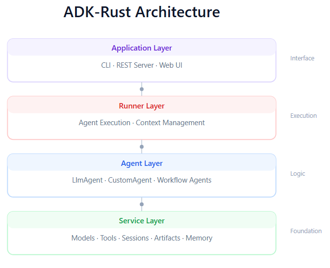
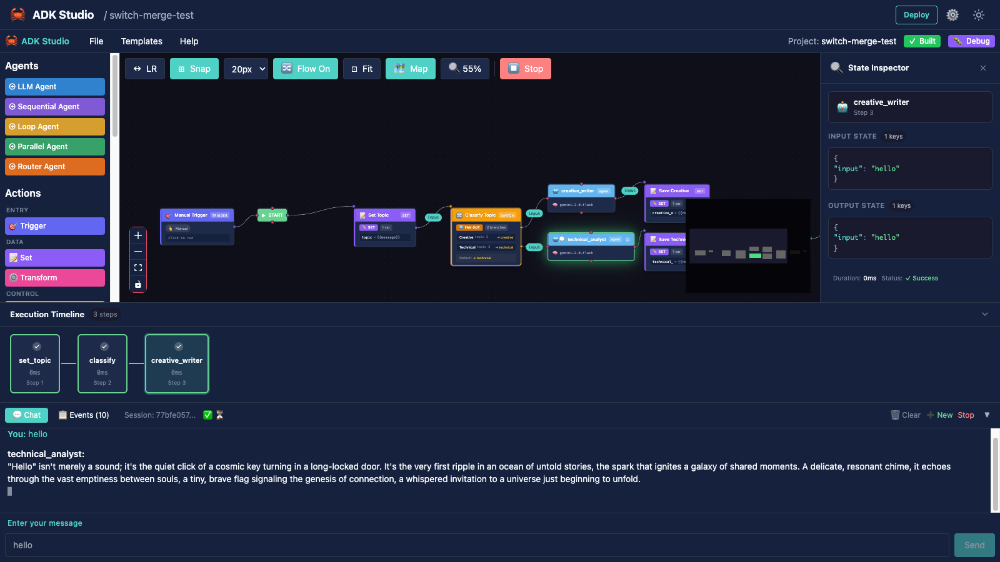

# ADK-Rust

[](https://github.com/zavora-ai/adk-rust/actions/workflows/ci.yml)
[](https://crates.io/crates/adk-rust)
[](https://docs.rs/adk-rust)
[](https://github.com/zavora-ai/adk-rust/wiki)
[](LICENSE)


> **🎉 v0.3.0 Released!** ADK Studio action nodes & debugger, ADK UI support for A2UI, AG UI and MCP Apps, Skills.md augmentation, and Vertex AI integration....including an all new ADK-Rust VS Code Extension! [Get started →](https://github.com/zavora-ai/adk-rust/wiki/quickstart)

A comprehensive and production-ready Rust framework for building AI agents. Create powerful and high-performance AI agent systems with a flexible, modular architecture. Model-agnostic. Type-safe. Blazingly fast.

## Overview

ADK-Rust provides a comprehensive framework for building AI agents in Rust, featuring:

- **Type-safe agent abstractions** with async execution and event streaming
- **Multiple agent types**: LLM agents, workflow agents (sequential, parallel, loop), and custom agents
- **Realtime voice agents**: Bidirectional audio streaming with OpenAI Realtime API and Gemini Live API
- **Tool ecosystem**: Function tools, Google Search, MCP (Model Context Protocol) integration
- **Production features**: Session management, artifact storage, memory systems, REST/A2A APIs
- **Developer experience**: Interactive CLI, 80+ working examples, comprehensive documentation

**Status**: Production-ready, actively maintained

## Architecture



ADK-Rust follows a clean layered architecture from application interface down to foundational services.

## Key Features

### Agent Types

**LLM Agents**: Powered by large language models with tool use, function calling, and streaming responses.

**Workflow Agents**: Deterministic orchestration patterns.
- `SequentialAgent`: Execute agents in sequence
- `ParallelAgent`: Execute agents concurrently
- `LoopAgent`: Iterative execution with exit conditions

**Custom Agents**: Implement the `Agent` trait for specialized behavior.

**Realtime Voice Agents**: Build voice-enabled AI assistants with bidirectional audio streaming.

**Graph Agents**: LangGraph-style workflow orchestration with state management and checkpointing.

### Multi-Provider Support

ADK supports multiple LLM providers with a unified API:

| Provider | Model Examples | Feature Flag |
|----------|---------------|--------------|
| Gemini | `gemini-3-pro-preview`, `gemini-2.5-flash`, `gemini-2.5-pro` | (default) |
| OpenAI | `gpt-5.2`, `gpt-5`, `gpt-4o`, `gpt-4o-mini` | `openai` |
| Anthropic | `claude-opus-4-20250514`, `claude-sonnet-4-20250514` | `anthropic` |
| DeepSeek | `deepseek-chat`, `deepseek-reasoner` | `deepseek` |
| Groq | `llama-3.3-70b-versatile`, `mixtral-8x7b-32768` | `groq` |
| Ollama | `llama3.2`, `qwen2.5`, `mistral` | `ollama` |
| mistral.rs | Phi-3, Mistral, Llama, Gemma, LLaVa, FLUX | git dependency |

All providers support streaming, function calling, and multimodal inputs (where available).

### Tool System

Built-in tools:
- Function tools (custom Rust functions)
- Google Search
- Artifact loading
- Loop termination

**MCP Integration**: Connect to Model Context Protocol servers for extended capabilities.

### Production Features

- **Session Management**: In-memory and SQLite-backed sessions with state persistence
- **Memory System**: Long-term memory with semantic search and vector embeddings
- **Servers**: REST API with SSE streaming, A2A protocol for agent-to-agent communication
- **Guardrails**: PII redaction, content filtering, JSON schema validation
- **Observability**: OpenTelemetry tracing, structured logging

## Core Crates

| Crate | Purpose | Key Features |
|-------|---------|--------------|
| `adk-core` | Foundational traits and types | `Agent` trait, `Content`, `Part`, error types, streaming primitives |
| `adk-agent` | Agent implementations | `LlmAgent`, `SequentialAgent`, `ParallelAgent`, `LoopAgent`, builder patterns |
| `adk-skill` | AgentSkills parsing and selection | Skill markdown parser, `.skills` discovery/indexing, lexical matching, prompt injection helpers |
| `adk-model` | LLM integrations | Gemini, OpenAI, Anthropic, DeepSeek, Groq, Ollama clients, streaming, function calling |
| `adk-gemini` | Gemini client | Google Gemini API client with streaming and multimodal support |
| `adk-mistralrs` | Native local inference | mistral.rs integration, ISQ quantization, LoRA adapters (git-only) |
| `adk-tool` | Tool system and extensibility | `FunctionTool`, Google Search, MCP protocol, schema validation |
| `adk-session` | Session and state management | SQLite/in-memory backends, conversation history, state persistence |
| `adk-artifact` | Artifact storage system | File-based storage, MIME type handling, image/PDF/video support |
| `adk-memory` | Long-term memory | Vector embeddings, semantic search, Qdrant integration |
| `adk-runner` | Agent execution runtime | Context management, event streaming, session lifecycle, callbacks |
| `adk-server` | Production API servers | REST API, A2A protocol, middleware, health checks |
| `adk-cli` | Command-line interface | Interactive REPL, session management, MCP server integration |
| `adk-realtime` | Real-time voice agents | OpenAI Realtime API, Gemini Live API, bidirectional audio, VAD |
| `adk-graph` | Graph-based workflows | LangGraph-style orchestration, state management, checkpointing, human-in-the-loop |
| `adk-browser` | Browser automation | 46 WebDriver tools, navigation, forms, screenshots, PDF generation |
| `adk-eval` | Agent evaluation | Test definitions, trajectory validation, LLM-judged scoring, rubrics |
| `adk-guardrail` | Input/output validation | PII redaction, content filtering, JSON schema validation |
| `adk-auth` | Access control | Role-based permissions, SSO/OAuth, audit logging |
| `adk-telemetry` | Observability | Structured logging, OpenTelemetry tracing, span helpers |
| `adk-ui` | Dynamic UI generation | 28 components, 10 templates, React client, streaming updates |
| `adk-studio` | Visual development | Drag-and-drop agent builder, code generation, live testing |

## Quick Start

### Installation

Requires Rust 1.85 or later (Rust 2024 edition). Add to your `Cargo.toml`:

```toml
[dependencies]
adk-rust = "0.3.0"

# Or individual crates
adk-core = "0.3.0"
adk-agent = "0.3.0"
adk-model = "0.3.0"  # Add features for providers: features = ["openai", "anthropic"]
adk-tool = "0.3.0"
adk-runner = "0.3.0"
```

**Nightly (latest features):**
```toml
adk-rust = { git = "https://github.com/zavora-ai/adk-rust", branch = "develop" }
```

Set your API key:

```bash
# For Gemini (default)
export GOOGLE_API_KEY="your-api-key"

# For OpenAI
export OPENAI_API_KEY="your-api-key"

# For Anthropic
export ANTHROPIC_API_KEY="your-api-key"

# For DeepSeek
export DEEPSEEK_API_KEY="your-api-key"

# For Groq
export GROQ_API_KEY="your-api-key"

# For Ollama (no key, just run: ollama serve)
```

### Basic Example (Gemini)

```rust
use adk_rust::prelude::*;
use adk_rust::Launcher;

#[tokio::main]
async fn main() -> AnyhowResult<()> {
    dotenvy::dotenv().ok();
    let api_key = std::env::var("GOOGLE_API_KEY")?;
    let model = GeminiModel::new(&api_key, "gemini-2.5-flash")?;

    let agent = LlmAgentBuilder::new("assistant")
        .description("Helpful AI assistant")
        .instruction("You are a helpful assistant. Be concise and accurate.")
        .model(Arc::new(model))
        .build()?;

    Launcher::new(Arc::new(agent)).run().await?;
    Ok(())
}
```

### OpenAI Example

```rust
use adk_rust::prelude::*;
use adk_rust::Launcher;

#[tokio::main]
async fn main() -> AnyhowResult<()> {
    dotenvy::dotenv().ok();
    let api_key = std::env::var("OPENAI_API_KEY")?;
    let model = OpenAIClient::new(OpenAIConfig::new(api_key, "gpt-4o"))?;

    let agent = LlmAgentBuilder::new("assistant")
        .instruction("You are a helpful assistant.")
        .model(Arc::new(model))
        .build()?;

    Launcher::new(Arc::new(agent)).run().await?;
    Ok(())
}
```

### Anthropic Example

```rust
use adk_rust::prelude::*;
use adk_rust::Launcher;

#[tokio::main]
async fn main() -> AnyhowResult<()> {
    dotenvy::dotenv().ok();
    let api_key = std::env::var("ANTHROPIC_API_KEY")?;
    let model = AnthropicClient::new(AnthropicConfig::new(api_key, "claude-sonnet-4-20250514"))?;

    let agent = LlmAgentBuilder::new("assistant")
        .instruction("You are a helpful assistant.")
        .model(Arc::new(model))
        .build()?;

    Launcher::new(Arc::new(agent)).run().await?;
    Ok(())
}
```

### DeepSeek Example

```rust
use adk_rust::prelude::*;
use adk_rust::Launcher;

#[tokio::main]
async fn main() -> AnyhowResult<()> {
    dotenvy::dotenv().ok();
    let api_key = std::env::var("DEEPSEEK_API_KEY")?;

    // Standard chat model
    let model = DeepSeekClient::chat(api_key)?;

    // Or use reasoner for chain-of-thought reasoning
    // let model = DeepSeekClient::reasoner(api_key)?;

    let agent = LlmAgentBuilder::new("assistant")
        .instruction("You are a helpful assistant.")
        .model(Arc::new(model))
        .build()?;

    Launcher::new(Arc::new(agent)).run().await?;
    Ok(())
}
```

### Groq Example (Ultra-Fast)

```rust
use adk_rust::prelude::*;
use adk_rust::Launcher;

#[tokio::main]
async fn main() -> AnyhowResult<()> {
    dotenvy::dotenv().ok();
    let api_key = std::env::var("GROQ_API_KEY")?;
    let model = GroqClient::new(GroqConfig::llama70b(api_key))?;

    let agent = LlmAgentBuilder::new("assistant")
        .instruction("You are a helpful assistant.")
        .model(Arc::new(model))
        .build()?;

    Launcher::new(Arc::new(agent)).run().await?;
    Ok(())
}
```

### Ollama Example (Local)

```rust
use adk_rust::prelude::*;
use adk_rust::Launcher;

#[tokio::main]
async fn main() -> AnyhowResult<()> {
    dotenvy::dotenv().ok();
    // Requires: ollama serve && ollama pull llama3.2
    let model = OllamaModel::new(OllamaConfig::new("llama3.2"))?;

    let agent = LlmAgentBuilder::new("assistant")
        .instruction("You are a helpful assistant.")
        .model(Arc::new(model))
        .build()?;

    Launcher::new(Arc::new(agent)).run().await?;
    Ok(())
}
```

### Run Examples

```bash
# Interactive console (Gemini)
cargo run --example quickstart

# OpenAI examples (requires --features openai)
cargo run --example openai_basic --features openai
cargo run --example openai_tools --features openai

# DeepSeek examples (requires --features deepseek)
cargo run --example deepseek_basic --features deepseek
cargo run --example deepseek_reasoner --features deepseek

# Groq examples (requires --features groq)
cargo run --example groq_basic --features groq

# Ollama examples (requires --features ollama)
cargo run --example ollama_basic --features ollama

# REST API server
cargo run --example server

# Workflow agents
cargo run --example sequential_agent
cargo run --example parallel_agent

# See all examples
ls examples/
```

## ADK-Rust Studio

[](https://crates.io/crates/adk-studio)


A visual development environment for building AI agents with drag-and-drop. Design complex multi-agent workflows, compile to production Rust code, and test live — all from your browser.



```bash
# Install and run
cargo install adk-studio
adk-studio
```

**Features**:
- Drag-and-drop canvas with LLM agents, workflow agents, and 14 action nodes
- Execution Timeline with step-by-step replay and State Inspector
- Debug mode with live input/output state visualization per node
- Real-time chat with SSE streaming and event trace
- 14 action nodes: Trigger, HTTP, Set, Transform, Switch, Loop, Merge, Wait, Code, Database, Email, Notification, RSS, File
- Triggers: Manual, Webhook (with auth), Cron Schedule, Event (with JSONPath filters)
- Code generation: Compile visual designs to production ADK-Rust with auto-detected dependencies
- Build, run, and deploy executables directly from Studio

## Advanced Features

### Realtime Voice Agents

Build voice-enabled AI assistants using the `adk-realtime` crate:

```rust
use adk_realtime::{RealtimeAgent, openai::OpenAIRealtimeModel, RealtimeModel};
use std::sync::Arc;

#[tokio::main]
async fn main() -> Result<(), Box<dyn std::error::Error>> {
    let model: Arc<dyn RealtimeModel> = Arc::new(
        OpenAIRealtimeModel::new(&api_key, "gpt-4o-realtime-preview-2024-12-17")
    );

    let agent = RealtimeAgent::builder("voice_assistant")
        .model(model)
        .instruction("You are a helpful voice assistant.")
        .voice("alloy")
        .server_vad()  // Enable voice activity detection
        .build()?;

    Ok(())
}
```

**Supported Realtime Models**:
| Provider | Model | Description |
|----------|-------|-------------|
| OpenAI | `gpt-4o-realtime-preview-2024-12-17` | Stable realtime model |
| OpenAI | `gpt-realtime` | Latest model with improved speech quality and function calling |
| Google | `gemini-2.0-flash-live-preview-04-09` | Gemini Live API |

**Features**:
- OpenAI Realtime API and Gemini Live API support
- Bidirectional audio streaming (PCM16, G711)
- Server-side Voice Activity Detection (VAD)
- Real-time tool calling during voice conversations
- Multi-agent handoffs for complex workflows

**Run realtime examples**:
```bash
cargo run --example realtime_basic --features realtime-openai
cargo run --example realtime_tools --features realtime-openai
cargo run --example realtime_handoff --features realtime-openai
```

### Graph-Based Workflows

Build complex, stateful workflows using the `adk-graph` crate (LangGraph-style):

```rust
use adk_graph::{prelude::*, node::AgentNode};
use adk_agent::LlmAgentBuilder;
use adk_model::GeminiModel;

// Create LLM agents for different tasks
let translator = Arc::new(LlmAgentBuilder::new("translator")
    .model(Arc::new(GeminiModel::new(&api_key, "gemini-2.0-flash")?))
    .instruction("Translate the input text to French.")
    .build()?);

let summarizer = Arc::new(LlmAgentBuilder::new("summarizer")
    .model(model.clone())
    .instruction("Summarize the input text in one sentence.")
    .build()?);

// Create AgentNodes with custom input/output mappers
let translator_node = AgentNode::new(translator)
    .with_input_mapper(|state| {
        let text = state.get("input").and_then(|v| v.as_str()).unwrap_or("");
        adk_core::Content::new("user").with_text(text)
    })
    .with_output_mapper(|events| {
        let mut updates = HashMap::new();
        for event in events {
            if let Some(content) = event.content() {
                let text: String = content.parts.iter()
                    .filter_map(|p| p.text())
                    .collect::<Vec<_>>()
                    .join("");
                updates.insert("translation".to_string(), json!(text));
            }
        }
        updates
    });

// Build graph with parallel execution
let agent = GraphAgent::builder("text_processor")
    .description("Translates and summarizes text in parallel")
    .channels(&["input", "translation", "summary"])
    .node(translator_node)
    .node(summarizer_node)  // Similar setup
    .edge(START, "translator")
    .edge(START, "summarizer")  // Parallel execution
    .edge("translator", "combine")
    .edge("summarizer", "combine")
    .edge("combine", END)
    .build()?;

// Execute
let mut input = State::new();
input.insert("input".to_string(), json!("AI is transforming how we work."));
let result = agent.invoke(input, ExecutionConfig::new("thread-1")).await?;
```

**Features**:
- **AgentNode**: Wrap LLM agents as graph nodes with custom input/output mappers
- **Parallel & Sequential**: Execute agents concurrently or in sequence
- **Cyclic Graphs**: ReAct pattern with tool loops and iteration limiting
- **Conditional Routing**: Dynamic routing via `Router::by_field` or custom functions
- **Checkpointing**: Memory and SQLite backends for fault tolerance
- **Human-in-the-Loop**: Dynamic interrupts based on state, resume from checkpoint
- **Streaming**: Multiple modes (values, updates, messages, debug)

**Run graph examples**:
```bash
cargo run --example graph_agent       # Parallel LLM agents with callbacks
cargo run --example graph_workflow    # Sequential multi-agent pipeline
cargo run --example graph_conditional # LLM-based routing
cargo run --example graph_react       # ReAct pattern with tools
cargo run --example graph_supervisor  # Multi-agent supervisor
cargo run --example graph_hitl        # Human-in-the-loop approval
cargo run --example graph_checkpoint  # State persistence
```

### Browser Automation

Give agents web browsing capabilities using the `adk-browser` crate:

```rust
use adk_browser::{BrowserSession, BrowserToolset, BrowserConfig};

// Create browser session
let config = BrowserConfig::new().webdriver_url("http://localhost:4444");
let session = Arc::new(BrowserSession::new(config));

// Get all 46 browser tools
let toolset = BrowserToolset::new(session);
let tools = toolset.all_tools();

// Add to agent
let mut builder = LlmAgentBuilder::new("web_agent")
    .model(model)
    .instruction("Browse the web and extract information.");

for tool in tools {
    builder = builder.tool(tool);
}

let agent = builder.build()?;
```

**46 Browser Tools**:
- Navigation: `browser_navigate`, `browser_back`, `browser_forward`, `browser_refresh`
- Extraction: `browser_extract_text`, `browser_extract_links`, `browser_extract_html`
- Interaction: `browser_click`, `browser_type`, `browser_select`, `browser_submit`
- Forms: `browser_fill_form`, `browser_get_form_fields`, `browser_clear_field`
- Screenshots: `browser_screenshot`, `browser_screenshot_element`
- JavaScript: `browser_evaluate`, `browser_evaluate_async`
- Cookies, frames, windows, and more

**Requirements**: WebDriver (Selenium, ChromeDriver, etc.)
```bash
docker run -d -p 4444:4444 selenium/standalone-chrome
cargo run --example browser_agent
```

### Agent Evaluation

Test and validate agent behavior using the `adk-eval` crate:

```rust
use adk_eval::{Evaluator, EvaluationConfig, EvaluationCriteria};

let config = EvaluationConfig::with_criteria(
    EvaluationCriteria::exact_tools()
        .with_response_similarity(0.8)
);

let evaluator = Evaluator::new(config);
let report = evaluator
    .evaluate_file(agent, "tests/my_agent.test.json")
    .await?;

assert!(report.all_passed());
```

**Evaluation Capabilities**:
- Trajectory validation (tool call sequences)
- Response similarity (Jaccard, Levenshtein, ROUGE)
- LLM-judged semantic matching
- Rubric-based scoring with custom criteria
- Safety and hallucination detection
- Detailed reporting with failure analysis

### Local Inference with mistral.rs

For native local inference without external dependencies, use the `adk-mistralrs` crate:

```rust
use adk_mistralrs::{MistralRsModel, MistralRsConfig, ModelSource, QuantizationLevel};
use adk_agent::LlmAgentBuilder;
use std::sync::Arc;

#[tokio::main]
async fn main() -> anyhow::Result<()> {
    // Load model with ISQ quantization for reduced memory
    let config = MistralRsConfig::builder()
        .model_source(ModelSource::huggingface("microsoft/Phi-3.5-mini-instruct"))
        .isq(QuantizationLevel::Q4_0)
        .paged_attention(true)
        .build();

    let model = MistralRsModel::new(config).await?;

    let agent = LlmAgentBuilder::new("local-assistant")
        .instruction("You are a helpful assistant running locally.")
        .model(Arc::new(model))
        .build()?;

    Ok(())
}
```

**Note**: `adk-mistralrs` is not on crates.io due to git dependencies. Add via:
```toml
adk-mistralrs = { git = "https://github.com/zavora-ai/adk-rust" }
# With Metal: features = ["metal"]
# With CUDA: features = ["cuda"]
```

**Features**: ISQ quantization, PagedAttention, multi-GPU splitting, LoRA/X-LoRA adapters, vision/speech/diffusion models, MCP integration.

### Dynamic UI Generation

The `adk-ui` crate enables agents to render rich user interfaces:

```rust
use adk_ui::{UiToolset, UI_AGENT_PROMPT};

let tools = UiToolset::all_tools(); // 10 render tools

let mut builder = LlmAgentBuilder::new("ui_assistant")
    .instruction(UI_AGENT_PROMPT);  // Tested prompt for reliable UI generation

for tool in tools {
    builder = builder.tool(tool);
}

let agent = builder.build()?;
```

**React Client**: `npm install @zavora-ai/adk-ui-react`

**Features**: 28 components, 10 templates, dark mode, streaming updates, server-side validation


## Building from Source

### Using Make (Recommended)

```bash
# See all available commands
make help

# Build all crates (CPU-only, works on all systems)
make build

# Build with all features (safe - adk-mistralrs excluded)
make build-all

# Build all examples
make examples

# Run tests
make test

# Run clippy lints
make clippy
```

### Manual Build

```bash
# Build workspace (CPU-only)
cargo build --workspace

# Build with all features (works without CUDA)
cargo build --workspace --all-features

# Build examples with common features
cargo build --examples --features "openai,anthropic,deepseek,ollama,groq,browser,guardrails,sso"
```

### Local LLM with mistral.rs

`adk-mistralrs` is excluded from the workspace by default to allow `--all-features` to work without CUDA toolkit. Build it explicitly:

```bash
# CPU-only (works on all systems)
make build-mistralrs
# or: cargo build --manifest-path adk-mistralrs/Cargo.toml

# macOS with Apple Silicon (Metal GPU)
make build-mistralrs-metal
# or: cargo build --manifest-path adk-mistralrs/Cargo.toml --features metal

# NVIDIA GPU (requires CUDA toolkit)
make build-mistralrs-cuda
# or: cargo build --manifest-path adk-mistralrs/Cargo.toml --features cuda
```

### Running mistralrs Examples

```bash
# Build and run examples with mistralrs
cargo run --example mistralrs_basic --features mistralrs

# With Metal GPU acceleration (macOS)
cargo run --example mistralrs_basic --features mistralrs,metal
```

## Use as Library

Add to your `Cargo.toml`:

```toml
[dependencies]
# All-in-one crate
adk-rust = "0.3.0"

# Or individual crates for finer control
adk-core = "0.3.0"
adk-agent = "0.3.0"
adk-model = { version = "0.3.0", features = ["openai", "anthropic"] }  # Enable providers
adk-tool = "0.3.0"
adk-runner = "0.3.0"

# Optional dependencies
adk-session = { version = "0.3.0", optional = true }
adk-artifact = { version = "0.3.0", optional = true }
adk-memory = { version = "0.3.0", optional = true }
adk-server = { version = "0.3.0", optional = true }
adk-cli = { version = "0.3.0", optional = true }
adk-realtime = { version = "0.3.0", features = ["openai"], optional = true }
adk-graph = { version = "0.3.0", features = ["sqlite"], optional = true }
adk-browser = { version = "0.3.0", optional = true }
adk-eval = { version = "0.3.0", optional = true }
```

## Examples

See [examples/](examples/) directory for complete, runnable examples:

**Getting Started**
- `quickstart/` - Basic agent setup and chat loop
- `function_tool/` - Custom tool implementation
- `multiple_tools/` - Agent with multiple tools
- `agent_tool/` - Use agents as callable tools

**OpenAI Integration** (requires `--features openai`)
- `openai_basic/` - Simple OpenAI GPT agent
- `openai_tools/` - OpenAI with function calling
- `openai_workflow/` - Multi-agent workflows with OpenAI
- `openai_structured/` - Structured JSON output

**DeepSeek Integration** (requires `--features deepseek`)
- `deepseek_basic/` - Basic DeepSeek chat
- `deepseek_reasoner/` - Chain-of-thought reasoning mode
- `deepseek_tools/` - Function calling with DeepSeek
- `deepseek_caching/` - Context caching for cost reduction

**Workflow Agents**
- `sequential/` - Sequential workflow execution
- `parallel/` - Concurrent agent execution
- `loop_workflow/` - Iterative refinement patterns
- `sequential_code/` - Code generation pipeline

**Realtime Voice Agents** (requires `--features realtime-openai`)
- `realtime_basic/` - Basic text-only realtime session
- `realtime_vad/` - Voice assistant with VAD
- `realtime_tools/` - Tool calling in realtime sessions
- `realtime_handoff/` - Multi-agent handoffs

**Graph Workflows**
- `graph_agent/` - GraphAgent with parallel LLM agents and callbacks
- `graph_workflow/` - Sequential multi-agent pipeline
- `graph_conditional/` - LLM-based classification and routing
- `graph_react/` - ReAct pattern with tools and cycles
- `graph_supervisor/` - Multi-agent supervisor routing
- `graph_hitl/` - Human-in-the-loop with risk-based interrupts
- `graph_checkpoint/` - State persistence and time travel debugging

**Browser Automation**
- `browser_basic/` - Basic browser session and tools
- `browser_agent/` - AI agent with browser tools
- `browser_interactive/` - Full 46-tool interactive example

**Agent Evaluation**
- `eval_basic/` - Basic evaluation setup
- `eval_trajectory/` - Tool call trajectory validation
- `eval_semantic/` - LLM-judged semantic matching
- `eval_rubric/` - Rubric-based scoring

**Guardrails**
- `guardrail_basic/` - PII redaction and content filtering
- `guardrail_schema/` - JSON schema validation
- `guardrail_agent/` - Full agent integration with guardrails

**mistral.rs Local Inference** (requires git dependency)
- `mistralrs_basic/` - Basic text generation with local models
- `mistralrs_tools/` - Function calling with mistral.rs
- `mistralrs_vision/` - Image understanding with vision models
- `mistralrs_isq/` - In-situ quantization for memory efficiency
- `mistralrs_lora/` - LoRA adapter usage and hot-swapping
- `mistralrs_multimodel/` - Multi-model serving
- `mistralrs_mcp/` - MCP client integration

**Dynamic UI**
- `ui_agent/` - Agent with UI rendering tools
- `ui_server/` - UI server with streaming updates
- `ui_react_client/` - React client example

**Production Features**
- `load_artifacts/` - Working with images and PDFs
- `mcp/` - Model Context Protocol integration
- `server/` - REST API deployment
- `a2a/` - Agent-to-Agent communication
- `web/` - Web UI with streaming
- `research_paper/` - Complex multi-agent workflow

## Development

### Testing

```bash
# Run all tests
cargo test

# Test specific crate
cargo test --package adk-core

# With output
cargo test -- --nocapture
```

### Code Quality

```bash
# Linting
cargo clippy

# Formatting
cargo fmt

# Security audit
cargo audit
```

### Building

```bash
# Development build
cargo build

# Optimized release build
cargo build --release
```

## Documentation

- **Wiki**: [GitHub Wiki](https://github.com/zavora-ai/adk-rust/wiki) - Comprehensive guides and tutorials
- **API Reference**: [docs.rs/adk-rust](https://docs.rs/adk-rust) - Full API documentation
- **Examples**: [examples/README.md](examples/README.md) - 80+ working examples with detailed explanations

## Performance

Optimized for production use:
- Zero-cost abstractions with Rust's ownership model
- Efficient async I/O via Tokio runtime
- Minimal allocations and copying
- Streaming responses for lower latency
- Connection pooling and caching support

## License

Apache 2.0 (same as Google's ADK)

## Related Projects

- [ADK](https://google.github.io/adk-docs/) - Google's Agent Development Kit
- [MCP Protocol](https://modelcontextprotocol.io/) - Model Context Protocol for tool integration
- [Gemini API](https://ai.google.dev/gemini-api/docs) - Google's multimodal AI model

## Contributing

Contributions welcome! Please open an issue or pull request on GitHub.

## Roadmap

**Implemented** (v0.3.0):
- **adk-gemini overhaul** — Vertex AI support (ADC, Service Accounts, WIF), v1 stable API, image generation, speech generation, thinking mode, content caching, batch processing, URL context
- **Context compaction** — automatic conversation history summarization to stay within token limits
- **Production hardening** — deterministic event ordering, bounded history, configurable limits across adk-core, adk-agent, adk-runner
- **ADK Studio debug mode** — Execution Timeline with step-by-step replay, State Inspector with per-node input/output visualization
- **Action nodes code generation** — HTTP (reqwest), Database (sqlx/mongodb/redis), Email (lettre/imap), Code (boa_engine JS sandbox) compile to production Rust
- **14 action nodes** — Trigger, HTTP, Set, Transform, Switch, Loop, Merge, Wait, Code, Database, Email, Notification, RSS, File
- **Triggers** — Manual, Webhook (with bearer/API key auth), Cron Schedule (with timezone), Event (with JSONPath filters)
- **A2UI protocol support** — render_screen, render_page, render_kit tools with AG-UI and MCP Apps adapters
- **SSO/OAuth integration** — Auth0, Okta, Azure AD, Google OIDC providers in adk-auth
- **Plugin system** (adk-plugin) — dynamic agent/tool/model loading with hot-reload

**Implemented** (v0.2.0):
- Core framework and agent types
- Multi-provider LLM support (Gemini, OpenAI, Anthropic, DeepSeek, Groq, Ollama)
- Native local inference (adk-mistralrs) with ISQ quantization, LoRA adapters, vision/speech/diffusion
- Tool system with MCP support
- Agent Tool — use agents as callable tools
- Session and artifact management
- Memory system with vector embeddings
- REST and A2A servers
- CLI with interactive mode
- Realtime voice agents (OpenAI Realtime API, Gemini Live API)
- Graph-based workflows (LangGraph-style) with checkpointing and human-in-the-loop
- Browser automation (46 WebDriver tools)
- Agent evaluation framework with trajectory validation and LLM-judged scoring
- Dynamic UI generation (adk-ui) with 28 components, 10 templates, React client
- Guardrails (adk-guardrail) with PII redaction, content filtering, schema validation
- ADK Studio — visual agent builder with drag-and-drop, code generation, live streaming

**Planned** (see [docs/roadmap/](docs/roadmap/)):

| Priority | Feature | Target | Status |
|----------|---------|--------|--------|
| 🔴 P0 | [ADK-UI vNext (A2UI + Generative UI)](docs/roadmap/adk-ui.md) | Q2-Q4 2026 | Planned |
| 🟡 P1 | [Cloud Integrations](docs/roadmap/cloud-integrations.md) | Q2-Q3 2026 | Planned |
| 🟢 P2 | [Enterprise Features](docs/roadmap/enterprise.md) | Q4 2026 | Planned |
