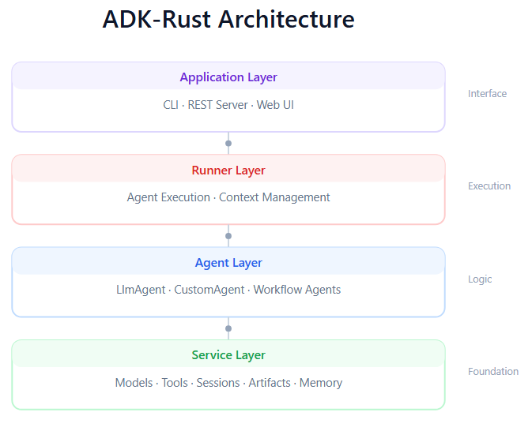

# ADK-Rust

[](https://github.com/zavora-ai/adk-rust/actions/workflows/ci.yml)
[](https://crates.io/crates/adk-rust)
[](https://docs.rs/adk-rust)
[](https://github.com/zavora-ai/adk-rust/wiki)
[](LICENSE)


> **🚀 v0.4.0 Released!** Focused, leaner framework. Extracted UI/Studio to standalone repos. Tiered feature presets (standard default builds in ~50s, not ~2min). Consolidated 7 OpenAI-compatible providers into presets (-1,000 lines). Vertex AI deps now opt-in. OpenAI reasoning model support (gpt-5.4, gpt-5-mini). Gemini thinking model fix for multi-turn tool calling. All 25 crates audited, documented, and tested. See [CHANGELOG](CHANGELOG.md) for full details.
>
> **Contributors:** Many thanks to[@mikefaille](https://github.com/mikefaille) — AdkIdentity design, realtime audio, LiveKit bridge, skill system. [@rohan-panickar](https://github.com/rohan-panickar) — OpenAI-compatible providers, xAI, multimodal content. [@dhruv-pant](https://github.com/dhruv-pant) — Gemini service account auth. [@danielsan](https://github.com/danielsan) — Google deps issue & PR (#181, #203), RAG crash report (#205). [@CodingFlow](https://github.com/CodingFlow) — Gemini 3 thinking level, global endpoint, citationSources (#177, #178, #179). [@ctylx](https://github.com/ctylx) — skill discovery fix (#204). [@poborin](https://github.com/poborin) — project config proposal (#176). [Get started →](https://github.com/zavora-ai/adk-rust/wiki/quickstart)

A comprehensive and production-ready Rust framework for building AI agents. Create powerful and high-performance AI agent systems with a flexible, modular architecture. Model-agnostic. Type-safe. Blazingly fast. 

```bash
cargo install cargo-adk
cargo adk new my-agent
cd my-agent && cargo run
```

Or pick a template: `--template tools` | `rag` | `api` | `openai`. See [Quick Start](#quick-start) for details.

## Overview

ADK-Rust provides a comprehensive framework for building AI agents in Rust, featuring:

- **Type-safe agent abstractions** with async execution and event streaming
- **Multiple agent types**: LLM agents, workflow agents (sequential, parallel, loop), and custom agents
- **Realtime voice agents**: Bidirectional audio streaming with OpenAI Realtime API and Gemini Live API
- **Tool ecosystem**: Function tools, Google Search, MCP (Model Context Protocol) integration
- **RAG pipeline**: Document chunking, vector embeddings, semantic search with 6 vector store backends
- **Security**: Role-based access control, declarative scope-based tool security, SSO/OAuth, audit logging
- **Production features**: Session management, artifact storage, memory systems, REST/A2A APIs
- **Developer experience**: Interactive CLI, 120+ working examples, comprehensive documentation

**Status**: Production-ready, actively maintained

## Architecture



ADK-Rust follows a clean layered architecture from application interface down to foundational services.

## Key Features

### Agent Types

**LLM Agents**: Powered by large language models with tool use, function calling, and streaming responses.

**Workflow Agents**: Deterministic orchestration patterns.
- `SequentialAgent`: Execute agents in sequence
- `ParallelAgent`: Execute agents concurrently
- `LoopAgent`: Iterative execution with exit conditions

**Custom Agents**: Implement the `Agent` trait for specialized behavior.

**Realtime Voice Agents**: Build voice-enabled AI assistants with bidirectional audio streaming.

**Graph Agents**: LangGraph-style workflow orchestration with state management and checkpointing.

### Multi-Provider Support

ADK supports multiple LLM providers with a unified API:

| Provider | Model Examples | Feature Flag |
|----------|---------------|--------------|
| Gemini | `gemini-2.5-flash`, `gemini-2.5-pro`, `gemini-3-pro-preview`, `gemini-3-flash-preview` | (default) |
| OpenAI | `gpt-5`, `gpt-5-mini`, `gpt-5-nano` | `openai` |
| Anthropic | `claude-sonnet-4-5-20250929`, `claude-opus-4-5-20251101`, `claude-haiku-4-5-20251001` | `anthropic` |
| DeepSeek | `deepseek-chat`, `deepseek-reasoner` | `deepseek` |
| Groq | `meta-llama/llama-4-scout-17b-16e-instruct`, `llama-3.3-70b-versatile` | `groq` |
| Ollama | `llama3.2:3b`, `qwen2.5:7b`, `mistral:7b` | `ollama` |
| Fireworks AI | `accounts/fireworks/models/llama-v3p1-8b-instruct` | `openai` (preset) |
| Together AI | `meta-llama/Llama-3.3-70B-Instruct-Turbo` | `openai` (preset) |
| Mistral AI | `mistral-small-latest` | `openai` (preset) |
| Perplexity | `sonar` | `openai` (preset) |
| Cerebras | `llama-3.3-70b` | `openai` (preset) |
| SambaNova | `Meta-Llama-3.3-70B-Instruct` | `openai` (preset) |
| xAI (Grok) | `grok-3-mini` | `openai` (preset) |
| Amazon Bedrock | `anthropic.claude-sonnet-4-20250514-v1:0` | `bedrock` |
| Azure AI Inference | (endpoint-specific) | `azure-ai` |
| mistral.rs | Phi-3, Mistral, Llama, Gemma, LLaVa, FLUX | git dependency |

All providers support streaming, function calling, and multimodal inputs (where available).

### Tool System

Define tools with zero boilerplate using the `#[tool]` macro:

```rust
use adk_tool::tool;

#[derive(Deserialize, JsonSchema)]
struct WeatherArgs {
    /// The city to look up
    city: String,
}

/// Get the current weather for a city.
#[tool]
async fn get_weather(args: WeatherArgs) -> Result<Value, AdkError> {
    Ok(json!({ "temp": 72, "city": args.city }))
}

// Use it: agent_builder.tool(Arc::new(GetWeather))
```

The macro reads the doc comment as the description, derives the JSON schema from the args type, and generates a `Tool` impl. No manual schema writing, no boilerplate.

Built-in tools:
- `#[tool]` macro (zero-boilerplate custom tools)
- Function tools (custom Rust functions)
- Google Search
- Artifact loading
- Loop termination

**MCP Integration**: Connect to Model Context Protocol servers for extended capabilities.

### Production Features

- **Session Management**: In-memory and SQLite-backed sessions with state persistence
- **Memory System**: Long-term memory with semantic search and vector embeddings
- **Servers**: REST API with SSE streaming, A2A protocol for agent-to-agent communication
- **Guardrails**: PII redaction, content filtering, JSON schema validation
- **Observability**: OpenTelemetry tracing, structured logging

## Core Crates

| Crate | Purpose | Key Features |
|-------|---------|--------------|
| `adk-core` | Foundational traits and types | `Agent` trait, `Content`, `Part`, error types, streaming primitives |
| `adk-agent` | Agent implementations | `LlmAgent`, `SequentialAgent`, `ParallelAgent`, `LoopAgent`, builder patterns |
| `adk-skill` | AgentSkills parsing and selection | Skill markdown parser, `.skills` discovery/indexing, lexical matching, prompt injection helpers |
| `adk-model` | LLM integrations | Gemini, OpenAI, Anthropic, DeepSeek, Groq, Ollama, Bedrock, Azure AI + OpenAI-compatible presets (Fireworks, Together, Mistral, Perplexity, Cerebras, SambaNova, xAI) |
| `adk-gemini` | Gemini client | Google Gemini API client with streaming and multimodal support |
| `adk-mistralrs` | Native local inference | mistral.rs integration, ISQ quantization, LoRA adapters (git-only) |
| `adk-tool` | Tool system and extensibility | `FunctionTool`, Google Search, MCP protocol, schema validation |
| `adk-session` | Session and state management | SQLite/in-memory backends, conversation history, state persistence |
| `adk-artifact` | Artifact storage system | File-based storage, MIME type handling, image/PDF/video support |
| `adk-memory` | Long-term memory | Vector embeddings, semantic search, Qdrant integration |
| `adk-rag` | RAG pipeline | Document chunking, embeddings, vector search, reranking, 6 backends |
| `adk-runner` | Agent execution runtime | Context management, event streaming, session lifecycle, callbacks |
| `adk-server` | Production API servers | REST API, A2A protocol, middleware, health checks |
| `adk-cli` | Command-line interface | Interactive REPL, session management, MCP server integration |
| `adk-realtime` | Real-time voice agents | OpenAI Realtime API, Gemini Live API, bidirectional audio, VAD |
| `adk-graph` | Graph-based workflows | LangGraph-style orchestration, state management, checkpointing, human-in-the-loop |
| `adk-browser` | Browser automation | 46 WebDriver tools, navigation, forms, screenshots, PDF generation |
| `adk-eval` | Agent evaluation | Test definitions, trajectory validation, LLM-judged scoring, rubrics |
| `adk-guardrail` | Input/output validation | PII redaction, content filtering, JSON schema validation |
| `adk-auth` | Access control | Role-based permissions, declarative scope-based security, SSO/OAuth, audit logging |
| `adk-telemetry` | Observability | Structured logging, OpenTelemetry tracing, span helpers |

> **Extracted to standalone repos:** [adk-ui](https://github.com/zavora-ai/adk-ui) (dynamic UI generation), [adk-studio](https://github.com/zavora-ai/adk-studio) (visual agent builder), [adk-playground](https://github.com/zavora-ai/adk-playground) (120+ examples).

## Quick Start

### Scaffold a project (recommended)

```bash
cargo install cargo-adk

cargo adk new my-agent                    # basic Gemini agent
cargo adk new my-agent --template tools   # agent with #[tool] custom tools
cargo adk new my-agent --template rag     # RAG with vector search
cargo adk new my-agent --template api     # REST server
cargo adk new my-agent --template openai  # OpenAI-powered agent

cd my-agent
cp .env.example .env    # add your API key
cargo run
```

### Manual installation

Requires Rust 1.85 or later (Rust 2024 edition). Add to your `Cargo.toml`:

```toml
[dependencies]
adk-rust = "0.4"  # Standard preset: agents, models, tools, sessions, runner

# Need server, CLI, graph, browser, eval, realtime, audio, RAG?
# adk-rust = { version = "0.4", features = ["full"] }
```

Set your API key:

```bash
# For Gemini (default)
export GOOGLE_API_KEY="your-api-key"

# For OpenAI
export OPENAI_API_KEY="your-api-key"

# For Anthropic
export ANTHROPIC_API_KEY="your-api-key"

# For DeepSeek
export DEEPSEEK_API_KEY="your-api-key"

# For Groq
export GROQ_API_KEY="your-api-key"

# For Fireworks AI
export FIREWORKS_API_KEY="your-api-key"

# For Together AI
export TOGETHER_API_KEY="your-api-key"

# For Mistral AI
export MISTRAL_API_KEY="your-api-key"

# For Perplexity
export PERPLEXITY_API_KEY="your-api-key"

# For Cerebras
export CEREBRAS_API_KEY="your-api-key"

# For SambaNova
export SAMBANOVA_API_KEY="your-api-key"

# For Azure AI Inference
export AZURE_AI_API_KEY="your-api-key"

# For Amazon Bedrock (uses AWS IAM credentials)
# Configure via: aws configure

# For Ollama (no key, just run: ollama serve)
```

### Basic Example (Gemini)

```rust
use adk_rust::prelude::*;
use adk_rust::Launcher;

#[tokio::main]
async fn main() -> AnyhowResult<()> {
    dotenvy::dotenv().ok();
    let api_key = std::env::var("GOOGLE_API_KEY")?;
    let model = GeminiModel::new(&api_key, "gemini-2.5-flash")?;

    let agent = LlmAgentBuilder::new("assistant")
        .description("Helpful AI assistant")
        .instruction("You are a helpful assistant. Be concise and accurate.")
        .model(Arc::new(model))
        .build()?;

    Launcher::new(Arc::new(agent)).run().await?;
    Ok(())
}
```

### OpenAI Example

```rust
use adk_rust::prelude::*;
use adk_rust::Launcher;

#[tokio::main]
async fn main() -> AnyhowResult<()> {
    dotenvy::dotenv().ok();
    let api_key = std::env::var("OPENAI_API_KEY")?;
    let model = OpenAIClient::new(OpenAIConfig::new(api_key, "gpt-5-mini"))?;

    let agent = LlmAgentBuilder::new("assistant")
        .instruction("You are a helpful assistant.")
        .model(Arc::new(model))
        .build()?;

    Launcher::new(Arc::new(agent)).run().await?;
    Ok(())
}
```

### Anthropic Example

```rust
use adk_rust::prelude::*;
use adk_rust::Launcher;

#[tokio::main]
async fn main() -> AnyhowResult<()> {
    dotenvy::dotenv().ok();
    let api_key = std::env::var("ANTHROPIC_API_KEY")?;
    let model = AnthropicClient::new(AnthropicConfig::new(api_key, "claude-sonnet-4-5-20250929"))?;

    let agent = LlmAgentBuilder::new("assistant")
        .instruction("You are a helpful assistant.")
        .model(Arc::new(model))
        .build()?;

    Launcher::new(Arc::new(agent)).run().await?;
    Ok(())
}
```

### DeepSeek Example

```rust
use adk_rust::prelude::*;
use adk_rust::Launcher;

#[tokio::main]
async fn main() -> AnyhowResult<()> {
    dotenvy::dotenv().ok();
    let api_key = std::env::var("DEEPSEEK_API_KEY")?;

    // Standard chat model
    let model = DeepSeekClient::chat(api_key)?;

    // Or use reasoner for chain-of-thought reasoning
    // let model = DeepSeekClient::reasoner(api_key)?;

    let agent = LlmAgentBuilder::new("assistant")
        .instruction("You are a helpful assistant.")
        .model(Arc::new(model))
        .build()?;

    Launcher::new(Arc::new(agent)).run().await?;
    Ok(())
}
```

### Groq Example (Ultra-Fast)

```rust
use adk_rust::prelude::*;
use adk_rust::Launcher;

#[tokio::main]
async fn main() -> AnyhowResult<()> {
    dotenvy::dotenv().ok();
    let api_key = std::env::var("GROQ_API_KEY")?;
    let model = GroqClient::new(GroqConfig::llama70b(api_key))?;

    let agent = LlmAgentBuilder::new("assistant")
        .instruction("You are a helpful assistant.")
        .model(Arc::new(model))
        .build()?;

    Launcher::new(Arc::new(agent)).run().await?;
    Ok(())
}
```

### Ollama Example (Local)

```rust
use adk_rust::prelude::*;
use adk_rust::Launcher;

#[tokio::main]
async fn main() -> AnyhowResult<()> {
    dotenvy::dotenv().ok();
    // Requires: ollama serve && ollama pull llama3.2
    let model = OllamaModel::new(OllamaConfig::new("llama3.2"))?;

    let agent = LlmAgentBuilder::new("assistant")
        .instruction("You are a helpful assistant.")
        .model(Arc::new(model))
        .build()?;

    Launcher::new(Arc::new(agent)).run().await?;
    Ok(())
}
```

### Run Examples

```bash
# Interactive console (Gemini)
cargo run --example quickstart

# OpenAI examples (requires --features openai)
cargo run --example openai_basic --features openai
cargo run --example openai_tools --features openai

# DeepSeek examples (requires --features deepseek)
cargo run --example deepseek_basic --features deepseek
cargo run --example deepseek_reasoner --features deepseek

# Groq examples (requires --features groq)
cargo run --example groq_basic --features groq

# Ollama examples (requires --features ollama)
cargo run --example ollama_basic --features ollama

# Multimodal examples (image analysis)
cargo run --example gemini_multimodal
cargo run --example anthropic_multimodal --features anthropic

# REST API server
cargo run --example server

# Workflow agents
cargo run --example sequential_agent
cargo run --example parallel_agent

# See all examples
ls examples/
```

## Companion Projects

| Project | Description |
|---------|-------------|
| [adk-studio](https://github.com/zavora-ai/adk-studio) | Visual agent builder — drag-and-drop canvas, code generation, live testing |
| [adk-ui](https://github.com/zavora-ai/adk-ui) | Dynamic UI generation — 28 components, React client, streaming updates |
| [adk-playground](https://github.com/zavora-ai/adk-playground) | 120+ working examples for every feature and provider |

## Advanced Features

### Realtime Voice Agents

Build voice-enabled AI assistants using the `adk-realtime` crate:

```rust
use adk_realtime::{RealtimeAgent, openai::OpenAIRealtimeModel, RealtimeModel};
use std::sync::Arc;

#[tokio::main]
async fn main() -> Result<(), Box<dyn std::error::Error>> {
    let model: Arc<dyn RealtimeModel> = Arc::new(
        OpenAIRealtimeModel::new(&api_key, "gpt-4o-realtime-preview-2024-12-17")
    );

    let agent = RealtimeAgent::builder("voice_assistant")
        .model(model)
        .instruction("You are a helpful voice assistant.")
        .voice("alloy")
        .server_vad()  // Enable voice activity detection
        .build()?;

    Ok(())
}
```

**Supported Realtime Models**:
| Provider | Model | Transport | Feature Flag |
|----------|-------|-----------|--------------|
| OpenAI | `gpt-4o-realtime-preview-2024-12-17` | WebSocket | `openai` |
| OpenAI | `gpt-realtime` | WebSocket | `openai` |
| OpenAI | `gpt-4o-realtime-*` | WebRTC | `openai-webrtc` |
| Google | `gemini-live-2.5-flash-native-audio` | WebSocket | `gemini` |
| Google | Gemini via Vertex AI | WebSocket + OAuth2 | `vertex-live` |
| LiveKit | Any (bridge to Gemini/OpenAI) | WebRTC | `livekit` |

**Features**:
- OpenAI Realtime API and Gemini Live API support
- Vertex AI Live with Application Default Credentials (ADC)
- LiveKit WebRTC bridge for production-grade audio routing
- OpenAI WebRTC transport with Opus codec and data channels
- Bidirectional audio streaming (PCM16, G711, Opus)
- Server-side Voice Activity Detection (VAD)
- Real-time tool calling during voice conversations
- Multi-agent handoffs for complex workflows

**Run realtime examples**:
```bash
# OpenAI Realtime (WebSocket)
cargo run --example realtime_basic --features realtime-openai
cargo run --example realtime_tools --features realtime-openai
cargo run --example realtime_handoff --features realtime-openai

# Vertex AI Live (requires gcloud auth application-default login)
cargo run -p adk-realtime --example vertex_live_voice --features vertex-live
cargo run -p adk-realtime --example vertex_live_tools --features vertex-live

# LiveKit Bridge (requires LiveKit server)
cargo run -p adk-realtime --example livekit_bridge --features livekit,openai

# OpenAI WebRTC (requires cmake)
cargo run -p adk-realtime --example openai_webrtc --features openai-webrtc
```

### Graph-Based Workflows

Build complex, stateful workflows using the `adk-graph` crate (LangGraph-style):

```rust
use adk_graph::{prelude::*, node::AgentNode};
use adk_agent::LlmAgentBuilder;
use adk_model::GeminiModel;

// Create LLM agents for different tasks
let translator = Arc::new(LlmAgentBuilder::new("translator")
    .model(Arc::new(GeminiModel::new(&api_key, "gemini-2.5-flash")?))
    .instruction("Translate the input text to French.")
    .build()?);

let summarizer = Arc::new(LlmAgentBuilder::new("summarizer")
    .model(model.clone())
    .instruction("Summarize the input text in one sentence.")
    .build()?);

// Create AgentNodes with custom input/output mappers
let translator_node = AgentNode::new(translator)
    .with_input_mapper(|state| {
        let text = state.get("input").and_then(|v| v.as_str()).unwrap_or("");
        adk_core::Content::new("user").with_text(text)
    })
    .with_output_mapper(|events| {
        let mut updates = HashMap::new();
        for event in events {
            if let Some(content) = event.content() {
                let text: String = content.parts.iter()
                    .filter_map(|p| p.text())
                    .collect::<Vec<_>>()
                    .join("");
                updates.insert("translation".to_string(), json!(text));
            }
        }
        updates
    });

// Build graph with parallel execution
let agent = GraphAgent::builder("text_processor")
    .description("Translates and summarizes text in parallel")
    .channels(&["input", "translation", "summary"])
    .node(translator_node)
    .node(summarizer_node)  // Similar setup
    .edge(START, "translator")
    .edge(START, "summarizer")  // Parallel execution
    .edge("translator", "combine")
    .edge("summarizer", "combine")
    .edge("combine", END)
    .build()?;

// Execute
let mut input = State::new();
input.insert("input".to_string(), json!("AI is transforming how we work."));
let result = agent.invoke(input, ExecutionConfig::new("thread-1")).await?;
```

**Features**:
- **AgentNode**: Wrap LLM agents as graph nodes with custom input/output mappers
- **Parallel & Sequential**: Execute agents concurrently or in sequence
- **Cyclic Graphs**: ReAct pattern with tool loops and iteration limiting
- **Conditional Routing**: Dynamic routing via `Router::by_field` or custom functions
- **Checkpointing**: Memory and SQLite backends for fault tolerance
- **Human-in-the-Loop**: Dynamic interrupts based on state, resume from checkpoint
- **Streaming**: Multiple modes (values, updates, messages, debug)

**Run graph examples**:
```bash
cargo run --example graph_agent       # Parallel LLM agents with callbacks
cargo run --example graph_workflow    # Sequential multi-agent pipeline
cargo run --example graph_conditional # LLM-based routing
cargo run --example graph_react       # ReAct pattern with tools
cargo run --example graph_supervisor  # Multi-agent supervisor
cargo run --example graph_hitl        # Human-in-the-loop approval
cargo run --example graph_checkpoint  # State persistence
```

### Browser Automation

Give agents web browsing capabilities using the `adk-browser` crate:

```rust
use adk_browser::{BrowserSession, BrowserToolset, BrowserConfig};

// Create browser session
let config = BrowserConfig::new().webdriver_url("http://localhost:4444");
let session = Arc::new(BrowserSession::new(config));

// Get all 46 browser tools
let toolset = BrowserToolset::new(session);
let tools = toolset.all_tools();

// Add to agent
let mut builder = LlmAgentBuilder::new("web_agent")
    .model(model)
    .instruction("Browse the web and extract information.");

for tool in tools {
    builder = builder.tool(tool);
}

let agent = builder.build()?;
```

**46 Browser Tools**:
- Navigation: `browser_navigate`, `browser_back`, `browser_forward`, `browser_refresh`
- Extraction: `browser_extract_text`, `browser_extract_links`, `browser_extract_html`
- Interaction: `browser_click`, `browser_type`, `browser_select`, `browser_submit`
- Forms: `browser_fill_form`, `browser_get_form_fields`, `browser_clear_field`
- Screenshots: `browser_screenshot`, `browser_screenshot_element`
- JavaScript: `browser_evaluate`, `browser_evaluate_async`
- Cookies, frames, windows, and more

**Requirements**: WebDriver (Selenium, ChromeDriver, etc.)
```bash
docker run -d -p 4444:4444 selenium/standalone-chrome
cargo run --example browser_agent
```

### Agent Evaluation

Test and validate agent behavior using the `adk-eval` crate:

```rust
use adk_eval::{Evaluator, EvaluationConfig, EvaluationCriteria};

let config = EvaluationConfig::with_criteria(
    EvaluationCriteria::exact_tools()
        .with_response_similarity(0.8)
);

let evaluator = Evaluator::new(config);
let report = evaluator
    .evaluate_file(agent, "tests/my_agent.test.json")
    .await?;

assert!(report.all_passed());
```

**Evaluation Capabilities**:
- Trajectory validation (tool call sequences)
- Response similarity (Jaccard, Levenshtein, ROUGE)
- LLM-judged semantic matching
- Rubric-based scoring with custom criteria
- Safety and hallucination detection
- Detailed reporting with failure analysis

### Local Inference with mistral.rs

For native local inference without external dependencies, use the `adk-mistralrs` crate:

```rust
use adk_mistralrs::{MistralRsModel, MistralRsConfig, ModelSource, QuantizationLevel};
use adk_agent::LlmAgentBuilder;
use std::sync::Arc;

#[tokio::main]
async fn main() -> anyhow::Result<()> {
    // Load model with ISQ quantization for reduced memory
    let config = MistralRsConfig::builder()
        .model_source(ModelSource::huggingface("microsoft/Phi-3.5-mini-instruct"))
        .isq(QuantizationLevel::Q4_0)
        .paged_attention(true)
        .build();

    let model = MistralRsModel::new(config).await?;

    let agent = LlmAgentBuilder::new("local-assistant")
        .instruction("You are a helpful assistant running locally.")
        .model(Arc::new(model))
        .build()?;

    Ok(())
}
```

**Note**: `adk-mistralrs` is not on crates.io due to git dependencies. Add via:
```toml
adk-mistralrs = { git = "https://github.com/zavora-ai/adk-rust" }
# With Metal: features = ["metal"]
# With CUDA: features = ["cuda"]
```

**Features**: ISQ quantization, PagedAttention, multi-GPU splitting, LoRA/X-LoRA adapters, vision/speech/diffusion models, MCP integration.

## Building from Source

### Dev Environment Setup

```bash
# Option A: Nix/devenv (reproducible — identical on Linux, macOS, CI)
devenv shell

# Option B: Setup script (installs sccache, cmake, etc.)
./scripts/setup-dev.sh

# Option C: Manual — just install sccache for faster builds
brew install sccache && echo 'export RUSTC_WRAPPER=sccache' >> ~/.zshrc
```

### Using Make (Recommended)

```bash
# See all available commands
make help

# Build all crates (CPU-only, works on all systems)
make build

# Build with all features (safe - adk-mistralrs excluded)
make build-all

# Build all examples
make examples

# Run tests
make test

# Run clippy lints
make clippy
```

### Manual Build

```bash
# Build workspace (CPU-only)
cargo build --workspace

# Build with all features (works without CUDA)
cargo build --workspace --all-features

# Build examples with common features
cargo build --examples --features "openai,anthropic,deepseek,ollama,groq,browser,guardrails,sso"
```

### Local LLM with mistral.rs

`adk-mistralrs` is excluded from the workspace by default to allow `--all-features` to work without CUDA toolkit. Build it explicitly:

```bash
# CPU-only (works on all systems)
make build-mistralrs
# or: cargo build --manifest-path adk-mistralrs/Cargo.toml

# macOS with Apple Silicon (Metal GPU)
make build-mistralrs-metal
# or: cargo build --manifest-path adk-mistralrs/Cargo.toml --features metal

# NVIDIA GPU (requires CUDA toolkit)
make build-mistralrs-cuda
# or: cargo build --manifest-path adk-mistralrs/Cargo.toml --features cuda
```

### Running mistralrs Examples

```bash
# Build and run examples with mistralrs
cargo run --example mistralrs_basic --features mistralrs

# With Metal GPU acceleration (macOS)
cargo run --example mistralrs_basic --features mistralrs,metal
```

## Use as Library

Add to your `Cargo.toml`:

```toml
[dependencies]
# Standard (default) — agents, models, tools, sessions, runner, guardrails, auth
adk-rust = "0.4"

# Full — adds server, CLI, graph, browser, eval, realtime, audio, RAG
adk-rust = { version = "0.4", features = ["full"] }

# Minimal — just agents + Gemini + runner (fastest build)
adk-rust = { version = "0.4", default-features = false, features = ["minimal"] }

# Or individual crates for finer control
adk-core = "0.4"
adk-agent = "0.4"
adk-model = { version = "0.4", features = ["openai", "anthropic"] }
adk-tool = "0.4"
adk-runner = "0.4"
```

## Examples

See [examples/](examples/) directory for complete, runnable examples:

**Getting Started**
- `quickstart/` - Basic agent setup and chat loop
- `function_tool/` - Custom tool implementation
- `multiple_tools/` - Agent with multiple tools
- `agent_tool/` - Use agents as callable tools

**Multimodal (Image/Audio/PDF)**
- `gemini_multimodal/` - Inline image analysis, multi-image comparison, vision agent
- `anthropic_multimodal/` - Image analysis with Claude (requires `--features anthropic`)

**OpenAI Integration** (requires `--features openai`)
- `openai_basic/` - Simple OpenAI GPT agent
- `openai_tools/` - OpenAI with function calling
- `openai_workflow/` - Multi-agent workflows with OpenAI
- `openai_structured/` - Structured JSON output

**DeepSeek Integration** (requires `--features deepseek`)
- `deepseek_basic/` - Basic DeepSeek chat
- `deepseek_reasoner/` - Chain-of-thought reasoning mode
- `deepseek_tools/` - Function calling with DeepSeek
- `deepseek_caching/` - Context caching for cost reduction

**Workflow Agents**
- `sequential/` - Sequential workflow execution
- `parallel/` - Concurrent agent execution
- `loop_workflow/` - Iterative refinement patterns
- `sequential_code/` - Code generation pipeline

**Realtime Voice Agents** (requires `--features realtime-openai`)
- `realtime_basic/` - Basic text-only realtime session
- `realtime_vad/` - Voice assistant with VAD
- `realtime_tools/` - Tool calling in realtime sessions
- `realtime_handoff/` - Multi-agent handoffs

**Vertex AI Live** (requires `--features vertex-live`)
- `vertex_live_voice/` - Vertex AI Live voice session with ADC auth
- `vertex_live_tools/` - Vertex AI Live with function calling (weather + time tools)

**LiveKit & WebRTC**
- `livekit_bridge/` - LiveKit WebRTC bridge to OpenAI Realtime (requires `--features livekit,openai`)
- `openai_webrtc/` - OpenAI WebRTC transport with Opus codec (requires `--features openai-webrtc`)

**Graph Workflows**
- `graph_agent/` - GraphAgent with parallel LLM agents and callbacks
- `graph_workflow/` - Sequential multi-agent pipeline
- `graph_conditional/` - LLM-based classification and routing
- `graph_react/` - ReAct pattern with tools and cycles
- `graph_supervisor/` - Multi-agent supervisor routing
- `graph_hitl/` - Human-in-the-loop with risk-based interrupts
- `graph_checkpoint/` - State persistence and time travel debugging

**Browser Automation**
- `browser_basic/` - Basic browser session and tools
- `browser_agent/` - AI agent with browser tools
- `browser_interactive/` - Full 46-tool interactive example

**Agent Evaluation**
- `eval_basic/` - Basic evaluation setup
- `eval_trajectory/` - Tool call trajectory validation
- `eval_semantic/` - LLM-judged semantic matching
- `eval_rubric/` - Rubric-based scoring

**Guardrails**
- `guardrail_basic/` - PII redaction and content filtering
- `guardrail_schema/` - JSON schema validation
- `guardrail_agent/` - Full agent integration with guardrails

**mistral.rs Local Inference** (requires git dependency)
- `mistralrs_basic/` - Basic text generation with local models
- `mistralrs_tools/` - Function calling with mistral.rs
- `mistralrs_vision/` - Image understanding with vision models
- `mistralrs_isq/` - In-situ quantization for memory efficiency
- `mistralrs_lora/` - LoRA adapter usage and hot-swapping
- `mistralrs_multimodel/` - Multi-model serving
- `mistralrs_mcp/` - MCP client integration

**Dynamic UI**
- `ui_agent/` - Agent with UI rendering tools
- `ui_server/` - UI server with streaming updates
- `ui_react_client/` - React client example

**Production Features**
- `load_artifacts/` - Working with images and PDFs
- `mcp/` - Model Context Protocol integration
- `server/` - REST API deployment
- `a2a/` - Agent-to-Agent communication
- `web/` - Web UI with streaming
- `research_paper/` - Complex multi-agent workflow
- `multi_turn_tool/` - Multi-turn tool conversations
- `auth_basic/` - Role-based access control
- `auth_audit/` - Access control with audit logging
- `rag_surrealdb/` - RAG pipeline with SurrealDB vector store

## Development

### Testing

```bash
# Run all tests
cargo test

# Test specific crate
cargo test --package adk-core

# With output
cargo test -- --nocapture
```

### Code Quality

```bash
# Linting
cargo clippy

# Formatting
cargo fmt

# Security audit
cargo audit
```

### Building

```bash
# Development build
cargo build

# Optimized release build
cargo build --release
```

## Documentation

- **Wiki**: [GitHub Wiki](https://github.com/zavora-ai/adk-rust/wiki) - Comprehensive guides and tutorials
- **API Reference**: [docs.rs/adk-rust](https://docs.rs/adk-rust) - Full API documentation
- **Examples**: [examples/README.md](examples/README.md) - 120+ working examples with detailed explanations

## Performance

Optimized for production use:
- Zero-cost abstractions with Rust's ownership model
- Efficient async I/O via Tokio runtime
- Minimal allocations and copying
- Streaming responses for lower latency
- Connection pooling and caching support

## License

Apache 2.0 (same as Google's ADK)

## Related Projects

- [ADK](https://google.github.io/adk-docs/) - Google's Agent Development Kit
- [MCP Protocol](https://modelcontextprotocol.io/) - Model Context Protocol for tool integration
- [Gemini API](https://ai.google.dev/gemini-api/docs) - Google's multimodal AI model

## Contributing

Contributions welcome! Please open an issue or pull request on GitHub.

## Roadmap

**v0.4.0** (current) — Framework focus & performance:
- **Breaking: Extracted UI/Studio/Playground** — `adk-ui`, `adk-studio`, and 120+ examples moved to standalone repos. This repo is now pure Rust framework.
- **Tiered feature presets** — Default changed from `full` to `standard` (~50s build). `minimal` (~30s), `standard` (default), `full` (~2min). Non-Gemini users no longer compile Google Cloud SDK.
- **Consolidated 7 OpenAI-compatible providers** — Fireworks, Together, Mistral, Perplexity, Cerebras, SambaNova, xAI collapsed into `OpenAICompatibleConfig` presets (-1,000 lines). Feature flags preserved as backward-compatible aliases.
- **Vertex AI deps opt-in** — `adk-gemini` default changed from `[studio, vertex]` to `[studio]`. Google Cloud deps only compile with `features = ["gemini-vertex"]`.
- **OpenAI reasoning model support** — Direct reqwest calls replace async-openai HTTP client, extracting `reasoning_content` from o3/gpt-5-mini. Empty text filtering for thinking models.
- **Gemini thinking model fix** — `thoughtSignature` no longer serialized in request payloads, fixing 400 errors in multi-turn tool calling with thinking models (#205).
- **Full crate audit** — All 25 crates: doc comments on all public items, stale versions bumped, dead code removed, convention violations fixed, shared utilities extracted.
- **CI overhaul** — Split into parallel fmt/clippy/test gates with nextest (~11x faster).
- **Dep bumps** — chrono 0.4.44, surrealdb 3.0.1, jsonschema 0.43, strum 0.28, rmcp 0.17.
- **Multimodal vision** — Anthropic `FileData` → `ImageBlock`, Bedrock `InlineData` → `ContentBlock::Image`.

<details>
<summary>v0.3.x and earlier</summary>

**v0.3.2**: 8 new LLM providers, RAG pipeline, scope-based security, Models Discovery API, Gemini 3 support, generation config, Vertex AI Live, realtime audio transports, response parsing hardening.

**v0.3.0**: adk-gemini Vertex AI overhaul, context compaction, production hardening, ADK Studio debug mode, action nodes code generation, SSO/OAuth, plugin system.

**v0.2.0**: Core framework, multi-provider LLM, tool system with MCP, sessions, artifacts, memory, REST/A2A servers, CLI, realtime voice, graph workflows, browser automation, evaluation, guardrails.
</details>

**Planned** (see [docs/roadmap/](docs/roadmap/)):

| Priority | Feature | Target | Status |
|----------|---------|--------|--------|
| 🔴 P0 | [ADK-UI vNext (A2UI + Generative UI)](docs/roadmap/adk-ui.md) | Q2-Q4 2026 | Planned |
| 🟡 P1 | [Cloud Integrations](docs/roadmap/cloud-integrations.md) | Q2-Q3 2026 | Planned |
| 🟢 P2 | [Enterprise Features](docs/roadmap/enterprise.md) | Q4 2026 | Planned |

## Star History

[](https://www.star-history.com/#zavora-ai/adk-rust&type=date&legend=top-left)
