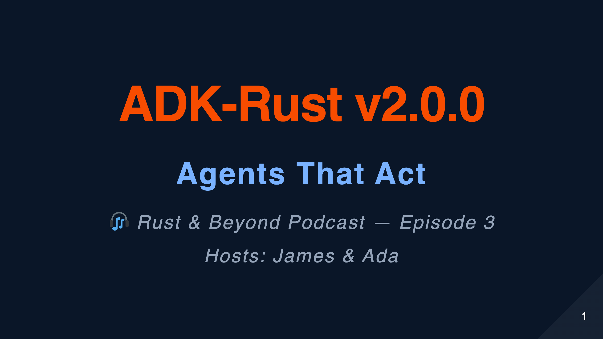
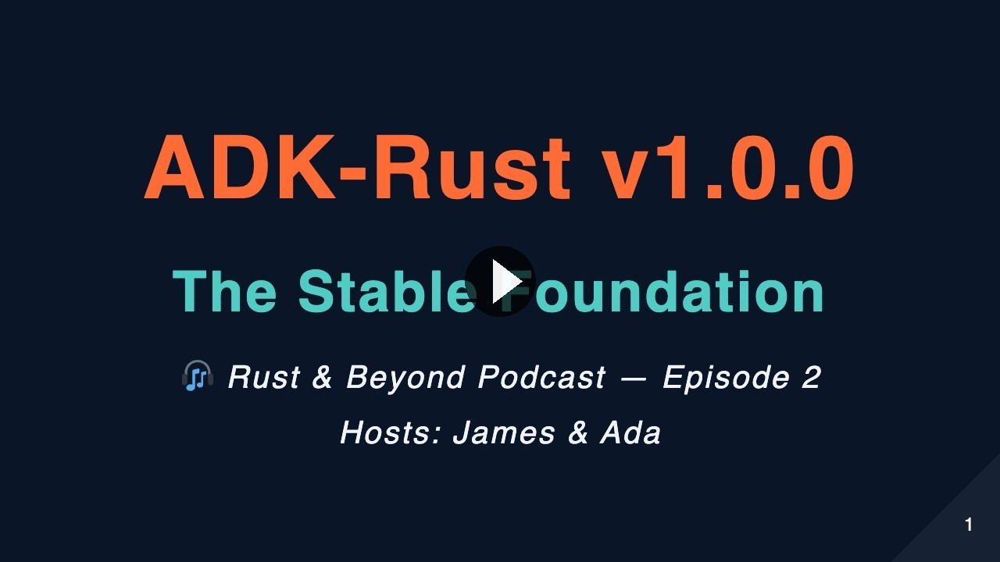

# ADK-Rust

[](https://github.com/zavora-ai/adk-rust/actions/workflows/ci.yml)
[](https://crates.io/crates/adk-rust)
[](https://docs.rs/adk-rust)
[](https://github.com/zavora-ai/adk-rust/wiki)
[](LICENSE)

[](https://github.com/zavora-ai/adk-rust/discussions)

A production-ready Rust framework for building AI agents. Model-agnostic, type-safe
and async, across 43 publishable crates for agent orchestration.

> **v2.1.0 Released!** This API-compatible minor release
> adds portable, validated teams with exact handoff and delegation semantics; a
> Gemini Enterprise Agent Platform path spanning Agent Engine runtime and BYOC
> deployment, Vertex sessions and Memory Bank, GCS artifacts, Example Store,
> Cloud telemetry, and managed code sandboxes; hardened ambient scheduling,
> runtime skill writing, and argument-level tool guardrails; plus Anthropic
> request customization and typed safety-refusal fallback; and a new ADK-Rust-owned
> responsive runtime UI for conversations, exact team topology, event timelines,
> shared state, artifacts, sessions, and UI-protocol discovery. All 43 crates are
> available on [crates.io](https://crates.io/crates/adk-rust/2.1.0).
>
> **Milestone:** ADK-Rust has crossed **500K total crates.io downloads** across
> the workspace crates.
>
> Coming from 1.x: six APIs changed shape and the fan-in default changed behaviour
> without an API change. See the [migration guide](docs/official_docs/migration/1.0-to-2.0.md)
> and the [CHANGELOG](CHANGELOG.md).

### 🎬 Rust & Beyond Podcast — Episode 3: Agents That Act

**ADK-Rust v2.0.0 — Agents That Act.** Eight chapters on agents that run on their
own and finish what they start: a workflow that resumes exactly where it stopped,
a graph that changes course when the problem does, and approvals you can trust
down to the digest. 42 crates, 4,300+ tests, sub-millisecond loop overhead.

<a href="https://www.youtube.com/watch?v=RIh-M0W1CiQ">
  
</a>

**▶️ [Watch on YouTube](https://www.youtube.com/watch?v=RIh-M0W1CiQ)** — *40 min 50 sec · Hosts: James (Fenrir) &amp; Ada (Kore) · Video with slides*

> *"Show me."* — Ada, thirty seconds in, declining to be told about the visual
> builder

<details>
<summary>Episode highlights</summary>

- **The Numbers** — 42 crates, 4,300+ tests, 104 runnable examples, 568 μs agent-loop
  overhead against LangGraph's 1,228 ms
- **Agents That Survive** — SQLite checkpointers, delta checkpoints, and a pause that
  resumes in a fresh process that shares only the database file
- **Subgraphs** — a graph as a node, nested three deep, with channel mismatches caught
  when the parent compiles rather than as an absent value at run time
- **Deciding At Run Time** — `run_node_with` for work whose size comes from state, and
  `with_goto` for a node that picks its own successor with no edge declared
- **Built To Run Unattended** — retries with capped backoff, concurrency bounds,
  node timeouts, and checkpoint retention that keeps a week-long thread steady
- **Governed Computer Use** — approval interrupts bound to a digest, so what you
  approved is what runs
- **What It Costs** — no automatic crash recovery, an unbounded child ledger, and why
  we kept two orchestration APIs when the other ADKs deprecated one

</details>

<details>
<summary>Previous episodes</summary>

#### 🎧 Episode 2: v1.0.0 — The Stable Foundation

A deep-dive into what shipped, who built it, and where it was going. 39 crates.
130K downloads. Semver stable.

<a href="https://www.youtube.com/watch?v=tlqaE8qeHac">
  
</a>

**▶️ [Watch on YouTube](https://www.youtube.com/watch?v=tlqaE8qeHac)** — *10 min 12 sec · Hosts: James (Fenrir) & Ada (Kore)*

> *"We believe the next generation of software will be built by composing autonomous
> agents, not by writing every line of logic by hand. And we believe Rust is the
> right language for the runtime those agents live in."* — James

#### 🎧 Episode 1: What is ADK-Rust?

*2 min 21 sec · Generated entirely by ADK-Rust using Gemini 3.1 Flash TTS*

</details>

<details>
<summary>How are these made?</summary>

Episodes are generated using ADK-Rust's own audio capabilities — Chirp3-HD
multi-speaker TTS synthesis via `adk-audio`. The script, slide deck (Marp), and
synthesized audio segments are concatenated with ffmpeg into a video presentation.
Zero manual voice recording.

```bash
# Episode 3 assets
docs/podcast/episode-3-script.md      # Full script, eight chapters
docs/podcast/episode-3-slides.md      # Marp slide deck
docs/podcast/adk-rust-episode-3.mp4   # Final video
docs/podcast/episode-3-narration.mp3  # Audio-only
```

The episode 3 video and slides are not in the repository: the video alone is about
900 MB, over GitHub's 100 MB per-file limit. The script and the deck source are.

</details>

---

## Build and test an agent in five minutes

Scaffold an OpenAI agent with the HTTP runtime and embedded UI:

```bash
cargo install cargo-adk
cargo adk new quickstart_agent --template api --provider openai
cd quickstart_agent
cp .env.example .env
# Open .env and replace the OPENAI_API_KEY placeholder, then:
cargo run
```

Open [http://127.0.0.1:8080/ui/](http://127.0.0.1:8080/ui/), enter a prompt,
and press <kbd>Enter</kbd>. The UI creates the session, streams the run, renders
Markdown and tool results, animates the active agent or workflow edge, and keeps
the event timeline, state, artifacts, and telemetry beside the conversation.


The animation uses the richer team showcase so the topology is visible; the
single-agent project you just generated uses the same UI with a one-node graph.
Confirm the server independently with:

```bash
curl -fsS http://127.0.0.1:8080/api/health
```

The [five-minute quickstart](docs/official_docs/quickstart.md) explains the
generated files and the console-only alternative. The runnable
[`runtime_ui_showcase`](examples/runtime_ui_showcase) reproduces the UI above
with tool, graph, and team agents.

### Add ADK-Rust to an existing project

```toml
[dependencies]
adk-rust = "2.1.0"                                        # Gemini, agents, runner, sessions
# adk-rust = { version = "2.1.0", features = ["standard"] }  # + server, auth, graph, eval
```

| Tier | Includes | Use case |
|------|----------|----------|
| `minimal` (default) | Gemini provider, agents, runner, sessions | Fast starter agents |
| `standard` | minimal + OpenAI, Anthropic, tools, memory, telemetry, server, auth, graph, eval, guardrail, plugins, artifacts, skills | Serving an agent over HTTP |
| `enterprise` | standard + realtime, browser, RAG, payments, AWP | Voice, retrieval and payments |
| `full` | enterprise + audio, code execution, sandbox | Everything |

A tier is a starting point, not a ceiling. Add any single capability on top of one
without moving to the next tier, so `features = ["minimal", "audio"]` gives you the
minimal build plus audio. [AGENTS.md](AGENTS.md#adk-rust-umbrella) lists every feature you can add
this way.

## One agent, end to end

```rust
use adk_rust::prelude::*;
use adk_rust::Launcher;

#[tokio::main]
async fn main() -> AnyhowResult<()> {
    dotenvy::dotenv().ok();
    let model = GeminiModel::new(&std::env::var("GOOGLE_API_KEY")?, "gemini-3.7-flash")?;

    let agent = LlmAgentBuilder::new("assistant")
        .instruction("You are a helpful assistant. Be concise and accurate.")
        .model(Arc::new(model))
        .build()?;

    Launcher::new(Arc::new(agent)).run().await?;
    Ok(())
}
```

Swap the provider by swapping the client. The agent, runner and tools are unchanged:

| Provider | Client | Feature | Key |
|----------|--------|---------|-----|
| Gemini | `GeminiModel::new(key, model)` | default | `GOOGLE_API_KEY` |
| OpenAI | `OpenAIClient::new(OpenAIConfig::new(key, model))` | `openai` | `OPENAI_API_KEY` |
| OpenAI Responses | `OpenAIResponsesClient::new(OpenAIResponsesConfig::new(key, model))` | `openai` | `OPENAI_API_KEY` |
| Anthropic | `AnthropicClient::new(AnthropicConfig::new(key, model))` | `anthropic` | `ANTHROPIC_API_KEY` |
| DeepSeek | `DeepSeekClient::chat(key)` | `deepseek` | `DEEPSEEK_API_KEY` |
| Groq | `GroqClient::new(GroqConfig::gpt_oss_120b(key))` | `groq` | `GROQ_API_KEY` |
| Ollama | `OllamaModel::new(OllamaConfig::new(model))` | `ollama` | none |
| Bedrock | `BedrockClient::new(BedrockConfig::new(region, model_id)).await?` | `bedrock` | AWS credential chain |
| mistral.rs | `MistralRsModel::new(config)` | `adk-mistralrs` | none, local |

Or let it choose: `adk_rust::run(instructions, input)` picks a provider from the
environment, among those you compiled in.

### Models

| Provider | Model Examples | Feature Flag |
|----------|---------------|--------------|
| Gemini | `gemini-3.7-flash` (default), `gemini-3.6-flash`, `gemini-3.5-flash-lite`, `gemini-3.1-pro-preview` | (default) |
| OpenAI | `gpt-5.6-terra` (default), `gpt-5.6-sol`, `gpt-5.6-luna` | `openai` |
| OpenAI Responses API | `gpt-5.6-terra`, `gpt-5.6-sol`, `gpt-5.6-luna` | `openai` |
| Anthropic | `claude-sonnet-5` (default), `claude-opus-5`, `claude-fable-5` | `anthropic` |
| DeepSeek | `deepseek-v4-flash`, `deepseek-v4-pro` | `deepseek` |
| Groq | `openai/gpt-oss-120b`, `openai/gpt-oss-20b` | `groq` |
| Ollama | `qwen3.6:35b-a3b`, `qwen3.5`, `llama3.2:3b` | `ollama` |
| Fireworks AI | `accounts/fireworks/models/kimi-k2p6` | `openai` (preset) |
| Together AI | `MiniMaxAI/MiniMax-M2.7` | `openai` (preset) |
| Mistral AI | `mistral-medium-latest` | `openai` (preset) |
| Perplexity | `sonar-pro` | `openai` (preset) |
| Cerebras | `gpt-oss-120b` | `openai` (preset) |
| SambaNova | `gpt-oss-120b` | `openai` (preset) |
| xAI (Grok) | `grok-4.6` | `openai` (preset) |
| Amazon Bedrock | `anthropic.claude-sonnet-4-20250514-v1:0` | `bedrock` |
| Azure AI Inference | (endpoint-specific) | `azure-ai` |
| mistral.rs | **Gemma 4**, Phi-3, Llama, Qwen 3.5, Voxtral, FLUX | `adk-mistralrs` |

Defaults are curated in `adk_model::catalog` and were checked on 23 August 2026.
Deployment-scoped providers such as Bedrock and Azure AI still require the model
or deployment identifier available in your own account and region.

Use `adk_model::catalog::recommended_model(provider)` for ADK's portable default,
`MODEL_CATALOG` for user-facing pickers, and `validate_model_selection` when
accepting configuration. Unknown IDs remain valid for private deployments and
new releases; known retired IDs include an actionable replacement.

## What you can build

Each row links to its guide and a runnable example.

| Capability | Guide | Example |
|------------|-------|---------|
| Embedded runtime UI — conversations, Markdown, tools, workflow/team topology, realtime playback, protocols, state and telemetry | [deployment](docs/official_docs/deployment/server.md#web-ui) | [`examples/advanced_agents`](examples/advanced_agents) |
| Tools — `#[tool]` derives the JSON schema from your argument type | [tools](docs/official_docs/tools/function-tools.md) | [`examples/coding_agent`](examples/coding_agent) |
| MCP clients and servers on `rmcp 3.1` — tools, resources, prompts, elicitation, tasks | [mcp](docs/official_docs/mcp/index.md) | [`examples/mcp_protocol_revisions`](examples/mcp_protocol_revisions) |
| Workflow agents — sequential, parallel, loop | [agents](docs/official_docs/agents/workflow-agents.md) | [`examples/multi_perspective_analysis`](examples/multi_perspective_analysis) |
| Portable teams — validated handoff, delegation, policies, receipts and shared state | [multi-agent](docs/official_docs/agents/multi-agent.md) | [`examples/team_architectures`](examples/team_architectures) |
| Graph workflows — checkpoints, durable resume, human-in-the-loop, subgraphs | [graph-agents](docs/official_docs/agents/graph-agents.md) | [`examples/graph_subgraph_claims`](examples/graph_subgraph_claims) |
| Coding agents — read, edit and run code in a confined workspace | [coding-agent](docs/official_docs/coding-agent/index.md) | [`examples/coding_goal`](examples/coding_goal) |
| Realtime voice and video — OpenAI Realtime, Gemini Live, Vertex, LiveKit, WebRTC | [realtime](docs/official_docs/agents/realtime-agents.md) | [`examples/realtime_voice`](examples/realtime_voice) |
| Governed computer use — approval interrupts bound to a digest | [computer-use](docs/official_docs/computer-use/index.md) | — |
| RAG — chunking, embeddings, vector search, 6 backends | [rag](docs/official_docs/tools/rag.md) | — |
| Memory — semantic search, project isolation, a bi-temporal knowledge graph | [memory](docs/official_docs/tools/memory-tools.md) | [`examples/skill_memory_improvements`](examples/skill_memory_improvements) |
| Servers — REST with SSE, A2A v1.0.0, background runs, cron | [deployment](docs/official_docs/deployment/server.md) | [`examples/ambient_cron_agent`](examples/ambient_cron_agent) |
| Gemini Enterprise Agent Platform — Agent Engine BYOC, managed state, memory, artifacts, telemetry and sandbox | [agent-engine](docs/official_docs/deployment/agent-engine.md) | [`examples/vertex_sandbox`](examples/vertex_sandbox) |
| Agentic Web Protocol — discovery, manifests, trust levels, consent | [awp](docs/official_docs/deployment/awp.md) | [`examples/awp_agent`](examples/awp_agent) |
| Agentic commerce — ACP and AP2 with durable journals | [payments](docs/official_docs/security/payments.md) | [`examples/payments`](examples/payments) |
| Editor interop — use an ACP coding agent as a tool, or expose yours | [acp](docs/official_docs/acp/index.md) | — |
| Browser automation — 46 WebDriver tools | [browser-tools](docs/official_docs/tools/browser-tools.md) | — |
| Evaluation — trajectory, rubric, LLM-judge, A/B, CI output | [evaluation](docs/official_docs/evaluation/evaluation.md) | [`examples/eval_showcase`](examples/eval_showcase) |
| Guardrails, RBAC, SSO, audit logging | [security](docs/official_docs/security/access-control.md) | — |
| Observability — OpenTelemetry tracing, structured logging | [observability](docs/official_docs/observability/telemetry.md) | [`examples/advanced_agents`](examples/advanced_agents) |

### Scaffold a project

```bash
cargo install cargo-adk

cargo adk new my-agent                       # basic Gemini agent (alias for --template llm)
cargo adk new my-agent --template tools      # agent with #[tool] custom tools
cargo adk new my-agent --template rag        # RAG with vector search
cargo adk new my-agent --template api        # REST server
cargo adk new my-agent --template graph      # graph workflow with checkpoints
cargo adk new my-agent --template realtime   # realtime voice agent
cargo adk new my-agent --template agent-engine # Gemini Enterprise Agent Engine BYOC

# Compose addons with any template
cargo adk new my-agent --template tools --addon telemetry --addon sessions
cargo adk new my-agent --addon mcp --addon guardrails

cd my-agent
cp .env.example .env    # add your API key
cargo run
```

**Agent types** — the core agent structure.

| Template | What you get |
|----------|--------------|
| `llm` (alias `basic`) | Single LLM agent with tool calling |
| `tools` | LLM agent with `#[tool]` custom tools |
| `sequential` | Multi-agent pipeline executing in order |
| `parallel` | Parallel execution with result aggregation |
| `loop` | Iterates until a condition is met |
| `conditional` | Routes based on LLM decisions |
| `graph` | Graph workflow with checkpoints and durable execution |
| `realtime` | Bidirectional audio and video streaming |
| `rag` | Vector search over a knowledge base |
| `api` | REST server exposing the agent over HTTP |
| `agent-engine` | Gemini Enterprise Agent Engine BYOC container and Terraform deployment |
| `openai` | OpenAI-powered agent |
| `custom` | Manual `Agent` trait implementation |

**Enterprise patterns** — pre-composed, several capabilities already wired together.

| Template | What you get |
|----------|--------------|
| `production` | LLM agent with server, auth, sessions and telemetry |
| `multi-agent` | Supervisor over sub-agents, with telemetry |
| `pipeline` | Sequential data processing with session state |
| `chatbot` | Conversational agent with memory and an HTTP interface |
| `a2a-server` (alias `a2a`) | A2A protocol server with session management |
| `managed-agents` | Anthropic Managed Agents API session with SSE streaming |

**Addons** — composable with any template, and with each other.

| Addon | Adds |
|-------|------|
| `telemetry` | OpenTelemetry tracing |
| `auth` | API key and JWT authentication |
| `sessions` | Session state management |
| `memory` | Semantic memory and RAG |
| `mcp` | MCP tool integration |
| `guardrails` | Input and output validation |
| `eval` | Evaluation framework |
| `browser` | Browser automation |
| `server` | HTTP server with A2A |

`cargo adk build` compiles the project without deploying, and `cargo adk validate`
checks an agent definition without building. `cargo adk templates` and
`cargo adk addons` print these lists.

## Crates

| Crate | Purpose | Key Features |
|-------|---------|--------------|
| `adk-core` | Foundational traits and types | `Agent` trait, `Content`, `Part`, error types, streaming primitives |
| `adk-agent` | Agent implementations | `LlmAgent`, workflow agents, and portable `TeamSpec` / `CompiledTeam` composition |
| `adk-skill` | AgentSkills parsing and selection | Skill markdown parser, `.skills` discovery/indexing, lexical matching, prompt injection helpers |
| `adk-model` | LLM integrations | Gemini, OpenAI, Anthropic, DeepSeek, Groq, Ollama, Bedrock, Azure AI + OpenAI-compatible presets (Fireworks, Together, Mistral, Perplexity, Cerebras, SambaNova, xAI) |
| `adk-gemini` | Gemini client | Google Gemini API client with streaming and multimodal support |
| `adk-gcp` | Shared Google Cloud plumbing | ADC credential caching, bounded REST transport, Vertex resource names, and LRO polling |
| `adk-anthropic` | Anthropic client | Dedicated Anthropic API client with streaming, thinking, caching, citations, vision, PDF, pricing |
| `adk-mistralrs` | Native local inference | mistral.rs v0.8 — **Gemma 4**, Qwen 3.5, Voxtral, ISQ/MXFP4 quantization, LoRA adapters |
| `adk-tool` | Tool system and extensibility | Typed Rust tools, provider-native tools, MCP clients and server SDK, and Vertex AI Example Store |
| `adk-devtools` | Coding-agent dev tools | `read_file`/`write_file`/`edit_file`/`glob`/`grep`/`bash` as a `DevToolset`, scoped to a sandboxed `Workspace` |
| `adk-session` | Session and state management | In-memory, SQL, Redis, MongoDB, Firestore, Neo4j, and Vertex AI backends |
| `adk-artifact` | Binary artifacts for agents | In-memory and GCS storage, versioning, MIME types, and image/PDF/video support |
| `adk-memory` | Long-term memory | Semantic stores, Vertex AI Memory Bank, project isolation, and bi-temporal knowledge graphs |
| `adk-payments` | Agentic commerce orchestration | ACP/AP2 adapters, canonical transaction kernel, durable journals, evidence-backed payment flows |
| `awp-types` | AWP protocol types | Trust levels, requester types, discovery documents, capability manifests, payment intents, typed A2A messages — zero `adk-*` deps |
| `adk-awp` | Agentic Web Protocol implementation | Business context loading, discovery/manifest generation, rate limiting, consent, events, health state machine, AWP routes |
| `adk-acp` | Agent Client Protocol integration | Official stable v1 client and server, one-shot and persistent sessions, streaming, cancellation, async permissions, client files and terminals, per-session MCP, and editor-facing ADK agents |
| `adk-rag` | RAG pipeline | Document chunking, embeddings, vector search, reranking, 6 backends |
| `adk-runner` | Agent execution runtime | Context management, event streaming, session lifecycle, callbacks |
| `adk-server` | Production API servers | REST, A2A v1.0.0, and Gemini Enterprise Agent Engine runtime dispatch |
| `adk-cli` | Run and inspect agents from a terminal | Interactive REPL, session management, MCP server integration |
| `adk-realtime` | Real-time voice & multimodal agents | OpenAI Realtime + Gemini Live, bidirectional audio, video frames, VAD, affective dialogue, server-side tools via `IntegratedRealtimeRunner` |
| `adk-graph` | Graph-based workflows | LangGraph-style orchestration, state reducers, checkpointing (memory, SQLite, delta), durable resume, human-in-the-loop interrupts, subgraphs, `with_goto` routing, per-node retry and timeouts, time travel |
| `adk-browser` | Browser automation | 46 WebDriver tools, navigation, forms, screenshots, PDF generation |
| `adk-computer-use` | Governed desktop automation | Deterministic graph over `computer-use-mcp`: parallel observation, digest-bound approval interrupts, single-executor mutation, verification; wire contracts + tamper-evident evaluation receipts |
| `adk-eval` | Agent evaluation | Test definitions, trajectory validation, LLM-judged scoring, rubrics |
| `adk-guardrail` | Runtime validation | Input/output checks, PII redaction, and argument-level tool allow/deny/revision |
| `adk-auth` | Access control | Role-based permissions, declarative scope-based security, SSO/OAuth, audit logging |
| `adk-sandbox` | Sandboxed code execution | Process/WASM backends, OS-level sandbox profiles (Seatbelt on macOS, bubblewrap on Linux; Windows AppContainer not implemented) |
| `adk-telemetry` | Observability | OpenTelemetry tracing, structured logging, and Google Cloud export |
| `adk-managed` | Managed agent runtime (Experimental) | Provider-neutral agent execution, in-process checkpointing and event replay (state does not survive process loss) |
| `adk-enterprise` | Enterprise client SDK (Experimental) | HTTP/SSE client for managed agent service, zero runtime deps |
| `adk-plugin` | Lifecycle hooks | `EnhancedPlugin` trait, tool and model interception, priority pipeline, shared `PluginContext` |
| `adk-retry-reflect` | Retry and reflect plugin | Intercepts tool failures, injects reflection prompts, exponential backoff, circuit breaker |
| `adk-action` | Action node types | 14 deterministic node types, `StandardProperties`, variable interpolation — the shared types behind `adk-graph`'s `ActionNodeExecutor` |
| `adk-code` | Code execution substrate | Process, Docker, embedded runtimes, and Vertex AI Agent Engine managed sandboxes |
| `adk-codeact-monty` | Python runtime for CodeAct (Experimental) | Pydantic Monty interpreter, sandboxed OS access, suspend and resume snapshots |
| `adk-audio` | Audio processing | STT and TTS providers, Deepgram streaming, desktop capture and playback, VAD, ONNX models (Whisper, Moonshine, Kokoro) |
| `adk-bench` | Benchmarking | Framework runtime performance against real LLM APIs, and cross-framework comparison with Python ADK |
| `adk-deploy` | Deployment utilities | Targets, manifests, and Gemini Enterprise Agent Engine BYOC deployment |
| `adk-rust-macros` | Procedural macros | `#[tool]` with `read_only`/`concurrency_safe`/`long_running` metadata, `#[entrypoint]` and `#[task]` for the functional API |
| `cargo-adk` | Cargo subcommand | Project templates including Agent Engine BYOC, composable addons, benchmarks, and deployment |
| `adk-rust` | Umbrella crate | Re-exports every crate above behind tiered feature presets — the one dependency most projects need |

> **Extracted to standalone repos:** [adk-ui](https://github.com/zavora-ai/adk-ui) (dynamic UI generation), [adk-studio](https://github.com/zavora-ai/adk-studio) (visual agent builder), [adk-playground](https://github.com/zavora-ai/adk-playground) (120+ examples).

## Performance

Measured with `cargo adk bench` against `gemini-2.5-flash`, same workload and prompt
for every framework.

| Framework | Cold Start | Agent Loop Overhead (mean) | Agent Loop Overhead (P95) | Peak RSS |
|-----------|-----------|---------------------------|--------------------------|----------|
| **ADK-Rust** | **109 ms** | **568 μs** | **615 μs** | ~15 MB |
| Gemini Python SDK | 501 ms | 253 μs | 334 μs | 69.7 MB |
| LangGraph | 502 ms | 1,228 ms | 1,228 ms | 92.7 MB |

Cold start is process launch to first API call. Overhead is turn time minus the LLM
round trip. Apple M-series, macOS, June 2026. Run it yourself with
`cargo adk bench --dry-run` to see the cost estimate first.

## Develop

```bash
devenv shell            # reproducible toolchain, or ./scripts/setup-dev.sh
make build              # cargo build --workspace
make test               # cargo nextest run --workspace
make clippy             # -D warnings
```

[AGENTS.md](AGENTS.md) documents the conventions CI enforces, including the
per-platform tool matrix and the CI cost tiers.
[CONTRIBUTING.md](CONTRIBUTING.md) covers the workflow and the required checks.

## Documentation

- [Official docs](docs/official_docs/) — guides for every capability above
- [Wiki](https://github.com/zavora-ai/adk-rust/wiki) — tutorials and quickstarts
- [docs.rs](https://docs.rs/adk-rust) — API reference
- [Examples](examples/) — 110 standalone crates, plus 120+ in the
  [playground](https://github.com/zavora-ai/adk-playground)

## Companion projects

| Project | What it is |
|---------|------------|
| [adk-studio](https://github.com/zavora-ai/adk-studio) | Visual agent builder — canvas, code generation, live testing |
| [adk-ui](https://github.com/zavora-ai/adk-ui) | Dynamic UI generation — 28 components, React client, streaming |
| [adk-playground](https://github.com/zavora-ai/adk-playground) | 120+ working examples, and a hosted playground |

## Project

- [ROADMAP.md](ROADMAP.md) — **v2.1.0** (current). Longer-term direction and
  why both orchestration APIs are supported
- [CHANGELOG.md](CHANGELOG.md) — every release
- [CONTRIBUTORS.md](CONTRIBUTORS.md) — the people who built this
- [STABILITY.md](STABILITY.md) — crate stability tiers and the deprecation policy
- [Discussions](https://github.com/zavora-ai/adk-rust/discussions) — ideas and questions

Related: [Google's ADK](https://google.github.io/adk-docs/) ·
[MCP](https://modelcontextprotocol.io/) ·
[Gemini API](https://ai.google.dev/gemini-api/docs)

## Star History

<a href="https://www.star-history.com/?repos=zavora-ai%2Fadk-rust&type=date&legend=top-left">
 <picture>
   <source media="(prefers-color-scheme: dark)" srcset="https://api.star-history.com/chart?repos=zavora-ai/adk-rust&type=date&theme=dark&legend=top-left&sealed_token=6AOetBtcoajNSDMBcnL6e2WKdvDT5NhmcnWTFkbCxSxNUpeTftTDJCnRVRZ3e_V2NpUvpnu6Uc-xchE6feVfXQmq25R-PE22UAyBKbp4S9BrjB71dnXsQg" />
   <source media="(prefers-color-scheme: light)" srcset="https://api.star-history.com/chart?repos=zavora-ai/adk-rust&type=date&legend=top-left&sealed_token=6AOetBtcoajNSDMBcnL6e2WKdvDT5NhmcnWTFkbCxSxNUpeTftTDJCnRVRZ3e_V2NpUvpnu6Uc-xchE6feVfXQmq25R-PE22UAyBKbp4S9BrjB71dnXsQg" />
   
 </picture>
</a>

## License

Apache 2.0. See [LICENSE](LICENSE).
