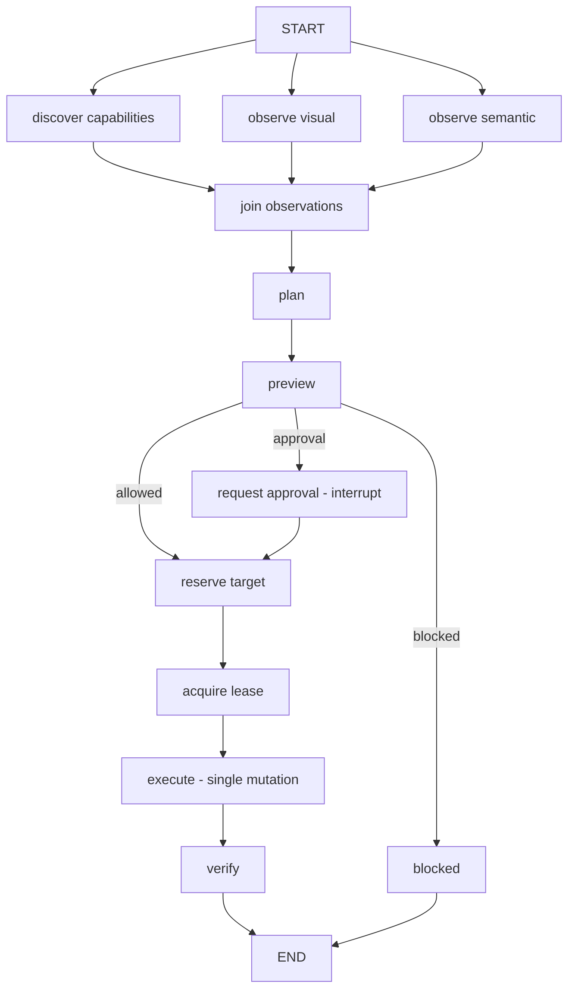

# adk-computer-use

Give an ADK agent safe, governed control of a real desktop.

This crate is the ADK-Rust orchestration layer for
[`computer-use-mcp`](https://github.com/zavora-ai/computer-use-mcp). It does not
perform any desktop actuation itself. The actual clicking, typing, and
screen-reading happens in `computer-use-mcp`, which remains authoritative for
policy, target validation, control leases, physical-user interruption, and
idempotent (run-once) effects. What lives here is everything you need on the ADK
side to drive that server without becoming the component that decides what is
safe: a deterministic workflow, strongly-typed wire contracts, an authorization
gate wired to your identity, and tamper-evident evaluation receipts.

## The problem it solves

Letting an LLM drive a live desktop is high-risk: one wrong action can send an
email, delete a file, or approve a payment. This crate makes that risk manageable
by wrapping every action in the same fixed, predictable control flow:

- **Observe widely, mutate narrowly.** Observation (capabilities, screenshot,
  accessibility tree) runs in parallel, but only **one** node in the entire graph
  is ever allowed to mutate anything.
- **Preview before acting.** Every action is previewed first. Anything that
  requires human approval pauses the graph at a durable checkpoint rather than
  proceeding.
- **Approval is bound to the action.** When you resume after approval, the action
  is pinned to the exact action and policy digests it was approved for. An
  approval for one action cannot authorize a different action.
- **Identity cannot be forged.** The principal and tenant come from `adk-auth`,
  not from model output or graph state, so a prompt cannot change who you are
  mid-run.

## How it fits together

The core of the crate is a deterministic [`adk-graph`](../adk-graph) workflow you
build with `build_reference_graph`. It interacts with the outside world through a
single trait, `ComputerUseRuntime`. In production that trait is backed by a live
MCP server; in tests and the portable example it is a plain Rust struct you write
yourself, with no server, network, or OS dependency.



Read top to bottom: observe in parallel, join the results, preview, branch to
approval when required, acquire the one-writer lease, perform the single mutation,
then verify it happened.

## What's included

| Module | What it provides |
| --- | --- |
| [`contracts`](src/contracts) | The `computer-use-mcp` MCP server wire types (`action`, `target`, `approval`, `receipt`, `lease`, `session`, `safety`), each validated so they cannot carry unsafe or disclosing data. |
| [`runtime`](src/runtime) | The `ComputerUseRuntime` trait plus its live MCP adapter, `ComputerUseMcpRuntime`. |
| `graph` | `build_reference_graph` and its checkpointer-aware variant. |
| `auth` | `ScopeAuthorizer` and `ComputerUseAuthContext` — the `computer:*` scope gate tied to your adk-auth identity. |
| `cancellation` | `CancellationBridge` — revokes desktop authority first, then stops the agent. |
| `eval` | `ComputerUseEvaluator` and the tamper-evident `AdkEvaluationReceipt`. |
| `error` | `ComputerUseError`, which converts cleanly into `adk_core::AdkError`. |

## Run the portable example

Because everything runs through the `ComputerUseRuntime` trait, you can run the
whole graph with no server, no desktop, and no specific OS:

```bash
cargo run -p adk-computer-use --example minimal_graph
```

You'll see the observations join, the action take the "allowed" route, a committed
receipt, and `verified: true`. In code:

```rust,no_run
use std::sync::Arc;
use adk_computer_use::{build_reference_graph, ScopeAuthorizer, ComputerUseRuntime};
use adk_graph::{ExecutionConfig, State};
use serde_json::json;

# async fn run(runtime: Arc<dyn ComputerUseRuntime>) -> Result<(), Box<dyn std::error::Error>> {
// Pass the graph a runtime (yours, or the MCP one) and the scopes you hold.
let authorizer = Arc::new(ScopeAuthorizer::new(["computer:plan", "computer:execute:background"]));
let graph = build_reference_graph(runtime, authorizer)?;

// Provide the action you want; the graph decides how, and whether, to run it.
let mut input = State::new();
input.insert("proposed_action".into(), json!({ "tool": "write_clipboard" }));

let result = graph.invoke(input, ExecutionConfig::new("demo")).await?;
assert_eq!(result.get("verified"), Some(&json!(true)));
# Ok(())
# }
```

The full in-process runtime is in
[`examples/minimal_graph.rs`](examples/minimal_graph.rs), which is a good starting
point for writing your own.

## Driving a real desktop

To drive a live desktop, use `ComputerUseMcpRuntime` pointed at a running
`computer-use-mcp` server. The ADK code is identical on every OS; only the demo
scaffolding (reading the clipboard, building a native window) is platform-specific.

The cross-platform live demo runs on **macOS, Linux, and Windows**:

```bash
cargo run -p adk-computer-use --example live_clipboard -- \
  "Place the exact public text 'ADK-Rust live prompt completed' on my clipboard."
```

- `live_clipboard` — a plain-English request that ends up on the real clipboard,
  then verified by reading it back with the platform's own tool (`pbpaste` on
  macOS, `Get-Clipboard` on Windows, `wl-paste`/`xclip`/`xsel` on Linux).

The native-UI showcases are macOS-specific (they build an AppKit window and drive
Finder), and live under [`examples/macos/`](examples/macos/README.md):

- `live_form` — a native AppKit form, picture-in-picture approval, and an
  independent read-back to confirm the result.
- `live_background_finder` — updates a Finder comment in the background, then
  rolls it back, without taking focus.

## Approvals and resuming

When a preview requires sign-off, the graph does not block a thread. It interrupts
and hands you the preview as durable checkpoint data. To continue, insert an
`approval` object back into the graph state that echoes the digests from the
action you are approving:

```json
{ "actionDigest": "<envelope.argsDigest>", "policyDigest": "<policy.policyDigest>", "grantId": "<grant id>" }
```

If either digest does not match the interrupted action, the resume is rejected, so
an approval cannot authorize a different action. The bearer token never enters ADK
or model state: set `"runtimeApproved": true` to let the runtime hold it
instead of passing a `grantId`.

## Evaluation

`ComputerUseEvaluator` replays a session's event trajectory and flags safety
violations: mutations without a lease, commits that were never verified, and the
same mutation running more than once. `AdkEvaluationReceipt` wraps the evidence in
a canonically-hashed, tamper-evident artifact. CI can produce a receipt, but
signing the matching statement is a release authority's responsibility, so CI
output alone cannot promote a release.

## License

Same terms as the ADK-Rust workspace — see the repository root.
