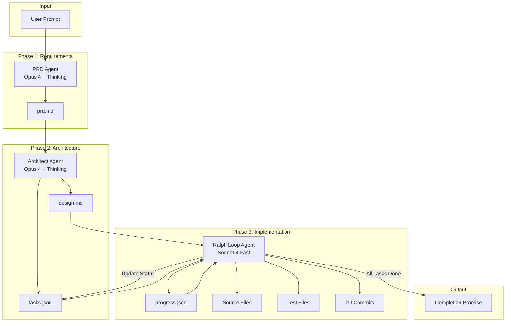

# adk-ralph

Ralph is a multi-agent autonomous development system that transforms a user's idea into a fully implemented project. It uses three specialized agents working in sequence:

1. **PRD Agent** - Creates structured requirements from user prompts
2. **Architect Agent** - Creates system design and task breakdown from PRD
3. **Ralph Loop Agent** - Iteratively implements tasks until completion

## Features

- **Multi-Agent Pipeline**: Three specialized agents for requirements, design, and implementation
- **Priority-Based Task Selection**: Implements highest priority tasks first with dependency checking
- **Progress Tracking**: Append-only progress log captures learnings and gotchas
- **Test-Before-Commit**: Only commits code that passes tests
- **Multi-Language Support**: Rust, Python, TypeScript, Go, Java
- **Telemetry Integration**: Full observability with OpenTelemetry
- **Flexible Configuration**: Environment variables, TOML files, or programmatic API

## Architecture

Ralph follows the "Ralph Wiggum" pattern of iterative, self-referential development where agents learn from their previous work through persistent files (`progress.json`, `tasks.json`) rather than in-memory state.



### Three-Agent Pipeline

| Phase | Agent | Input | Output | Purpose |
|-------|-------|-------|--------|---------|
| 1. Requirements | PRD Agent | User prompt | `prd.md` | Generate structured requirements with user stories |
| 2. Design | Architect Agent | `prd.md` | `design.md`, `tasks.json` | Create architecture and task breakdown |
| 3. Implementation | Ralph Loop Agent | `design.md`, `tasks.json`, `progress.json` | Source code, tests, commits | Iteratively implement all tasks |

### Agent Model Strategy

| Agent | Recommended Model | Thinking | Purpose |
|-------|------------------|----------|---------|
| PRD Agent | Claude Opus 4 | ✅ Enabled | Deep requirements analysis |
| Architect Agent | Claude Opus 4 | ✅ Enabled | Complex design decisions |
| Ralph Loop Agent | Claude Sonnet 4 | ❌ Disabled | Fast implementation iterations |

### ADK-Rust Integration

Ralph leverages the ADK-Rust framework for agent orchestration:

- **`adk-core`**: Core traits (`Llm`, `Tool`, `Agent`, `Content`, `Part`)
- **`adk-agent`**: `LlmAgentBuilder` for creating agents with tools
- **`adk-runner`**: `Runner` for executing agents with session management
- **`adk-session`**: `InMemorySessionService` for session state
- **`adk-model`**: Model providers (Anthropic, OpenAI, Gemini, Ollama)

### Tools

Ralph uses specialized tools for each operation:

| Tool | Purpose | Operations |
|------|---------|------------|
| **FileTool** | File system operations | read, write, append, list, delete |
| **GitTool** | Version control | status, add, commit, diff, log, branch |
| **TestTool** | Test execution | run, check, coverage (multi-language) |
| **ProgressTool** | Progress tracking | read, append, summary |
| **TaskTool** | Task management | list, get_next, update_status, complete |

## Installation

Add to your `Cargo.toml`:

```toml
[dependencies]
adk-ralph = { path = "../adk-ralph" }
```

## Quick Start

```bash
# 1. Copy the example configuration
cp .env.example .env

# 2. Set your API key
export ANTHROPIC_API_KEY=your-key

# 3. Run Ralph with a project idea
cargo run -p adk-ralph -- "Create a CLI calculator in Rust"
```

## Configuration

Ralph supports three configuration methods (in order of precedence):
1. **Environment variables** (highest priority)
2. **TOML configuration file** (`ralph.toml`)
3. **Default values** (lowest priority)

### Configuration Files

- `.env.example` - Environment variable template with all options
- `ralph.toml.example` - TOML configuration template with all options

### Environment Variables Reference

#### API Keys (Required)

Set at least one API key based on your chosen provider:

| Variable | Description |
|----------|-------------|
| `ANTHROPIC_API_KEY` | Anthropic API key for Claude models |
| `OPENAI_API_KEY` | OpenAI API key for GPT models |
| `GEMINI_API_KEY` | Google Gemini API key |

#### Per-Agent Model Configuration

Each agent can use a different model and provider:

| Variable | Default | Description |
|----------|---------|-------------|
| `RALPH_PRD_PROVIDER` | `anthropic` | Provider for PRD Agent |
| `RALPH_PRD_MODEL` | `claude-opus-4-0-20250514` | Model for PRD Agent |
| `RALPH_PRD_THINKING` | `true` | Enable thinking mode for PRD Agent |
| `RALPH_ARCHITECT_PROVIDER` | `anthropic` | Provider for Architect Agent |
| `RALPH_ARCHITECT_MODEL` | `claude-opus-4-0-20250514` | Model for Architect Agent |
| `RALPH_ARCHITECT_THINKING` | `true` | Enable thinking mode for Architect Agent |
| `RALPH_LOOP_PROVIDER` | `anthropic` | Provider for Ralph Loop Agent |
| `RALPH_LOOP_MODEL` | `claude-sonnet-4-20250514` | Model for Ralph Loop Agent |
| `RALPH_LOOP_THINKING` | `false` | Enable thinking mode for Ralph Loop Agent |

**Supported Providers**: `anthropic`, `openai`, `gemini`, `ollama`

**Legacy Single-Model Configuration** (applies to all agents if per-agent not set):

| Variable | Default | Description |
|----------|---------|-------------|
| `RALPH_MODEL_PROVIDER` | `anthropic` | LLM provider for all agents |
| `RALPH_MODEL_NAME` | `claude-sonnet-4-20250514` | Model name for all agents |

#### Execution Settings

| Variable | Default | Range | Description |
|----------|---------|-------|-------------|
| `RALPH_MAX_ITERATIONS` | `50` | 1-1000 | Maximum loop iterations before terminating |
| `RALPH_MAX_TASK_RETRIES` | `3` | 1-10 | Maximum retries for failed tasks |
| `RALPH_COMPLETION_PROMISE` | `All tasks completed successfully!` | - | Message when all tasks complete |

#### File Paths

All paths are relative to `RALPH_PROJECT_PATH`:

| Variable | Default | Description |
|----------|---------|-------------|
| `RALPH_PROJECT_PATH` | `.` | Base directory for the project |
| `RALPH_PRD_PATH` | `prd.md` | Path to PRD file |
| `RALPH_DESIGN_PATH` | `design.md` | Path to design file |
| `RALPH_TASKS_PATH` | `tasks.json` | Path to tasks file |
| `RALPH_PROGRESS_PATH` | `progress.json` | Path to progress file |

#### Telemetry Configuration

| Variable | Default | Description |
|----------|---------|-------------|
| `RALPH_TELEMETRY_ENABLED` | `true` | Enable/disable telemetry |
| `RALPH_SERVICE_NAME` | `ralph` | Service name for telemetry |
| `RALPH_ENABLE_TRACING` | `true` | Enable distributed tracing |
| `RALPH_ENABLE_METRICS` | `true` | Enable metrics collection |
| `RALPH_LOG_LEVEL` | `info` | Log level: trace, debug, info, warn, error |
| `RALPH_OTLP_ENDPOINT` | (none) | OTLP endpoint for telemetry export |

### TOML Configuration

For complex configurations, use `ralph.toml`:

```toml
[execution]
max_iterations = 50
max_task_retries = 3
completion_promise = "All tasks completed successfully!"

[paths]
project = "."
prd = "prd.md"
design = "design.md"
tasks = "tasks.json"
progress = "progress.json"

[agents.prd]
provider = "anthropic"
model = "claude-opus-4-0-20250514"
thinking_enabled = true
max_tokens = 8192
temperature = 0.7

[agents.architect]
provider = "anthropic"
model = "claude-opus-4-0-20250514"
thinking_enabled = true
max_tokens = 8192
temperature = 0.7

[agents.ralph]
provider = "anthropic"
model = "claude-sonnet-4-20250514"
thinking_enabled = false
max_tokens = 4096
temperature = 0.7

[telemetry]
enabled = true
service_name = "ralph"
enable_tracing = true
enable_metrics = true
log_level = "info"
# otlp_endpoint = "http://localhost:4317"
```

### Example Configurations

#### Minimal (Anthropic)

```bash
export ANTHROPIC_API_KEY=sk-ant-...
cargo run -p adk-ralph -- "Create a REST API in Rust"
```

#### Cost-Optimized (Sonnet for all)

```bash
export ANTHROPIC_API_KEY=sk-ant-...
export RALPH_PRD_MODEL=claude-sonnet-4-20250514
export RALPH_PRD_THINKING=false
export RALPH_ARCHITECT_MODEL=claude-sonnet-4-20250514
export RALPH_ARCHITECT_THINKING=false
```

#### OpenAI Configuration

```bash
export OPENAI_API_KEY=sk-...
export RALPH_PRD_PROVIDER=openai
export RALPH_PRD_MODEL=gpt-4o
export RALPH_ARCHITECT_PROVIDER=openai
export RALPH_ARCHITECT_MODEL=gpt-4o
export RALPH_LOOP_PROVIDER=openai
export RALPH_LOOP_MODEL=gpt-4o-mini
```

#### Local Ollama (No API costs)

```bash
export RALPH_PRD_PROVIDER=ollama
export RALPH_PRD_MODEL=llama3.1:70b
export RALPH_ARCHITECT_PROVIDER=ollama
export RALPH_ARCHITECT_MODEL=llama3.1:70b
export RALPH_LOOP_PROVIDER=ollama
export RALPH_LOOP_MODEL=llama3.1:8b
```

#### Mixed Providers

```bash
export ANTHROPIC_API_KEY=sk-ant-...
export OPENAI_API_KEY=sk-...
export RALPH_PRD_PROVIDER=anthropic
export RALPH_PRD_MODEL=claude-opus-4-0-20250514
export RALPH_ARCHITECT_PROVIDER=openai
export RALPH_ARCHITECT_MODEL=gpt-4o
export RALPH_LOOP_PROVIDER=anthropic
export RALPH_LOOP_MODEL=claude-sonnet-4-20250514
```

### Programmatic Configuration

```rust
use adk_ralph::{RalphConfig, AgentModelConfig, ModelConfig, TelemetryConfig};

let config = RalphConfig::builder()
    .agents(AgentModelConfig {
        prd_model: ModelConfig::new("anthropic", "claude-opus-4-0-20250514")
            .with_thinking()
            .with_max_tokens(8192),
        architect_model: ModelConfig::new("anthropic", "claude-opus-4-0-20250514")
            .with_thinking()
            .with_max_tokens(8192),
        ralph_model: ModelConfig::new("anthropic", "claude-sonnet-4-20250514")
            .with_max_tokens(4096),
    })
    .max_iterations(100)
    .project_path("./my-project")
    .completion_promise("🎉 Project complete!")
    .build()?;
```

## Data Models

### PRD (prd.md)

Product Requirements Document with user stories and acceptance criteria.

```markdown
# Product Requirements Document

## Project Overview
[Scope and description]

## User Stories

### US-001: [Title]
**Priority**: 1
**Status**: pending | passing

**Description**: As a [role], I want [feature], so that [benefit].

**Acceptance Criteria**:
1. WHEN [condition], THE system SHALL [behavior]
```

### Design (design.md)

System architecture with component diagrams, interfaces, and file structure.

### Tasks (tasks.json)

Structured task list with priorities, dependencies, and status tracking.

```json
{
  "project": "project-name",
  "language": "rust",
  "phases": [{
    "id": "phase-1",
    "name": "Core Implementation",
    "sprints": [{
      "id": "sprint-1",
      "tasks": [{
        "id": "TASK-001",
        "title": "Set up project structure",
        "priority": 1,
        "status": "pending",
        "dependencies": [],
        "user_story_id": "US-001"
      }]
    }]
  }]
}
```

### Progress (progress.json)

Append-only log of completed work, learnings, and gotchas.

```json
{
  "project": "project-name",
  "entries": [{
    "task_id": "TASK-001",
    "approach": "Created standard Rust project layout",
    "learnings": ["Used workspace structure"],
    "gotchas": ["Remember to add crates to workspace"]
  }]
}
```

## Telemetry

Ralph captures the following telemetry data:

### Spans (Distributed Tracing)
- `ralph.prd_generation` - PRD agent execution
- `ralph.architect_design` - Architect agent execution
- `ralph.loop_iteration` - Each Ralph loop iteration
- `ralph.task_execution` - Individual task execution
- `ralph.tool_call` - Each tool invocation

### Metrics
- `ralph_iterations_total` - Total loop iterations
- `ralph_tasks_completed` - Tasks completed counter
- `ralph_tasks_failed` - Tasks failed counter
- `ralph_llm_tokens_used` - Token usage per model
- `ralph_llm_latency_seconds` - LLM response latency
- `ralph_tool_duration_seconds` - Tool execution duration

### Viewing Telemetry

```bash
# Start Jaeger for local tracing
docker run -d --name jaeger \
  -p 16686:16686 \
  -p 4317:4317 \
  jaegertracing/all-in-one:latest

# Configure Ralph to export to Jaeger
export RALPH_OTLP_ENDPOINT=http://localhost:4317

# View traces at http://localhost:16686
```

## Example Prompts

Ralph works best with clear, detailed project descriptions. Here are example prompts for different project types:

### CLI Application (Rust)

```bash
cargo run -p adk-ralph -- "Create a CLI task manager in Rust called 'taskr'. 
It should support:
- Adding tasks with title, description, and priority (high/medium/low)
- Listing tasks with filtering by status and priority
- Marking tasks as complete
- Deleting tasks
- Storing tasks in a local JSON file
Use clap for argument parsing and colored output."
```

**Expected Output Structure:**
```
taskr/
├── Cargo.toml
├── src/
│   ├── main.rs
│   ├── cli.rs
│   ├── task.rs
│   └── storage.rs
└── tests/
    └── integration_tests.rs
```

### Web API (Python)

```bash
cargo run -p adk-ralph -- "Create a REST API for a bookstore in Python using FastAPI.
Features:
- CRUD operations for books (title, author, ISBN, price, stock)
- Search books by title or author
- User authentication with JWT tokens
- SQLite database with SQLAlchemy
- Input validation with Pydantic
Include OpenAPI documentation and unit tests with pytest."
```

**Expected Output Structure:**
```
bookstore-api/
├── requirements.txt
├── main.py
├── models/
│   ├── book.py
│   └── user.py
├── routes/
│   ├── books.py
│   └── auth.py
├── database.py
└── tests/
    ├── test_books.py
    └── test_auth.py
```

### Full-Stack Application (TypeScript)

```bash
cargo run -p adk-ralph -- "Create a real-time chat application with TypeScript.
Backend: Express.js with Socket.io for WebSocket communication
Frontend: React with Tailwind CSS
Features:
- User registration and login
- Create and join chat rooms
- Real-time messaging with typing indicators
- Message history persistence with PostgreSQL
- Online user presence
Use Prisma for database access and Vitest for testing."
```

**Expected Output Structure:**
```
chat-app/
├── backend/
│   ├── package.json
│   ├── src/
│   │   ├── index.ts
│   │   ├── socket.ts
│   │   └── routes/
│   └── prisma/
│       └── schema.prisma
├── frontend/
│   ├── package.json
│   ├── src/
│   │   ├── App.tsx
│   │   ├── components/
│   │   └── hooks/
│   └── tailwind.config.js
└── docker-compose.yml
```

### Library/Package (Go)

```bash
cargo run -p adk-ralph -- "Create a Go library for rate limiting called 'ratelimit'.
Implement:
- Token bucket algorithm
- Sliding window algorithm
- Fixed window algorithm
Support both in-memory and Redis-backed storage.
Include comprehensive benchmarks and examples.
Follow Go best practices with proper error handling."
```

**Expected Output Structure:**
```
ratelimit/
├── go.mod
├── ratelimit.go
├── token_bucket.go
├── sliding_window.go
├── fixed_window.go
├── storage/
│   ├── memory.go
│   └── redis.go
├── examples/
│   └── main.go
└── ratelimit_test.go
```

### Microservice (Java)

```bash
cargo run -p adk-ralph -- "Create a Spring Boot microservice for order processing.
Features:
- REST API for creating, updating, and querying orders
- Order status workflow (pending -> confirmed -> shipped -> delivered)
- Integration with external payment service (mock)
- Event publishing to Kafka for order state changes
- PostgreSQL for persistence with JPA
- Health checks and metrics endpoints
Use Maven for build and JUnit 5 for testing."
```

**Expected Output Structure:**
```
order-service/
├── pom.xml
├── src/main/java/com/example/orders/
│   ├── OrderServiceApplication.java
│   ├── controller/
│   ├── service/
│   ├── repository/
│   ├── model/
│   └── event/
├── src/main/resources/
│   └── application.yml
└── src/test/java/
    └── com/example/orders/
```

### Tips for Effective Prompts

1. **Be Specific**: Include technology choices, frameworks, and libraries
2. **List Features**: Enumerate the key features you want implemented
3. **Mention Testing**: Specify testing frameworks and coverage expectations
4. **Define Structure**: If you have preferences for project organization, state them
5. **Include Constraints**: Mention any performance, security, or compatibility requirements

### Minimal Prompts

Ralph can also work with minimal prompts, inferring reasonable defaults:

```bash
# Simple CLI tool
cargo run -p adk-ralph -- "Create a Rust CLI for converting CSV to JSON"

# Basic web server
cargo run -p adk-ralph -- "Create a Python Flask app that serves a TODO list API"

# Simple library
cargo run -p adk-ralph -- "Create a TypeScript npm package for validating email addresses"
```

## Development

```bash
# Run tests
cargo test -p adk-ralph

# Run with debug logging
RALPH_LOG_LEVEL=debug cargo run -p adk-ralph -- "Your prompt"

# Check configuration
cargo run -p adk-ralph -- --check-config
```

## License

Apache-2.0
