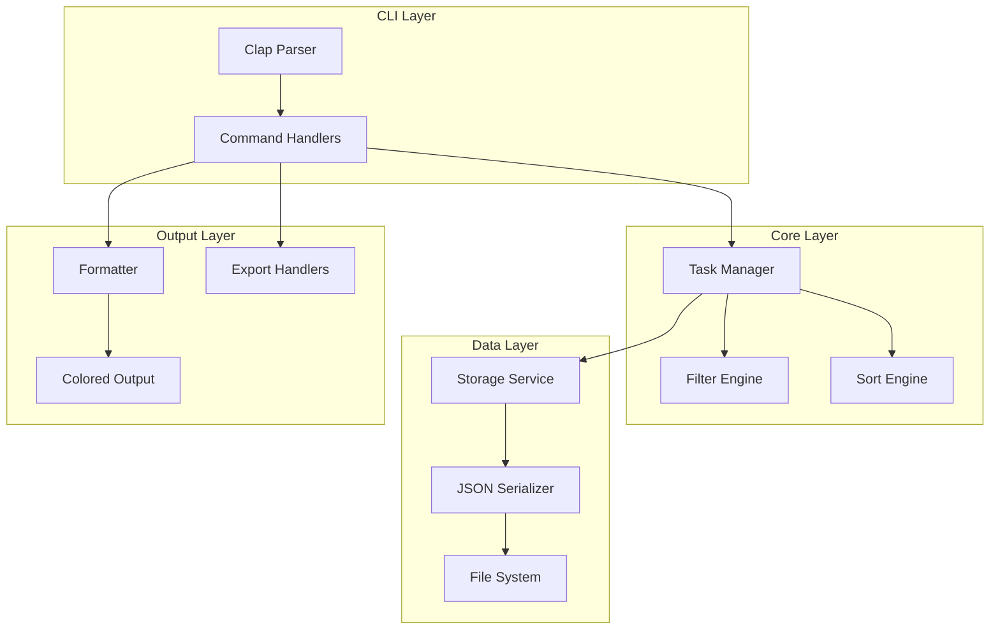
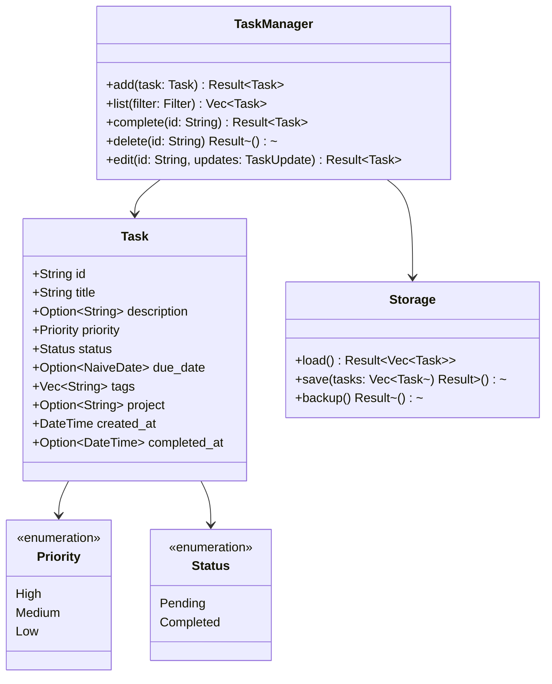

# System Design: taskr

## Architecture Overview

Taskr follows a simple layered architecture with clear separation between CLI parsing, business logic, and data persistence.



## Component Diagram



## File Structure

```
taskr/
├── Cargo.toml
├── src/
│   ├── main.rs           # Entry point, CLI setup
│   ├── lib.rs            # Library exports
│   ├── cli.rs            # Clap command definitions
│   ├── commands/
│   │   ├── mod.rs
│   │   ├── add.rs        # Add command handler
│   │   ├── list.rs       # List command handler
│   │   ├── complete.rs   # Complete command handler
│   │   ├── delete.rs     # Delete command handler
│   │   ├── edit.rs       # Edit command handler
│   │   └── export.rs     # Export command handler
│   ├── task.rs           # Task model and operations
│   ├── storage.rs        # File-based persistence
│   ├── filter.rs         # Filtering logic
│   ├── format.rs         # Output formatting
│   └── error.rs          # Error types
└── tests/
    ├── cli_tests.rs      # CLI integration tests
    ├── task_tests.rs     # Task unit tests
    └── storage_tests.rs  # Storage tests
```

## Technology Stack

- **Language**: Rust 2021 edition
- **CLI Parsing**: clap 4.x with derive macros
- **Serialization**: serde + serde_json
- **Terminal Colors**: colored
- **Date/Time**: chrono
- **ID Generation**: uuid
- **Directories**: dirs (XDG support)

## Data Models

### Task (JSON Schema)

```json
{
  "id": "550e8400-e29b-41d4-a716-446655440000",
  "title": "Implement feature X",
  "description": "Add support for feature X with tests",
  "priority": "high",
  "status": "pending",
  "due_date": "2024-12-31",
  "tags": ["work", "urgent"],
  "project": "my-project",
  "created_at": "2024-01-15T10:30:00Z",
  "completed_at": null
}
```

### Storage File (tasks.json)

```json
{
  "version": 1,
  "tasks": [
    { /* Task objects */ }
  ],
  "metadata": {
    "last_modified": "2024-01-15T10:30:00Z"
  }
}
```

## Error Handling

- Use `thiserror` for error type definitions
- Provide user-friendly error messages
- Exit with appropriate codes (0 success, 1 error)
- Log errors to stderr, output to stdout

## Testing Strategy

### Unit Tests
- Task creation and validation
- Filter matching logic
- Sort comparisons
- Date parsing

### Integration Tests
- Full CLI command execution
- File I/O operations
- Error scenarios

### Property Tests
- JSON serialization round-trips
- Filter combinations
- Sort stability
