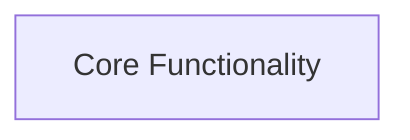

# System Design: Create a Go library for

## Architecture Overview

Create a Go library for rate limiting called ratelimit.

## Component Diagram



## Components

### Core Functionality

**Purpose**: As a user, I want create a go library for rate limiting called ratelimit., so that I can accomplish my goals.

**Interface**:
- // [ ] AC-001. WHEN the user runs the application, THE system SHALL create a go library for rate limiting called ratelimit.

**File**: `src/core_functionality.rs`

## File Structure

```
create-a-go-library-for/
├── src/
│   ├── main.rs
│   └── lib.rs
├── tests/
├── Cargo.toml
└── README.md
```

## Technology Stack

- **Language**: rust
- **Testing**: cargo test / proptest
- **Build Tool**: cargo

## Design Decisions

- Target language: rust (detected from project or PRD)
- Testing framework: cargo test / proptest

