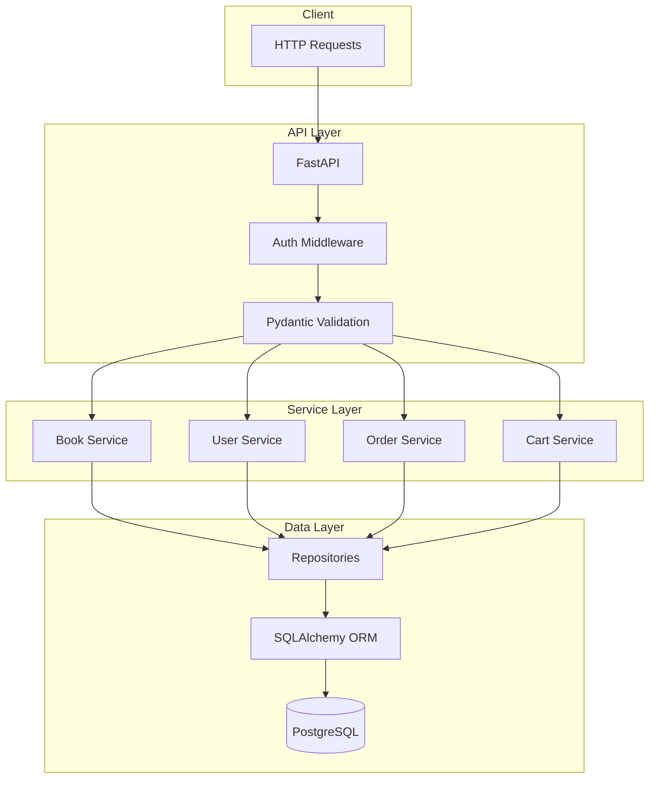
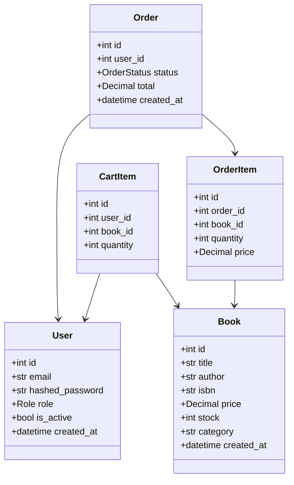
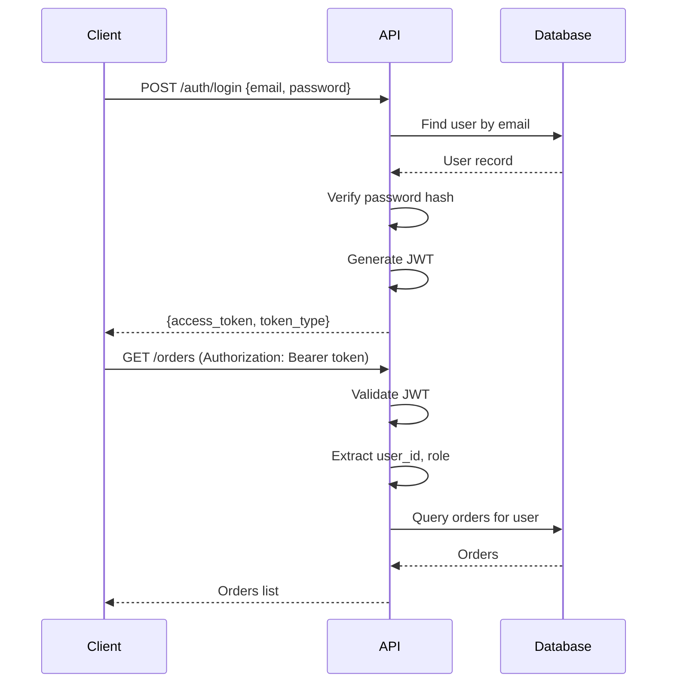

# System Design: bookstore-api

## Architecture Overview

The bookstore API follows a layered architecture with FastAPI handling HTTP requests, SQLAlchemy for database operations, and Pydantic for data validation.



## Component Diagram



## File Structure

```
bookstore-api/
├── requirements.txt
├── alembic.ini
├── main.py                 # FastAPI app entry point
├── config.py               # Configuration settings
├── database.py             # Database connection
├── models/
│   ├── __init__.py
│   ├── book.py             # Book SQLAlchemy model
│   ├── user.py             # User SQLAlchemy model
│   ├── order.py            # Order SQLAlchemy model
│   └── cart.py             # Cart SQLAlchemy model
├── schemas/
│   ├── __init__.py
│   ├── book.py             # Book Pydantic schemas
│   ├── user.py             # User Pydantic schemas
│   ├── order.py            # Order Pydantic schemas
│   └── cart.py             # Cart Pydantic schemas
├── routes/
│   ├── __init__.py
│   ├── books.py            # Book endpoints
│   ├── auth.py             # Authentication endpoints
│   ├── users.py            # User management endpoints
│   ├── orders.py           # Order endpoints
│   └── cart.py             # Cart endpoints
├── services/
│   ├── __init__.py
│   ├── book_service.py
│   ├── user_service.py
│   ├── order_service.py
│   └── cart_service.py
├── auth/
│   ├── __init__.py
│   ├── jwt.py              # JWT utilities
│   ├── password.py         # Password hashing
│   └── dependencies.py     # Auth dependencies
├── alembic/
│   └── versions/           # Database migrations
└── tests/
    ├── conftest.py         # Test fixtures
    ├── test_books.py
    ├── test_auth.py
    ├── test_orders.py
    └── test_cart.py
```

## Technology Stack

- **Framework**: FastAPI 0.100+
- **ORM**: SQLAlchemy 2.0
- **Validation**: Pydantic 2.0
- **Database**: SQLite (dev) / PostgreSQL (prod)
- **Migrations**: Alembic
- **Auth**: python-jose (JWT), passlib (bcrypt)
- **Testing**: pytest, pytest-asyncio, httpx

## API Endpoints

### Books
- `GET /books` - List books (paginated, filterable)
- `GET /books/{id}` - Get book details
- `POST /books` - Create book (staff+)
- `PUT /books/{id}` - Update book (staff+)
- `DELETE /books/{id}` - Delete book (admin)
- `POST /books/import` - Bulk import (staff+)

### Authentication
- `POST /auth/register` - Register new user
- `POST /auth/login` - Login, get JWT
- `POST /auth/refresh` - Refresh token
- `POST /auth/password-reset` - Request password reset

### Users
- `GET /users/me` - Get current user
- `PUT /users/me` - Update current user
- `GET /users` - List users (admin)
- `PUT /users/{id}/role` - Update user role (admin)

### Cart
- `GET /cart` - Get cart contents
- `POST /cart/items` - Add item to cart
- `PUT /cart/items/{id}` - Update quantity
- `DELETE /cart/items/{id}` - Remove item
- `DELETE /cart` - Clear cart

### Orders
- `GET /orders` - List user's orders
- `GET /orders/{id}` - Get order details
- `POST /orders` - Create order from cart

## Authentication Flow



## Error Handling

- Use HTTPException for API errors
- Return RFC 7807 problem details format
- Log errors with correlation IDs
- Validate all inputs with Pydantic

## Testing Strategy

### Unit Tests
- Service layer logic
- JWT token generation/validation
- Password hashing

### Integration Tests
- Full endpoint testing with TestClient
- Database operations with test database
- Authentication flows

### Fixtures
- Factory Boy for test data
- pytest fixtures for database setup
