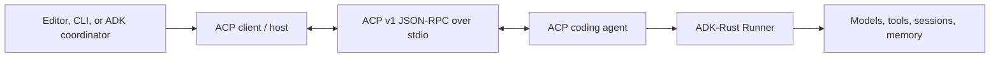
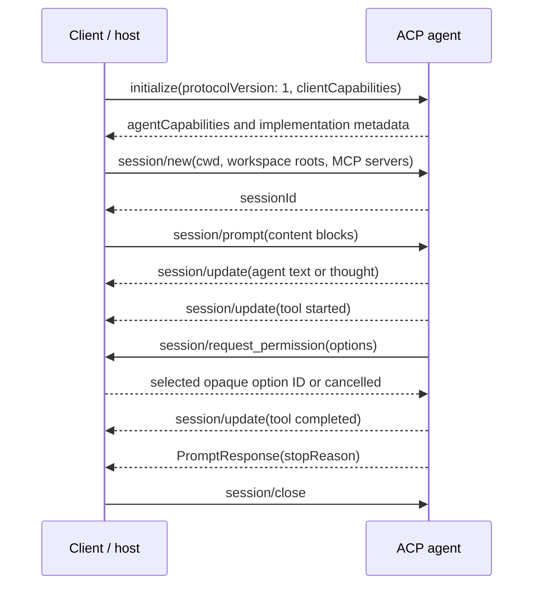

# Agent Client Protocol architecture

ACP standardizes the relationship between a coding interface and a coding
agent. It gives them a common way to establish capabilities, open a project
session, exchange prompts, stream progress, request permission, cancel work,
and close or resume the session.

## The two roles

| Role | Responsibilities |
|---|---|
| Client / host | Starts the agent process, presents the human interface, selects the workspace, supplies optional files, terminals, and MCP servers, applies permission policy, and renders live updates |
| ACP agent | Accepts project sessions and prompts, performs coding work, reports messages and tool activity, asks for permission where needed, and returns a typed stop reason |

ADK-Rust can occupy either role. These are two deployment directions, not two
different protocols.

When ADK-Rust consumes another coding agent, the left side is ADK-Rust and the
right side is the external process. When an editor consumes an ADK-Rust agent,
the editor owns the left side and `AcpServer` owns the right side.

## One ACP turn

The connection is bidirectional. A client must keep reading while a prompt is
running because the agent may send notifications or permission requests before
the final prompt response.

## Session identity and state

An ACP session identifies a continuing conversation about one project. It
contains an absolute `cwd`, optional additional directories, multiple prompts,
streamed updates, and a lifecycle. In the ADK-Rust server, one ACP session maps
to one ADK-Rust session so model history and session state remain attached to
the same conversation.

Closing an active connection is different from deleting persisted history:

- `session/close` releases the active session and its processes;
- `session/resume` attaches to persisted ADK session state;
- `session/delete` removes the persisted session;
- `session/list` returns sessions visible through the configured
  `SessionService`.

## Capabilities are a contract

Initialization is not a decorative handshake. Each side advertises only the
operations and content it supports. ADK-Rust uses those capabilities to avoid
sending optional HTTP or SSE MCP configuration to an agent that accepts only
stdio, and it advertises filesystem or terminal host operations only when the
application supplies the corresponding implementation.

Unsupported media, remote transports, model selectors, and experimental
protocol additions remain unadvertised. Callers should design against the
negotiated capability object rather than assuming every ACP implementation has
the same surface.

## Next

- [Build an ACP client or host](client.md)
- [Expose an ADK-Rust ACP agent](server.md)
- [Testing and support matrix](testing.md)
