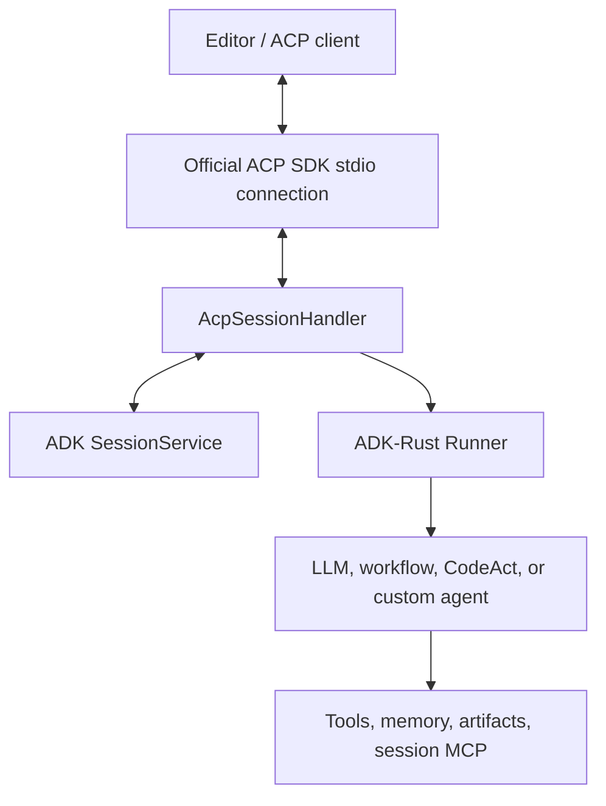

# Expose an ADK-Rust agent through ACP

Use the server direction when an editor or another ACP client should start your
ADK-Rust binary and use its agent inside a coding interface. Your Rust process
owns the agent, model, tools, workflows, sessions, memory, and operating policy.
The client sees only the capabilities and session lifecycle published through
ACP.

## Install the server feature

```toml
[dependencies]
adk-acp = { version = "2.0.0", features = ["server"] }
```

## Build and serve an agent

```rust,ignore
use adk_acp::server::{AcpServer, AcpServerConfigBuilder};
use adk_session::InMemorySessionService;
use std::sync::Arc;

let config = AcpServerConfigBuilder::new()
    .agent(Arc::new(repository_agent))
    .session_service(Arc::new(InMemorySessionService::new()))
    .agent_name("repository-guide")
    .agent_description("Explains and improves this Rust workspace")
    .max_sessions(16)
    .build()?;

let handle = AcpServer::run(config).await?;
handle.wait().await?;
```

The server uses the official SDK `Agent` builder and stdio transport. Protocol
traffic is the only data written to stdout; configure tracing and diagnostics
to use stderr.

## Runtime mapping



The handler validates an absolute `cwd`, reserves session capacity, creates or
resumes the ADK session, and runs the configured agent. Typed ADK events are
translated to ACP `session/update` notifications while the prompt is active.

## Implemented lifecycle

| ACP operation | ADK-Rust behavior |
|---|---|
| `initialize` | Negotiates protocol v1 and returns exact implementation and capability metadata |
| `session/new` | Validates workspace paths and creates one persisted ADK session |
| `session/prompt` | Converts supported content blocks and streams the Runner |
| `session/cancel` | Cancels the active Runner invocation and returns a cancelled stop reason |
| `$/cancel_request` | Cancels the matching JSON-RPC request without corrupting the session |
| `session/close` | Cancels active work and releases session-owned processes |
| `session/list` | Lists persisted ACP-visible sessions |
| `session/resume` | Reattaches to the original session and workspace |
| `session/delete` | Removes persisted history and releases active resources |

Only one prompt may run in a session at a time. Different sessions may run
concurrently up to `max_sessions`.

## Event mapping

- model text becomes `agent_message_chunk`;
- model thought content becomes `agent_thought_chunk`;
- ADK function calls become ACP tool-start updates;
- function responses become tool-completion updates;
- cancellation becomes `StopReason::Cancelled`;
- normal completion becomes `StopReason::EndTurn`.

Unsupported prompt media is rejected and is not advertised during
initialization.

## Client-supplied MCP servers

The client may include stdio MCP servers in `session/new` or `session/resume`.
The server validates names, commands, arguments, and environment entries before
starting a process. It then:

1. starts each child in the session workspace;
2. applies a bounded startup handshake;
3. wraps the connection as an ADK `McpToolset`;
4. injects the toolset into that Runner invocation;
5. cancels the MCP services on close, delete, failed startup, or server shutdown.

Invocation-scoped toolsets are currently resolved by `LlmAgent` and
`CodeActAgent`. Optional HTTP and SSE MCP transports are not advertised by the
server.

## Persistence decisions

`InMemorySessionService` is suitable for a local editor process and tests. Use
a durable service when sessions must survive process restarts. Resume validates
that the caller supplies the original `cwd`; a session cannot be silently
reattached to a different project.

## Tool approval boundary

ADK-Rust has an asynchronous `ToolConfirmationHandler` that resolves a decision
for one exact function-call ID. The current ACP server does not bridge that
handler to `session/request_permission`. In interoperability testing, the
official Rust SDK delivered the nested permission request but lost the outer
prompt response after the reply. The bridge remains disabled so an editor
cannot enter a hanging turn.

Use server-owned tool authorization, read-only tools, RBAC, guardrails, or a
workflow interrupt where approval must happen inside the ADK-Rust process. The
client-side permission path for external ACP agents is fully implemented.

## Deploy safely

- Start the binary with the intended project workspace.
- Treat `cwd` and additional roots as context, not OS isolation.
- Apply `adk-sandbox`, a container, or another process boundary for untrusted
  prompts and commands.
- Keep model and MCP credentials in a client secret store or process
  environment.
- Never write banners, debug objects, or logs to protocol stdout.
- Use a durable `SessionService` when resume must survive process restart.
- Set a finite session limit and close inactive sessions.

The runnable [`acp_server`](../../../examples/acp_server) crate includes a
Gemini-backed agent, workspace-bounded read tools, stderr tracing, and editor
process configuration.

## Next

- [Build an ACP client or host](client.md)
- [Testing and support matrix](testing.md)
