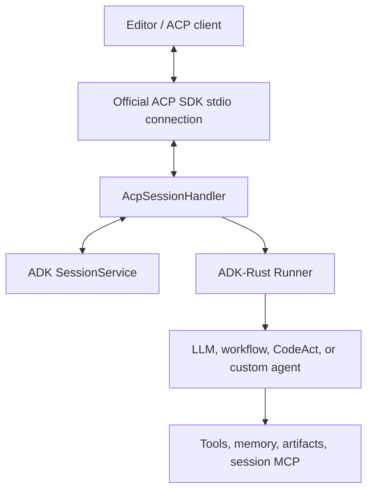

# Expose an ADK-Rust agent through ACP

Use the server direction when an editor or another ACP client should start your
ADK-Rust binary and use its agent inside a coding interface. Your Rust process
owns the agent, model, tools, workflows, sessions, memory, and operating policy.
The client sees only the capabilities and session lifecycle published through
ACP.

## Install the server feature

```toml
[dependencies]
adk-acp = { version = "2.1.0", features = ["server"] }
```

## Build and serve an agent

```rust,ignore
use adk_acp::server::{AcpServer, AcpServerConfigBuilder};
use adk_session::InMemorySessionService;
use std::sync::Arc;

let config = AcpServerConfigBuilder::new()
    .agent(Arc::new(repository_agent))
    .session_service(Arc::new(InMemorySessionService::new()))
    .agent_name("repository-guide")
    .agent_description("Explains and improves this Rust workspace")
    .max_sessions(16)
    .build()?;

let handle = AcpServer::run(config).await?;
handle.wait().await?;
```

The server uses the official SDK `Agent` builder and stdio transport. Protocol
traffic is the only data written to stdout; configure tracing and diagnostics
to use stderr.

## Runtime mapping


```mermaid
flowchart TD
    CLIENT[Editor / ACP client]
    SDK[Official ACP SDK stdio connection]
    HANDLER[AcpSessionHandler]
    SESSION[ADK SessionService]
    RUNNER[ADK-Rust Runner]
    AGENT[LLM, workflow, CodeAct, or custom agent]
    TOOLS[Tools, memory, artifacts, session MCP]

    CLIENT <--> SDK
    SDK <--> HANDLER
    HANDLER <--> SESSION
    HANDLER --> RUNNER
    RUNNER --> AGENT
    AGENT --> TOOLS
```

The handler validates an absolute `cwd`, reserves session capacity, creates or
resumes the ADK session, and runs the configured agent. Typed ADK events are
translated to ACP `session/update` notifications while the prompt is active.

## Implemented lifecycle

| ACP operation | ADK-Rust behavior |
|---|---|
| `initialize` | Negotiates protocol v1 and returns exact implementation and capability metadata |
| `session/new` | Validates workspace paths and creates one persisted ADK session |
| `session/prompt` | Converts supported content blocks (text, resource-link, embedded-resource, image, audio) and streams the Runner |
| `session/load` | Reactivates a persisted session (validating `cwd`) and replays its stored conversation as ordered `session/update` notifications before completing |
| `session/cancel` | Cancels the active Runner invocation and returns a cancelled stop reason |
| `$/cancel_request` | Cancels the matching JSON-RPC request without corrupting the session |
| `session/close` | Cancels active work and releases session-owned processes |
| `session/list` | Lists persisted ACP-visible sessions |
| `session/resume` | Reattaches to the original session and workspace |
| `session/fork` | Branches a persisted session into a new session id, copying its history and relevant state and leaving the source unchanged |
| `session/set_mode` | Validates and records a session mode declared by the agent's `SessionControls`, emitting a `CurrentModeUpdate` |
| `session/set_config_option` | Validates and records a configuration value declared by the agent's `SessionControls`, emitting a `ConfigOptionUpdate` |
| `session/delete` | Removes persisted history and releases active resources |

Only one prompt may run in a session at a time. Different sessions may run
concurrently up to `max_sessions`.

## Event mapping

- model text becomes `agent_message_chunk`;
- model thought content becomes `agent_thought_chunk`;
- embedded-resource content becomes an ACP embedded-resource `agent_message_chunk`;
- ADK function calls become ACP tool-start updates with an inferred tool `kind`;
- function responses become tool-completion updates enriched with the result
  content and any affected file locations, keyed to the originating tool call;
- events carrying usage metadata become `UsageUpdate` notifications (token
  counts, plus cost in USD when reported);
- agent-declared commands become an `AvailableCommandsUpdate` when a session
  becomes active, and a recorded session title becomes a `SessionInfoUpdate`;
- plan entries would become a `Plan` update — this mapping exists but stays
  dormant until an ADK plan primitive surfaces plan entries;
- cancellation becomes `StopReason::Cancelled`;
- normal completion becomes `StopReason::EndTurn`.

A shared content module owns the `ContentBlock` ↔ `adk_core::Part` mapping in
both directions. Embedded-resource prompt content maps to
`Part::EmbeddedResource`, preserving the source URI, optional MIME type, and
contents; text resources are preserved verbatim while binary resources are
base64-encoded on the wire and decoded to raw bytes internally. Image and audio
prompt content maps to `Part::InlineData`, preserving the MIME type, decoded
bytes, annotations, and an image's optional source URI. These fields remain in
session JSON and are restored by `session/load`. Because the prompt handler
accepts embedded-resource, image, and audio content, the server advertises the
`embedded_context`, `image`, and `audio` prompt capabilities. A prompt carrying
a content type the server has not advertised is rejected with a descriptive
error rather than partially handled.

## Load and history replay

`session/load` restores the visible history of a persisted session when a client
reconnects. The handler reactivates the session the same way `session/resume`
does — validating that the caller supplied the original `cwd` and returning a
session-not-found error for an unknown identifier — and then performs a replay
pass. It reads the persisted events through the session service and maps each
stored user, agent, thought, and tool event to its corresponding
`session/update` notification, in original chronological order, before the load
request completes. The server advertises the `load_session` capability so a
client knows it can reconnect and rebuild the conversation view.

## Session modes, configuration options, and fork

An agent opts into interactive session controls by supplying a `SessionControls`
provider through `AcpServerConfigBuilder::session_controls`. The provider declares
the available modes (a `SessionModeState`), configuration options (selects and
toggles), and ACP slash-commands. The server advertises exactly what the provider
declares — an agent without a provider advertises no modes and no options — and
surfaces them in the `session/new`, `session/load`, `session/resume`, and
`session/fork` responses.

`session/set_mode` validates the requested mode id against the advertised set,
records it, and emits a `CurrentModeUpdate`; an unknown id is rejected and the
current mode is left unchanged. `session/set_config_option` validates the value
against the option's declared choices, records it, and emits a
`ConfigOptionUpdate`; an unknown option or invalid value is rejected. Both
selections persist in ADK session state under `acp:mode` and `acp:config:<id>`,
so they survive load, resume, and fork.

`session/fork` branches a persisted session: it reads the source session, creates
a new session id, copies the stored events and relevant state (`cwd`, additional
directories, mode, and configuration) into it, and returns the new id. The source
session's persisted history is left byte-for-byte unchanged. A fork for an unknown
session identifier returns a session-not-found error. The server advertises the
`fork` session capability because the handler is registered.

On session activation the server also emits an `AvailableCommandsUpdate` for any
commands the provider declares (and none when it declares none), and a
`SessionInfoUpdate` carrying the session title when one is recorded under
`acp:title` (set via `set_session_title`). A `Plan` update mapping exists but
stays dormant until an ADK plan primitive surfaces plan entries.

## Client-supplied MCP servers

The client may include stdio MCP servers in `session/new` or `session/resume`.
The server validates names, commands, arguments, and environment entries before
starting a process. It then:

1. starts each child in the session workspace;
2. applies a bounded startup handshake;
3. wraps the connection as an ADK `McpToolset`;
4. injects the toolset into that Runner invocation;
5. cancels the MCP services on close, delete, failed startup, or server shutdown.

Invocation-scoped toolsets are currently resolved by `LlmAgent` and
`CodeActAgent`. Optional HTTP and SSE MCP transports are not advertised by the
server.

## Persistence decisions

`InMemorySessionService` is suitable for a local editor process and tests. Use
a durable service when sessions must survive process restarts. Resume validates
that the caller supplies the original `cwd`; a session cannot be silently
reattached to a different project.

## Tool approval boundary

The server bridges ADK tool confirmations to native ACP permission requests.
When the configured agent pauses on a `ToolConfirmationRequest` during a prompt
turn — surfaced on `event.actions.tool_confirmation` when an agent awaits human
approval of a tool call — the server sends a `session/request_permission`
request describing the tool and its arguments, awaits the client's outcome, and
resumes execution with the mapped decision. An approval maps to allow, and a
denial or a cancellation both map to deny, so a cancelled request never executes
the tool. Each outcome is correlated to the exact call by its function-call
identifier and fed back to the runner through
`RunConfig::tool_confirmation_decisions`.

The nested `session/request_permission` is issued from the task that already
handles the outer `session/prompt`, spawned through `ConnectionTo::spawn`, so it
does not block the connection's dispatch loop and the outer prompt response
still completes. An earlier concern that the official Rust SDK loses the outer
prompt response after a nested bidirectional request does not reproduce with
this pause/resume flow; it is covered by the in-memory interoperability tests.

Server-owned tool authorization, read-only tools, RBAC, guardrails, and workflow
interrupts remain available where approval must happen entirely inside the
ADK-Rust process. The client-side permission path for external ACP agents is
also fully implemented.

## Deploy safely

- Start the binary with the intended project workspace.
- Treat `cwd` and additional roots as context, not OS isolation.
- Apply `adk-sandbox`, a container, or another process boundary for untrusted
  prompts and commands.
- Keep model and MCP credentials in a client secret store or process
  environment.
- Never write banners, debug objects, or logs to protocol stdout.
- Use a durable `SessionService` when resume must survive process restart.
- Set a finite session limit and close inactive sessions.

The runnable [`acp_server`](../../../examples/acp_server) crate includes a
Gemini-backed agent, workspace-bounded read tools, stderr tracing, and editor
process configuration.

## Next

- [Build an ACP client or host](client.md)
- [Testing and support matrix](testing.md)
