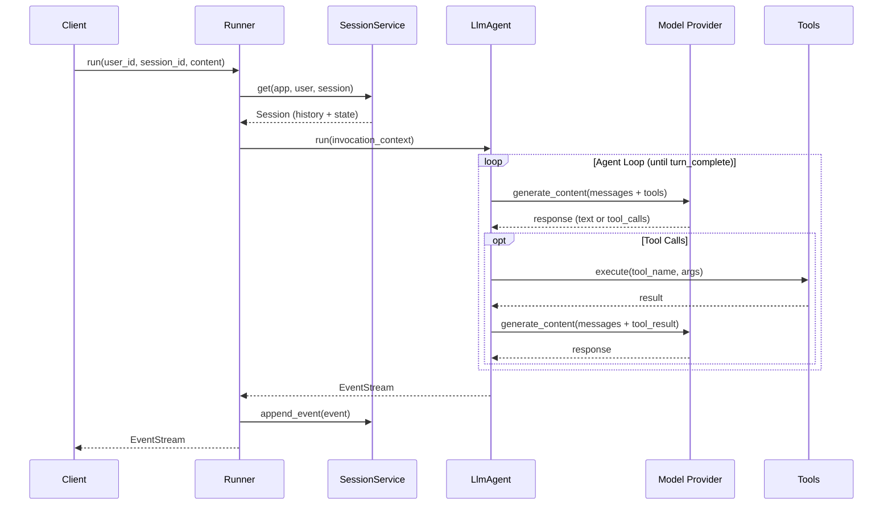

# Runner

The execution runtime from `adk-runner` that orchestrates agent execution.

## Overview

The `Runner` manages the complete lifecycle of agent execution:

- Session management (create/retrieve sessions)
- Memory injection (search and inject relevant memories)
- Artifact handling (scoped artifact access)
- Event streaming (process and forward events)
- Agent transfers (handle multi-agent handoffs)



## Installation

```toml
[dependencies]
adk-runner = "2.1.0"
```

## RunnerConfig

Configure the runner with required services:

```rust
use adk_runner::{Runner, RunnerConfig};
use adk_session::InMemorySessionService;
use adk_artifact::InMemoryArtifactService;
use std::sync::Arc;

let config = RunnerConfig {
    app_name: "my_app".to_string(),
    agent: Arc::new(my_agent),
    session_service: Arc::new(InMemorySessionService::new()),
    artifact_service: Some(Arc::new(InMemoryArtifactService::new())),
    memory_service: None,
    plugin_manager: None,
    run_config: None,
    compaction_config: None,
    context_cache_config: None,
    cache_capable: None,
    request_context: None,
    cancellation_token: None,
};

let runner = Runner::new(config)?;
```

### RunnerConfigBuilder (Recommended)

Use the typestate builder to construct a Runner. The builder enforces required fields at compile time and defaults all optional fields, so adding new fields in future releases won't break your code:

```rust
use adk_runner::Runner;

let runner = Runner::builder()
    .app_name("my_app")
    .agent(Arc::new(my_agent))
    .session_service(Arc::new(InMemorySessionService::new()))
    // Optional fields — only set what you need
    .artifact_service(Arc::new(InMemoryArtifactService::new()))
    .build()?;
```

The builder requires three fields: `app_name`, `agent`, and `session_service`. Everything else is optional and has sensible defaults. The `build()` method is only available once all three required fields are set — missing one is a compile-time error, not a runtime one.

### Configuration Fields

| Field | Type | Required | Description |
|-------|------|----------|-------------|
| `app_name` | `String` | Yes | Application identifier |
| `agent` | `Arc<dyn Agent>` | Yes | Root agent to execute |
| `session_service` | `Arc<dyn SessionService>` | Yes | Session storage backend |
| `artifact_service` | `Option<Arc<dyn ArtifactService>>` | No | Artifact storage |
| `memory_service` | `Option<Arc<dyn Memory>>` | No | Long-term memory |
| `plugin_manager` | `Option<Arc<PluginManager>>` | No | Plugin lifecycle hooks |
| `compaction_config` | `Option<EventsCompactionConfig>` | No | Context compaction settings |
| `run_config` | `Option<RunConfig>` | No | Execution options |
| `context_cache_config` | `Option<ContextCacheConfig>` | No | Runner-level context cache lifecycle (experimental — see below) |
| `cache_capable` | `Option<Arc<dyn CacheCapable>>` | No | Cache-capable model reference (experimental — see below) |
| `request_context` | `Option<RequestContext>` | No | Auth middleware context |
| `cancellation_token` | `Option<CancellationToken>` | No | Cooperative cancellation |

### Prompt caching

**Caching is a provider-level concern and needs no Runner configuration.** Each
provider integration handles it where the request is assembled:

| Provider | Mechanism | Default |
|----------|-----------|---------|
| Anthropic / Bedrock | `cache_control` breakpoints | **on** (`AnthropicConfig::prompt_caching`, opt out with `with_prompt_caching(false)`) |
| OpenAI | server-side prompt caching, `PromptCacheRetention` for retention | automatic |
| Gemini | implicit caching on 2.5/3.x — a shared prefix earns a discount with no code change | automatic |

Cache hits are observable without any extra wiring: the Gemini integration
records `cachedContentTokenCount` on each response.

> **`context_cache_config` and `cache_capable` are experimental and should be
> left unset.** They drive Gemini's *explicit* `cachedContents` API from the
> Runner. That API requires the cache to **replace** `system_instruction`,
> `tools`, and `tool_config` — sending a cache alongside any of them is rejected
> with `INVALID_ARGUMENT`. The Runner selects a cache before the agent resolves
> its tools, so it cannot assemble that request, and enabling these fields does
> not currently produce cache hits. Guaranteed (rather than best-effort) caching
> for Gemini belongs in the model integration, alongside how the other providers
> do it.

## Running Agents

Execute an agent with user input:

```rust
use adk_core::{Content, SessionId, UserId};
use futures::StreamExt;

let user_content = Content::new("user").with_text("Hello!");

let mut stream = runner.run(
    UserId::new("user-123")?,
    SessionId::new("session-456")?,
    user_content,
).await?;

while let Some(event) = stream.next().await {
    match event {
        Ok(e) => {
            if let Some(content) = e.content() {
                for part in &content.parts {
                    if let Some(text) = part.text() {
                        print!("{}", text);
                    }
                }
            }
        }
        Err(e) => eprintln!("Error: {}", e),
    }
}
```

### String Convenience Method

For simple call sites, `run_str()` accepts plain `&str` arguments and handles the newtype conversion internally:

```rust
let mut stream = runner.run_str(
    "user-123",
    "session-456",
    Content::new("user").with_text("Hello!"),
).await?;
```

If the string fails validation (empty, contains null bytes, or exceeds the length limit), `run_str()` returns an error before starting the agent loop. The existing `run()` method with typed `UserId`/`SessionId` remains unchanged.

## Interruption and Run Isolation

A run is registered as soon as `run()` returns its stream, and deregistered when
that stream is dropped — including when it is dropped without ever being polled.

| Method | Scope |
|--------|-------|
| `interrupt(session_id)` | Cancels **every** in-flight run for that session ID, across apps and users |
| `interrupt_identity(app_name, user_id, session_id)` | Cancels runs for one exact identity |
| `active_runs()` | The identity of every in-flight run; a repeated identity means concurrent runs |
| `active_session_ids()` | Deduplicated session IDs of in-flight runs |

```rust
// Cancel one tenant's run without touching another that shares the session ID
let cancelled = runner.interrupt_identity("my-app", "user-1", "session-1");
```

A session ID is only unique within an app and user, so `interrupt(session_id)` is
the broad form and `interrupt_identity` the precise one. Prefer
`interrupt_identity` when a single `Runner` serves more than one app or user.

Runs are tracked by a unique run ID rather than by session ID, so two runs for the
same identity are tracked separately and each deregisters only itself.

### Persistence Is Identity-Bound

Every event the Runner persists — user turns, model responses, transfer events,
plugin events, and compaction events — is written through
`SessionService::append_event_for_identity` with the full
`(app_name, user_id, session_id)` triple. A `SessionService` whose natural key is
composite can therefore bind each event to its tenant, and can reject or ignore
the raw-session-ID `append_event` path entirely.

## Execution Flow

```
┌─────────────────────────────────────────────────────────────┐
│                     Runner.run()                            │
└─────────────────────────────────────────────────────────────┘
                              │
                              ▼
┌─────────────────────────────────────────────────────────────┐
│                  1. Session Retrieval                       │
│                                                             │
│   SessionService.get(app_name, user_id, session_id)        │
│   → Creates new session if not exists                       │
└─────────────────────────────────────────────────────────────┘
                              │
                              ▼
┌─────────────────────────────────────────────────────────────┐
│                  2. Agent Selection                         │
│                                                             │
│   Check session state for active agent                      │
│   → Use root agent or transferred agent                     │
└─────────────────────────────────────────────────────────────┘
                              │
                              ▼
┌─────────────────────────────────────────────────────────────┐
│                3. Context Creation                          │
│                                                             │
│   InvocationContext with:                                   │
│   - Session (mutable)                                       │
│   - Artifacts (scoped to session)                          │
│   - Memory (if configured)                                  │
│   - Run config                                              │
└─────────────────────────────────────────────────────────────┘
                              │
                              ▼
┌─────────────────────────────────────────────────────────────┐
│                  4. Agent Execution                         │
│                                                             │
│   agent.run(ctx) → EventStream                             │
└─────────────────────────────────────────────────────────────┘
                              │
                              ▼
┌─────────────────────────────────────────────────────────────┐
│                 5. Event Processing                         │
│                                                             │
│   For each event:                                           │
│   - Update session state                                    │
│   - Handle transfers                                        │
│   - Forward to caller                                       │
└─────────────────────────────────────────────────────────────┘
                              │
                              ▼
┌─────────────────────────────────────────────────────────────┐
│                  6. Session Save                            │
│                                                             │
│   SessionService.append_event(session, events)             │
└─────────────────────────────────────────────────────────────┘
```

## InvocationContext

The context provided to agents during execution:

```rust
pub trait InvocationContext: CallbackContext {
    /// The agent being executed
    fn agent(&self) -> Arc<dyn Agent>;
    
    /// Memory service (if configured)
    fn memory(&self) -> Option<Arc<dyn Memory>>;
    
    /// Current session
    fn session(&self) -> &dyn Session;
    
    /// Execution configuration
    fn run_config(&self) -> &RunConfig;
    
    /// Signal end of invocation
    fn end_invocation(&self);
    
    /// Check if invocation has ended
    fn ended(&self) -> bool;
}
```

## RunConfig

Execution options:

```rust
pub struct RunConfig {
    /// Streaming mode for responses
    pub streaming_mode: StreamingMode,
    // ... other fields (tool_confirmation_decisions, cached_content, etc.)
}
```

### ToolExecutionStrategy

Controls how multiple tool calls from a single LLM response are dispatched:

| Strategy | Behavior |
|----------|----------|
| `Sequential` (default) | Execute tools one at a time in LLM-returned order |
| `Parallel` | Execute all tools concurrently; the caller owns safety |
| `Auto` | Execute the safe read-only subset concurrently, then all remaining calls sequentially |

Set per-agent via `LlmAgentBuilder`:

```rust
use adk_core::ToolExecutionStrategy;

let agent = LlmAgentBuilder::new("fast_agent")
    .model(model)
    .tool_execution_strategy(ToolExecutionStrategy::Auto)
    .tool(Arc::new(
        search_tool
            .with_read_only(true)
            .with_concurrency_safe(true),
    ))
    .tool(Arc::new(save_tool)) // runs after the concurrent safe subset
    .build()?;
```

In `Auto` mode, the dispatch loop queries both `is_read_only()` and `is_concurrency_safe()`. Calls whose selected tools return `true` for both methods run concurrently first; all remaining calls then run sequentially. `Parallel` bypasses these metadata checks as an explicit caller override. Results are always reassembled in the original LLM-returned order regardless of strategy. Failed tools produce a JSON error response without aborting the batch.

```rust
pub enum StreamingMode {
    /// No streaming, return complete response
    None,
    /// Server-Sent Events (default)
    SSE,
    /// Bidirectional streaming (realtime)
    Bidi,
}
```

## Agent Transfers

The Runner handles multi-agent transfers automatically:

```rust
// In an agent's tool or callback
if should_transfer {
    // Set transfer in event actions
    ctx.set_actions(EventActions {
        transfer_to_agent: Some("specialist_agent".to_string()),
        ..Default::default()
    });
}
```

The Runner will:
1. Detect the transfer request in the event
2. Find the target agent in sub_agents
3. Update session state with new active agent
4. Continue execution with the new agent

## Context Compaction

For long-running sessions, enable automatic context compaction to keep the LLM context window bounded:

```rust
use adk_runner::{Runner, RunnerConfig, EventsCompactionConfig};
use adk_agent::LlmEventSummarizer;
use std::sync::Arc;

let summarizer = LlmEventSummarizer::new(model.clone());

let config = RunnerConfig {
    // ... other fields ...
    compaction_config: Some(EventsCompactionConfig {
        compaction_interval: 3,  // Compact every 3 invocations
        overlap_size: 1,         // Keep 1 event overlap for continuity
        summarizer: Arc::new(summarizer),
    }),
    // ...
};
```

When compaction triggers, older events are replaced by a summary event. `conversation_history()` automatically uses the summary instead of the original events.

See [Context Compaction](../sessions/context-compaction.md) for full documentation.

## Integration with Launcher

The `Launcher` uses `Runner` internally:

```rust
// Launcher creates Runner with default services
Launcher::new(agent)
    .app_name("my_app")
    .run()
    .await?;

// Equivalent to using the builder:
let runner = Runner::builder()
    .app_name("my_app")
    .agent(agent)
    .session_service(Arc::new(InMemorySessionService::new()))
    .build()?;
```

## Custom Runner Usage

For advanced scenarios, use Runner directly:

```rust
use adk_runner::Runner;

// Production configuration using the builder
let runner = Runner::builder()
    .app_name("production_app")
    .agent(my_agent)
    .session_service(Arc::new(SqliteSessionService::new(db_pool)))
    .artifact_service(Arc::new(S3ArtifactService::new(s3_client)))
    .memory_service(Arc::new(QdrantMemoryService::new(qdrant_client)))
    .build()?;

// Use in HTTP handler with run_str() for convenience
async fn chat_handler(runner: &Runner, request: ChatRequest) -> Response {
    let stream = runner.run_str(
        &request.user_id,
        &request.session_id,
        request.content,
    ).await?;
    
    // Stream events to client
    Response::sse(stream)
}
```

---

**Previous**: [← Core Types](core.md) | **Next**: [Launcher →](../deployment/launcher.md)
