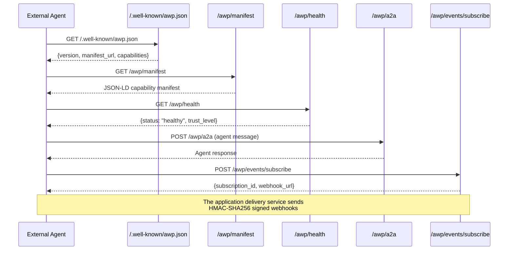

# Agentic Web Protocol (AWP)

ADK-Rust provides [Agentic Web Protocol (AWP)](https://agenticwebprotocol.com) types and Axum integration for making websites and services accessible to AI agents. The implementation spans two crates: `awp-types` (pure protocol types) and `adk-awp` (routes, middleware, and service interfaces). Applications supply agent dispatch, authentication, authorization, and durable webhook delivery.

## Overview

AWP enables any website to declare its capabilities, policies, and business context in a machine-readable format. AI agents can discover these capabilities, negotiate protocol versions, subscribe to events, and interact through typed A2A messages. `adk-awp` enforces body and rate limits at its HTTP boundary; application handlers enforce identity and capability authorization.

Use AWP when:
- You want AI agents to discover and interact with your service programmatically
- You need trust-level metadata and a hook for application-enforced access control
- You want to serve both human visitors and AI agents from the same endpoints
- You need event subscriptions and HMAC-SHA256 signing primitives
- You want a health state machine for service monitoring

## Architecture

### AWP Request Flow



### Application Layout

```
┌─────────────────────────────────────────────────┐
│                  Your Application                │
│                                                  │
│  ┌──────────────┐  ┌──────────────────────────┐ │
│  │  LLM Agent   │  │  awp_routes(state)       │ │
│  │  (adk-agent) │  │  ├ /.well-known/awp.json │ │
│  │              │  │  ├ /awp/manifest          │ │
│  │  Instructions│  │  ├ /awp/health            │ │
│  │  derived from│  │  └ /awp/a2a              │ │
│  │  business.   │  │  auth + management routes│ │
│  │  toml        │  │                           │ │
│  └──────────────┘  └──────────────────────────┘ │
│         ▲                      ▲                 │
│         │                      │                 │
│    ┌────┴──────────────────────┴────┐            │
│    │     BusinessContextLoader      │            │
│    │     (business.toml + ArcSwap)  │            │
│    └────────────────────────────────┘            │
└─────────────────────────────────────────────────┘
```

## Crates

| Crate | Purpose | Dependencies |
|-------|---------|-------------|
| `awp-types` | Protocol types (enums, structs, errors) | Zero `adk-*` deps — `serde`, `uuid`, `chrono`, `thiserror` only |
| `adk-awp` | Routes, middleware, service interfaces, and in-memory implementations | `awp-types`, `adk-core`, `axum` 0.8, `tokio`, `dashmap` |

The split means any Rust project can depend on `awp-types` without pulling in the ADK tree.

## Quick Start

### 1. Create a `business.toml`

```toml
site_name = "My Shop"
site_description = "An online store powered by AWP"
domain = "myshop.example.com"
contact = "hello@myshop.example.com"

[business]
country = "US"
currency = "USD"
languages = ["en"]

[brand_voice]
tone = "friendly and helpful"
greeting = "Welcome! How can I help?"

[[capabilities]]
name = "browse_products"
description = "Browse the product catalog"
endpoint = "/api/products"
method = "GET"
access_level = "anonymous"

[[capabilities]]
name = "place_order"
description = "Place an order"
endpoint = "/api/orders"
method = "POST"
access_level = "known"

[[products]]
sku = "WIDGET-001"
name = "Standard Widget"
price = 1999
inventory = 500
tags = ["widget"]

[[policies]]
name = "privacy"
description = "Minimal data collection, no tracking."
policy_type = "privacy"

[payments]
providers = ["stripe"]
auto_approve_threshold = 5000

[support]
escalation_contacts = ["support@myshop.example.com"]
hours = "Mon-Fri 9-5 EST"
```

### 2. Load and serve AWP routes

```rust
use std::sync::Arc;

use adk_awp::{AwpA2aHandler, AwpState, BusinessContextLoader, awp_routes};
use async_trait::async_trait;
use awp_types::AwpError;
use axum::http::{HeaderMap, header};
use serde_json::{Value, json};

struct ApplicationA2a {
    bearer_token: Arc<str>,
}

#[async_trait]
impl AwpA2aHandler for ApplicationA2a {
    async fn handle(&self, headers: HeaderMap, message: Value) -> Result<Value, AwpError> {
        let expected = format!("Bearer {}", self.bearer_token);
        let authorized = headers
            .get(header::AUTHORIZATION)
            .and_then(|value| value.to_str().ok())
            .is_some_and(|value| value == expected);
        if !authorized {
            return Err(AwpError::Unauthorized("invalid A2A credential".to_string()));
        }
        // Authorize the requested capability and dispatch to the application agent.
        Ok(json!({ "status": "processed", "messageId": message["id"] }))
    }
}

let loader = BusinessContextLoader::from_file("business.toml".as_ref())?;
let a2a_token: Arc<str> = std::env::var("AWP_A2A_TOKEN")?.into();
let state = AwpState::builder(loader.context_ref())
    .a2a_handler(Arc::new(ApplicationA2a { bearer_token: a2a_token }))
    .build();

let app = axum::Router::new()
    .merge(awp_routes(state))
    .merge(your_custom_routes);

let listener = tokio::net::TcpListener::bind("127.0.0.1:3456").await?;
axum::serve(
    listener,
    app.into_make_service_with_connect_info::<std::net::SocketAddr>(),
)
.await?;
```

This registers the four public AWP endpoints with version negotiation, rate
limiting, and a 64 KiB A2A body limit. Without an `AwpA2aHandler`,
`POST /awp/a2a` returns `503` and never acknowledges work that was not
dispatched. `ConnectInfo` supplies the peer address used to isolate anonymous
rate-limit buckets; without it, unknown callers intentionally share one bucket.

## Public AWP endpoints

| Method | Path | Description |
|--------|------|-------------|
| GET | `/.well-known/awp.json` | Discovery document — entry point for agents |
| GET | `/awp/manifest` | JSON-LD capability manifest |
| GET | `/awp/health` | Health state (Healthy/Degrading/Degraded) |
| POST | `/awp/a2a` | Application-provided A2A dispatch |

## Authenticated management endpoints

`awp_management_routes()` returns subscription management separately and
without an authentication layer. Apply the application's auth middleware
before merging it:

| Method | Path | Description |
|--------|------|-------------|
| POST | `/awp/events/subscribe` | Create a webhook subscription |
| GET | `/awp/events/subscriptions` | List all subscriptions |
| DELETE | `/awp/events/subscriptions/{id}` | Delete a subscription |

## Discovery Document

The discovery document at `/.well-known/awp.json` is auto-generated from your `business.toml`:

```json
{
  "version": { "major": 1, "minor": 0 },
  "siteName": "My Shop",
  "siteDescription": "An online store powered by AWP",
  "capabilityManifestUrl": "https://myshop.example.com/awp/manifest",
  "a2aEndpointUrl": "https://myshop.example.com/awp/a2a",
  "eventsEndpointUrl": "https://myshop.example.com/awp/events/subscribe",
  "healthEndpointUrl": "https://myshop.example.com/awp/health",
  "supportedTrustLevels": ["anonymous"]
}
```

## Capability Manifest

The manifest at `/awp/manifest` uses JSON-LD format:

```json
{
  "@context": "https://schema.org",
  "@type": "WebAPI",
  "name": "My Shop",
  "description": "An online store powered by AWP",
  "capabilities": [
    {
      "name": "browse_products",
      "description": "Browse the product catalog",
      "endpoint": "/api/products",
      "method": "GET"
    }
  ]
}
```

## Trust Levels

AWP uses four trust levels with increasing access:

| Level | Discriminant | How Assigned |
|-------|-------------|-------------|
| `Anonymous` | 0 | No credentials |
| `Known` | 1 | Valid API key or JWT |
| `Partner` | 2 | JWT with `partner` scope |
| `Internal` | 3 | JWT with `internal` scope |

Trust levels are ordered: `Anonymous < Known < Partner < Internal`. Each capability in `business.toml` declares its minimum `access_level`.

`DefaultTrustAssigner` classifies every request as `Anonymous`. A bearer or API
key header is not trusted until an application verifier validates it. Higher
trust levels therefore require a custom assigner.

Configure `.supported_trust_levels(...)` alongside that assigner so discovery
advertises only levels the deployment can verify.

### Custom Trust Assignment

Implement the `TrustLevelAssigner` trait for custom logic:

```rust
use std::sync::Arc;

use adk_awp::TrustLevelAssigner;
use async_trait::async_trait;
use awp_types::TrustLevel;
use axum::http::{HeaderMap, header};

struct MyTrustAssigner {
    bearer_token: Arc<str>,
}

#[async_trait]
impl TrustLevelAssigner for MyTrustAssigner {
    async fn assign(&self, headers: &HeaderMap) -> TrustLevel {
        let expected = format!("Bearer {}", self.bearer_token);
        if headers
            .get(header::AUTHORIZATION)
            .and_then(|value| value.to_str().ok())
            .is_some_and(|value| value == expected)
        {
            TrustLevel::Known
        } else {
            TrustLevel::Anonymous
        }
    }
}
```

Use the same verified identity and scope source as the rest of the application
when assigning `Partner` or `Internal`.

## Rate Limiting

The built-in `InMemoryRateLimiter` uses a sliding window algorithm with per-trust-level limits:

| Trust Level | Default Limit |
|-------------|--------------|
| Anonymous | 30 requests/minute |
| Known | 120 requests/minute |
| Partner | 600 requests/minute |
| Internal | Unlimited |

Rejected requests receive HTTP 429 with a `Retry-After` header.

### Custom Limits

```rust
use std::collections::HashMap;
use awp_types::TrustLevel;
use adk_awp::{InMemoryRateLimiter, RateLimitConfig};

let mut limits = HashMap::new();
limits.insert(TrustLevel::Anonymous, RateLimitConfig {
    max_requests: 10,
    window_secs: 60,
});
limits.insert(TrustLevel::Known, RateLimitConfig {
    max_requests: 100,
    window_secs: 60,
});

let limiter = InMemoryRateLimiter::with_config(limits);
```

## Version Negotiation

All AWP routes include version negotiation middleware:

- Clients send `AWP-Version: 1.1` header (optional — defaults to current version)
- Server checks major version compatibility
- Compatible requests proceed; incompatible requests get HTTP 406
- Malformed version values get HTTP 400
- Response includes `AWP-Version: 1.0` header

## Event Subscriptions

Subscription management is a privileged surface. Mount
`awp_management_routes()` behind authentication before accepting these
requests. Callback URLs must be absolute HTTPS URLs and signing secrets must
contain at least 32 bytes:

```bash
# Subscribe
curl -X POST http://localhost:3456/awp/events/subscribe \
  -H "Authorization: Bearer $AWP_ADMIN_TOKEN" \
  -H "Content-Type: application/json" \
  -d '{
    "subscriber": "my-agent",
    "callbackUrl": "https://my-agent.example/webhook",
    "eventTypes": ["health.changed"],
    "secret": "replace-with-at-least-32-random-bytes"
  }'

# List subscriptions
curl -H "Authorization: Bearer $AWP_ADMIN_TOKEN" \
  http://localhost:3456/awp/events/subscriptions
```

`InMemoryEventSubscriptionService` signs and logs matching deliveries but
performs no network I/O. Production applications implement
`EventSubscriptionService` with destination validation, a durable queue,
bounded retries, and their HTTP client.

An HTTP delivery implementation can carry an `X-AWP-Signature` header with the
HMAC-SHA256 signature:

```
X-AWP-Signature: sha256=<hex_digest>
```

Verify signatures with `adk_awp::verify_signature(payload, secret, signature)`.

## Health State Machine

The health endpoint tracks service state with strictly validated transitions:

```
Healthy → Degrading → Degraded
    ↑         │           │
    └─────────┘           │
    └─────────────────────┘
```

State changes emit `health.changed` events to all matching subscribers.

```rust
use adk_awp::HealthStateMachine;

// Transition to degrading
health.report_degrading("database latency high").await?;

// Transition to degraded
health.report_degraded("database unreachable").await?;

// Recover
health.report_healthy().await?;
```

Invalid transitions (e.g., Healthy → Degraded) return an error.

## Consent Storage

AWP includes a consent storage interface. Regulatory compliance also requires
application-specific notice, lawful basis, retention, access controls, and
deletion policy; selecting a storage implementation does not establish
compliance:

```rust
use adk_awp::InMemoryConsentService;

let consent = InMemoryConsentService::new();

// Capture consent
consent.capture_consent("visitor-123", "analytics").await?;

// Check consent
let has_consent = consent.check_consent("visitor-123", "analytics").await?;

// Revoke consent
consent.revoke_consent("visitor-123", "analytics").await?;
```

## Requester Type Detection

AWP detects whether a request comes from a human or an AI agent:

1. `X-AWP-Channel: agent` header → Agent (explicit override)
2. `Accept: application/json` + agent User-Agent pattern → Agent
3. Otherwise → Human

Agent User-Agent patterns: `bot`, `crawler`, `spider`, `agent`, `gpt`, `claude`, `gemini`, `perplexity`, `anthropic`, `openai`.

```rust
use adk_awp::detect_requester_type;
use axum::http::HeaderMap;

let mut headers = HeaderMap::new();
headers.insert("X-AWP-Channel", "agent".parse().unwrap());
let requester = detect_requester_type(&headers);
// RequesterType::Agent
```

## AWP Message Types

Beyond generic A2A messages, AWP defines typed message categories for agent routing:

| Type | Description |
|------|-------------|
| `VisitorIntentSignal` | Purchase or service intent |
| `ContentGapSignal` | Missing or outdated content detected |
| `PaymentIntent` | Payment lifecycle message |
| `SupportEscalation` | Escalation to human support |
| `ReviewSignal` | Review or feedback from a platform |
| `OperationsProposal` | Inventory, scheduling proposal |
| `InvokeCapability` | Invoke a declared capability |
| `RenderUi` | Request UI rendering |
| `OutboundTrigger` | Proactive outbound message |

```rust
use awp_types::{AwpMessageType, AwpTypedMessage};

let msg = AwpTypedMessage {
    id: uuid::Uuid::now_v7(),
    sender: "visitor-agent".to_string(),
    recipient: "payment-agent".to_string(),
    awp_type: AwpMessageType::PaymentIntent,
    timestamp: chrono::Utc::now(),
    payload: serde_json::json!({"sku": "WIDGET-001", "amount": 2500}),
};
```

## Payment Intents

AWP defines a simplified payment lifecycle for owner-policy-driven payments:

```
Draft → PendingApproval → Approved → Executing → Settled
                                                → Rejected
                                                → Cancelled
```

The `PaymentPolicy` evaluates whether to auto-approve or require owner approval:

```rust
use awp_types::{PaymentPolicy, TrustLevel};

let policy = PaymentPolicy::default(); // $50 auto-approve, $500 require approval

let decision = policy.evaluate(2500, TrustLevel::Known);
// PaymentPolicyDecision::AutoApprove (amount $25 <= $50 threshold)

let decision = policy.evaluate(60_000, TrustLevel::Partner);
// PaymentPolicyDecision::RequireApproval (amount $600 > $500 threshold)
```

## business.toml Schema

The full schema supports rich business configuration:

| Section | Fields | Required |
|---------|--------|----------|
| (root) | `site_name`, `site_description`, `domain`, `contact` | Yes (except contact) |
| `[business]` | `name`, `country`, `languages`, `currency`, `timezone` | No |
| `[brand_voice]` | `tone`, `greeting`, `escalation_message` | No |
| `[[products]]` | `sku`, `name`, `price`, `inventory`, `tags`, `description` | No |
| `[[capabilities]]` | `name`, `description`, `endpoint`, `method`, `access_level` | Yes |
| `[[policies]]` | `name`, `description`, `policy_type` | Yes |
| `[channels]` | `whatsapp`, `email`, `website`, `sms` | No |
| `[payments]` | `providers`, `auto_approve_threshold`, `require_approval_threshold` | No |
| `[support]` | `escalation_contacts`, `hours`, `sla` | No |
| `[content]` | `topics`, `auto_draft`, `publish_delay` | No |
| `[reviews]` | `platforms`, `auto_respond_threshold` | No |
| `[outreach]` | `follow_up_delay`, `require_consent` | No |

All extended sections are optional — existing minimal `business.toml` files continue to work.

### Hot Reload

The `BusinessContextLoader` supports hot-reload via `ArcSwap`:

```rust
let loader = BusinessContextLoader::from_file("business.toml".as_ref())?;
loader.watch("business.toml".into()).await?;
// Changes to business.toml are picked up automatically every 5 seconds
```

## Running the Example

A complete AWP agent example is included:

```bash
cd examples/awp_agent
cp .env.example .env   # add your GOOGLE_API_KEY
cargo run
```

The example:
1. Loads `business.toml` with products, policies, and brand voice
2. Creates an LLM agent with instructions derived from the business context
3. Installs authenticated A2A dispatch to that agent
4. Mounts management routes behind a separate demo credential
5. Exercises every endpoint and prints protocol verification

## Best Practices

1. **Start with a minimal `business.toml`** — only `site_name`, `site_description`, `domain`, capabilities, and policies are required
2. **Enforce capability authorization** — `access_level` is manifest metadata; the application handler must enforce it
3. **Enable hot-reload** in production — call `loader.watch()` for zero-downtime config updates
4. **Implement custom `TrustLevelAssigner`** — the default intentionally assigns only `Anonymous`
5. **Authenticate management routes** — never expose subscription CRUD from an unprotected router
6. **Install real A2A dispatch** — the fail-closed default returns `503`
7. **Use durable event delivery** — implement destination policy, queueing, and bounded retries
8. **Verify webhook signatures** — validate `X-AWP-Signature` on incoming webhooks

## Related

- [A2A Protocol](a2a.md) — Agent-to-Agent communication (complementary to AWP)
- [Server Deployment](server.md) — Running agents as HTTP servers
- [Access Control](../security/access-control.md) — Role-based permissions

---

**Previous**: [← A2A Protocol](a2a.md) | **Next**: [Evaluation →](../evaluation/evaluation.md)
