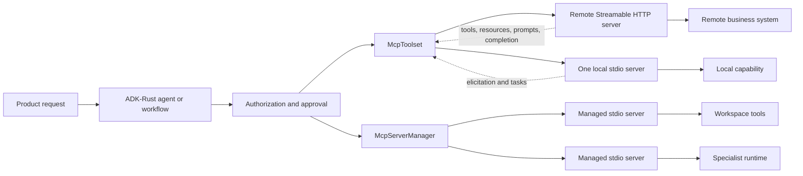

# Model Context Protocol in ADK-Rust

Model Context Protocol (MCP) is the boundary between an AI application and a
separately owned capability. An MCP server can publish tools, readable
resources, prompt templates, and argument completion. The client discovers that
catalog and communicates through negotiated protocol methods rather than a
private integration.

ADK-Rust 2 uses the official `rmcp 2.2` SDK and MCP `2025-11-25` types.

## Where ADK-Rust fits

`McpToolset` adapts one initialized MCP client connection to ADK-Rust.
`McpServerManager` owns a changing registry of local stdio child processes and
aggregates their tools. Applications that publish capabilities can build MCP
servers with `adk_tool::mcp::rmcp`, which is the exact SDK version used by the
framework.

## Choose the right surface

| You need to | Use | Ownership |
|---|---|---|
| Connect one known local server | `McpToolset` + `TokioChildProcess` | The application starts the child process |
| Connect one remote MCP service | `McpHttpClientBuilder` | The remote deployment owns availability |
| Change local server definitions at runtime | `McpServerManager` | The application owns a local registry and child processes |
| Publish an MCP server | `adk_tool::mcp::rmcp` | Your service owns schemas, authorization, and side effects |
| Keep a deprecated sampling integration working | `mcp-sampling` feature | Compatibility only under SEP-2577 |

## Implemented capability map

| Capability | ADK-Rust API | Behavior |
|---|---|---|
| Tool discovery and calls | `McpToolset`, `Toolset` | Raw schemas and multimodal results are preserved |
| Tool filtering | `with_filter`, `with_tools` | The model sees only selected tools |
| Resources and templates | `list_resources`, `list_resource_templates`, `read_resource` | Read context through stable URIs |
| Prompts | `list_prompts`, `get_prompt` | Resolve reusable server-owned messages |
| Completion | `complete_prompt_argument`, `complete_resource_argument` | Ask the server for argument suggestions |
| Resource subscriptions | `subscribe_resource`, `unsubscribe_resource` | Custom handlers receive update notifications |
| Elicitation | `ElicitationHandler` | Form and URL modes |
| Tasks | `McpTaskConfig` | Negotiated tool-call task creation, polling, result, and cancellation |
| Streamable HTTP | `McpHttpClientBuilder` | Timeouts, headers, auth injection, expired-session recovery |
| Dynamic local registry | `McpServerManager` | Add, update, enable, disable, remove, save, monitor, and restart |
| Advanced SDK work | `adk_tool::mcp::rmcp` | Server handlers, transports, notifications, and extension types |

## Documentation path

- [Build an MCP client](client.md)
- [Manage local MCP servers dynamically](manager.md)
- [Publish an MCP server](server.md)
- [Security and authorization](security.md)
- [Testing and verification](testing.md)
- [Provider-aware schema normalization](../tools/schema-normalization.md)

## Important boundaries

- Dynamic management currently targets local stdio child processes.
- Manager health monitoring detects a closed MCP connection. It does not prove
  that the server's database or external API is healthy.
- `autoApprove` is preserved for compatible configuration; ADK-Rust does not
  interpret it as authorization.
- `OAuth2Config` performs a fixed client-credentials token request. It is not
  the complete MCP authorization discovery and browser-authorization flow.
- Sampling, roots, and logging are deprecated upstream through SEP-2577.

These boundaries are part of the public contract and should be reflected in
deployment design.
