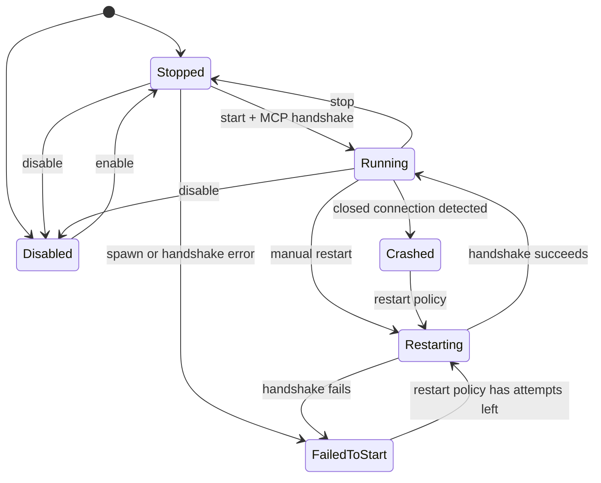

# Dynamic MCP server management

`McpServerManager` owns a runtime registry of local MCP server child processes.
Use it when integrations change by workspace, tenant, administrator selection,
or deployment configuration.

It is not the connection pool for remote HTTP services. Build those with
`McpHttpClientBuilder` and keep their lifecycle in the application that owns the
remote configuration.

## Lifecycle



The monitor checks whether the MCP connection has closed. It retries crashed or
failed starts only while the configured `RestartPolicy` has attempts remaining.

## Configuration

```json
{
  "mcpServers": {
    "workspace-tools": {
      "command": "/opt/company/bin/workspace-mcp",
      "args": ["--stdio", "--root", "/srv/workspace"],
      "env": {
        "RUST_LOG": "info"
      },
      "disabled": false,
      "autoApprove": [],
      "restartPolicy": {
        "initialDelayMs": 500,
        "maxDelayMs": 15000,
        "backoffMultiplier": 2.0,
        "maxRestartAttempts": 5
      }
    }
  }
}
```

Server IDs accept ASCII letters, numbers, hyphens, and underscores. Use a
stable ID because it becomes part of a collision-prefixed tool name.

`autoApprove` is read and written for configuration compatibility. The manager
does not grant approval from this field.

## Start and aggregate tools

```rust
use adk_tool::mcp::manager::McpServerManager;
use std::sync::Arc;
use std::time::Duration;

let manager = Arc::new(McpServerManager::from_json_file("mcp.json")?
    .with_name("workspace_mcp")
    .with_health_check_interval(Duration::from_secs(15))
    .with_grace_period(Duration::from_secs(2)));

let outcomes = manager.start_all().await;
for (server_id, outcome) in outcomes {
    if let Err(error) = outcome {
        eprintln!("{server_id}: {error}");
    }
}

manager.start_monitoring();

let agent = LlmAgentBuilder::new("operator")
    .model(model)
    .toolset(manager.clone())
    .build()?;
```

Registry mutations are serialized while a child completes its MCP handshake.
`start_all` returns an independent result for every enabled server, but startup
is not currently a parallel-handshake path.

## Change the registry at runtime

```rust
manager.add_server("billing".into(), billing_config).await?;
manager.start_server("billing").await?;

manager.update_server("billing", replacement_config).await?;
manager.disable_server("billing").await?;
manager.enable_server("billing").await?;

let snapshot = manager.all_configs().await;
manager.save_json_file("mcp.json").await?;

manager.remove_server("billing").await?;
manager.shutdown().await?;
```

Updating a running server stops it and starts the replacement. If the
replacement fails, the manager restores and restarts the previous definition
before returning the replacement error.

`save_json_file` writes a temporary file in the destination directory and then
renames it over the destination.

## Resources, prompts, and notifications

A managed server can publish resources and prompts in addition to tools. The
manager exposes each server's resource and prompt surface by server ID, and
delivers `resources/updated` / `resources/list_changed` notifications to a
handler shared across every managed connection.

Register the handler once; it is retained across manual and automatic restarts:

```rust
use adk_tool::{ResourceNotificationHandler, mcp::manager::McpServerManager};
use std::sync::Arc;

struct ReloadOnChange;

#[async_trait::async_trait]
impl ResourceNotificationHandler for ReloadOnChange {
    async fn handle_resource_updated(
        &self,
        uri: &str,
    ) -> Result<(), Box<dyn std::error::Error + Send + Sync>> {
        tracing::info!(%uri, "resource changed; re-read it to refresh cached state");
        Ok(())
    }

    async fn handle_resource_list_changed(
        &self,
    ) -> Result<(), Box<dyn std::error::Error + Send + Sync>> {
        Ok(())
    }
}

let manager = Arc::new(
    McpServerManager::from_json_file("mcp.json")?
        .with_resource_notification_handler(Arc::new(ReloadOnChange)),
);
manager.start_server("workspace-tools").await?;
```

Then read and subscribe per server:

```rust
let resources = manager.list_server_resources("workspace-tools").await?;
let templates = manager.list_server_resource_templates("workspace-tools").await?;
let contents = manager.read_server_resource("workspace-tools", "config://policy").await?;

let prompts = manager.list_server_prompts("workspace-tools").await?;
let review = manager
    .get_server_prompt("workspace-tools", "review_pr", None)
    .await?;

// Subscribe / unsubscribe. Subscriptions are restored automatically if the
// managed process reconnects.
manager.subscribe_server_resource("workspace-tools", "config://policy").await?;
manager.unsubscribe_server_resource("workspace-tools", "config://policy").await?;
```

Each `*_server_*` method targets one running server by ID and returns
`AdkError::Tool` if the server is unknown or not currently running.

For a single connection (rather than the manager registry), the same surface is
available directly on `McpToolset` via `McpToolset::with_handlers`,
`list_resources`, `read_resource`, `list_prompts`, `get_prompt`, and
`subscribe_resource`. See the runnable agentic example:

```bash
cargo run --manifest-path examples/mcp_resources/Cargo.toml --bin resources-client
```

## Tool-name collisions

If two running servers publish `search`, the aggregated names become:

```text
crm__search
knowledge__search
```

A tool name published by only one server is unchanged.

## Shutdown behavior

Stopping a server cancels its MCP session, waits up to the configured grace
period for the connection to close, then drops the transport. The child process
is owned by the `TokioChildProcess` transport rather than a separately retained
process handle.

Call `shutdown()` before dropping the manager. Dropping a manager with running
servers emits a warning because `Drop` cannot await asynchronous cleanup.

## Verified example

```bash
cargo run --manifest-path examples/mcp_manager/Cargo.toml
```

The example starts a real Rust MCP child process, discovers and calls a tool,
adds and enables a second server, updates it, saves the registry, disables and
removes it, and closes all sessions. It requires no model, API key, package
download, or network access.
