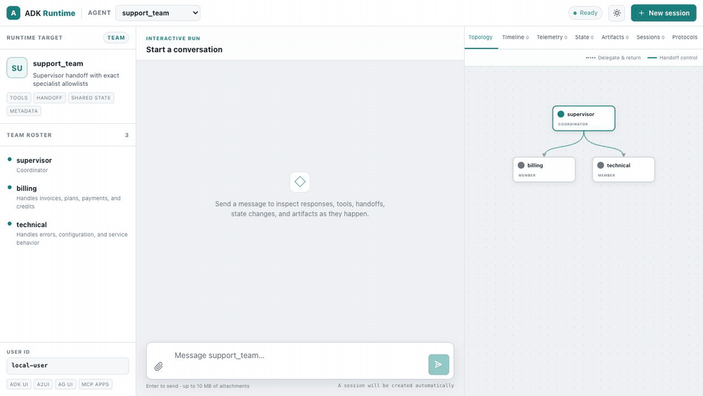

# Quickstart

Create your first AI agent in under 5 minutes.

## Prerequisites

- Rust 1.95.0 or later (`rustup update stable`)
- An OpenAI API key for this walkthrough

## Step 1: Scaffold an OpenAI server

```bash
cargo install cargo-adk
cargo adk new quickstart_agent --template api --provider openai
cd quickstart_agent
```

This creates a complete Rust project with an OpenAI agent, in-memory sessions,
the ADK HTTP runtime, streaming endpoints, and the embedded development UI.

### Other Templates

```bash
# Agent with custom tools using #[tool] macro
cargo adk new my_agent --template tools

# RAG agent with Gemini embeddings and in-memory vector search
cargo adk new my_agent --template rag

# REST API server with the embedded runtime UI
cargo adk new my_agent --template api

# OpenAI GPT-5-mini agent
cargo adk new my_agent --template openai

# A2A protocol agent with builder API
cargo adk new my_agent --template a2a

# Use any provider with any template
cargo adk new my_agent --template tools --provider anthropic

# Add optional addons to any template
cargo adk new my_agent --template tools --addon docker --addon ci
```

| Template | What you get |
|----------|-------------|
| `basic` | Gemini agent with interactive console (default) |
| `tools` | Agent with `#[tool]` macro custom tools + schemars schema generation |
| `rag` | RAG pipeline — Gemini embeddings, in-memory vector store, document ingestion |
| `api` | Axum REST server, health check, streaming endpoints, and embedded runtime UI |
| `openai` | OpenAI GPT-5-mini agent with console |
| `a2a` | A2A protocol agent with `A2aServer` builder and agent card |
| `graph` | Graph-based workflow with checkpoints and durable resume |
| `realtime` | Real-time voice/audio streaming agent |

> **Tip:** Use the `--addon` flag to compose templates with optional addons like `docker`, `ci`, `telemetry`, and more. See the [Composable Templates](development/composable-templates.md) page for the full list of 9 addons and 5 enterprise patterns.

## Step 2: Add your API key

```bash
cp .env.example .env
# Open .env and replace the OPENAI_API_KEY placeholder.
```

The generated `.gitignore` excludes `.env`. Keep the key local and never commit
it.

## Step 3: Run the agent

```bash
cargo run
```

Open [http://127.0.0.1:8080/ui/](http://127.0.0.1:8080/ui/). The agent appears
automatically; you do not need to create a session or call an endpoint first.

## Step 4: Test it in the runtime UI

Enter a prompt such as:

```
Explain what this agent can do in three concise Markdown bullets.
```

The response streams into the conversation. Use the inspector on the right to
review the execution topology, ordered event timeline, state changes, artifacts,
sessions, protocol capabilities, and telemetry without leaving the page.



This recording uses the portable-team showcase so the animated handoff is easy
to see. Your scaffolded agent uses the same runtime UI with a one-node topology.

Verify the HTTP runtime separately if you want a smoke test:

```bash
curl -fsS http://127.0.0.1:8080/api/health
```

You now have one executable that runs the agent, manages sessions, streams
events, and serves its own test interface. No separate frontend install is
required.

### Prefer a terminal-only agent?

Use the OpenAI console template instead:

```bash
cargo adk new quickstart_console --template openai
cd quickstart_console
cp .env.example .env   # replace the OPENAI_API_KEY placeholder
cargo run
```

---

## Zero-Config Alternative — `adk::run()`

If you just want to run a quick agent without scaffolding, use the one-liner:

```rust
use adk_rust::run;

#[tokio::main]
async fn main() -> anyhow::Result<()> {
    dotenvy::dotenv().ok();
    // Minimal default: set GOOGLE_API_KEY. Add provider features for OpenAI/Anthropic.
    let response = run("You are a helpful assistant.", "Explain Rust in one sentence.").await?;
    println!("{response}");
    Ok(())
}
```

This handles provider detection for compiled providers, session creation, agent building, and execution in a single call. Great for scripts, prototypes, and quick experiments.

---

## Understanding the generated code

The API scaffold's `src/main.rs` builds an ordinary `LlmAgent`, then mounts it in
the standard server. The important wiring is:

```rust
use adk_rust::prelude::*;
use adk_rust::server::{ServerConfig, create_app};
use adk_rust::session::InMemorySessionService;
use std::sync::Arc;

#[tokio::main]
async fn main() -> anyhow::Result<()> {
    dotenvy::dotenv().ok();
    let api_key = std::env::var("OPENAI_API_KEY")?;

    let model = adk_rust::model::openai::OpenAIClient::new(
        adk_rust::model::openai::OpenAIConfig::new(&api_key, "gpt-5.6-terra"),
    )?;

    let agent: Arc<dyn Agent> = Arc::new(
        LlmAgentBuilder::new("quickstart_agent")
            .description("REST API agent")
            .instruction("You are a helpful assistant accessible via REST API.")
            .model(Arc::new(model))
            .build()?,
    );

    let config = ServerConfig::new(
        Arc::new(adk_rust::SingleAgentLoader::new(agent)),
        Arc::new(InMemorySessionService::new()),
    );
    let app = create_app(config);

    let listener = tokio::net::TcpListener::bind("127.0.0.1:8080").await?;
    axum::serve(listener, app).await?;
    Ok(())
}
```

| Part | What it does |
|------|-------------|
| `OpenAIClient` | Creates the model client from `OPENAI_API_KEY` |
| `LlmAgentBuilder` | Builder pattern: name, description, instruction (system prompt), model, tools |
| `InMemorySessionService` | Stores local development sessions for the runner and UI |
| `create_app` | Mounts the REST/SSE API and embedded runtime UI in one Axum router |

---

## Adding Custom Tools

The fastest way to add tools is the `#[tool]` macro. Add `adk-tool` to your dependencies:

```toml
[dependencies]
adk-tool = "2.1.0"
schemars = "1"
serde = { version = "1", features = ["derive"] }
```

Then define a tool — the doc comment becomes the description, the args struct becomes the JSON schema:

```rust
use adk_tool::{tool, AdkError};
use schemars::JsonSchema;
use serde::Deserialize;
use serde_json::{json, Value};

#[derive(Deserialize, JsonSchema)]
struct WeatherArgs {
    /// The city to look up
    city: String,
}

/// Get the current weather for a city.
#[tool]
async fn get_weather(args: WeatherArgs) -> std::result::Result<Value, AdkError> {
    Ok(json!({ "temp": 22, "city": args.city, "condition": "sunny" }))
}
```

The macro generates a `GetWeather` struct implementing `Tool`. Add it to your agent:

```rust
let agent = LlmAgentBuilder::new("weather_agent")
    .instruction("Use the get_weather tool for weather questions.")
    .model(Arc::new(model))
    .tool(Arc::new(GetWeather))  // Generated by #[tool]
    .build()?;
```

> **Tip:** Or scaffold a project with tools already set up: `cargo adk new my-agent --template tools`

### Built-in Tools

ADK also includes ready-to-use tools:

```rust
// Google Search (handled server-side by Gemini)
.tool(Arc::new(GoogleSearchTool::new()))

// Exit a LoopAgent
.tool(Arc::new(ExitLoopTool::new()))
```

---

## Running as a Web Server

Scaffold a server project when you want HTTP serving:

```bash
cargo adk new my-api --template api --provider openai
cd my-api
cp .env.example .env
cargo run
```

Open `http://127.0.0.1:8080/ui/`. The default basic template uses the
lightweight console launcher instead.

---

## Using Other Models

Enable providers via feature flags. The default build stays Gemini-only for fast installs, so add only the provider you need:

```toml
[dependencies]
adk-rust = { version = "2.1.0", features = ["openai"] }
```

Or scaffold with a provider: `cargo adk new my-agent --provider openai`

### OpenAI

```rust
let api_key = std::env::var("OPENAI_API_KEY")?;
let model = OpenAIClient::new(OpenAIConfig::new(api_key, "gpt-5.6-terra"))?;
```

### Anthropic

```rust
let api_key = std::env::var("ANTHROPIC_API_KEY")?;
let model = AnthropicClient::new(AnthropicConfig::new(api_key, "claude-sonnet-5"))?;
```

### DeepSeek

```rust
let api_key = std::env::var("DEEPSEEK_API_KEY")?;
let model = DeepSeekClient::chat(api_key)?;         // standard
// let model = DeepSeekClient::reasoner(api_key)?;   // chain-of-thought
```

### Groq

```rust
let api_key = std::env::var("GROQ_API_KEY")?;
let model = GroqClient::new(GroqConfig::gpt_oss_120b(api_key))?;
```

### Ollama (Local)

```rust
// Requires: ollama serve && ollama pull llama3.2
let model = OllamaModel::new(OllamaConfig::new("llama3.2"))?;
```

### Supported Models

| Provider | Model Examples | Feature Flag |
|----------|---------------|--------------|
| Gemini | `gemini-3.7-flash`, `gemini-3.6-flash`, `gemini-3.1-pro-preview` | (default) |
| OpenAI | `gpt-5.6-terra`, `gpt-5.6-sol`, `gpt-5.6-luna` | `openai` |
| Anthropic | `claude-sonnet-5`, `claude-opus-5`, `claude-fable-5` | `anthropic` |
| DeepSeek | `deepseek-v4-flash`, `deepseek-v4-pro` | `deepseek` |
| Groq | `openai/gpt-oss-120b`, `openai/gpt-oss-20b` | `groq` |
| Ollama | `qwen3.6:35b-a3b`, `qwen3.5`, `llama3.2:3b` | `ollama` |

---

## Next Steps

- [LlmAgent Configuration](agents/llm-agent.md) — all configuration options
- [Function Tools](tools/function-tools.md) — create custom tools with `#[tool]`
- [Workflow Agents](agents/workflow-agents.md) — sequential, parallel, loop pipelines
- [Sessions](sessions/sessions.md) — manage conversation state
- [Callbacks](callbacks/callbacks.md) — customize agent behavior

---

**Previous**: [Introduction](introduction.md) | **Next**: [LlmAgent](agents/llm-agent.md)
