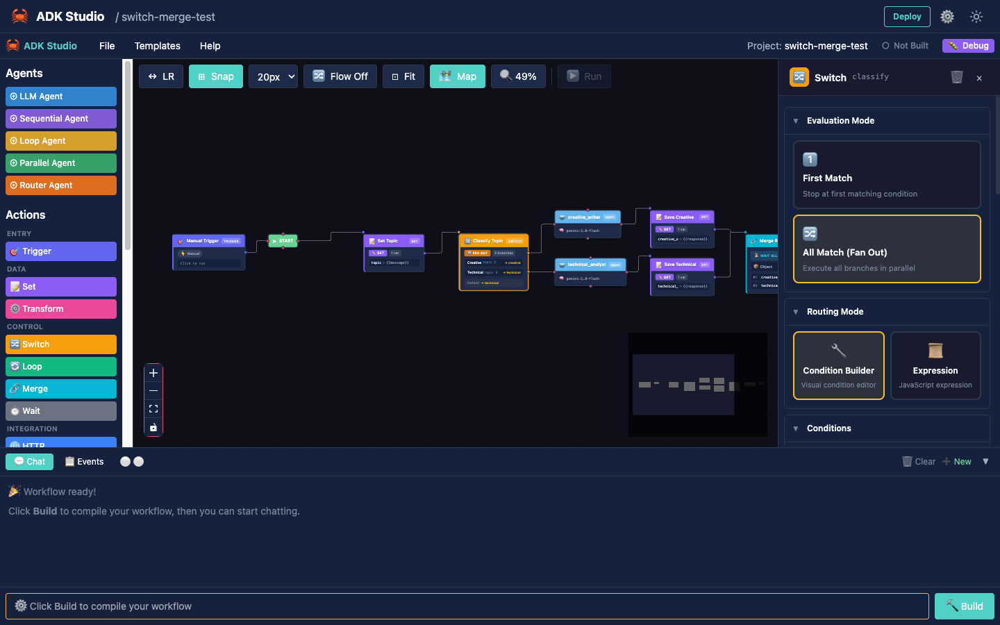

# Action Nodes

Non-LLM programmatic nodes for deterministic workflow operations. Action nodes complement LLM agents by handling data transformation, API integrations, control flow, and automation logic.

## Overview

Action nodes are visually distinct from LLM agent nodes — they use unique colors and icons to make workflows easy to scan. Each node type handles a specific category of operation, from HTTP requests to database queries to conditional branching.

All action nodes share a set of standard properties for error handling, tracing, execution control, and I/O mapping. They support `{{variable}}` interpolation in string fields and automatically receive predecessor node outputs.


## Available Nodes

| Node | Icon | Color | Description |
|------|------|-------|-------------|
| **Trigger** | 🎯 | Indigo | Workflow entry point (manual, webhook, schedule, event) |
| **HTTP** | 🌐 | Blue | Make HTTP requests to external APIs |
| **Set** | 📝 | Purple | Define and manipulate workflow state variables |
| **Transform** | ⚙️ | Pink | Transform data using expressions or built-in operations |
| **Switch** | 🔀 | Amber | Conditional branching based on conditions |
| **Loop** | 🔄 | Emerald | Iterate over arrays or repeat operations |
| **Merge** | 🔗 | Cyan | Combine multiple branches back into single flow |
| **Wait** | ⏱️ | Gray | Pause workflow for duration or condition |
| **Code** | 💻 | Red | Execute custom JavaScript in sandboxed runtime |
| **Database** | 🗄️ | Teal | Database operations (PostgreSQL, MySQL, SQLite, MongoDB, Redis) |
| **Email** | 📧 | Rose | Send emails via SMTP or monitor via IMAP |
| **Notification** | 🔔 | Orange | Send to Slack, Discord, Teams, or webhooks |
| **RSS** | 📡 | Lime | Monitor RSS/Atom feeds for new entries |
| **File** | 📁 | Sky | File operations on local or cloud storage (S3, GCS, Azure) |

---

## Standard Properties

Every action node inherits these shared properties:

### Identity

| Property | Type | Description |
|----------|------|-------------|
| `id` | string | Unique identifier |
| `name` | string | Display name |
| `description` | string? | Optional tooltip description |

### Error Handling

| Mode | Behavior |
|------|----------|
| `stop` | Halt workflow on error (default) |
| `continue` | Log error and proceed to next node |
| `retry` | Retry with configurable count (1-10) and delay (ms) |
| `fallback` | Use a fallback value on error |

### Tracing

| Property | Type | Description |
|----------|------|-------------|
| `enabled` | boolean | Enable detailed execution traces |
| `logLevel` | `none` \| `error` \| `info` \| `debug` | Log verbosity |

### Execution Control

| Property | Type | Description |
|----------|------|-------------|
| `timeout` | number | Timeout in ms (default: 30000) |
| `condition` | string? | Skip node if expression evaluates to false |

### Input/Output Mapping

| Property | Type | Description |
|----------|------|-------------|
| `inputMapping` | Record<string, string>? | Map state fields to node inputs |
| `outputKey` | string | Key where result is stored in workflow state |

---

## Node Reference

### Trigger Node 🎯

Workflow entry point. Every workflow starts with a Trigger node. See the dedicated [Triggers Guide](triggers.md) for full details.

| Trigger Type | Description |
|-------------|-------------|
| Manual | User-initiated via chat input |
| Webhook | HTTP endpoint (POST/GET) with optional auth |
| Schedule | Cron-based timing with timezone support |
| Event | External system events with JSONPath filtering |

### HTTP Node 🌐

Makes HTTP requests to external APIs with full auth, header, body, and response handling.

**Configuration:**

| Property | Type | Description |
|----------|------|-------------|
| `method` | GET, POST, PUT, PATCH, DELETE | HTTP method |
| `url` | string | URL with `{{variable}}` interpolation |
| `auth` | object | Authentication (none, bearer, basic, api_key) |
| `headers` | Record<string, string> | Request headers |
| `body` | object | Body (none, json, form, raw) |
| `response` | object | Response handling (json, text, binary) with optional JSONPath extraction |
| `rateLimit` | object? | Rate limiting (requests per window) |

**Example:**

```json
{
  "type": "http",
  "name": "Fetch User Data",
  "method": "GET",
  "url": "https://api.example.com/users/{{userId}}",
  "auth": {
    "type": "bearer",
    "bearer": { "token": "{{API_TOKEN}}" }
  },
  "headers": { "Accept": "application/json" },
  "body": { "type": "none" },
  "response": { "type": "json", "jsonPath": "$.data" },
  "errorHandling": { "mode": "retry", "retryCount": 3, "retryDelay": 1000 },
  "mapping": { "outputKey": "userData" }
}
```

### Set Node 📝

Defines and manipulates workflow state variables. Supports literal values, expressions, and secrets.

**Configuration:**

| Property | Type | Description |
|----------|------|-------------|
| `mode` | set, merge, delete | Variable operation |
| `variables` | Variable[] | List of variables to set |
| `envVars` | object? | Load from .env file with optional prefix filter |

**Variable types:** `string`, `number`, `boolean`, `json`, `expression`

Variables marked `isSecret: true` are masked in logs and UI.

### Transform Node ⚙️

Transforms data using expressions or built-in operations.

**Transform types:**

| Type | Description |
|------|-------------|
| `jsonpath` | JSONPath expression |
| `jmespath` | JMESPath expression |
| `template` | String template with interpolation |
| `javascript` | JavaScript expression |

**Built-in operations:** `pick`, `omit`, `rename`, `flatten`, `sort`, `unique`

**Type coercion targets:** `string`, `number`, `boolean`, `array`, `object`

### Switch Node 🔀

Conditional branching with multiple output ports. Each condition maps to a separate output port on the node.



**Configuration:**

| Property | Type | Description |
|----------|------|-------------|
| `evaluationMode` | `first_match` \| `all_match` | Stop at first match or evaluate all |
| `conditions` | SwitchCondition[] | List of conditions with output ports |
| `defaultBranch` | string? | Output port when no conditions match |

**Condition operators:** `eq`, `neq`, `gt`, `lt`, `gte`, `lte`, `contains`, `startsWith`, `endsWith`, `matches`, `in`, `empty`, `exists`

**Example:**

```json
{
  "type": "switch",
  "evaluationMode": "first_match",
  "conditions": [
    { "id": "ok", "name": "Success", "field": "status", "operator": "eq", "value": "success", "outputPort": "success" },
    { "id": "err", "name": "Error", "field": "status", "operator": "eq", "value": "error", "outputPort": "error" }
  ],
  "defaultBranch": "unknown"
}
```

### Loop Node 🔄

Iterates over arrays, repeats a fixed number of times, or loops while a condition holds.

**Loop types:**

| Type | Description |
|------|-------------|
| `forEach` | Iterate over an array from state |
| `while` | Loop while condition is true |
| `times` | Repeat N times |

**Parallel execution:** Enable `parallel.enabled` with optional `batchSize` and `delayBetween` for concurrent iteration.

**Result aggregation:** When `results.collect` is true, iteration results are gathered into an array under `results.aggregationKey`.

### Merge Node 🔗

Combines multiple parallel branches back into a single flow. Has multiple input ports.

**Merge modes:**

| Mode | Behavior |
|------|----------|
| `wait_all` | Wait for all incoming branches |
| `wait_any` | Continue when first branch completes |
| `wait_n` | Continue after N branches complete |

**Combine strategies:** `array`, `object`, `first`, `last`

Optional timeout with `continue` or `error` behavior.

### Wait Node ⏱️

Pauses workflow execution.

**Wait types:**

| Type | Description |
|------|-------------|
| `fixed` | Wait for a fixed duration (ms, s, m, h) |
| `until` | Wait until a specific timestamp |
| `webhook` | Wait for an incoming webhook |
| `condition` | Poll a condition at intervals |

### Code Node 💻

Executes custom JavaScript in a sandboxed `boa_engine` runtime. Graph state is injected as the global `input` object.

**Configuration:**

| Property | Type | Description |
|----------|------|-------------|
| `language` | javascript, typescript | Code language |
| `code` | string | Code to execute |
| `sandbox` | object | Security limits (network, filesystem, memory, time) |

**Sandbox defaults:**

| Limit | Default |
|-------|---------|
| Network access | false |
| Filesystem access | false |
| Memory limit | 128 MB |
| Time limit | 5000 ms |

### Database Node 🗄️

Performs database operations with connection pooling and parameterized queries.

**Supported databases:**

| Database | Driver | Features |
|----------|--------|----------|
| PostgreSQL | `sqlx` (postgres) | Async pool, parameterized queries, row-to-JSON |
| MySQL | `sqlx` (mysql) | Async pool, parameterized queries, row-to-JSON |
| SQLite | `sqlx` (sqlite) | Async pool, parameterized queries, row-to-JSON |
| MongoDB | `mongodb` | Native BSON, find/insert/update/delete |
| Redis | `redis` | GET, SET, DEL, HGET, HSET, LPUSH, LRANGE |

Connection strings are treated as secrets and masked in logs.

### Email Node 📧

Send emails via SMTP or monitor incoming emails via IMAP.

**Send mode (SMTP):**
- TLS/SSL support
- Authentication
- To/CC/BCC recipients
- HTML or plain text body
- `{{variable}}` interpolation in subject and body
- File attachments from state

**Monitor mode (IMAP):**
- Folder selection (default: INBOX)
- Filters: sender, subject, date range, unread only
- Mark as read after processing

### Notification Node 🔔

Sends notifications to messaging platforms.

**Channels:** Slack, Discord, Microsoft Teams, custom webhook

**Message formats:** plain text, markdown, platform-specific blocks (Block Kit, Embeds, Adaptive Cards)

### RSS Node 📡

Monitors RSS/Atom feeds for new entries.

- Configurable poll interval
- Keyword, author, category, and date filters
- Seen-item tracking to avoid duplicates
- Optional full content or summary only

### File Node 📁

File operations on local or cloud storage.

**Operations:** read, write, delete, list

**Cloud providers:** Amazon S3, Google Cloud Storage, Azure Blob Storage

**File formats:** JSON, CSV, XML, text, binary (with CSV parsing options for delimiter, headers, quoting)

---

## Variable Interpolation

All string fields in action nodes support `{{variable}}` syntax for dynamic values:

```
https://api.example.com/users/{{userId}}
Bearer {{API_TOKEN}}
Hello {{user.name}}, your order {{orderId}} is ready.
```

Variables are resolved from the workflow state at execution time. Dot notation (`user.name`) accesses nested values.

## Multi-Port Nodes

Two node types have dynamic port counts:

- **Switch** — one output port per condition, plus an optional default port
- **Merge** — multiple input ports, one per incoming branch

These ports are visually represented on the node and connect to different downstream/upstream nodes.

---

## Code Generation

Action nodes compile to production Rust code alongside LLM agents. Dependencies are auto-detected and added to the generated `Cargo.toml`.

| Node | Crate | What It Generates |
|------|-------|-------------------|
| HTTP | `reqwest` | Async HTTP requests with auth, headers, body, JSONPath extraction |
| Database | `sqlx` / `mongodb` / `redis` | Connection pools, parameterized queries, Redis commands |
| Email | `lettre` / `imap` | SMTP send with TLS; IMAP monitoring with search filters |
| Code | `boa_engine` | Embedded JavaScript execution with graph state as `input` object |
| Set | native | Variable assignment (literal, expression, secret) |
| Transform | native | Map, filter, sort, reduce, flatten, group, pick, merge, template |
| Merge | native | Branch combination (waitAll, waitAny, append) |

All generated code uses `adk-graph` `FunctionNode` closures with `GraphError::NodeExecutionFailed` for error handling.

**Example generated code (HTTP node):**

```rust
let http_node = FunctionNode::new("fetch_data", |ctx| async move {
    let client = reqwest::Client::new();
    let resp = client.get("https://api.example.com/data")
        .bearer_auth(&ctx.get("API_TOKEN").unwrap_or_default())
        .send().await
        .map_err(|e| GraphError::NodeExecutionFailed {
            node: "fetch_data".into(),
            message: e.to_string(),
        })?;
    let body: serde_json::Value = resp.json().await?;
    Ok(NodeOutput::new().with_update("apiData", body))
});
```

**Example generated code (Code node):**

```rust
let code_node = FunctionNode::new("process", |ctx| async move {
    let mut js_ctx = boa_engine::Context::default();
    // Graph state injected as global `input` object
    // User code executed in thread-isolated sandbox
    Ok(NodeOutput::new().with_update("result", output))
});
```

---

**Previous**: [← Studio](studio.md) | **Next**: [Triggers →](triggers.md)
