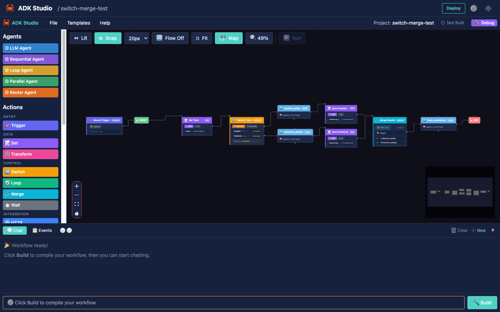
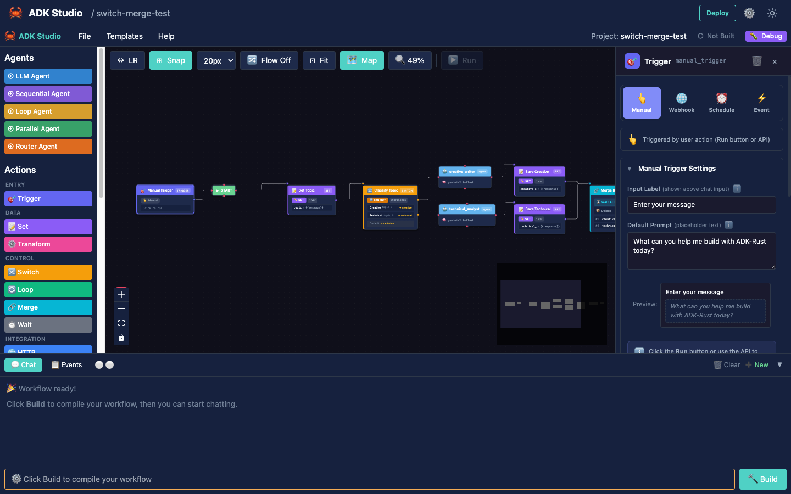

# ADK Studio

Visual development environment for building AI agents with drag-and-drop.

## Overview

ADK Studio provides a low-code interface for designing, testing, and deploying AI agents built with ADK-Rust. Create complex multi-agent workflows visually, then compile them to production Rust code.


## Installation

```bash
# Install from crates.io (self-contained binary)
cargo install adk-studio

# Or build from source
cargo build --release -p adk-studio
```

## Quick Start

```bash
# Start the studio server
adk-studio

# Open in browser
open http://localhost:3000
```

### CLI Options

| Option | Description | Default |
|--------|-------------|---------|
| `--port`, `-p` | Server port | 3000 |
| `--host`, `-h` | Bind address | 127.0.0.1 |
| `--dir`, `-d` | Projects directory | `~/.local/share/adk-studio/projects` |
| `--static`, `-s` | Override static files directory | (embedded) |

```bash
# Bind to all interfaces for remote access
adk-studio --host 0.0.0.0 --port 8080

# Custom projects directory
adk-studio --dir ./my-projects
```

---

## Step-by-Step Tutorial

Follow this walkthrough to build your first AI agent in ADK Studio.

### Step 1: Create a New Project

Click the **+ New Project** button in the top-right corner.


Enter a name for your project (e.g., "Demo Project") and click **Create**.

### Step 2: Add an Agent to the Canvas

The left sidebar contains the **Agent Palette** with available agent types:
- **LLM Agent** - Single AI agent powered by a language model
- **Sequential** - Execute sub-agents in order
- **Parallel** - Execute sub-agents concurrently
- **Loop** - Iterate until exit condition
- **Router** - Route to sub-agents based on input

Below the agent palette, the **Action Node Palette** provides 14 non-LLM programmatic nodes for deterministic operations (HTTP requests, database queries, branching, loops, etc.). See the [Action Nodes Guide](action-nodes.md) for details.

Click on **LLM Agent** to add it to the canvas.


### Step 3: Configure the Agent

When you select an agent, the **Properties Panel** appears on the right side. Here you can configure:

- **Name** - Identifier for the agent
- **Model** - LLM provider and model (Gemini, OpenAI, etc.)
- **Instructions** - System prompt for the agent


### Step 4: Add Tools to the Agent

Scroll down in the left sidebar to find the **Tool Palette**:
- **Function** - Custom Rust function with code editor
- **MCP** - Model Context Protocol server
- **Browser** - 46 WebDriver automation actions
- **Google Search** - Grounded web search
- **Load Artifact** - Load files into context

Click on a tool to add it to your agent.


### Step 5: Build and Test

Click **Build Project** to compile your agent. Once built, use the **Chat Panel** at the bottom to test your agent with real conversations.


The chat supports:
- Live SSE streaming responses
- Agent execution animations
- Event trace panel for debugging

### Step 6: View Generated Code

Click **View Code** to see the production-ready Rust code generated from your visual design.


You can copy this code or use **Compile** to generate a complete Rust project.

---

## Features

### Agent Types

| Agent | Description |
|-------|-------------|
| **LLM Agent** | Single agent powered by an LLM |
| **Sequential** | Execute sub-agents in order |
| **Parallel** | Execute sub-agents concurrently |
| **Loop** | Iterate until exit condition |
| **Router** | Route to sub-agents based on input |

### Action Nodes

14 non-LLM programmatic nodes for deterministic workflow operations. See the [Action Nodes Guide](action-nodes.md) for full details.



| Node | Description |
|------|-------------|
| **Trigger** 🎯 | Workflow entry point (manual, webhook, schedule, event) |
| **HTTP** 🌐 | Make HTTP requests to external APIs |
| **Set** 📝 | Define and manipulate workflow state variables |
| **Transform** ⚙️ | Transform data with expressions or built-in operations |
| **Switch** 🔀 | Conditional branching based on conditions |
| **Loop** 🔄 | Iterate over arrays or repeat operations |
| **Merge** 🔗 | Combine multiple branches back into single flow |
| **Wait** ⏱️ | Pause workflow for duration or condition |
| **Code** 💻 | Execute custom JavaScript in sandboxed runtime |
| **Database** 🗄️ | Database operations (PostgreSQL, MySQL, SQLite, MongoDB, Redis) |
| **Email** 📧 | Send via SMTP or monitor via IMAP |
| **Notification** 🔔 | Send to Slack, Discord, Teams, or webhooks |
| **RSS** 📡 | Monitor RSS/Atom feeds |
| **File** 📁 | File operations on local or cloud storage |

### Triggers

Workflows start with a Trigger node. See the [Triggers Guide](triggers.md) for full details.



| Trigger | Description |
|---------|-------------|
| **Manual** | User-initiated via chat input |
| **Webhook** | HTTP endpoint with optional auth |
| **Schedule** | Cron-based timing with timezone |
| **Event** | External system events with JSONPath filtering |

### Tool Types

| Tool | Description |
|------|-------------|
| **Function** | Custom Rust function with code editor |
| **MCP** | Model Context Protocol server |
| **Browser** | 46 WebDriver automation actions |
| **Google Search** | Grounded web search |
| **Load Artifact** | Load files into context |

### Real-Time Chat

Test agents directly in the studio:

- Live SSE streaming responses
- Agent execution animations
- Event trace panel for debugging
- Session memory persistence

### Code Generation

Convert visual designs to production code:

1. **View Code** - Preview generated Rust with syntax highlighting
2. **Compile** - Generate complete Rust project
3. **Build** - Compile to executable with real-time output
4. **Run** - Execute the built agent

The Build button appears automatically when your workflow has changed since the last build.

### Action Node Code Generation

Action nodes compile to production Rust code alongside LLM agents. Dependencies are auto-detected and added to the generated `Cargo.toml`.

| Node | Crate | What It Generates |
|------|-------|-------------------|
| **HTTP** | `reqwest` | Async HTTP requests with auth, headers, body, JSONPath extraction |
| **Database** | `sqlx` / `mongodb` / `redis` | Connection pools, parameterized queries, Redis commands |
| **Email** | `lettre` / `imap` | SMTP send with TLS/auth/CC/BCC; IMAP monitoring with search filters |
| **Code** | `boa_engine` | Embedded JavaScript execution with graph state as `input` object |
| **Set** | native | Variable assignment (literal, expression, secret) |
| **Transform** | native | Map, filter, sort, reduce, flatten, group, pick, merge, template |
| **Merge** | native | Branch combination (waitAll, waitAny, append) |

All action nodes support `{{variable}}` interpolation and receive predecessor node outputs automatically.

#### Supported Databases

| Database | Driver | Features |
|----------|--------|----------|
| PostgreSQL | `sqlx` (postgres) | Async pool, parameterized queries, row-to-JSON mapping |
| MySQL | `sqlx` (mysql) | Async pool, parameterized queries, row-to-JSON mapping |
| SQLite | `sqlx` (sqlite) | Async pool, parameterized queries, row-to-JSON mapping |
| MongoDB | `mongodb` | Native BSON driver, find/insert/update/delete operations |
| Redis | `redis` | GET, SET, DEL, HGET, HSET, LPUSH, LRANGE commands |

## Architecture

```
┌─────────────────────────────────────────────────────────────┐
│                     ADK Studio UI                           │
│  ┌─────────────┐  ┌─────────────┐  ┌─────────────────────┐ │
│  │   Palette   │  │   Canvas    │  │   Properties        │ │
│  │  - Agents   │  │  ReactFlow  │  │  - Name             │ │
│  │  - Tools    │  │  Workflow   │  │  - Model            │ │
│  │             │  │  Designer   │  │  - Instructions     │ │
│  └─────────────┘  └─────────────┘  └─────────────────────┘ │
└─────────────────────────────────────────────────────────────┘
                              │
                              ▼ HTTP/SSE
┌─────────────────────────────────────────────────────────────┐
│                    ADK Studio Server                        │
│  ┌─────────────┐  ┌─────────────┐  ┌─────────────────────┐ │
│  │   Routes    │  │   Codegen   │  │   Storage           │ │
│  │  /api/*     │  │  Rust code  │  │  Projects           │ │
│  │  /chat      │  │  generation │  │  File-based         │ │
│  └─────────────┘  └─────────────┘  └─────────────────────┘ │
└─────────────────────────────────────────────────────────────┘
                              │
                              ▼ Build
┌─────────────────────────────────────────────────────────────┐
│                   Generated Rust Project                    │
│  ┌─────────────────────────────────────────────────────┐   │
│  │  Cargo.toml + src/main.rs                           │   │
│  │  Uses: adk-rust, adk-agent, adk-model, etc.        │   │
│  └─────────────────────────────────────────────────────┘   │
└─────────────────────────────────────────────────────────────┘
```

## API Endpoints

### Projects

| Endpoint | Method | Description |
|----------|--------|-------------|
| `/api/projects` | GET | List all projects |
| `/api/projects` | POST | Create new project |
| `/api/projects/:id` | GET | Get project details |
| `/api/projects/:id` | PUT | Update project |
| `/api/projects/:id` | DELETE | Delete project |

### Code Generation

| Endpoint | Method | Description |
|----------|--------|-------------|
| `/api/projects/:id/codegen` | POST | Generate Rust code |
| `/api/projects/:id/build` | POST | Compile project |
| `/api/projects/:id/run` | POST | Run built executable |

### Chat

| Endpoint | Method | Description |
|----------|--------|-------------|
| `/api/chat` | POST | Send message (SSE stream) |

### Triggers

| Endpoint | Method | Description |
|----------|--------|-------------|
| `/api/projects/:id/webhook/*path` | POST, GET | Webhook trigger (async) |
| `/api/projects/:id/webhook-exec/*path` | POST | Webhook trigger (sync, waits for result) |
| `/api/projects/:id/webhook-events` | GET | SSE stream for webhook notifications |
| `/api/projects/:id/events` | POST | Event trigger |
| `/api/sessions/:id/resume` | POST | Resume interrupted workflow (HITL) |

## Environment Variables

| Variable | Description | Required |
|----------|-------------|----------|
| `GOOGLE_API_KEY` | Gemini API key | For Gemini models |
| `GEMINI_API_KEY` | Gemini API key (alternative) | For Gemini models |
| `OPENAI_API_KEY` | OpenAI API key | For OpenAI models |
| `ANTHROPIC_API_KEY` | Anthropic API key | For Claude models |
| `DEEPSEEK_API_KEY` | DeepSeek API key | For DeepSeek models |
| `GROQ_API_KEY` | Groq API key | For Groq models |
| `OLLAMA_HOST` | Ollama server URL (default: `http://localhost:11434`) | For Ollama models |
| `ADK_DEV_MODE` | Use local workspace deps | No |
| `RUST_LOG` | Log level | No (default: info) |

> **Note**: You only need the API key for the provider(s) your agents use. ADK Studio auto-detects the provider from the model name and generates the correct code.

## Generated Code Structure

```
my-project/
├── Cargo.toml
└── src/
    └── main.rs
```

The generated code adapts to the provider(s) used in your project. ADK Studio detects the provider from each agent's model name and generates the correct imports, API key resolution, and model constructors.

Example generated `main.rs` (Gemini):

```rust
use adk_model::gemini::GeminiModel;
// ...

let gemini_api_key = std::env::var("GOOGLE_API_KEY")
    .or_else(|_| std::env::var("GEMINI_API_KEY"))
    .expect("GOOGLE_API_KEY or GEMINI_API_KEY must be set");

let model = Arc::new(GeminiModel::new(&gemini_api_key, "gemini-2.5-flash")?);
```

Example with OpenAI:

```rust
use adk_model::openai::{OpenAIClient, OpenAIConfig};
// ...

let openai_api_key = std::env::var("OPENAI_API_KEY")
    .expect("OPENAI_API_KEY must be set");

let model = Arc::new(OpenAIClient::new(OpenAIConfig::new(&openai_api_key, "gpt-5-mini"))?);
```

Example with Ollama (local, no API key):

```rust
use adk_model::ollama::{OllamaModel, OllamaConfig};
// ...

let model = Arc::new(OllamaModel::new(OllamaConfig::new("llama3.2"))?);
```

The generated `Cargo.toml` automatically includes the correct `adk-model` feature flags:

```toml
# Only Gemini
adk-model = { version = "0.3.0", default-features = false, features = ["gemini"] }

# Mixed providers (e.g., Gemini + Anthropic)
adk-model = { version = "0.3.0", default-features = false, features = ["gemini", "anthropic"] }

# Ollama only (no API key needed)
adk-model = { version = "0.3.0", default-features = false, features = ["ollama"] }
```

### Generated Code with Action Nodes

When your workflow includes action nodes, the generated code uses `adk-graph` for workflow orchestration with `FunctionNode` closures:

```rust
use adk_graph::prelude::*;

// HTTP action node → reqwest call
let http_node = FunctionNode::new("fetch_data", |ctx| async move {
    let client = reqwest::Client::new();
    let resp = client.get("https://api.example.com/data")
        .bearer_auth(&ctx.get("API_TOKEN").unwrap_or_default())
        .send().await
        .map_err(|e| GraphError::NodeExecutionFailed {
            node: "fetch_data".into(),
            message: e.to_string(),
        })?;
    let body: serde_json::Value = resp.json().await?;
    Ok(NodeOutput::new().with_update("apiData", body))
});

// Code action node → boa_engine JS execution
let code_node = FunctionNode::new("process", |ctx| async move {
    let mut js_ctx = boa_engine::Context::default();
    // Graph state injected as global `input` object
    // User code executed in thread-isolated sandbox
    Ok(NodeOutput::new().with_update("result", output))
});
```

Auto-detected dependencies are added to the generated `Cargo.toml` (reqwest, sqlx, mongodb, redis, lettre, imap, boa_engine).

## Templates

Studio includes pre-built templates:

- **Basic Assistant** - Simple LLM agent
- **Research Agent** - Agent with Google Search
- **Support Router** - Multi-agent routing
- **Code Assistant** - Agent with code tools

## Best Practices

| Practice | Description |
|----------|-------------|
| **Start simple** | Begin with single LLM agent, add complexity |
| **Test often** | Use chat panel to validate behavior |
| **Review code** | Check generated code before deploying |
| **Version projects** | Export and version control project JSON |
| **Use templates** | Start from templates for common patterns |

---

**Previous**: [← Memory](../security/memory.md) | **Next**: [Action Nodes →](action-nodes.md)
