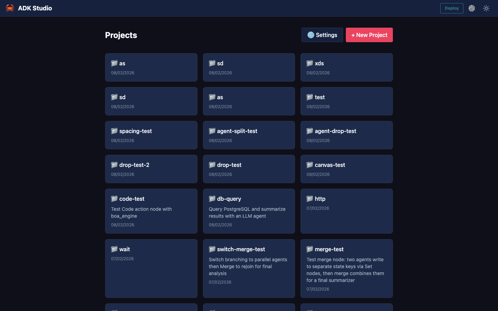
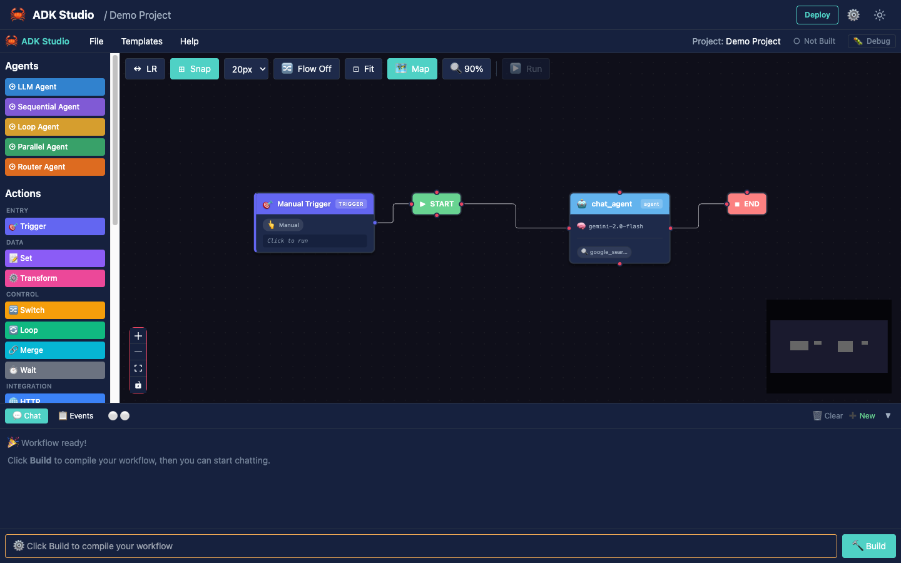
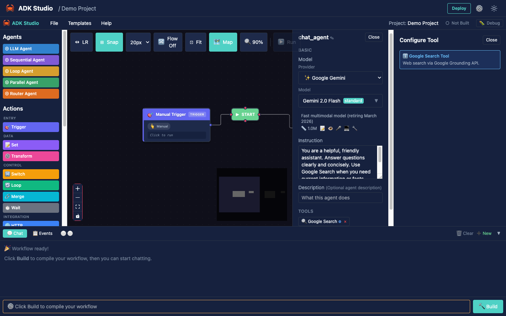
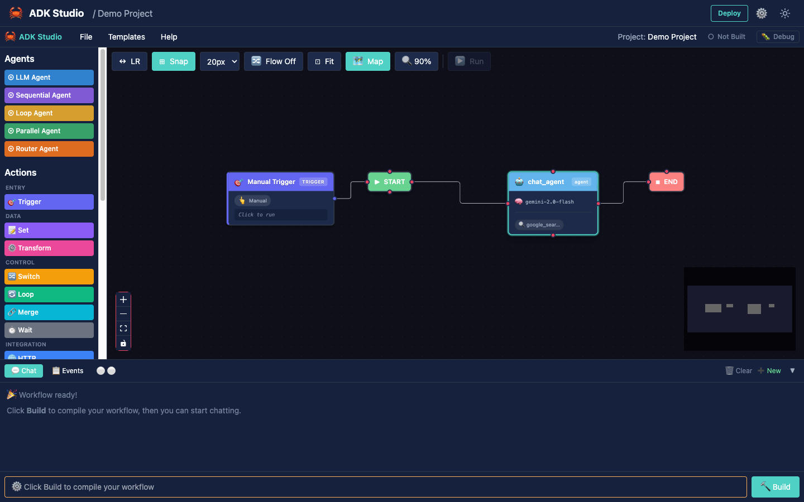
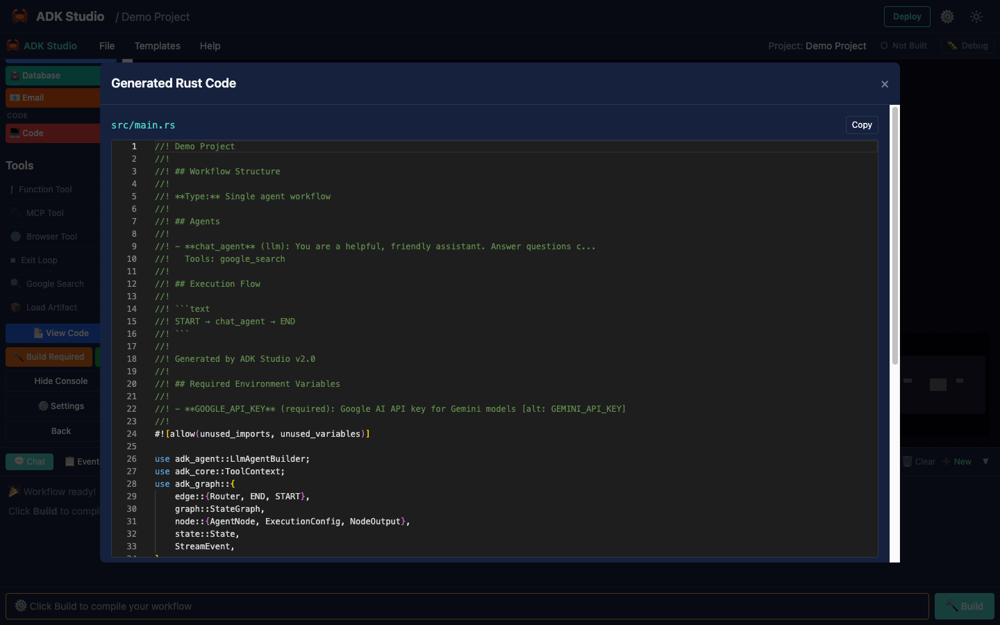

# ADK Studio

Visual development environment for building AI agents with drag-and-drop.

## Overview

ADK Studio provides a low-code interface for designing, testing, and deploying AI agents built with ADK-Rust. Create complex multi-agent workflows visually, then compile them to production Rust code.



## Installation

```bash
# Install from crates.io (self-contained binary)
cargo install adk-studio

# Or build from source
cargo build --release -p adk-studio
```

## Quick Start

```bash
# Start the studio server
adk-studio

# Open in browser
open http://localhost:3000
```

### CLI Options

| Option | Description | Default |
|--------|-------------|---------|
| `--port`, `-p` | Server port | 3000 |
| `--host`, `-h` | Bind address | 127.0.0.1 |
| `--dir`, `-d` | Projects directory | `~/.local/share/adk-studio/projects` |
| `--static`, `-s` | Override static files directory | (embedded) |

```bash
# Bind to all interfaces for remote access
adk-studio --host 0.0.0.0 --port 8080

# Custom projects directory
adk-studio --dir ./my-projects
```

---

## Step-by-Step Tutorial

Follow this walkthrough to build your first AI agent in ADK Studio.

### Step 1: Create a New Project

Click the **+ New Project** button in the top-right corner.


Enter a name for your project (e.g., "Demo Project") and click **Create**.

### Step 2: Add an Agent to the Canvas

The left sidebar contains the **Agent Palette** with available agent types:
- **LLM Agent** - Single AI agent powered by a language model
- **Sequential** - Execute sub-agents in order
- **Parallel** - Execute sub-agents concurrently
- **Loop** - Iterate until exit condition
- **Router** - Route to sub-agents based on input

Click on **LLM Agent** to add it to the canvas.



### Step 3: Configure the Agent

When you select an agent, the **Properties Panel** appears on the right side. Here you can configure:

- **Name** - Identifier for the agent
- **Model** - LLM provider and model (Gemini, OpenAI, etc.)
- **Instructions** - System prompt for the agent


### Step 4: Add Tools to the Agent

Scroll down in the left sidebar to find the **Tool Palette**:
- **Function** - Custom Rust function with code editor
- **MCP** - Model Context Protocol server
- **Browser** - 46 WebDriver automation actions
- **Google Search** - Grounded web search
- **Load Artifact** - Load files into context

Click on a tool to add it to your agent.



### Step 5: Build and Test

Click **Build Project** to compile your agent. Once built, use the **Chat Panel** at the bottom to test your agent with real conversations.



The chat supports:
- Live SSE streaming responses
- Agent execution animations
- Event trace panel for debugging

### Step 6: View Generated Code

Click **View Code** to see the production-ready Rust code generated from your visual design.



You can copy this code or use **Compile** to generate a complete Rust project.

---

## Features

### Agent Types

| Agent | Description |
|-------|-------------|
| **LLM Agent** | Single agent powered by an LLM |
| **Sequential** | Execute sub-agents in order |
| **Parallel** | Execute sub-agents concurrently |
| **Loop** | Iterate until exit condition |
| **Router** | Route to sub-agents based on input |

### Tool Types

| Tool | Description |
|------|-------------|
| **Function** | Custom Rust function with code editor |
| **MCP** | Model Context Protocol server |
| **Browser** | 46 WebDriver automation actions |
| **Google Search** | Grounded web search |
| **Load Artifact** | Load files into context |

### Real-Time Chat

Test agents directly in the studio:

- Live SSE streaming responses
- Agent execution animations
- Event trace panel for debugging
- Session memory persistence

### Code Generation

Convert visual designs to production code:

1. **View Code** - Preview generated Rust with syntax highlighting
2. **Compile** - Generate complete Rust project
3. **Build** - Compile to executable with real-time output
4. **Run** - Execute the built agent

## Architecture

```
┌─────────────────────────────────────────────────────────────┐
│                     ADK Studio UI                           │
│  ┌─────────────┐  ┌─────────────┐  ┌─────────────────────┐ │
│  │   Palette   │  │   Canvas    │  │   Properties        │ │
│  │  - Agents   │  │  ReactFlow  │  │  - Name             │ │
│  │  - Tools    │  │  Workflow   │  │  - Model            │ │
│  │             │  │  Designer   │  │  - Instructions     │ │
│  └─────────────┘  └─────────────┘  └─────────────────────┘ │
└─────────────────────────────────────────────────────────────┘
                              │
                              ▼ HTTP/SSE
┌─────────────────────────────────────────────────────────────┐
│                    ADK Studio Server                        │
│  ┌─────────────┐  ┌─────────────┐  ┌─────────────────────┐ │
│  │   Routes    │  │   Codegen   │  │   Storage           │ │
│  │  /api/*     │  │  Rust code  │  │  Projects           │ │
│  │  /chat      │  │  generation │  │  File-based         │ │
│  └─────────────┘  └─────────────┘  └─────────────────────┘ │
└─────────────────────────────────────────────────────────────┘
                              │
                              ▼ Build
┌─────────────────────────────────────────────────────────────┐
│                   Generated Rust Project                    │
│  ┌─────────────────────────────────────────────────────┐   │
│  │  Cargo.toml + src/main.rs                           │   │
│  │  Uses: adk-rust, adk-agent, adk-model, etc.        │   │
│  └─────────────────────────────────────────────────────┘   │
└─────────────────────────────────────────────────────────────┘
```

## API Endpoints

### Projects

| Endpoint | Method | Description |
|----------|--------|-------------|
| `/api/projects` | GET | List all projects |
| `/api/projects` | POST | Create new project |
| `/api/projects/:id` | GET | Get project details |
| `/api/projects/:id` | PUT | Update project |
| `/api/projects/:id` | DELETE | Delete project |

### Code Generation

| Endpoint | Method | Description |
|----------|--------|-------------|
| `/api/projects/:id/codegen` | POST | Generate Rust code |
| `/api/projects/:id/build` | POST | Compile project |
| `/api/projects/:id/run` | POST | Run built executable |

### Chat

| Endpoint | Method | Description |
|----------|--------|-------------|
| `/api/chat` | POST | Send message (SSE stream) |

## Environment Variables

| Variable | Description | Required |
|----------|-------------|----------|
| `GOOGLE_API_KEY` | Gemini API key | Yes (for Gemini) |
| `OPENAI_API_KEY` | OpenAI API key | Yes (for OpenAI) |
| `ADK_DEV_MODE` | Use local workspace deps | No |
| `RUST_LOG` | Log level | No (default: info) |

## Generated Code Structure

```
my-project/
├── Cargo.toml
└── src/
    └── main.rs
```

Example generated `main.rs`:

```rust
use adk_rust::prelude::*;
use adk_rust::Launcher;

#[tokio::main]
async fn main() -> Result<(), Box<dyn std::error::Error>> {
    dotenvy::dotenv().ok();
    let api_key = std::env::var("GOOGLE_API_KEY")?;
    let model = GeminiModel::new(&api_key, "gemini-2.0-flash")?;

    let agent = LlmAgentBuilder::new("assistant")
        .description("Helpful AI assistant")
        .instruction("You are a helpful assistant.")
        .model(Arc::new(model))
        .build()?;

    Launcher::new(Arc::new(agent)).run().await?;
    Ok(())
}
```

## Templates

Studio includes pre-built templates:

- **Basic Assistant** - Simple LLM agent
- **Research Agent** - Agent with Google Search
- **Support Router** - Multi-agent routing
- **Code Assistant** - Agent with code tools

## Best Practices

| Practice | Description |
|----------|-------------|
| **Start simple** | Begin with single LLM agent, add complexity |
| **Test often** | Use chat panel to validate behavior |
| **Review code** | Check generated code before deploying |
| **Version projects** | Export and version control project JSON |
| **Use templates** | Start from templates for common patterns |

---

**Previous**: [← Memory](../security/memory.md) | **Next**: [Development Guidelines →](../development/development-guidelines.md)
