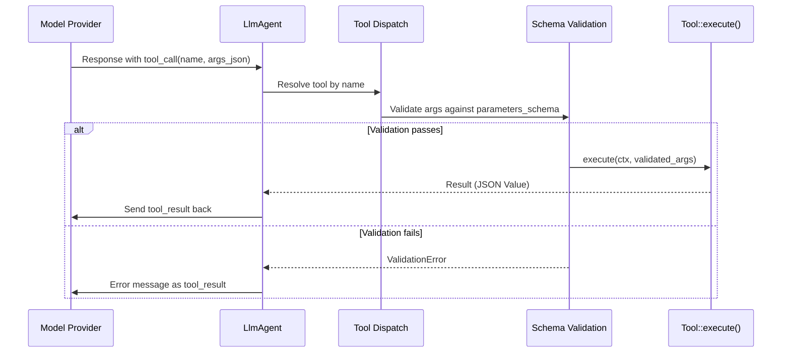

# Function Tools

Extend agent capabilities with custom Rust functions.

---

## What are Function Tools?

Function tools let you give agents abilities beyond conversation - calling APIs, performing calculations, accessing databases, or any custom logic. The LLM decides when to use a tool based on the user's request.

> **Key highlights**:
> - 🚀 **`#[tool]` macro** - zero-boilerplate tool registration (recommended)
> - 🔧 **`FunctionTool::new()`** - wrap any async function manually
> - 📝 **JSON parameters** - flexible input/output
> - 🎯 **Type-safe schemas** - automatic JSON Schema from types via schemars
> - 🔗 **Context access** - session state, artifacts, memory

---

### Tool Execution Pipeline



---

## Recommended: `#[tool]` Macro

The fastest way to create tools. The macro reads your doc comment as the description and derives the JSON schema from your args type:

```rust
use adk_tool::tool;
use adk_core::AdkError;
use schemars::JsonSchema;
use serde::Deserialize;
use serde_json::{json, Value};

#[derive(Deserialize, JsonSchema)]
struct WeatherArgs {
    /// The city to look up
    city: String,
    /// Temperature unit (celsius or fahrenheit)
    unit: Option<String>,
}

/// Get the current weather for a city.
#[tool]
async fn get_weather(args: WeatherArgs) -> Result<Value, AdkError> {
    Ok(json!({ "temp": 22, "city": args.city }))
}

// Generated: pub struct GetWeather; — implements adk_core::Tool
// Use it: agent_builder.tool(Arc::new(GetWeather))
```

If your tool needs session context, add `Arc<dyn ToolContext>` as the first parameter:

```rust
use adk_core::ToolContext;
use std::sync::Arc;

/// Search the user's saved documents.
#[tool]
async fn search_docs(
    ctx: Arc<dyn ToolContext>,
    args: SearchArgs,
) -> Result<Value, AdkError> {
    let user_id = ctx.user_id();
    // ... use context for scoped access
}
```

### Tool Metadata Attributes

Mark tools as read-only, concurrency-safe, or long-running directly in the macro:

```rust
/// Look up cached data — no side effects, safe for parallel dispatch.
#[tool(read_only, concurrency_safe)]
async fn cache_lookup(args: LookupArgs) -> Result<Value, AdkError> {
    Ok(json!({"result": "cached"}))
}

/// Start a long-running background report.
#[tool(long_running)]
async fn generate_report(args: ReportArgs) -> Result<Value, AdkError> {
    Ok(json!({"task_id": "abc123", "status": "processing"}))
}
```

Available attributes (all optional, combine freely):

| Attribute | Effect |
|-----------|--------|
| `read_only` | `is_read_only() → true` — included in concurrent batch under `Auto` strategy |
| `concurrency_safe` | `is_concurrency_safe() → true` — explicitly safe for parallel dispatch |
| `long_running` | `is_long_running() → true` — prevents LLM from re-calling a pending tool |

Plain `#[tool]` without attributes keeps the defaults (all `false`), so existing code is unaffected.

---

## Alternative: `FunctionTool::new()`

For dynamic tools or when you prefer explicit registration:

Create a tool with `FunctionTool::new()` and **always add a schema** so the LLM knows what parameters to pass:

```rust
use adk_rust::prelude::*;
use adk_rust::Launcher;
use schemars::JsonSchema;
use serde::{Deserialize, Serialize};
use serde_json::json;
use std::sync::Arc;

#[derive(JsonSchema, Serialize, Deserialize)]
struct WeatherParams {
    /// The city or location to get weather for
    location: String,
}

#[tokio::main]
async fn main() -> anyhow::Result<()> {
    dotenvy::dotenv().ok();
    let api_key = std::env::var("GOOGLE_API_KEY")?;
    let model = GeminiModel::new(&api_key, "gemini-2.5-flash")?;

    // Weather tool with proper schema
    let weather_tool = FunctionTool::new(
        "get_weather",
        "Get current weather for a location",
        |_ctx, args| async move {
            let location = args.get("location")
                .and_then(|v| v.as_str())
                .unwrap_or("unknown");
            Ok(json!({
                "location": location,
                "temperature": "22°C",
                "conditions": "sunny"
            }))
        },
    )
    .with_parameters_schema::<WeatherParams>(); // Required for LLM to call correctly!

    let agent = LlmAgentBuilder::new("weather_agent")
        .instruction("You help users check the weather. Always use the get_weather tool.")
        .model(Arc::new(model))
        .tool(Arc::new(weather_tool))
        .build()?;

    Launcher::new(Arc::new(agent)).run().await?;
    Ok(())
}
```

> ⚠️ **Important**: Always use `.with_parameters_schema<T>()` - without it, the LLM won't know what parameters to pass and may not call the tool.

**How it works**:
1. User asks: "What's the weather in Tokyo?"
2. LLM decides to call `get_weather` with `{"location": "Tokyo"}`
3. Tool returns `{"location": "Tokyo", "temperature": "22°C", "conditions": "sunny"}`
4. LLM formats response: "The weather in Tokyo is sunny at 22°C."

---

## Step 2: Parameter Handling

Extract parameters from the JSON `args`:

```rust
let order_tool = FunctionTool::new(
    "process_order",
    "Process an order. Parameters: product_id (required), quantity (required), priority (optional)",
    |_ctx, args| async move {
        // Required parameters - return error if missing
        let product_id = args.get("product_id")
            .and_then(|v| v.as_str())
            .ok_or_else(|| adk_core::AdkError::tool("product_id is required"))?;
        
        let quantity = args.get("quantity")
            .and_then(|v| v.as_i64())
            .ok_or_else(|| adk_core::AdkError::tool("quantity is required"))?;
        
        // Optional parameter with default
        let priority = args.get("priority")
            .and_then(|v| v.as_str())
            .unwrap_or("normal");
        
        Ok(json!({
            "order_id": "ORD-12345",
            "product_id": product_id,
            "quantity": quantity,
            "priority": priority,
            "status": "confirmed"
        }))
    },
);
```

---

## Step 3: Typed Parameters with Schema

For complex tools, use typed structs with JSON Schema:

```rust
use schemars::JsonSchema;
use serde::{Deserialize, Serialize};

#[derive(JsonSchema, Serialize, Deserialize)]
struct CalculatorParams {
    /// The arithmetic operation to perform
    operation: Operation,
    /// First operand
    a: f64,
    /// Second operand
    b: f64,
}

#[derive(JsonSchema, Serialize, Deserialize)]
#[serde(rename_all = "lowercase")]
enum Operation {
    Add,
    Subtract,
    Multiply,
    Divide,
}

let calculator = FunctionTool::new(
    "calculator",
    "Perform arithmetic operations",
    |_ctx, args| async move {
        let params: CalculatorParams = serde_json::from_value(args)?;
        let result = match params.operation {
            Operation::Add => params.a + params.b,
            Operation::Subtract => params.a - params.b,
            Operation::Multiply => params.a * params.b,
            Operation::Divide if params.b != 0.0 => params.a / params.b,
            Operation::Divide => return Err(adk_core::AdkError::tool("Cannot divide by zero")),
        };
        Ok(json!({ "result": result }))
    },
)
.with_parameters_schema::<CalculatorParams>();
```

The schema is auto-generated from Rust types using `schemars`.

---

## Step 4: Multi-Tool Agent

Add multiple tools to one agent:

```rust
let agent = LlmAgentBuilder::new("assistant")
    .instruction("Help with calculations, conversions, and weather.")
    .model(Arc::new(model))
    .tool(Arc::new(calc_tool))
    .tool(Arc::new(convert_tool))
    .tool(Arc::new(weather_tool))
    .build()?;
```

The LLM automatically chooses the right tool based on the user's request.

---

## Error Handling

Return errors with the `Tool` component for tool-specific failures:

```rust
use adk_core::{AdkError, ErrorComponent, ErrorCategory};

let divide_tool = FunctionTool::new(
    "divide",
    "Divide two numbers",
    |_ctx, args| async move {
        let a = args.get("a").and_then(|v| v.as_f64())
            .ok_or_else(|| AdkError::new(
                ErrorComponent::Tool,
                ErrorCategory::InvalidInput,
                "tool.divide.missing_param",
                "Parameter 'a' is required",
            ))?;
        let b = args.get("b").and_then(|v| v.as_f64())
            .ok_or_else(|| AdkError::new(
                ErrorComponent::Tool,
                ErrorCategory::InvalidInput,
                "tool.divide.missing_param",
                "Parameter 'b' is required",
            ))?;
        
        if b == 0.0 {
            return Err(AdkError::new(
                ErrorComponent::Tool,
                ErrorCategory::InvalidInput,
                "tool.divide.division_by_zero",
                "Cannot divide by zero",
            ));
        }
        
        Ok(json!({ "result": a / b }))
    },
);
```

For quick migration, the backward-compatible shorthand also works:

```rust
Err(AdkError::tool("Parameter 'a' is required"))
```

Error messages are passed to the LLM, which can retry or ask for different input.

---

## Tool Context

Access session info via `ToolContext`:

```rust
#[derive(JsonSchema, Serialize, Deserialize)]
struct GreetParams {
    #[serde(default)]
    message: Option<String>,
}

let greet_tool = FunctionTool::new(
    "greet",
    "Greet the user with session info",
    |ctx, _args| async move {
        let user_id = ctx.user_id();
        let session_id = ctx.session_id();
        let agent_name = ctx.agent_name();
        Ok(json!({
            "greeting": format!("Hello, user {}!", user_id),
            "session": session_id,
            "served_by": agent_name
        }))
    },
)
.with_parameters_schema::<GreetParams>();
```

**Available context**:
- `ctx.user_id()` - Current user ID
- `ctx.session_id()` - Current session ID
- `ctx.agent_name()` - Name of the agent
- `ctx.artifacts()` - Access to artifact storage
- `ctx.search_memory(query)` - Search memory service

---

## Long-Running Tools

For operations that take significant time (data processing, external APIs), use the non-blocking pattern:

1. **Start tool** returns immediately with a task_id
2. **Background work** runs asynchronously  
3. **Status tool** lets users check progress

```rust
use std::collections::HashMap;
use std::sync::Arc;
use tokio::sync::RwLock;

#[derive(JsonSchema, Serialize, Deserialize)]
struct ReportParams {
    topic: String,
}

#[derive(JsonSchema, Serialize, Deserialize)]
struct StatusParams {
    task_id: String,
}

// Shared task store
let tasks: Arc<RwLock<HashMap<String, TaskState>>> = Arc::new(RwLock::new(HashMap::new()));
let tasks1 = tasks.clone();
let tasks2 = tasks.clone();

// Tool 1: Start (returns immediately)
let start_tool = FunctionTool::new(
    "generate_report",
    "Start generating a report. Returns task_id immediately.",
    move |_ctx, args| {
        let tasks = tasks1.clone();
        async move {
            let topic = args.get("topic").and_then(|v| v.as_str()).unwrap_or("general").to_string();
            let task_id = format!("task_{}", rand::random::<u32>());
            
            // Store initial state
            tasks.write().await.insert(task_id.clone(), TaskState {
                status: "processing".to_string(),
                progress: 0,
                result: None,
            });

            // Spawn background work (non-blocking!)
            let tasks_bg = tasks.clone();
            let tid = task_id.clone();
            tokio::spawn(async move {
                // Simulate work...
                tokio::time::sleep(tokio::time::Duration::from_secs(10)).await;
                if let Some(t) = tasks_bg.write().await.get_mut(&tid) {
                    t.status = "completed".to_string();
                    t.result = Some("Report complete".to_string());
                }
            });

            // Return immediately with task_id
            Ok(json!({"task_id": task_id, "status": "processing"}))
        }
    },
)
.with_parameters_schema::<ReportParams>()
.with_long_running(true);  // Mark as long-running

// Tool 2: Check status
let status_tool = FunctionTool::new(
    "check_report_status",
    "Check report generation status",
    move |_ctx, args| {
        let tasks = tasks2.clone();
        async move {
            let task_id = args.get("task_id").and_then(|v| v.as_str()).unwrap_or("");
            if let Some(t) = tasks.read().await.get(task_id) {
                Ok(json!({"status": t.status, "result": t.result}))
            } else {
                Ok(json!({"error": "Task not found"}))
            }
        }
    },
)
.with_parameters_schema::<StatusParams>();
```

**Key points**:
- `.with_long_running(true)` tells the agent this tool returns a pending status
- The tool spawns work with `tokio::spawn()` and returns immediately
- Provide a status check tool so users can poll progress

This adds a note to prevent the LLM from calling the tool repeatedly.

---

## Streaming Progress from a Tool

Long-running tools can push intermediate output to the UI *while still
executing*, so the user sees a shell command's stdout, a build's logs, or a
download's bytes live instead of waiting for the final result. Call
`ToolContext::emit_progress` as output arrives:

```rust
use adk_core::{Result, Tool, ToolContext};
use std::sync::Arc;

#[async_trait::async_trait]
impl Tool for BuildTool {
    // ... name(), description(), parameters_schema() ...

    async fn execute(&self, ctx: Arc<dyn ToolContext>, args: serde_json::Value) -> Result<serde_json::Value> {
        // Emit chunks as they arrive — each becomes a partial Event on the
        // agent's EventStream, the SAME stream the model's reply travels on.
        ctx.emit_progress("stdout", "Compiling project...\n").await;
        ctx.emit_progress("stdout", "Build finished in 4.2s\n").await;
        ctx.emit_progress("stderr", "warning: unused variable `x`\n").await;

        // The final return value is still the complete result the model consumes.
        Ok(serde_json::json!({ "status": "ok", "warnings": 1 }))
    }
}
```

**The signature:**

```rust
async fn emit_progress(&self, stream: &str, chunk: &str)
```

- `stream` — a label for the chunk: `"stdout"`, `"stderr"`, or any custom channel.
- `chunk` — the text to emit (emit per line for terminal-style output).

**How it reaches the UI.** The framework forwards each chunk as a partial
[`Event`](../events/events.md#streaming-tool-progress) on the agent's
`EventStream`. A consumer detects it with `event.tool_progress_stream()` and
renders it live. There is no second channel and no log scraping — progress,
model text, and the final tool result all arrive on one ordered stream.

**Backward compatible.** The default `emit_progress` is a no-op, so existing
tools and runners that don't stream are unaffected. Only tools that opt in emit
progress, and only consumers that check `tool_progress_stream()` observe it.

> See the `streaming_bash` example for a complete web UI that renders live
> `bash` output and one-shot tool results (`read_file`, `grep`, `glob`) from a
> single event feed. The streaming `bash` tool itself lives in `adk-devtools`.

---

## Run Examples

```bash
cargo adk new tool_agent --template tools
cd tool_agent
cargo run
```

---

## Best Practices

1. **Clear descriptions** - Help the LLM understand when to use the tool
2. **Validate inputs** - Return helpful error messages for missing parameters
3. **Return structured JSON** - Use clear field names
4. **Keep tools focused** - Each tool should do one thing well
5. **Use schemas** - For complex tools, define parameter schemas
6. **Mark read-only tools** - Use `.with_read_only(true)` for tools with no side effects so `Auto` dispatch can run them concurrently

---

## Tool Metadata: Read-Only and Concurrency

Mark tools as read-only or concurrency-safe to enable smarter dispatch:

```rust
// A lookup tool that performs no side effects
let lookup = FunctionTool::new("lookup", "Look up data", |_ctx, args| async move {
    Ok(json!({"result": "cached data"}))
})
.with_read_only(true)        // Safe for concurrent execution in Auto mode
.with_concurrency_safe(true); // Explicitly safe for parallel dispatch

// A mutation tool (defaults: read_only=false, concurrency_safe=false)
let update = FunctionTool::new("update", "Update record", |_ctx, args| async move {
    Ok(json!({"updated": true}))
});
```

When `ToolExecutionStrategy::Auto` is active, the dispatch loop runs all `is_read_only() == true` tools concurrently first, then executes the remaining tools sequentially. This reduces latency when an LLM returns multiple tool calls in a single response.

---

## SimpleToolContext: Using Tools Outside the Agent Loop

When you need to call a tool outside the agent loop (testing, MCP server mode, sub-agent delegation), use `SimpleToolContext` instead of implementing the full `ToolContext` trait hierarchy:

```rust
use adk_tool::SimpleToolContext;
use adk_core::ToolContext;
use std::sync::Arc;

// Construct with just a caller name — all other fields get sensible defaults
let ctx = SimpleToolContext::new("my-test-harness");

// Optionally override the function call ID
let ctx = SimpleToolContext::new("my-mcp-server")
    .with_function_call_id("custom-call-id");

// Bind a session ID so session-aware tools (and MCP servers that key state by
// session) see a stable identifier instead of the empty default.
let ctx = SimpleToolContext::new("my-mcp-server")
    .with_session_id("session-42");

// Use it to execute any tool
let tool_ctx: Arc<dyn ToolContext> = Arc::new(ctx);
let result = my_tool.execute(tool_ctx, json!({"key": "value"})).await?;
```

Defaults: `user_id()` → `"anonymous"`, `session_id()` / `branch()` → `""`, `artifacts()` → `None`, `search_memory()` → empty vec. Both `invocation_id` and `function_call_id` are auto-generated UUIDs. Set a real session with `with_session_id(...)` when a tool routes or persists state per session.

---

## StatefulTool: Shared State Across Invocations

For tools that need to maintain state between calls (counters, caches, connection pools), use `StatefulTool<S>`:

```rust
use adk_tool::StatefulTool;
use adk_core::ToolContext;
use std::sync::Arc;
use tokio::sync::RwLock;

struct AppCache {
    entries: RwLock<HashMap<String, String>>,
}

let cache = Arc::new(AppCache {
    entries: RwLock::new(HashMap::new()),
});

let cache_tool = StatefulTool::new(
    "cache_lookup",
    "Look up a value in the application cache",
    cache.clone(),
    |state, _ctx, args| async move {
        let key = args["key"].as_str().unwrap_or("");
        let entries = state.entries.read().await;
        let value = entries.get(key).cloned().unwrap_or_default();
        Ok(json!({"key": key, "value": value}))
    },
)
.with_read_only(true)
.with_concurrency_safe(true);
```

`StatefulTool` clones the `Arc<S>` on each invocation (cheap reference count bump), so all executions share the same underlying state. It supports the same builder methods as `FunctionTool`: `with_long_running`, `with_parameters_schema`, `with_response_schema`, `with_scopes`, `with_read_only`, and `with_concurrency_safe`.

---

## Related

- [Built-in Tools](built-in-tools.md) - Pre-built tools (GoogleSearch, ExitLoop)
- [MCP Tools](mcp-tools.md) - Model Context Protocol integration
- [LlmAgent](../agents/llm-agent.md) - Adding tools to agents

---

## Multimodal Function Responses

Gemini 3 models support receiving images, audio, PDFs, and file references in function responses — not just JSON. Tools can return multimodal data by including `inline_data` and/or `file_data` arrays in their JSON return value:

```rust
/// Tool that returns a chart image alongside JSON metadata.
async fn generate_chart(
    _ctx: Arc<dyn ToolContext>,
    args: serde_json::Value,
) -> Result<serde_json::Value> {
    let png_bytes: Vec<u8> = render_chart(&args);

    // Include inline_data in the return value — the framework extracts it automatically
    Ok(json!({
        "response": {
            "title": "Q4 Sales",
            "chart_type": "bar"
        },
        "inline_data": [{
            "mime_type": "image/png",
            "data": png_bytes
        }]
    }))
}
```

The framework automatically:
1. Detects `inline_data`/`file_data` via `FunctionResponseData::from_tool_result()`
2. Base64-encodes inline binary data
3. Nests the parts inside the `functionResponse` wire object (matching the Gemini 3 API format)

### File References

For large files stored externally, use `file_data` with a URI instead of embedding bytes:

```rust
Ok(json!({
    "response": { "document_id": "report-2024", "pages": 12 },
    "file_data": [{
        "mime_type": "application/pdf",
        "file_uri": "gs://my-bucket/reports/report-2024.pdf"
    }]
}))
```

### Direct Construction

For framework-level code (custom agents, conversion layers), construct `FunctionResponseData` directly:

```rust
use adk_core::{FunctionResponseData, InlineDataPart, FileDataPart};

// JSON + inline image
let frd = FunctionResponseData::with_inline_data(
    "chart_tool",
    json!({"title": "Q4 Chart"}),
    vec![InlineDataPart { mime_type: "image/png".into(), data: png_bytes }],
);

// JSON + file reference
let frd = FunctionResponseData::with_file_data(
    "doc_tool",
    json!({"status": "ok"}),
    vec![FileDataPart { mime_type: "application/pdf".into(), file_uri: "gs://bucket/file.pdf".into() }],
);

// JSON + both
let frd = FunctionResponseData::with_multimodal("tool", json, inline_parts, file_parts);
```

> **Note**: Multimodal function responses require Gemini 3 series models (`gemini-3-flash-preview`, `gemini-3-pro-preview`). Earlier models return a 400 error.

See `examples/multimodal_function_response/` for a complete working example.

---

**Previous**: [← mistral.rs](../models/mistralrs.md) | **Next**: [Built-in Tools →](built-in-tools.md)
