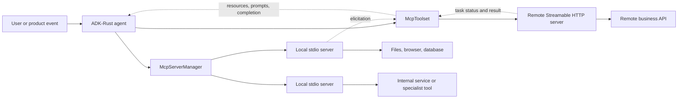

# Model Context Protocol (MCP)

> **Documentation map:** [Overview and architecture](../mcp/index.md) ·
> [Client](../mcp/client.md) · [Dynamic manager](../mcp/manager.md) ·
> [Server authoring](../mcp/server.md) · [Security](../mcp/security.md) ·
> [Testing](../mcp/testing.md)

MCP gives an AI application a standard way to discover and use capabilities
owned by another process or service. A server can publish:

- **tools** that perform actions;
- **resources** that return readable context;
- **prompts** that provide reusable message templates; and
- **completion** suggestions that help a client fill prompt or resource
  arguments.

ADK-Rust is usually the MCP **client**. `McpToolset` turns discovered MCP tools
into normal ADK-Rust `Tool` values, so an `LlmAgent` can select and call them.
The framework also exposes resources, prompts, completion, subscriptions,
elicitation, and the negotiated task lifecycle. For MCP server authoring and
advanced protocol work, ADK-Rust re-exports the exact `rmcp` SDK version it
uses.

ADK-Rust 2 currently uses `rmcp 2.2`, the official Rust SDK aligned with the
MCP `2025-11-25` specification.

## Architecture



There are two separate layers:

1. `McpToolset` owns one initialized MCP client connection. It discovers the
   server's capabilities and adapts them to ADK-Rust.
2. `McpServerManager` owns a changing registry of local stdio servers. It
   starts, monitors, restarts, updates, enables, disables, persists, and
   aggregates those connections.

The manager does not grant tool approval. It preserves `autoApprove` when
reading compatible configuration, but the application must apply its normal
ADK-Rust authorization and approval policy.

## Install

Local stdio MCP support is opt-in:

```toml
[dependencies]
adk-tool = { version = "2.0.0", features = ["mcp"] }
```

Add Streamable HTTP when connecting to remote services:

```toml
adk-tool = { version = "2.0.0", features = ["mcp", "http-transport"] }
```

Legacy sampling callbacks require the separate `mcp-sampling` feature. The MCP
project has deprecated sampling, roots, and logging through SEP-2577; use those
APIs only when maintaining a compatible deployment.

## Connect one local server

```rust
use adk_tool::{
    McpToolset,
    mcp::rmcp::{ServiceExt, transport::TokioChildProcess},
};
use std::sync::Arc;
use tokio::process::Command;

let command = Command::new("./target/release/company-mcp");
let client = ().serve(TokioChildProcess::new(command)?).await?;

let toolset = McpToolset::new(client)
    .with_name("company_tools")
    .with_tools(&["find_customer", "read_order", "request_refund"]);

let agent = LlmAgentBuilder::new("support")
    .model(model)
    .toolset(Arc::new(toolset.clone()))
    .build()?;

// Keep the token when the application owns the process lifecycle.
let shutdown = toolset.cancellation_token().await;
// ... run the agent ...
shutdown.cancel();
```

`McpToolset` keeps the server's input and output schemas intact. Each model
adapter normalizes a copy for its provider when it builds the model request.
That lets the same MCP server work with Gemini, OpenAI, Anthropic, and other
providers without damaging the source schema.

## Use the protocol beyond tools

```rust
use serde_json::json;

let resources = toolset.list_resources().await?;
let templates = toolset.list_resource_templates().await?;
let contents = toolset.read_resource("company://policy/refunds").await?;

let prompts = toolset.list_prompts().await?;
let prompt = toolset
    .get_prompt(
        "investigate_order",
        Some(serde_json::Map::from_iter([
            ("order_id".to_string(), json!("ORD-1042")),
        ])),
    )
    .await?;

let suggestions = toolset
    .complete_prompt_argument("investigate_order", "order_id", "ORD-", None)
    .await?;

toolset.subscribe_resource("company://inventory/sku-42").await?;
// ... receive notifications in a custom ClientHandler ...
toolset.unsubscribe_resource("company://inventory/sku-42").await?;
```

The convenience methods return an empty list when an older server does not
implement resource or prompt listing. Operations against a declared resource
or prompt return an error when the remote call fails.

## Dynamic server management

Use `McpServerManager` when the application needs a fleet of local MCP child
processes rather than one static connection.

```rust
use adk_tool::mcp::manager::{McpServerConfig, McpServerManager};
use std::collections::HashMap;
use std::sync::Arc;
use std::time::Duration;

let manager = Arc::new(McpServerManager::from_json_file("mcp.json")?
    .with_name("product_mcp_servers")
    .with_health_check_interval(Duration::from_secs(15))
    .with_grace_period(Duration::from_secs(2)));

let outcomes = manager.start_all().await;
for (server_id, outcome) in outcomes {
    if let Err(error) = outcome {
        eprintln!("{server_id} did not start: {error}");
    }
}
manager.start_monitoring();

let agent = LlmAgentBuilder::new("operator")
    .model(model)
    .toolset(manager.clone())
    .build()?;
```

The runtime registry supports:

```rust
manager.add_server("billing".into(), billing_config).await?;
manager.start_server("billing").await?;

manager.update_server("billing", replacement_config).await?;
manager.disable_server("billing").await?;
manager.enable_server("billing").await?;

manager.save_json_file("mcp.json").await?;
manager.remove_server("billing").await?;
manager.shutdown().await?;
```

When two servers publish the same tool name, the aggregated toolset prefixes
both names as `{server_id}__{tool_name}`. Unique names remain unchanged.

The health monitor detects a closed MCP connection. A configured
`RestartPolicy` controls bounded retry with exponential backoff. This is
connection supervision, not an application-level health check: use a domain
tool or a separate service probe when you need to verify the server's backing
database or external API.

Run the deterministic example:

```bash
cargo run --manifest-path examples/mcp_manager/Cargo.toml
```

It starts a real Rust MCP child server and exercises discovery, a tool call,
runtime add/enable/update/disable/remove, config persistence, and shutdown. It
does not download packages or require an API key.

## Remote Streamable HTTP

```rust
use adk_tool::{McpAuth, McpHttpClientBuilder};
use std::time::Duration;

let toolset = McpHttpClientBuilder::new("https://mcp.example.com/mcp")
    .with_auth(McpAuth::bearer(std::env::var("MCP_TOKEN")?))
    .header("X-Tenant-ID", "tenant-42")
    .timeout(Duration::from_secs(30))
    .reinit_on_expired_session(true)
    .connect()
    .await?;
```

The builder applies request timeouts, custom headers, bearer tokens, custom
API-key headers, and bounded recovery when an HTTP session expires.

`OAuth2Config` implements a fixed OAuth 2.0 client-credentials token request.
It is useful for a server with a known token endpoint. It is not the complete
MCP authorization flow: it does not perform protected-resource metadata
discovery, authorization-server discovery, browser authorization, PKCE, or
resource-indicator negotiation. Use `rmcp`'s authorization APIs or an external
identity component when the deployment requires that flow.

## Elicitation

An MCP server may need information that the tool arguments did not include. In
that case it can send an elicitation request back to the client. The application
decides how to show the request to a person and whether to accept, decline, or
cancel it.

```rust
let toolset = McpToolset::with_elicitation_handler(
    transport,
    Arc::new(MyElicitationHandler),
).await?;
```

ADK-Rust advertises both form and URL elicitation. A handler error or panic is
converted into a decline so the MCP connection remains usable. Validate the
returned values and apply consent rules in the application before accepting a
consequential request.

See `examples/mcp_elicitation` for a complete server and interactive client.

## Long-running MCP tasks

MCP `2025-11-25` can move a tool call into a protocol task. ADK-Rust uses the
task flow only when the server negotiated `tasks.requests.tools.call` and the
tool declares required or optional task support.

```rust
use adk_tool::McpTaskConfig;
use std::time::Duration;

let toolset = McpToolset::new(client).with_task_support(
    McpTaskConfig::enabled()
        .poll_interval(Duration::from_secs(1))
        .timeout(Duration::from_secs(120))
        .max_attempts(120),
);
```

For task mode, ADK-Rust:

1. sends `tools/call` with official task metadata;
2. receives the created task;
3. polls `tasks/get` using the server's suggested interval;
4. reads the final payload through `tasks/result`; and
5. calls `tasks/cancel` when its local timeout or poll limit is reached.

`input_required` is returned as a typed error because an ordinary ADK tool call
does not yet have a protocol-neutral resume channel for supplying that missing
input. Design that interaction explicitly in the owning workflow.

## Capability map

| MCP capability | ADK-Rust 2 surface | Notes |
|---|---|---|
| Tool discovery and calls | `McpToolset`, `Toolset` | Raw schemas; multimodal and structured results preserved |
| Tool filtering | `with_filter`, `with_tools` | Filter before exposure to the model |
| Resources and templates | list/read methods | Method-not-found handled for older servers |
| Prompts | list/get methods | Typed argument maps |
| Completion | prompt/resource completion methods | Returns official `CompletionInfo` |
| Resource subscriptions | subscribe/unsubscribe methods | Notifications require an appropriate client handler |
| Elicitation | `ElicitationHandler` | Form and URL modes |
| Tasks | `McpTaskConfig` | Negotiated tool-call task lifecycle |
| Local stdio | `TokioChildProcess` | Direct or manager-owned |
| Streamable HTTP | `McpHttpClientBuilder` | Timeouts, headers, auth injection, session recovery |
| Dynamic local registry | `McpServerManager` | Add/update/enable/disable/remove/save/monitor/restart |
| Server authoring and extensions | `adk_tool::mcp::rmcp` | Exact SDK re-export for advanced use |
| Sampling, roots, logging | compatibility feature / `rmcp` | Deprecated upstream through SEP-2577 |

## Choosing the boundary

Use a Rust `FunctionTool` when the capability belongs to the same process and
release. Use MCP when another program, team, language, security boundary, or
deployment owns the capability and should publish its own contract.

For production deployments:

- expose the smallest useful tool set;
- separate read-only and consequential actions;
- keep secrets out of command-line arguments and committed `mcp.json` files;
- authenticate remote HTTP servers and scope credentials narrowly;
- treat tool descriptions and server-returned content as untrusted input;
- retain ADK-Rust authorization and approval around tool execution;
- bound connection, tool, and task timeouts; and
- record tool calls, approvals, errors, and server lifecycle changes.

## Current limits

- `McpServerManager` manages local stdio child processes. Remote HTTP services
  use `McpHttpClientBuilder` and application-owned configuration.
- Manager health checks detect closed MCP connections; they do not call a
  business-level health tool.
- Registry mutations are serialized while a child completes its MCP handshake.
- `autoApprove` is configuration compatibility, not authorization enforcement.
- The built-in OAuth helper is client credentials, not the complete MCP OAuth
  discovery and user-authorization flow.

These limits are stated so that deployment decisions remain explicit.

## References

- [MCP specification 2025-11-25](https://modelcontextprotocol.io/specification/2025-11-25)
- [Official Rust SDK (`rmcp`)](https://github.com/modelcontextprotocol/rust-sdk)
- [`rmcp 2.2` API documentation](https://docs.rs/rmcp/2.2.0/rmcp/)
- [Provider-aware schema normalization](schema-normalization.md)
