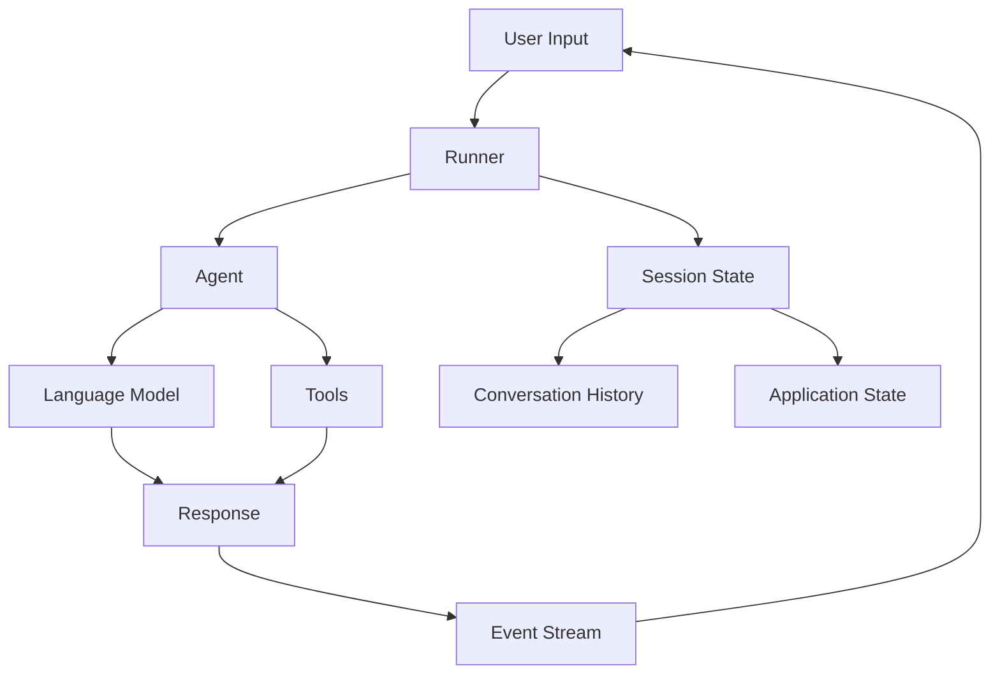

# Core Concepts

This guide explains the fundamental concepts and components of ADK-Rust. Understanding these building blocks will help you design and build effective agent systems.

## Overview

ADK-Rust is built around five core abstractions:

1. **Agents**: The "brains" that process user input and generate responses
2. **Models**: Language models (like Gemini) that power LLM agents
3. **Tools**: Capabilities that agents can use (search, calculations, etc.)
4. **Sessions**: State management for conversations
5. **Runner**: Execution engine that orchestrates everything



## 1. Agents

An **Agent** is the core abstraction in ADK-Rust. It represents an entity that can process user input and produce responses.

### The Agent Trait

```rust
#[async_trait]
pub trait Agent: Send + Sync {
    /// Unique identifier for this agent
    fn name(&self) -> &str;
    
    /// Human-readable description
    fn description(&self) -> &str;
    
    /// Tools available to this agent
    fn tools(&self) -> &[Arc<dyn Tool>];
    
    /// Sub-agents (for workflow agents)
    fn sub_agents(&self) -> &[Arc<dyn Agent>];
    
    /// Execute the agent with given context
    async fn run(&self, ctx: Arc<dyn InvocationContext>) -> Result<EventStream>;
}
```

### Agent Types

#### LlmAgent

Uses a language model to generate responses. Most common agent type.

```rust
use adk_agent::LlmAgentBuilder;
use adk_model::gemini::GeminiModel;
use std::sync::Arc;

let model = GeminiModel::new(&api_key, "gemini-2.0-flash-exp")?;

let agent = LlmAgentBuilder::new("assistant")
    .description("Helpful AI assistant")
    .model(Arc::new(model))
    .instruction("You are a friendly and knowledgeable assistant")
    .tool(Arc::new(my_tool))
    .build()?;
```

**Key features**:
- Powered by LLM (Language Learning Model)
- Supports tools via function calling
- Streaming responses
- Multi-turn conversations

#### CustomAgent

User-defined logic for specialized behavior.

```rust
use adk_agent::CustomAgentBuilder;

let agent = CustomAgentBuilder::new("custom")
    .description("Custom logic agent")
    .handler(|ctx| async move {
        // Your custom logic here
        let content = Content::text("Custom response");
        Ok(vec![Event::new(ctx.invocation_id(), "custom", Some(content))])
    })
    .build()?;
```

**Use cases**:
- Business logic that doesn't need LLM
- API integrations
- Deterministic responses
- Routing/orchestration logic

#### SequentialAgent

Chains agents in sequence, passing output from one to the next.

```rust
use adk_agent::SequentialAgent;

let workflow = SequentialAgent::new(
    "pipeline",
    vec![
        Arc::new(analyzer),    // Step 1: Analyze input
        Arc::new(processor),   // Step 2: Process data
        Arc::new(summarizer),  // Step 3: Summarize results
    ],
);
```

**Behavior**:
- Executes agents in order
- Each agent receives previous agent's output
- Stops if any agent fails
- Returns combined results

#### ParallelAgent

Runs multiple agents concurrently.

```rust
use adk_agent::ParallelAgent;

let multi_perspective = ParallelAgent::new(
    "analysis",
    vec![
        Arc::new(technical_agent),  // Technical perspective
        Arc::new(business_agent),   // Business perspective
        Arc::new(user_agent),       // User perspective
    ],
);
```

**Behavior**:
- Executes all agents simultaneously
- Each agent gets the same input
- Waits for all to complete
- Returns all outputs

#### LoopAgent

Iterative execution with exit conditions.

```rust
use adk_agent::LoopAgent;
use adk_tool::ExitLoopTool;

let refiner = LoopAgent::new(
    "refiner",
    Arc::new(refinement_agent),
    Some(5),  // Max 5 iterations
)?;
```

**Behavior**:
- Repeats agent execution
- Agent output becomes next iteration's input
- Exits when:
  - Agent calls `exit_loop` tool
  - Max iterations reached
  - Agent returns empty response

#### ConditionalAgent

Branching logic based on context.

```rust
use adk_agent::ConditionalAgent;

let conditional = ConditionalAgent::new(
    "router",
    |ctx| async move {
        // Routing logic
        let input = ctx.get_input_text();
        input.contains("code")
    },
    Arc::new(code_agent),      // If true
    Arc::new(general_agent),   // If false
)?;
```

**Use cases**:
- Routing based on input
- Feature flags
- A/B testing
- Dynamic behavior

## 2. Models

Models are the LLMs that power intelligent agents.

### The Llm Trait

```rust
#[async_trait]
pub trait Llm: Send + Sync {
    fn name(&self) -> &str;
    
    async fn generate_content(&self, req: &LlmRequest) 
        -> Result<LlmResponse>;
    
    async fn generate_content_stream(&self, req: &LlmRequest) 
        -> Result<LlmResponseStream>;
}
```

### GeminiModel

Google's Gemini integration (currently the only built-in model).

```rust
use adk_model::gemini::GeminiModel;

let model = GeminiModel::new(
    &api_key,
    "gemini-2.0-flash-exp",  // Model name
)?;

// With custom config
let model = GeminiModel::with_config(
    &api_key,
    "gemini-2.0-flash-exp",
    config,  // GenerateContentConfig
)?;
```

**Supported models**:
- `gemini-2.0-flash-exp` (recommended)
- `gemini-1.5-pro`
- `gemini-1.5-flash`

**Features**:
- Streaming and non-streaming responses
- Function calling (tool integration)
- Multi-turn conversations
- Safety settings

### Custom Models

Implement the `Llm` trait to integrate other providers:

```rust
use adk_core::{Llm, LlmRequest, LlmResponse};

struct OpenAIModel {
    api_key: String,
}

#[async_trait]
impl Llm for OpenAIModel {
    fn name(&self) -> &str { "gpt-4" }
    
    async fn generate_content(&self, req: &LlmRequest) 
        -> Result<LlmResponse> 
    {
        // Call OpenAI API
        todo!()
    }
    
    async fn generate_content_stream(&self, req: &LlmRequest) 
        -> Result<LlmResponseStream> 
    {
        // Streaming implementation
        todo!()
    }
}
```

## 3. Tools

Tools extend agent capabilities by allowing them to perform actions.

### The Tool Trait

```rust
#[async_trait]
pub trait Tool: Send + Sync {
    fn name(&self) -> &str;
    fn description(&self) -> &str;
    fn is_long_running(&self) -> bool { false }
    
    async fn execute(
        &self,
        ctx: Arc<dyn ToolContext>,
        args: Value,
    ) -> Result<Value>;
}
```

### Built-in Tools

#### GoogleSearchTool

Web search powered by Google.

```rust
use adk_tool::GoogleSearchTool;

let search_tool = GoogleSearchTool::new();
```

The agent can use this to search for current information.

#### ExitLoopTool

Allows agents to exit loop iterations.

```rust
use adk_tool::ExitLoopTool;

let exit_tool = ExitLoopTool::new();
```

Used automatically by `LoopAgent`.

#### LoadArtifactsTool

Load artifacts from storage.

```rust
use adk_tool::LoadArtifactsTool;

let load_tool = LoadArtifactsTool::new();
```

### Function Tools

Create custom tools from Rust functions:

```rust
use adk_tool::FunctionTool;
use serde_json::{json, Value};

let calculator = FunctionTool::new(
    "calculate",
    "Perform arithmetic: add(a, b), subtract(a, b), multiply(a, b), divide(a, b)",
    |_ctx, args| async move {
        let operation = args["operation"].as_str().unwrap();
        let a = args["a"].as_f64().unwrap();
        let b = args["b"].as_f64().unwrap();
        
        let result = match operation {
            "add" => a + b,
            "subtract" => a - b,
            "multiply" => a * b,
            "divide" => a / b,
            _ => return Err(AdkError::Tool("Unknown operation".into())),
        };
        
        Ok(json!({"result": result}))
    }
);
```

### Toolsets

Group related tools together:

```rust
use adk_tool::{BasicToolset, Toolset};

let toolset = BasicToolset::new(
    "math_tools",
    vec![
        Arc::new(calculator),
        Arc::new(converter),
        Arc::new(statistics),
    ],
);

// Use in agent
let agent = LlmAgentBuilder::new("math-agent")
    .model(Arc::new(model))
    .toolset(Arc::new(toolset))
    .build()?;
```

### MCP Integration

Connect to Model Context Protocol servers:

```rust
use adk_tool::McpToolset;

let mcp_toolset = McpToolset::new("mcp-server", /* config */)?;
```

See [MCP Integration Guide](06_mcp.md) for details.

## 4. Sessions

Sessions manage conversation state and history.

### SessionService Trait

```rust
#[async_trait]
pub trait SessionService: Send + Sync {
    async fn create(&self, req: CreateRequest) -> Result<Box<dyn Session>>;
    async fn get(&self, req: GetRequest) -> Result<Box<dyn Session>>;
    async fn list(&self, req: ListRequest) -> Result<Vec<Box<dyn Session>>>;
    async fn delete(&self, req: DeleteRequest) -> Result<()>;
}
```

### In-Memory Sessions

Fast, non-persistent storage:

```rust
use adk_session::InMemorySessionService;

let session_service = Arc::new(InMemorySessionService::new());
```

**Characteristics**:
- Fast (all in RAM)
- Lost on restart
- Good for development
- Single-process only

### Database Sessions

Persistent storage with SQLite:

```rust
use adk_session::DatabaseSessionService;

let session_service = Arc::new(
    DatabaseSessionService::new("sqlite://sessions.db").await?
);
```

**Characteristics**:
- Persisted to disk
- Survives restarts
- Good for production
- Supports multiple processes

### Session State

Sessions store:
- **Events**: Full conversation history
- **State**: Application-specific key-value data
- **Metadata**: User ID, creation time, etc.

```rust
// Access session state in custom agents
let session = ctx.get_session().await?;
let state = session.state();

// Read state
if let Some(value) = state.get("counter") {
    // Use value
}

// Write state
state.set("counter".to_string(), json!(42));
```

## 5. Runner

The Runner orchestrates agent execution.

### Creating a Runner

```rust
use adk_runner::Runner;

let runner = Runner::new(
    "my-app",                    // Application name
    Arc::new(agent),             // Root agent
    session_service,             // Session storage
);

// With optional services
let runner = Runner::builder()
    .app_name("my-app")
    .agent(Arc::new(agent))
    .session_service(session_service)
    .artifact_service(artifact_service)  // Optional
    .memory_service(memory_service)      // Optional
    .build()?;
```

### Running Agents

```rust
let events = runner.run(
    user_id,      // User identifier
    session_id,   // Session identifier
    content,      // User input (Content)
).await?;

// Process event stream
use futures::StreamExt;
while let Some(event) = events.next().await {
    match event {
        Ok(evt) => {
            // Handle event
            if let Some(content) = evt.content {
                println!("Agent: {:?}", content);
            }
        }
        Err(e) => eprintln!("Error: {}", e),
    }
}
```

### InvocationContext

The context passed to agents during execution:

```rust
pub trait InvocationContext: Send + Sync {
    fn invocation_id(&self) -> &str;
    fn user_id(&self) -> &str;
    fn session_id(&self) -> &str;
    fn app_name(&self) -> &str;
    
    async fn get_session(&self) -> Result<Box<dyn Session>>;
    async fn save_session(&self, session: Box<dyn Session>) -> Result<()>;
    
    // Access services
    fn artifact_service(&self) -> Option<Arc<dyn ArtifactService>>;
    fn memory_service(&self) -> Option<Arc<dyn MemoryService>>;
}
```

## Event Streaming

All agent responses are streamed as events.

### Event Structure

```rust
pub struct Event {
    pub invocation_id: String,
    pub agent_name: String,
    pub content: Option<Content>,
    pub actions: EventActions,
}

pub struct EventActions {
    pub pending_tool_calls: Vec<ToolCall>,
    pub tool_calls: Vec<ToolCall>,
    pub transfer: Option<Transfer>,
}
```

### Event Types

- **Content events**: Agent responses (text, code, etc.)
- **Tool call events**: Tools being executed
- **Transfer events**: Agent handoffs (in workflows)

### Processing Events

```rust
while let Some(event) = events.next().await {
    let evt = event?;
    
    // Check for content
    if let Some(content) = evt.content {
        for part in content.parts {
            if let Some(text) = part.text() {
                println!("Text: {}", text);
            }
        }
    }
    
    // Check for tool calls
    for tool_call in evt.actions.tool_calls {
        println!("Tool: {} -> {:?}", tool_call.name, tool_call.result);
    }
    
    // Check for agent transfers
    if let Some(transfer) = evt.actions.transfer {
        println!("Transferring to: {}", transfer.to);
    }
}
```

## Design Patterns

### Pattern 1: Single Agent

Simple, stateless agent:

```rust
let agent = LlmAgentBuilder::new("qa")
    .model(Arc::new(model))
    .build()?;
```

**Use when**: Simple Q&A, no state needed

### Pattern 2: Agent with Tools

Agent with external capabilities:

```rust
let agent = LlmAgentBuilder::new("assistant")
    .model(Arc::new(model))
    .tool(Arc::new(GoogleSearchTool::new()))
    .tool(Arc::new(calculator))
    .build()?;
```

**Use when**: Need real-time data or computations

### Pattern 3: Sequential Workflow

Multi-step processing:

```rust
let workflow = SequentialAgent::new(
    "pipeline",
    vec![step1, step2, step3],
);
```

**Use when**: Steps must happen in order

### Pattern 4: Parallel Processing

Multiple perspectives:

```rust
let parallel = ParallelAgent::new(
    "multi_view",
    vec![agent_a, agent_b, agent_c],
);
```

**Use when**: Independent parallel analysis needed

### Pattern 5: Iterative Refinement

Repeated improvement:

```rust
let loop_agent = LoopAgent::new(
    "refiner",
    Arc::new(refinement_agent),
    Some(max_iterations),
)?;
```

**Use when**: Need progressive refinement

## Best Practices

### 1. Use Arc for Shared Services

```rust
let model = Arc::new(GeminiModel::new(&api_key, "gemini-2.0-flash-exp")?);
let tool = Arc::new(GoogleSearchTool::new());

// Reuse across multiple agents
let agent1 = LlmAgentBuilder::new("a1").model(model.clone()).build()?;
let agent2 = LlmAgentBuilder::new("a2").model(model.clone()).build()?;
```

### 2. Handle Errors Gracefully

```rust
while let Some(event) = events.next().await {
    match event {
        Ok(evt) => { /* process */ },
        Err(e) => {
            eprintln!("Error: {}", e);
            // Decide: continue, retry, or abort?
        }
    }
}
```

### 3. Provide Clear Tool Descriptions

```rust
let tool = FunctionTool::new(
    "get_user_profile",
    "Retrieve user profile by user ID. Returns name, email, and preferences.",
    handler,
);
```

The LLM uses descriptions to decide when to call tools.

### 4. Use Streaming for Real-Time UX

```rust
let mut events = runner.run(user_id, session_id, query).await?;

while let Some(event) = events.next().await {
    // Update UI in real-time as tokens arrive
}
```

### 5. Leverage Session State

```rust
// Store context between turns
let session = ctx.get_session().await?;
session.state().set("user_prefs".to_string(), json!({
    "language": "en",
    "theme": "dark"
}));
```

## Next Steps

- **[API Reference →](05_api_reference.md)**: Detailed API docs
- **[Workflow Patterns →](07_workflows.md)**: Advanced orchestration
- **[Examples →](../examples/)**: Working code samples

---

**Previous**: [Quick Start](03_quickstart.md) | **Next**: [API Reference](05_api_reference.md)
