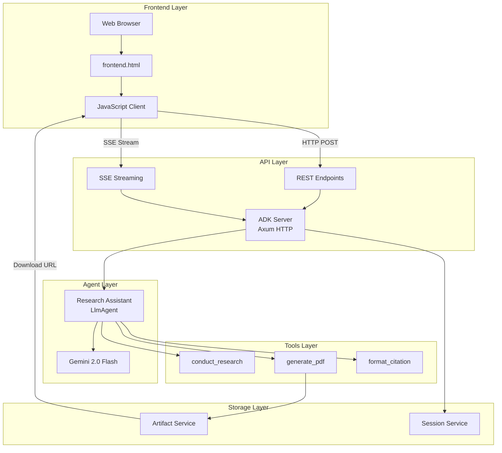
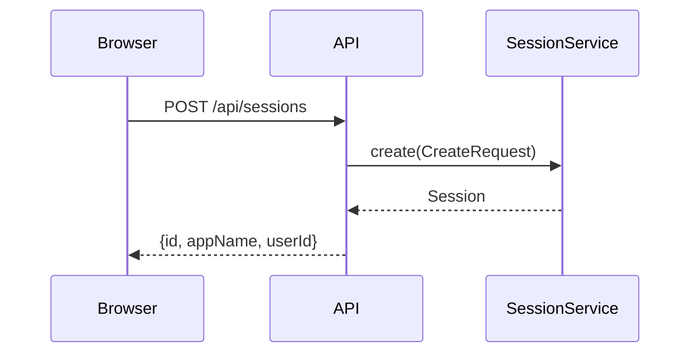
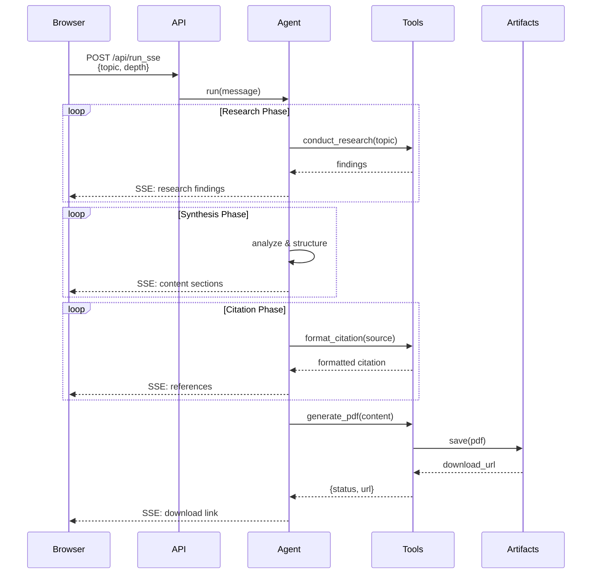
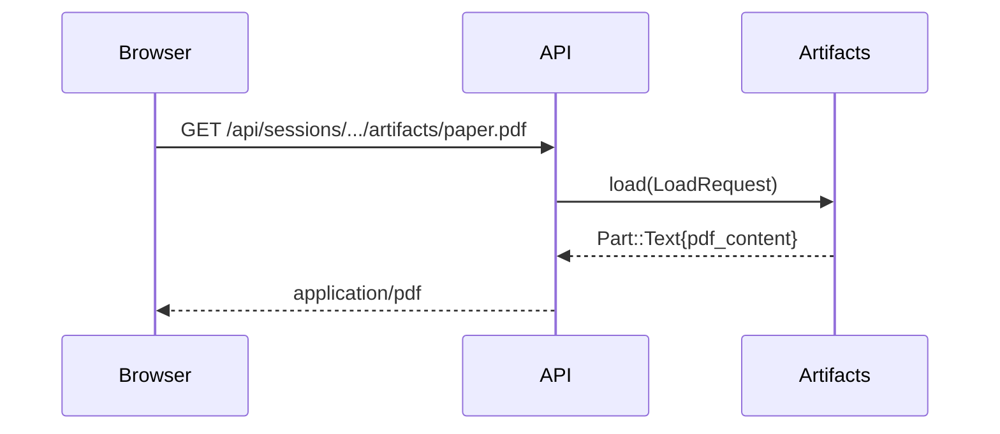
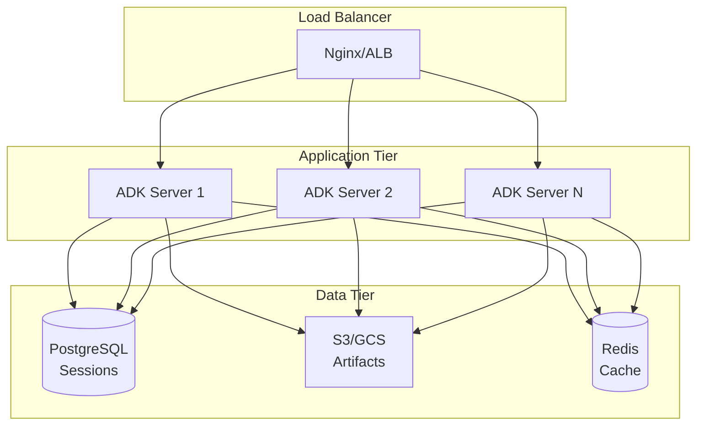

# Research Paper Generator - Architecture

## System Overview



## Request Flow

### 1. Session Creation



### 2. Research Request



### 3. PDF Download



## Component Details

### Frontend Components

```
frontend.html
├── UI Components
│   ├── Research Form
│   │   ├── Topic Input
│   │   ├── Depth Selector
│   │   └── Author Input
│   ├── Status Display
│   └── Output Area
├── Session Manager
│   └── Auto-initialization
├── SSE Client
│   ├── Event Parser
│   └── Stream Handler
└── Download Manager
    └── URL Handler
```

### Backend Components

```
main.rs
├── Agent Configuration
│   ├── LlmAgentBuilder
│   ├── Model Setup
│   └── Instruction Template
├── Tool Definitions
│   ├── conduct_research
│   │   ├── Topic Analysis
│   │   ├── Source Gathering
│   │   └── Findings Synthesis
│   ├── generate_pdf
│   │   ├── Content Formatting
│   │   ├── PDF Creation
│   │   └── Artifact Storage
│   └── format_citation
│       └── APA Formatting
└── Launcher
    ├── Server Mode
    └── Artifact Service
```

## Data Flow

### Research Data Structure

```json
{
  "topic": "Quantum Computing",
  "depth": "comprehensive",
  "sources": [
    {
      "title": "Recent Advances in Quantum Computing",
      "summary": "...",
      "relevance": "high"
    }
  ],
  "key_findings": [
    "Finding 1",
    "Finding 2"
  ],
  "methodology": "Literature review",
  "timestamp": "2024-01-15T10:30:00Z"
}
```

### PDF Generation Request

```json
{
  "title": "Quantum Computing Research Paper",
  "content": "# Executive Summary\n\n...",
  "author": "Research Assistant"
}
```

### PDF Generation Response

```json
{
  "status": "success",
  "filename": "quantum_computing_research_paper.pdf",
  "size_bytes": 15420,
  "download_url": "/api/sessions/.../artifacts/quantum_computing_research_paper.pdf",
  "message": "PDF generated successfully"
}
```

## Scalability Considerations

### Current Architecture (Development)

- **Session Storage**: In-memory (InMemorySessionService)
- **Artifact Storage**: In-memory (InMemoryArtifactService)
- **Concurrency**: Single server instance
- **State**: Ephemeral (lost on restart)

### Production Architecture



### Recommended Production Changes

1. **Session Storage**: Use `DatabaseSessionService` with PostgreSQL
2. **Artifact Storage**: Use GCS or S3 for PDF storage
3. **Caching**: Add Redis for session caching
4. **Load Balancing**: Multiple server instances behind load balancer
5. **Authentication**: Add JWT/OAuth for user authentication
6. **Rate Limiting**: Implement per-user rate limits
7. **Monitoring**: Add Prometheus metrics and distributed tracing
8. **CDN**: Serve static frontend assets via CDN

## Security Considerations

### Current Implementation

- ✅ CORS enabled (permissive for development)
- ✅ Input validation in tools
- ✅ Error handling
- ❌ No authentication
- ❌ No rate limiting
- ❌ No input sanitization for PDF content

### Production Requirements

1. **Authentication**: JWT tokens or OAuth 2.0
2. **Authorization**: Role-based access control
3. **Rate Limiting**: Per-user and per-IP limits
4. **Input Validation**: Sanitize all user inputs
5. **CORS**: Restrict to specific domains
6. **HTTPS**: TLS certificates required
7. **API Keys**: Secure storage (not in code)
8. **Audit Logging**: Track all research requests

## Performance Optimization

### Current Bottlenecks

1. **LLM Latency**: Gemini API calls (2-5 seconds)
2. **PDF Generation**: Synchronous processing
3. **Memory**: In-memory storage limits

### Optimization Strategies

1. **Streaming**: Already implemented via SSE
2. **Caching**: Cache research results for common topics
3. **Async Processing**: Queue PDF generation jobs
4. **Compression**: Compress large PDFs
5. **CDN**: Cache static assets
6. **Connection Pooling**: Reuse HTTP connections
7. **Batch Processing**: Group multiple research requests

## Monitoring & Observability

### Key Metrics

- Request rate (requests/second)
- Response time (p50, p95, p99)
- Error rate (%)
- Active sessions
- PDF generation time
- Artifact storage size
- LLM token usage

### Logging

```rust
// Add structured logging
tracing::info!(
    topic = %topic,
    depth = %depth,
    user_id = %user_id,
    "Research request received"
);

tracing::info!(
    filename = %filename,
    size_bytes = %size,
    duration_ms = %duration,
    "PDF generated successfully"
);
```

### Tracing

Enable distributed tracing with OpenTelemetry:

```rust
use adk_telemetry::init_telemetry;

init_telemetry("research_paper_generator")?;
```

## Testing Strategy

### Unit Tests

- Tool function logic
- PDF generation
- Citation formatting
- Input validation

### Integration Tests

- API endpoint responses
- Session management
- Artifact storage/retrieval
- SSE streaming

### End-to-End Tests

- Full research workflow
- Frontend-backend integration
- PDF download
- Error scenarios

### Load Tests

- Concurrent users
- Large research requests
- Artifact storage limits
- Memory usage under load
