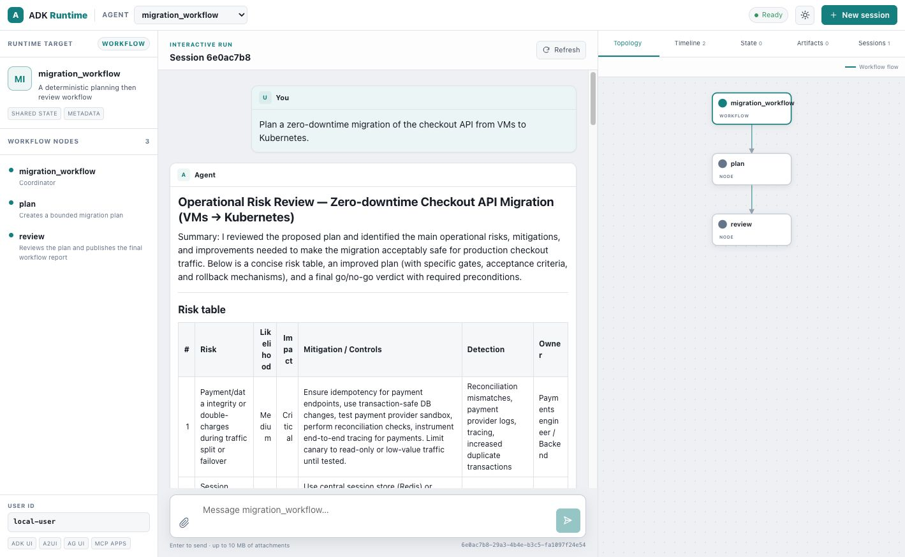

# Graph workflow



This example exposes a real `GraphAgent` with deterministic control flow:

```text
migration_workflow → plan → review → END
```

Both workflow nodes are ordinary OpenAI-backed `LlmAgent`s. The graph controls
their order and state projection; the runtime UI reads the graph's portable
flow topology without depending on `adk-graph` types.

## Run

```bash
cargo run --manifest-path examples/runtime_ui_showcase/Cargo.toml \
  --bin runtime-ui-graph
```

Open `http://127.0.0.1:8088/ui/` and send:

> Plan a zero-downtime migration of the checkout API from VMs to Kubernetes.

Expected behavior:

1. `plan` produces a bounded migration plan.
2. Graph state passes that plan into `review`.
3. `review` returns the final Markdown risk report and go/no-go verdict.
4. The topology inspector shows the exact workflow flow edges.
