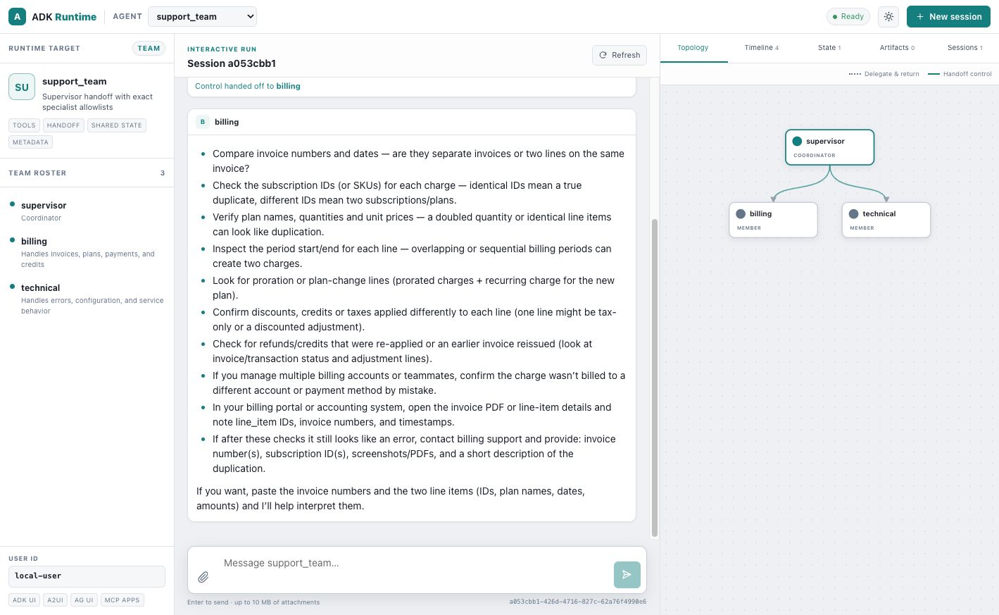

# Portable team



This example compiles a serializable `TeamSpec` into one executable root. Its
allowlist contains exactly two handoff edges:

```text
supervisor → billing
supervisor → technical
```

Neither specialist may hand off to the other or back to the supervisor.

## Run

```bash
cargo run --manifest-path examples/runtime_ui_showcase/Cargo.toml \
  --bin runtime-ui-team
```

Open `http://127.0.0.1:8088/ui/` and send:

> My invoice includes the same subscription charge twice. What should I verify?

Expected behavior:

1. The supervisor calls `transfer_to_agent` with the exact `billing` target.
2. The incoming topology edge and active billing node animate during the run.
3. Billing retains control and produces the final Markdown response.
4. The timeline and `__adk_team_execution_v1` state record the completed handoff.
