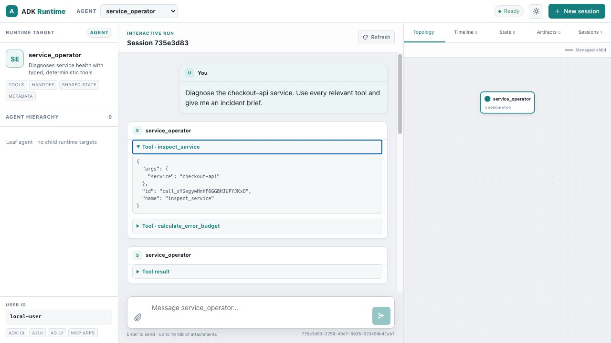

# Agent with tools



This example builds one `LlmAgent` with two typed, deterministic tools:
`inspect_service` and `calculate_error_budget`. The tools make no external
network calls; only the OpenAI model request is live.

## Run

```bash
cargo run --manifest-path examples/runtime_ui_showcase/Cargo.toml \
  --bin runtime-ui-tools
```

Open `http://127.0.0.1:8088/ui/` and send:

> Diagnose the checkout-api service. Use every relevant tool and give me an incident brief.

Expected behavior:

1. The model calls both tools with `service = "checkout-api"`.
2. Tool calls and results appear as expandable transcript rows.
3. The final response renders as Markdown with a status table and actions.
4. Timeline, session state, artifacts, and telemetry remain available through
   the standard runtime inspector.
